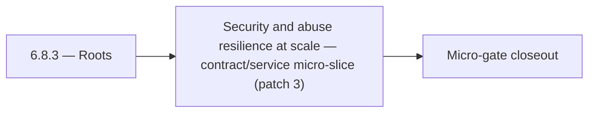

# 6.8.3 — Roots

- **Era:** `6.x` Reliability and Scaling — hub [`versions.md`](../versions.md) · minors start at [`6.0 — Reliability and Scaling era umbrella`](6.0%20%E2%80%94%20Reliability%20and%20Scaling%20era%20umbrella.md)
- **Minor:** [6.8 — Security and abuse resilience at scale](./6.8 — Security and abuse resilience at scale.md)
- **Codename:** Roots
- **Status:** ✅ Completed
## Focus
Security and abuse resilience at scale — contract/service micro-slice (patch 3)

## Flowchart

## Micro-gate

| Track | Gate question | Answer / Evidence (fill at patch closeout) |
| --- | --- | --- |
| **Contract** | SLO/SLI, idempotency, DLQ envelope, trace propagation — `docs/backend/apis/` + matrices updated? | Document at patch closeout. |
| **Service** | Retry/DLQ, rate limits, abuse guards, HF/SMTP/provider paths — smoke + caps documented? | Document smoke paths. |
| **Surface** | Ops dashboards, `/status`, degraded-mode UX — delta for this patch? | Document UX delta or N/A. |
| **Frontend** | Dashboard/extension reliability patterns (`components.md` Era 6) touched? | Abuse resilience, rate limits, security controls at scale. Document at closeout. |
| **Data** | Lineage, retention, Redis/DB-backed idempotency state — migrations recorded? | Document lineage or N/A. |
| **Ops** | SLO panels, alerts, chaos/runbook refs (`queue-observability.md`, RC) — delta? | Document ops delta or N/A. |

## Tasks
### Contract
- ✅ Completed: 📌 Planned: **[appointment360]** — refine duplicate task (was: 📌 planned: redis distributed limiter correctness under failo…) | patch `6.8.3` band `3` | reason: specialize this file vs sibling patches; see docs/codebases/appointment360-codebase-analysis.md
- ✅ Completed: 📌 Planned: **[appointment360]** — refine duplicate task (was: sync message response p95 < 3s) | patch `6.8.3` band `3` | reason: specialize this file vs sibling patches; see docs/codebases/appointment360-codebase-analysis.md
- ✅ Completed: 📌 Planned: **[appointment360]** — refine duplicate task (was: 📌 planned: document retry and timeout contract: max retries,…) | patch `6.8.3` band `3` | reason: specialize this file vs sibling patches; see docs/codebases/appointment360-codebase-analysis.md
- ✅ Completed: 📌 Planned: **[appointment360]** — refine duplicate task (was: 📌 planned: define idempotent bulk job-create behavior.) | patch `6.8.3` band `3` | reason: specialize this file vs sibling patches; see docs/codebases/appointment360-codebase-analysis.md

### Service
- ✅ Completed: 📌 Planned: **[appointment360]** — refine duplicate task (was: 📌 planned: implement chat archival ttl: define max chat age;…) | patch `6.8.3` band `3` | reason: specialize this file vs sibling patches; see docs/codebases/appointment360-codebase-analysis.md
- ✅ Completed: 📌 Planned: **[appointment360]** — refine duplicate task (was: 📌 planned: move rate limiter to redis-backed distributed imp…) | patch `6.8.3` band `3` | reason: specialize this file vs sibling patches; see docs/codebases/appointment360-codebase-analysis.md
- ✅ Completed: 📌 Planned: **[appointment360]** — refine duplicate task (was: 📌 planned: implement `tokenbucketratelimiter` middleware (or…) | patch `6.8.3` band `3` | reason: specialize this file vs sibling patches; see docs/codebases/appointment360-codebase-analysis.md
- ✅ Completed: 📌 Planned: **[appointment360]** — refine duplicate task (was: 📌 planned: add circuit breaker / retry budget around connect…) | patch `6.8.3` band `3` | reason: specialize this file vs sibling patches; see docs/codebases/appointment360-codebase-analysis.md

### Surface

- ✅ Completed: 📌 Planned: **[connectra]** — Verify UX for route `/` and bindings (patch 6.8.3 band 3) | area: `frontend-page` | files: `contact360/dashboard/app/page.tsx` | reason: Dashboard/extension surface for era 6 must match gateway contracts

### Data

- ✅ Completed: 📌 Planned: **[appointment360]** — refine duplicate task (was: 📌 planned: **[appointment360]** — update postgresql/es/s3 li…) | patch `6.8.3` band `3` | reason: specialize this file vs sibling patches; see docs/codebases/appointment360-codebase-analysis.md

### Ops

- ✅ Completed: 📌 Planned: **[platform]** — Record smoke evidence, rollback, and alerts (patch band 3: surface/data) | area: `ops` | files: `docs/commands/`, `.github/workflows/` | reason: Smoke, rollback, and observability for patch 6.8.3

## Service task slices
> Merged from era `6.x` reliability/scaling task packs (P0→`.0`–`.2`, P1→`.3`–`.6`, Ops→`.7`–`.9`).

### Connectra
- Query P95 SLO baseline captured in dashboards.
- Batch-upsert idempotency test passes (duplicate submission).
- Drift detector runs on schedule with last success timestamp exported.
- CORS + per-tenant rate limit reviewed by security; no wildcard prod misconfig.

### Appointment360 (gateway)
- Specify rate limit headers: X-RateLimit-Remaining, X-RateLimit-Reset
- Document idempotency contract: X-Idempotency-Key header, 24h TTL, replay semantics
- Move idempotency state to Redis for multi-replica shared state
- Move abuse guard sliding window to Redis for multi-replica
- Add TTLCache for user object with USER_CACHE_TTL (300s default)
- Add DataLoaders for all foreign-key fetches to eliminate N+1
- Add query depth limit extension
- Dashboard status bar shows GraphQL latency from X-Process-Time header
- Rate limit exceeded modal — parse X-RateLimit-Remaining: 0 response and display warning
- Connection pool exhaustion banner: surface when /health/db shows pool full
- Create idempotency_keys table (fallback if Redis unavailable): key, response_hash, expires_at
- Configure REDIS_URL, ENABLE_REDIS_CACHE=true for production
- Load test: 500 concurrent query contacts(query) requests through gateway
- Load test: 50 concurrent billing mutations with idempotency keys
- Add alert: error rate > 1% in 5-minute window → PagerDuty
- Add alert: DB pool overflow > 0 for > 60s → PagerDuty
- Document SLO dashboard in ops runbook

### Mailvetter
- Add retry-state indicators in progress UI.
- Add per-job error summary panel.
- Add `job_events` and `job_failures` tables.
- Add correlation IDs in job/result rows for traceability.
- Move rate limiter to Redis-backed distributed implementation.
- Add idempotency key support on bulk create endpoint.
- Add worker retry + dead-letter queue.
- Add clear `processing` and `failed` transitions for jobs.

### emailapis / emailapigo
- SLO table row for Emailapis added in [`slo-idempotency.md`](slo-idempotency.md).
- `emailapis_endpoint_era_matrix.json` includes era `6.x` reliability notes (timeouts, circuits, concurrency).
- Provider degradation runbook reviewed in tabletop exercise.
- Staging load test: bulk job completes within **P95** target without OOM or goroutine leak.

## Evidence gate
Patch closeout includes contract diff, smoke output, data lineage delta, and ops note
