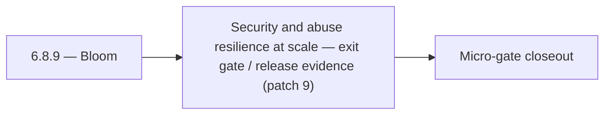

# 6.8.9 — Bloom

- **Era:** `6.x` Reliability and Scaling — hub [`versions.md`](../versions.md) · minors start at [`6.0 — Reliability and Scaling era umbrella`](6.0%20%E2%80%94%20Reliability%20and%20Scaling%20era%20umbrella.md)
- **Minor:** [6.8 — Security and abuse resilience at scale](./6.8 — Security and abuse resilience at scale.md)
- **Codename:** Bloom
- **Status:** planned

## Focus
Security and abuse resilience at scale — exit gate / release evidence (patch 9)

## Flowchart

## Micro-gate

| Track | Gate question | Answer / Evidence (fill at patch closeout) |
| --- | --- | --- |
| **Contract** | SLO/SLI, idempotency, DLQ envelope, trace propagation — `docs/backend/apis/` + matrices updated? | Document at patch closeout. |
| **Service** | Retry/DLQ, rate limits, abuse guards, HF/SMTP/provider paths — smoke + caps documented? | Document smoke paths. |
| **Surface** | Ops dashboards, `/status`, degraded-mode UX — delta for this patch? | Document UX delta or N/A. |
| **Frontend** | Dashboard/extension reliability patterns (`components.md` Era 6) touched? | Abuse resilience, rate limits, security controls at scale. Document at closeout. |
| **Data** | Lineage, retention, Redis/DB-backed idempotency state — migrations recorded? | Document lineage or N/A. |
| **Ops** | SLO panels, alerts, chaos/runbook refs (`queue-observability.md`, RC) — delta? | Document ops delta or N/A. |

## Tasks
### Ops
- 📌 Planned: **[appointment360]** — refine duplicate task (was: alarm: connectra `5xx` rate > 3%) | patch `6.8.9` band `9` | reason: specialize this file vs sibling patches; see docs/codebases/appointment360-codebase-analysis.md
- 📌 Planned: **[appointment360]** — refine duplicate task (was: 📌 planned: dashboard: p95 latency by batch size) | patch `6.8.9` band `9` | reason: specialize this file vs sibling patches; see docs/codebases/appointment360-codebase-analysis.md
- 📌 Planned: **[appointment360]** — refine duplicate task (was: 📌 planned: error budget: define burn rate alert thresholds) | patch `6.8.9` band `9` | reason: specialize this file vs sibling patches; see docs/codebases/appointment360-codebase-analysis.md
- 📌 Planned: **[appointment360]** — refine duplicate task (was: 📌 planned: connectra availability dependency documented in r…) | patch `6.8.9` band `9` | reason: specialize this file vs sibling patches; see docs/codebases/appointment360-codebase-analysis.md
- 📌 Planned: **[appointment360]** — refine duplicate task (was: `docs/codebases/salesnavigator-codebase-analysis.md`) | patch `6.8.9` band `9` | reason: specialize this file vs sibling patches; see docs/codebases/appointment360-codebase-analysis.md
- 📌 Planned: **[appointment360]** — refine duplicate task (was: `docs/backend/apis/salesnavigator_era_task_packs.md`) | patch `6.8.9` band `9` | reason: specialize this file vs sibling patches; see docs/codebases/appointment360-codebase-analysis.md

### Contract

- 📌 Planned: **[appointment360]** — Diff and document schema for operations like ConnectraClient, LAMBDA_AI_API_URL, LAMBDA_CONNECTRA_API_URL; align with roadmap | area: `backend-api` | files: `docs/backend/apis/*.md`, `contact360.io/api/app/graphql/schema.py` | reason: Keep GraphQL/REST contracts aligned for era 6.9 patch 6.8.9

### Service

- 📌 Planned: **[appointment360]** — refine duplicate task (was: 📌 planned: **[appointment360]** — service slice: - [x] ✅ com…) | patch `6.8.9` band `9` | reason: specialize this file vs sibling patches; see docs/codebases/appointment360-codebase-analysis.md

### Surface

- 📌 Planned: **[connectra]** — Verify UX for route `/` and bindings (patch 6.8.9 band 9) | area: `frontend-page` | files: `contact360/dashboard/app/page.tsx` | reason: Dashboard/extension surface for era 6 must match gateway contracts

### Data

- 📌 Planned: **[appointment360]** — refine duplicate task (was: 📌 planned: **[appointment360]** — update postgresql/es/s3 li…) | patch `6.8.9` band `9` | reason: specialize this file vs sibling patches; see docs/codebases/appointment360-codebase-analysis.md

## Service task slices
> Merged from era `6.x` reliability/scaling task packs (P0→`.0`–`.2`, P1→`.3`–`.6`, Ops→`.7`–`.9`).

### Connectra
- Query P95 SLO baseline captured in dashboards.
- Batch-upsert idempotency test passes (duplicate submission).
- Drift detector runs on schedule with last success timestamp exported.
- CORS + per-tenant rate limit reviewed by security; no wildcard prod misconfig.

### Appointment360 (gateway)
- Add alert: error rate > 1% in 5-minute window → PagerDuty
- Add alert: DB pool overflow > 0 for > 60s → PagerDuty
- Document SLO dashboard in ops runbook

### Mailvetter
- Autoscaling policy based on Redis queue depth.
- Alerts on queue lag, error rate, webhook failure rate.
- Chaos test for Redis outage and DB transient failures.

### emailapis / emailapigo
- SLO table row for Emailapis added in [`slo-idempotency.md`](slo-idempotency.md).
- `emailapis_endpoint_era_matrix.json` includes era `6.x` reliability notes (timeouts, circuits, concurrency).
- Provider degradation runbook reviewed in tabletop exercise.
- Staging load test: bulk job completes within **P95** target without OOM or goroutine leak.

## Evidence gate
Micro-gate table filled and handoff note to `6.9.0` recorded
