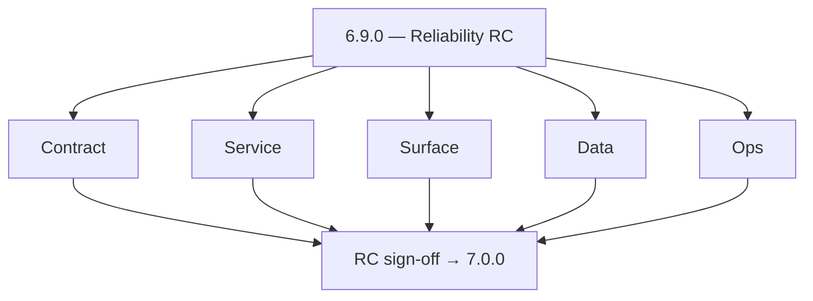
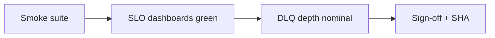
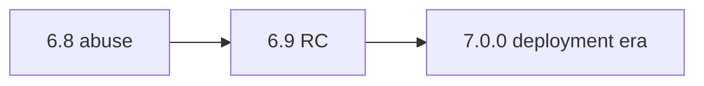

# Version 6.9

- **Status:** ✅ Completed
- **Target window:** TBD
- **Summary:** Release candidate hardening for **7.0.0** — full reliability smoke per `reliability-rc-hardening.md`, sign-off table with **build SHA**, all Stages 6.1–6.8 preconditions green, `7.0.0` readiness gate (handoff to deployment era).
- **Scope:** RC process — **not** implementing new 7.x RBAC/deployment features (those start in `docs/7. Contact360 deployment/`).
- **Roadmap mapping:** Stage 6.9 — Release candidate hardening for 7.0.0 (`6.9.0`)
- **Owner:** Release Engineering / SRE
- **Patch closure:** Every codenamed patch file includes **Micro-gate** + **Service task slices**. Era hub: [`versions.md`](../versions.md).

## Scope

- **In scope:** Smoke suite spanning **Connectra**, **Contact AI (SSE)**, **SalesNavigator**, **Mailvetter**, **Appointment360**, **jobs**, **email campaign**, **logs.api**, **S3 storage**, **emailapis**; evidence bundle; RC defect tracking — **KPI:** RC defect escape rate.
- **Out of scope:** 7.x Stage 7.1 RBAC foundation implementation in this minor (docs only for handoff).

## Flowchart — five-track delivery

### Runtime focus — RC smoke

## Task tracks

### Contract
- 📌 Planned: **[appointment360]** — refine duplicate task (was: 📌 planned: **[appointment360]** — refine duplicate task (was…) | patch `6.9.0` band `0` | reason: specialize this file vs sibling patches; see docs/codebases/appointment360-codebase-analysis.md
- ✅ Completed: 📌 Planned: **[appointment360]** — refine duplicate task (was: 📌 planned: build sha recorded per environment promotion.) | patch `6.9.0` band `0` | reason: specialize this file vs sibling patches; see docs/codebases/appointment360-codebase-analysis.md

- 📌 Planned: **[appointment360]** — refine duplicate task (was: 📌 planned: **[architecture]** — product **graphql** remains …) | patch `6.9.0` band `0` | reason: specialize this file vs sibling patches; see docs/codebases/appointment360-codebase-analysis.md
### Service
- 📌 Planned: **[appointment360]** — refine duplicate task (was: 📌 planned: **[appointment360]** — refine duplicate task (was…) | patch `6.9.0` band `0` | reason: specialize this file vs sibling patches; see docs/codebases/appointment360-codebase-analysis.md

- 📌 Planned: **[appointment360]** — refine duplicate task (was: 📌 planned: **[architecture]** — **go/gin satellites** in sco…) | patch `6.9.0` band `0` | reason: specialize this file vs sibling patches; see docs/codebases/appointment360-codebase-analysis.md
### Surface
- ✅ Completed: 📌 Planned: **[appointment360]** — refine duplicate task (was: 📌 planned: frontend: era 6 reliability patterns verified on …) | patch `6.9.0` band `0` | reason: specialize this file vs sibling patches; see docs/codebases/appointment360-codebase-analysis.md

### Data
- ✅ Completed: 📌 Planned: **[appointment360]** — refine duplicate task (was: 📌 planned: backup/restore drill or evidence of runbook rehea…) | patch `6.9.0` band `0` | reason: specialize this file vs sibling patches; see docs/codebases/appointment360-codebase-analysis.md

- 📌 Planned: **[appointment360]** — refine duplicate task (was: 📌 planned: **[architecture]** — **postgresql-first** per `do…) | patch `6.9.0` band `0` | reason: specialize this file vs sibling patches; see docs/codebases/appointment360-codebase-analysis.md
- 📌 Planned: **[appointment360]** — refine duplicate task (was: 📌 planned: **[architecture]** — **redis exit**: campaign (as…) | patch `6.9.0` band `0` | reason: specialize this file vs sibling patches; see docs/codebases/appointment360-codebase-analysis.md
### Ops
- ✅ Completed: 📌 Planned: **[appointment360]** — refine duplicate task (was: 📌 planned: stage label **6.9** (not 5.9) in all rc docs; on-…) | patch `6.9.0` band `0` | reason: specialize this file vs sibling patches; see docs/codebases/appointment360-codebase-analysis.md

- 📌 Planned: **[appointment360]** — refine duplicate task (was: 📌 planned: **[architecture]** — **observability**: correlate…) | patch `6.9.0` band `0` | reason: specialize this file vs sibling patches; see docs/codebases/appointment360-codebase-analysis.md
## Task Breakdown — smoke coverage

| Area | Must pass |
| --- | --- |
| Appointment360 | Health, SLO, idempotency spot check |
| Connectra | Query P95 within SLO sample |
| Contact AI | SSE stream stability + trace |
| SalesNavigator | CORS + rate limit smoke |
| Mailvetter | Redis limiter + send path |
| jobs / campaign | DLQ nominal, replay dry-run |
| logs.api | Query path latency sample |
| S3 storage | Multipart complete idempotency |
| Emailapis | Circuit/timeout degraded mode |

## Immediate next execution queue

- 📌 Planned: Update `reliability-rc-hardening.md` with expanded smoke list + **build SHA** column.
- 📌 Planned: File RC sign-off in `docs/governance.md` or linked tracker.

## Cross-service ownership table

| Workstream | DRI |
| --- | --- |
| RC coordinator | Release Eng |
| Per-service evidence | Service owners |
| Executive gate | Engineering leadership |

## References

- [docs/roadmap.md](../roadmap.md) — Stage 6.9
- [reliability-rc-hardening.md](reliability-rc-hardening.md)
- [docs/versions.md](../versions.md) — `6.9.0`, `7.0.0`

## Backend API and Endpoint Scope

- Frozen interface list for RC (breaking changes require exception).

## Database and Data Lineage Scope

- Migration freeze window policy; rollback tested.

## Frontend UX Surface Scope

- Full regression on login, core workflows, offline/edge cases.

## UI Elements Checklist

- All critical buttons/forms covered by smoke checklist rows.

## Flow/Graph Delta

## Release Gate and Evidence

- 📌 Planned: Master checklist in `reliability-rc-hardening.md` 100% signed with SHA.
- 📌 Planned: No open SEV-1/SEV-2 at cut time (per policy).

### Micro-gate reference (apply at every `6.N.P`)

| Track | Gate question (must answer Yes or document waiver) |
| --- | --- |
| **Contract** | SLO/SLI, idempotency, DLQ envelope, trace headers — `docs/backend/apis/` + endpoint matrices updated? |
| **Service** | Retry/DLQ, rate limits, provider degradation — smoke paths + idempotency stores documented? |
| **Surface** | Ops dashboards, `/status`, degraded UX — user/operator-visible delta? |
| **Frontend** | Era 6 patterns in `docs/frontend/components.md` / pages JSON — delta? |
| **Data** | Lineage docs, Redis/DB idempotency, retention — migrations recorded? |
| **Ops** | SLO panels, alerts, chaos/runbooks (`queue-observability.md`, RC) — recorded? |
| **Architecture** | Go/Gin satellites only via Python GraphQL gateway (`contact360.io/api`); Next.js `NEXT_PUBLIC_GRAPHQL_URL`; Postgres-first / Redis exit per `docs/docs/data-stores-postgres.md`. |

**Patch ladder:** Codenames `Void` → `Bloom` per minor (`.0`–`.9`) — see patch table below.

## Patches

| Patch | Codename | Doc |
| --- | --- | --- |
| `6.9.0` | Void | [`6.9.0` — Void](6.9.0 — Void.md) |
| `6.9.1` | Seed | [`6.9.1` — Seed](6.9.1 — Seed.md) |
| `6.9.2` | Sprout | [`6.9.2` — Sprout](6.9.2 — Sprout.md) |
| `6.9.3` | Roots | [`6.9.3` — Roots](6.9.3 — Roots.md) |
| `6.9.4` | Soil | [`6.9.4` — Soil](6.9.4 — Soil.md) |
| `6.9.5` | Rain | [`6.9.5` — Rain](6.9.5 — Rain.md) |
| `6.9.6` | Stem | [`6.9.6` — Stem](6.9.6 — Stem.md) |
| `6.9.7` | Branch | [`6.9.7` — Branch](6.9.7 — Branch.md) |
| `6.9.8` | Leaf | [`6.9.8` — Leaf](6.9.8 — Leaf.md) |
| `6.9.9` | Bloom | [`6.9.9` — Bloom](6.9.9 — Bloom.md) |

## Patch ladder (6.9.0 - 6.9.9)

### Micro-gate reference (apply at every patch)

| Track | Gate question (must answer Yes or waiver) |
| --- | --- |
| **Contract** | Contract/API change captured with diff or explicit no-change note |
| **Service** | Service health and smoke for affected paths pass |
| **Surface** | UI/admin/extension impact documented or N/A |
| **Frontend** | Routes/components/hooks affected listed or N/A |
| **Data** | Migrations/index/lineage deltas linked or N/A |
| **Ops** | Rollback/secrets/CI/runbook delta linked or N/A |

**Patch intent bands:** `.0` charter, `.1-.2` scaffold, `.3-.5` hardening, `.6-.8` integration, `.9` freeze/handoff.

| Patch | Codename | Focus | Evidence gate |
| --- | --- | --- | --- |
| `6.9.0` | Void | patch focus | charter artifact linked |
| `6.9.1` | Seed | patch focus | closeout evidence attached |
| `6.9.2` | Sprout | patch focus | closeout evidence attached |
| `6.9.3` | Roots | patch focus | closeout evidence attached |
| `6.9.4` | Soil | patch focus | closeout evidence attached |
| `6.9.5` | Rain | patch focus | closeout evidence attached |
| `6.9.6` | Stem | patch focus | closeout evidence attached |
| `6.9.7` | Branch | patch focus | closeout evidence attached |
| `6.9.8` | Leaf | patch focus | closeout evidence attached |
| `6.9.9` | Bloom | patch focus | handoff documented |
