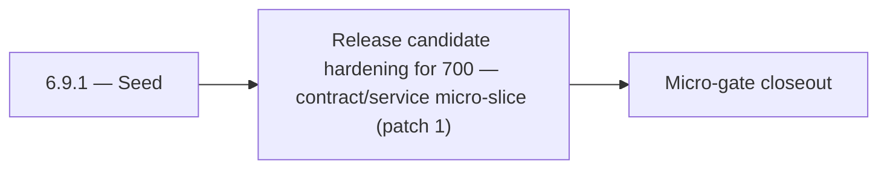

# 6.9.1 — Seed

- **Era:** `6.x` Reliability and Scaling — hub [`versions.md`](../versions.md) · minors start at [`6.0 — Reliability and Scaling era umbrella`](6.0%20%E2%80%94%20Reliability%20and%20Scaling%20era%20umbrella.md)
- **Minor:** [6.9 — Release candidate hardening for 700](./6.9 — Release candidate hardening for 700.md)
- **Codename:** Seed
- **Status:** ✅ Completed
## Focus
Release candidate hardening for 700 — contract/service micro-slice (patch 1)

## Flowchart

## Micro-gate

| Track | Gate question | Answer / Evidence (fill at patch closeout) |
| --- | --- | --- |
| **Contract** | SLO/SLI, idempotency, DLQ envelope, trace propagation — `docs/backend/apis/` + matrices updated? | Document at patch closeout. |
| **Service** | Retry/DLQ, rate limits, abuse guards, HF/SMTP/provider paths — smoke + caps documented? | Document smoke paths. |
| **Surface** | Ops dashboards, `/status`, degraded-mode UX — delta for this patch? | Document UX delta or N/A. |
| **Frontend** | Dashboard/extension reliability patterns (`components.md` Era 6) touched? | RC hardening for 7.0 — `reliability-rc-hardening.md` gate. Document at closeout. |
| **Data** | Lineage, retention, Redis/DB-backed idempotency state — migrations recorded? | Document lineage or N/A. |
| **Ops** | SLO panels, alerts, chaos/runbook refs (`queue-observability.md`, RC) — delta? | Document ops delta or N/A. |

## Tasks
### Contract
- ✅ Completed: 📌 Planned: **[appointment360]** — refine duplicate task (was: 📌 planned: build sha recorded per environment promotion.) | patch `6.9.1` band `1` | reason: specialize this file vs sibling patches; see docs/codebases/appointment360-codebase-analysis.md
- ✅ Completed: 📌 Planned: **[appointment360]** — refine duplicate task (was: utility ai endpoints p95 < 2s) | patch `6.9.1` band `1` | reason: specialize this file vs sibling patches; see docs/codebases/appointment360-codebase-analysis.md
- ✅ Completed: 📌 Planned: **[appointment360]** — refine duplicate task (was: 📌 planned: document idempotency contract for `post /message`…) | patch `6.9.1` band `1` | reason: specialize this file vs sibling patches; see docs/codebases/appointment360-codebase-analysis.md
- ✅ Completed: 📌 Planned: **[appointment360]** — refine duplicate task (was: p95 latency < 5s for 100 profiles) | patch `6.9.1` band `1` | reason: specialize this file vs sibling patches; see docs/codebases/appointment360-codebase-analysis.md

### Service
- ✅ Completed: 📌 Planned: **[appointment360]** — refine duplicate task (was: 📌 planned: add sse stream error handling: catch lambda timeo…) | patch `6.9.1` band `1` | reason: specialize this file vs sibling patches; see docs/codebases/appointment360-codebase-analysis.md
- ✅ Completed: 📌 Planned: **[appointment360]** — refine duplicate task (was: 📌 planned: add distributed tracing: aws x-ray or otel contex…) | patch `6.9.1` band `1` | reason: specialize this file vs sibling patches; see docs/codebases/appointment360-codebase-analysis.md
- ✅ Completed: 📌 Planned: **[appointment360]** — refine duplicate task (was: 📌 planned: add idempotency key support on bulk create endpoi…) | patch `6.9.1` band `1` | reason: specialize this file vs sibling patches; see docs/codebases/appointment360-codebase-analysis.md
- ✅ Completed: 📌 Planned: **[appointment360]** — refine duplicate task (was: per-api-key: 100 req/min; configurable via env) | patch `6.9.1` band `1` | reason: specialize this file vs sibling patches; see docs/codebases/appointment360-codebase-analysis.md

### Surface

- ✅ Completed: 📌 Planned: **[connectra]** — Verify UX for route `/` and bindings (patch 6.9.1 band 1) | area: `frontend-page` | files: `contact360/dashboard/app/page.tsx` | reason: Dashboard/extension surface for era 6 must match gateway contracts

### Data

- ✅ Completed: 📌 Planned: **[appointment360]** — refine duplicate task (was: 📌 planned: **[appointment360]** — update postgresql/es/s3 li…) | patch `6.9.1` band `1` | reason: specialize this file vs sibling patches; see docs/codebases/appointment360-codebase-analysis.md

### Ops

- ✅ Completed: 📌 Planned: **[platform]** — Record smoke evidence, rollback, and alerts (patch band 1: charter/P0) | area: `ops` | files: `docs/commands/`, `.github/workflows/` | reason: Smoke, rollback, and observability for patch 6.9.1

## Service task slices
> Merged from era `6.x` reliability/scaling task packs (P0→`.0`–`.2`, P1→`.3`–`.6`, Ops→`.7`–`.9`).

### Appointment360 (gateway)
- Document SLO targets (error budget 1.0%, latency p99 < 2s) in docs/governance.md
- Define /health/slo endpoint contract: returns current error rate, budget consumed
- Define /health/db response schema: pool size, overflow, active connections
- Enable GraphQLRateLimitMiddleware: set GRAPHQL_RATE_LIMIT_REQUESTS_PER_MINUTE > 0 in production
- Enable GraphQLMutationAbuseGuardMiddleware: set ABUSE_GUARDED_MUTATIONS list
- Enable GraphQLIdempotencyMiddleware: set IDEMPOTENCY_REQUIRED_MUTATIONS list
- Enable QueryComplexityExtension: set GRAPHQL_COMPLEXITY_LIMIT to 100
- Enable QueryTimeoutExtension: set GRAPHQL_QUERY_TIMEOUT to 30s
- Add get_pool_stats() to db/session.py and expose via /health/db
- Add check_pool_health() and alert if overflow > 0
- Configure database pool: DATABASE_POOL_SIZE=25, DATABASE_MAX_OVERFLOW=50
- Retry-safe mutations: ensure billing/payment mutations send X-Idempotency-Key
- Instrument DB session events: log slow queries (> 500ms)
- Add request_id + trace_id to all log lines for correlation
- Add RED metrics (rate, error, duration) aggregation store
- Set GRAPHQL_MAX_BODY_BYTES=2097152 (2MB) in production

### Connectra
- Query P95 SLO baseline captured in dashboards.
- Batch-upsert idempotency test passes (duplicate submission).
- Drift detector runs on schedule with last success timestamp exported.
- CORS + per-tenant rate limit reviewed by security; no wildcard prod misconfig.

### contact.ai
- Define SLO targets for contact.ai:
- Sync message response p95 < 3s
- SSE first-token latency p95 < 1s
- Utility AI endpoints p95 < 2s
- Availability target: 99.5%
- Document retry and timeout contract: max retries, backoff policy, `Retry-After` header behavior.
- Define SSE stream error format: `data: {"error": "<message>", "code": "<code>"}\n\n`.
- Document idempotency contract for `POST /message`: repeated calls with same payload must not create duplicate messages.
- Add SSE stream error handling: catch Lambda timeout, HF stream abort; emit error event and close stream cleanly.
- Implement SSE client reconnect logic: `Last-Event-ID` support or state-based resume.
- Add optimistic lock (version column or ETag) to `ai_chats` to prevent concurrent message append races.
- Implement chat archival TTL: define max chat age; background Lambda to soft-delete stale chats.
- Add distributed tracing: AWS X-Ray or OTEL context propagation across Lambda invocations.
- Tune HF + Gemini retry budgets: max 2 retries on HF, then 1 Gemini attempt, then 503.
- Health endpoint improvements: `/health/db` must report connection pool state; add `/health/hf` for HF API reachability.
- Add `version` column to `ai_chats` for optimistic concurrency control.
- Define and document TTL / archival strategy: chats older than N days → archived or deleted.
- Add lineage note to `contact_ai_data_lineage.md`: archival lifecycle and compliance retention.

### emailapis / emailapigo
- SLO table row for Emailapis added in [`slo-idempotency.md`](slo-idempotency.md).
- `emailapis_endpoint_era_matrix.json` includes era `6.x` reliability notes (timeouts, circuits, concurrency).
- Provider degradation runbook reviewed in tabletop exercise.
- Staging load test: bulk job completes within **P95** target without OOM or goroutine leak.

### Emailcampaign
- Campaign of 100k recipients completes within SLO on staging environment.
- Duplicate campaign enqueue is silently deduplicated.
- Failed campaigns can be resumed from last checkpoint without re-sending to already-sent recipients.
- Prometheus endpoint exposes campaign metrics.

### Jobs
- Idempotent create proven by duplicate POST test (staging).
- At least one DLQ message successfully replayed with audit trail.
- Stale-processing sweeper verified in soak test.
- SLO panels + alert routes live; chaos drill documented.

### logs.api
- Query/cache SLO evidence captured for staging + production baseline.
- Hot-partition and cache-churn runbooks tabletop-approved.
- Dashboard spec implemented or exported to Grafana/Datadog.
- `logsapi_endpoint_era_matrix.json` updated for era `6.x`.

### Mailvetter
- Define SLOs: p95 single verify latency, bulk completion SLA, queue lag thresholds.
- Define idempotent bulk job-create behavior.
- Move rate limiter to Redis-backed distributed implementation.
- Add idempotency key support on bulk create endpoint.
- Add worker retry + dead-letter queue.
- Add clear `processing` and `failed` transitions for jobs.
- Add `job_events` and `job_failures` tables.
- Add correlation IDs in job/result rows for traceability.

### S3Storage
- Duplicate `complete` with same idempotency key does not double-charge storage or metadata.
- Crash test: mid-upload resume works or fails closed safely.
- CAS conflict path tested end-to-end.
- Reconciliation job shows zero unexplained drift post-cleanup on staging bucket.

### Salesnavigator
- Define SLOs for `save-profiles`:
- p95 latency < 5s for 100 profiles
- p99 latency < 15s for 500 profiles
- Availability: 99.5% monthly
- Define `Retry-After` header semantics on `429` rate-limit responses
- Define partial success response contract: `{success: true, saved_count: N, errors: [...]}` is valid even with N < total
- Add `X-Request-ID` response header (pass-through or generate if absent)
- Implement `TokenBucketRateLimiter` middleware (or equivalent):
- Per-API-key: 100 req/min; configurable via env
- Return `429` with `Retry-After` header on exhaustion
- Add chunk-level idempotency token: generate per save session; pass as Connectra request context for replay safety
- Add circuit breaker / retry budget around Connectra calls:
- 3 retries with exponential backoff (already in `tenacity` config — confirm coverage)
- Circuit opens after 5 consecutive `ConnectraAPIError` in 60s window
- Tighten CORS from `*` to explicit allowed origins (extension origin + dashboard origin)
- Add `X-Request-ID` correlation header to all responses (generate UUID4 if not provided)
- Implement proper timeout escalation: confirm adaptive timeout formula is correct
- Chunk idempotency key: store per chunk in Connectra request metadata to prevent replay duplication
- Replay-safe ingest: same profile UUID + same data → no-op at Connectra level (confirm Connectra upsert semantics)

## Evidence gate
Patch closeout includes contract diff, smoke output, data lineage delta, and ops note
