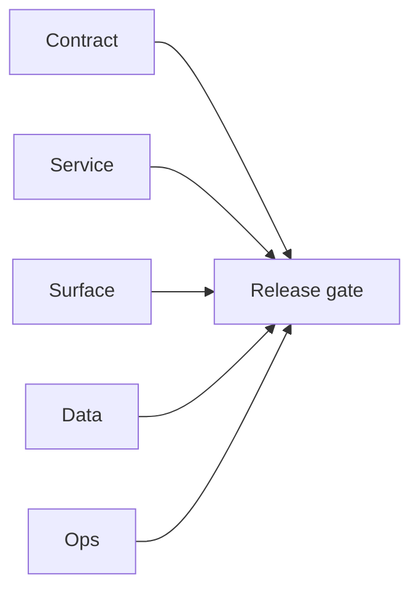

# 6.x Era Docs

Execution guide for Contact360 `6.x.x` era delivery.

## Era objective

- Define and deliver a stable era contract across Contract/Service/Surface/Data/Ops tracks.
- Ensure every patch packet carries closeout evidence before release handoff.

## As-is snapshot (reliability risks)

- **`contact360.io/admin`:** In-memory job progress stores (`_analyze_jobs`, `_generate_json_jobs`, `_upload_jobs`, etc.) **lose state on process restart** — track migration to Redis/DB under this era (see [`contact360.io/root/docs/imported/analysis/jobs-reliability-scaling-task-pack.md`](../../contact360.io/root/docs/imported/analysis/jobs-reliability-scaling-task-pack.md) and [`docs/codebases/admin-codebase-analysis.md`](../codebases/admin-codebase-analysis.md)).

## Minor index

| Minor | Title | Status | Doc |
| --- | --- | --- | --- |
| `6.0` | Reliability and Scaling era umbrella | planned | [`6.0 - Reliability and Scaling era umbrella`](6.0%20—%20Reliability%20and%20Scaling%20era%20umbrella.md) |
| `6.1` | SLO and error-budget baseline | planned | [`6.1 - SLO and error-budget baseline`](6.1%20—%20SLO%20and%20error-budget%20baseline.md) |
| `6.2` | Idempotent writes and reconciliation | planned | [`6.2 - Idempotent writes and reconciliation`](6.2%20—%20Idempotent%20writes%20and%20reconciliation.md) |
| `6.3` | Queue DLQ and worker resilience | planned | [`6.3 - Queue DLQ and worker resilience`](6.3%20—%20Queue%20DLQ%20and%20worker%20resilience.md) |
| `6.4` | Observability and correlated telemetry | planned | [`6.4 - Observability and correlated telemetry`](6.4%20—%20Observability%20and%20correlated%20telemetry.md) |
| `6.5` | Performance and latency wave | planned | [`6.5 - Performance and latency wave`](6.5%20—%20Performance%20and%20latency%20wave.md) |
| `6.6` | Storage lifecycle and artifact integrity | planned | [`6.6 - Storage lifecycle and artifact integrity`](6.6%20—%20Storage%20lifecycle%20and%20artifact%20integrity.md) |
| `6.7` | Cost reliability and budget guardrails | planned | [`6.7 - Cost reliability and budget guardrails`](6.7%20—%20Cost%20reliability%20and%20budget%20guardrails.md) |
| `6.8` | Security and abuse resilience at scale | planned | [`6.8 - Security and abuse resilience at scale`](6.8%20—%20Security%20and%20abuse%20resilience%20at%20scale.md) |
| `6.9` | Release candidate hardening for 700 | planned | [`6.9 - Release candidate hardening for 700`](6.9%20—%20Release%20candidate%20hardening%20for%20700.md) |
| `6.10` | Buffer - placeholder minor within the 6x reliability era | planned | [`6.10 - Buffer - placeholder minor within the 6x reliability era`](6.10%20—%20Buffer%20-%20placeholder%20minor%20within%20the%206x%20reliability%20era.md) |

## Patch ladder overview

- `6.0.x`: Void, Seed, Sprout, Roots, Soil, Rain, Stem, Branch, Leaf, Bloom
- `6.1.x`: Void, Seed, Sprout, Roots, Soil, Rain, Stem, Branch, Leaf, Bloom
- `6.2.x`: Void, Seed, Sprout, Roots, Soil, Rain, Stem, Branch, Leaf, Bloom
- `6.3.x`: Void, Seed, Sprout, Roots, Soil, Rain, Stem, Branch, Leaf, Bloom
- `6.4.x`: Void, Seed, Sprout, Roots, Soil, Rain, Stem, Branch, Leaf, Bloom
- `6.5.x`: Void, Seed, Sprout, Roots, Soil, Rain, Stem, Branch, Leaf, Bloom
- `6.6.x`: Void, Seed, Sprout, Roots, Soil, Rain, Stem, Branch, Leaf, Bloom
- `6.7.x`: Void, Seed, Sprout, Roots, Soil, Rain, Stem, Branch, Leaf, Bloom
- `6.8.x`: Void, Seed, Sprout, Roots, Soil, Rain, Stem, Branch, Leaf, Bloom
- `6.9.x`: Void, Seed, Sprout, Roots, Soil, Rain, Stem, Branch, Leaf, Bloom
- `6.10.x`: Void, Seed, Sprout, Roots, Soil, Rain, Stem, Branch, Leaf, Bloom

## Universal task breakdown

- `Task 1 - Contract`: freeze API contracts, auth boundaries, and error envelopes.
- `Task 2 - Service`: validate runtime health and integration behavior.
- `Task 3 - Surface`: verify UI/UX/admin/extension surface behavior.
- `Task 4 - Data`: verify migrations, index mappings, and lineage references.
- `Task 5 - Ops`: verify CI, rollback path, secrets, and runbooks.
- `Task 6 - Evidence`: close patch gates with links in era docs and versions index.

## Stack references

Framework and stack reference material (rename-safe paths under `docs/tech/`):

- [Go/Gin — why & practices](../tech/tech-go-gin-why-practices.md)
- [Go/Gin — 100-point checklist](../tech/tech-go-gin-checklist-100.md)
- [Next.js — why & practices](../tech/tech-nextjs-why-practices.md)
- [Next.js — 100-point checklist](../tech/tech-nextjs-checklist-100.md)

## Cross-links

- [`docs/README.md`](../README.md)
- [`docs/versions.md`](../versions.md)
- [`docs/architecture.md`](../architecture.md)
- [`contact360.io/root/docs/imported/analysis/README.md`](../../contact360.io/root/docs/imported/analysis/README.md)
## Tasks

### Contract

- ✅ Completed: ✅ Completed: 📌 Planned: **[appointment360]** — Diff and document schema for operations like ConnectraClient, LAMBDA_AI_API_URL, LAMBDA_CONNECTRA_API_URL; align with roadmap | area: `backend-api` | files: `docs/backend/apis/*.md`, `contact360.io/api/app/graphql/schema.py` | reason: Keep GraphQL/REST contracts aligned for era 6.0 patch 0.0.0

### Service

- ✅ Completed: ✅ Completed: 📌 Planned: **[appointment360]** — Service slice: - [x] ✅ Completed: complexity/timeout, idempotency, abuse-guard, and RED/SLO middleware foundations. | area: `backend-api` | files: `contact360.io/api/app/graphql/modules/`, `contact360.io/api/app/clients/` | reason: Implement or verify runtime behavior for - [x] ✅ Completed: complexity/timeout, idempotency, abuse-guard, and RED/SLO mid
- ✅ Completed: ✅ Completed: 📌 Planned: **[emailapis]** — Harden primary worker/gateway integration and failure envelopes | area: `backend-api` | files: `docs/codebases/emailapis-codebase-analysis.md` | reason: P0 band: critical path and idempotency

### Surface

- ✅ Completed: ✅ Completed: 📌 Planned: **[connectra]** — Verify UX for route `/` and bindings (patch 0.0.0 band 0) | area: `frontend-page` | files: `contact360/dashboard/app/page.tsx` | reason: Dashboard/extension surface for era 6 must match gateway contracts

### Data

- ✅ Completed: ✅ Completed: 📌 Planned: **[appointment360]** — Update PostgreSQL/ES/S3 lineage notes if this patch touches persistence or exports | area: `data-lineage` | files: `docs/backend/database/`, `migrations/` | reason: Migrations, indexes, and lineage evidence for this patch

### Ops

- ✅ Completed: ✅ Completed: 📌 Planned: **[platform]** — Record smoke evidence, rollback, and alerts (patch band 0: charter/P0) | area: `ops` | files: `docs/commands/`, `.github/workflows/` | reason: Smoke, rollback, and observability for patch 0.0.0

## Flowchart

Five-track delivery (contract / service / surface / data / ops) for this doc:

**Master hub:** [`docs/docs/flowchart.md`](../docs/flowchart.md) — cross-system diagrams and era strip (`0.x` → `10.x`).
