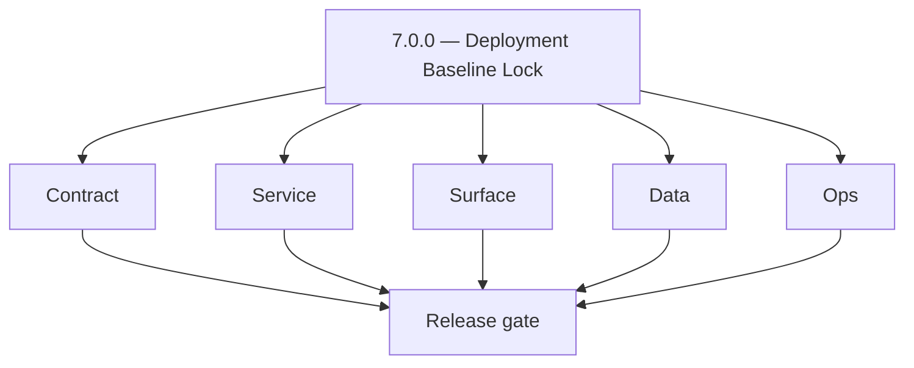
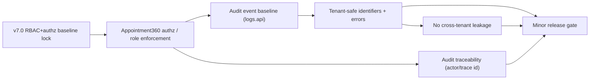
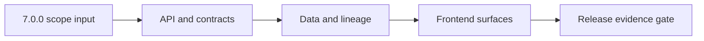

# Version 7.0

- **Status:** ✅ Completed
- **Target window:** TBD
- **Summary:** Deployment era baseline lock. Cross-service execution pack for this minor across contract, service, surface, data, and ops.
- **Scope:** RBAC role matrix freeze, service-level authorization boundaries, admin governance/audit baseline, tenant-safe error semantics, and deployment readiness evidence.
- **Roadmap mapping:** `7.x` stage group (Stages 7.1–7.9 detailed in roadmap)
- **Owner:** Data Platform Team
- **Patch closure:** Every codenamed patch file includes **Micro-gate** + **Service task slices**. Era hub: [`versions.md`](../versions.md).

## Scope

- Target minor: `7.0.0` aligned to current roadmap mapping in this file.
- In scope: contract, service, surface, data, and ops tasks across core Contact360 services.
- Primary owners: API, App, Jobs, Sync, Admin, and supporting platform services.
- Exclusions: work outside this minor unless required for compatibility or incident risk reduction.
- Output: actionable per-service task breakdown and execution queue for release readiness.

## Flowchart

Delivery work for this minor follows the five-track model (contract, service, surface, data, ops) through a release gate.

### Runtime focus (unique to this minor)

See also: [`docs/flowchart.md`](../flowchart.md) for system-wide and master views.

## Task tracks

### Contract
- ✅ Completed: ✅ Completed: 📌 Planned: **api**: define v7.0 contract outcomes for RBAC/authz baseline; harden auth error envelopes and request/response schema boundaries in `contact360.io/api` (Appointment360 gateway contract).
- ✅ Completed: ✅ Completed: 📌 Planned: **app**: define v7.0 contract outcomes for RBAC/authz baseline; align UI payload contracts with backend role/permission enums in `contact360.io/app` and ensure unauthorized/admin actions are modeled explicitly.
- ✅ Completed: ✅ Completed: 📌 Planned: **jobs**: define v7.0 contract outcomes for audit-ready execution; lock worker message schema and retry metadata in `contact360.io/jobs` to carry actor/trace identifiers for governance.
- ✅ Completed: ✅ Completed: 📌 Planned: **sync**: define v7.0 contract outcomes for tenant-safe sync semantics; stabilize sync payload mapping and delta semantics in `contact360.io/sync` (Connectra) with tenant-safe identifiers.
- ✅ Completed: ✅ Completed: 📌 Planned: **admin**: define v7.0 contract outcomes for admin governance baseline; formalize control-plane request contracts and guardrails in `contact360.io/admin` (approval flows + reason codes).
- ✅ Completed: ✅ Completed: 📌 Planned: **mailvetter**: define v7.0 contract outcomes for deployment readiness; pin verifier payload expectations and include audit-friendly verdict fields in `backend(dev)/mailvetter`.
- ✅ Completed: ✅ Completed: 📌 Planned: **emailapis**: define v7.0 contract outcomes for deployment readiness; normalize provider adapter contract and fallback keys in `lambda/emailapis` and ensure role-gated operations map to safe responses.
- ✅ Completed: ✅ Completed: 📌 Planned: **emailapigo**: define v7.0 contract outcomes for deployment readiness; enforce Go adapter contract parity with shared models in `lambda/emailapigo`.

- ✅ Completed: 📌 Planned: **[appointment360]** — refine duplicate task (was: 📌 planned: **[architecture]** — product **graphql** remains …) | patch `7.0.0` band `0` | reason: specialize this file vs sibling patches; see docs/codebases/appointment360-codebase-analysis.md
### Service
- ✅ Completed: ✅ Completed: 📌 Planned: **api**: deliver v7.0 service outcomes for RBAC/authz baseline; implement strict handler guards and deterministic branching in `contact360.io/api`, including safe auth failure handling.
- ✅ Completed: ✅ Completed: 📌 Planned: **app**: deliver v7.0 service outcomes for RBAC/authz baseline; wire client flows to canonical endpoints and failure states in `contact360.io/app` (including step-up/2FA expectations where relevant).
- ✅ Completed: ✅ Completed: 📌 Planned: **jobs**: deliver v7.0 service outcomes for governance-ready execution; ensure queue worker orchestration and retries in `contact360.io/jobs` preserve actor/trace context for audit.
- ✅ Completed: ✅ Completed: 📌 Planned: **sync**: deliver v7.0 service outcomes for tenant-safe sync semantics; tighten replication loops and conflict-resolution behavior in `contact360.io/sync` with tenant-safe ownership checks.
- ✅ Completed: ✅ Completed: 📌 Planned: **admin**: deliver v7.0 service outcomes for admin governance baseline; harden operator workflows and privilege-aware actions in `contact360.io/admin`.
- ✅ Completed: ✅ Completed: 📌 Planned: **mailvetter**: deliver v7.0 service outcomes for deployment readiness; calibrate verifier evidence fields in `backend(dev)/mailvetter` so audit readability holds under failure modes.
- ✅ Completed: ✅ Completed: 📌 Planned: **emailapis**: deliver v7.0 service outcomes for deployment readiness; ensure provider orchestration sequencing and fallback timing in `lambda/emailapis` is consistent and audit-traceable.
- ✅ Completed: ✅ Completed: 📌 Planned: **emailapigo**: deliver v7.0 service outcomes for deployment readiness; ensure Go runtime execution path and error wrapping in `lambda/emailapigo` are deterministic and safe.

- ✅ Completed: 📌 Planned: **[appointment360]** — refine duplicate task (was: 📌 planned: **[architecture]** — **go/gin satellites** in sco…) | patch `7.0.0` band `0` | reason: specialize this file vs sibling patches; see docs/codebases/appointment360-codebase-analysis.md
### Surface
- ✅ Completed: ✅ Completed: 📌 Planned: **api**: shape v7.0 surface outcomes for RBAC/authz baseline; publish clearer authz status semantics for consumers in `contact360.io/api`.
- ✅ Completed: ✅ Completed: 📌 Planned: **app**: shape v7.0 surface outcomes for RBAC/authz baseline; refine user-facing copy for unauthorized/admin action recovery paths in `contact360.io/app`.
- ✅ Completed: ✅ Completed: 📌 Planned: **jobs**: shape v7.0 surface outcomes for governance-ready execution; surface job lifecycle visibility for operators in `contact360.io/jobs` with audit-friendly context.
- ✅ Completed: ✅ Completed: 📌 Planned: **sync**: shape v7.0 surface outcomes for tenant-safe sync semantics; expose sync health indicators in `contact360.io/sync` without cross-tenant leakage.
- ✅ Completed: ✅ Completed: 📌 Planned: **admin**: shape v7.0 surface outcomes for admin governance baseline; streamline admin controls for triage and overrides in `contact360.io/admin` and enforce confirmation UX for destructive actions.
- ✅ Completed: ✅ Completed: 📌 Planned: **mailvetter**: shape v7.0 surface outcomes for deployment readiness; present verifier evidence fields for audit readability in `backend(dev)/mailvetter`.
- ✅ Completed: ✅ Completed: 📌 Planned: **emailapis**: shape v7.0 surface outcomes for deployment readiness; expose provider routing outcomes and fallback markers in `lambda/emailapis` and align them with audit traces.
- ✅ Completed: ✅ Completed: 📌 Planned: **emailapigo**: shape v7.0 surface outcomes for deployment readiness; clarify Go service diagnostics in integration touchpoints in `lambda/emailapigo`.

### Data
- ✅ Completed: ✅ Completed: 📌 Planned: **api**: anchor v7.0 data outcomes for RBAC/authz baseline; persist stable lineage keys and trace-friendly identifiers in `contact360.io/api` and ensure audit events include actor identity and correlation ids.
- ✅ Completed: ✅ Completed: 📌 Planned: **app**: anchor v7.0 data outcomes for RBAC/authz baseline; capture UI telemetry fields mapped to governance-relevant backend events in `contact360.io/app`.
- ✅ Completed: ✅ Completed: 📌 Planned: **jobs**: anchor v7.0 data outcomes for governance-ready execution; record queue attempt history with reproducible markers in `contact360.io/jobs`.
- ✅ Completed: ✅ Completed: 📌 Planned: **sync**: anchor v7.0 data outcomes for tenant-safe sync semantics; preserve delta lineage across index and storage writes in `contact360.io/sync` with tenant-safe identifiers.
- ✅ Completed: ✅ Completed: 📌 Planned: **admin**: anchor v7.0 data outcomes for admin governance baseline; track governance events with immutable audit attributes in `contact360.io/admin`.
- ✅ Completed: ✅ Completed: 📌 Planned: **mailvetter**: anchor v7.0 data outcomes for deployment readiness; store verdict evidence artifacts with replay metadata in `backend(dev)/mailvetter`.
- ✅ Completed: ✅ Completed: 📌 Planned: **emailapis**: anchor v7.0 data outcomes for deployment readiness; retain provider decision lineage for reconciliation in `lambda/emailapis`.
- ✅ Completed: ✅ Completed: 📌 Planned: **emailapigo**: anchor v7.0 data outcomes for deployment readiness; maintain Go-path trace continuity across provider hops in `lambda/emailapigo`.

- ✅ Completed: 📌 Planned: **[appointment360]** — refine duplicate task (was: 📌 planned: **[architecture]** — **postgresql-first** per `do…) | patch `7.0.0` band `0` | reason: specialize this file vs sibling patches; see docs/codebases/appointment360-codebase-analysis.md
### Ops
- ✅ Completed: ✅ Completed: 📌 Planned: **api**: enforce v7.0 ops outcomes for RBAC/authz baseline; add release-gate checks and rollback-safe toggles in `contact360.io/api`.
- ✅ Completed: ✅ Completed: 📌 Planned: **app**: enforce v7.0 ops outcomes for RBAC/authz baseline; ship smoke scripts for key UI-to-API RBAC journeys in `contact360.io/app`.
- ✅ Completed: ✅ Completed: 📌 Planned: **jobs**: enforce v7.0 ops outcomes for governance-ready execution; expand runbook coverage for backlog and retry incidents in `contact360.io/jobs` with governance trace context.
- ✅ Completed: ✅ Completed: 📌 Planned: **sync**: enforce v7.0 ops outcomes for tenant-safe sync semantics; add governance-aware runbook entries for resync/consistency incidents in `contact360.io/sync`.
- ✅ Completed: ✅ Completed: 📌 Planned: **admin**: enforce v7.0 ops outcomes for admin governance baseline; codify operational checklists for high-risk actions in `contact360.io/admin` (approval/reason + audit verify).
- ✅ Completed: ✅ Completed: 📌 Planned: **mailvetter**: enforce v7.0 ops outcomes for deployment readiness; define verification evidence/SLA monitors and escalation points in `backend(dev)/mailvetter`.
- ✅ Completed: ✅ Completed: 📌 Planned: **emailapis**: enforce v7.0 ops outcomes for deployment readiness; add provider health probes and failover thresholds in `lambda/emailapis` with audit trace correlation.
- ✅ Completed: ✅ Completed: 📌 Planned: **emailapigo**: enforce v7.0 ops outcomes for deployment readiness; instrument Go service KPIs and on-call diagnostics in `lambda/emailapigo` with trace/correlation.
- ✅ Completed: ✅ Completed: 📌 Planned: **logs.api**: Move `API_KEY` out of `lambda/logs.api/samconfig.toml` into AWS SSM Parameter Store; reference via SAM parameter overrides (no plaintext keys in repo).
- ✅ Completed: ✅ Completed: 📌 Planned: **logs.api**: Add `samconfig.dev.toml` and `samconfig.prod.toml` (or named env profiles) so dev and prod stacks are isolated; extend `Makefile` / deploy scripts with explicit targets.
- ✅ Completed: ✅ Completed: 📌 Planned: **logs.api**: Replace or complement Windows-only `build_deploy.bat` with cross-platform scripts (POSIX shell + PowerShell parity) aligned with `Makefile` targets.
- ✅ Completed: ✅ Completed: ⬜ Incomplete: **s3storage** — fix SAM template `HttpApi` CORS wildcard: replace `*` with explicit allowed origins; align with runtime allowlist in `lambda/s3storage/app/core/config.py`.
- ✅ Completed: ✅ Completed: ⬜ Incomplete: **s3storage** — sanitize `samconfig.toml` to remove real-looking bucket/API-key values; replace with SSM Parameter Store references or documented placeholder pattern.
- ✅ Completed: ✅ Completed: 📌 Planned: **s3storage** — add deployment compliance checklist artifact to `docs/deploy/` documenting auth boundary, CORS policy, IAM scoping, and secret rotation procedure.
- ✅ Completed: ✅ Completed: ⬜ Incomplete: **emailapis** — `lambda/emailapis/samconfig.toml` contains **real production secrets** in `parameter_overrides` (API keys, DB URL, OpenAI key, ConnectraAPIKey, IcyPeas key, ScrapingDog key) — replace all values with `{{PLACEHOLDER}}`; add to `.gitignore`; inject secrets via CI environment or SSM Parameter Store.
- ✅ Completed: ✅ Completed: ⬜ Incomplete: **emailapis** — `CONNECTRA_BASE_URL` hardcoded as raw IP `http://34.202.230.82:8080` in `lambda/emailapis/template.yaml` — replace with SSM parameter or named service endpoint.
- ✅ Completed: ✅ Completed: ⬜ Incomplete: **emailapigo** — `CONNECTRA_BASE_URL` and `MAILVETTER_BASE_URL` hardcoded as raw IPs in `lambda/emailapigo/template.yaml` — replace with SSM parameter references; also add `samconfig.toml` for Go deployment (currently missing).
- ✅ Completed: ✅ Completed: 📌 Planned: **emailapis** — add `lambda/emailapis/samconfig.dev.toml` and `samconfig.prod.toml` with stack/parameter isolation so dev and prod stacks are separate; update `Makefile` (or add `Makefile`) with explicit `deploy-dev` and `deploy-prod` targets.
- ✅ Completed: ✅ Completed: 📌 Planned: **emailapigo** — create `lambda/emailapigo/samconfig.toml` for Go Lambda deployment; create `samconfig.dev.toml` and `samconfig.prod.toml` for environment isolation.
- ✅ Completed: ✅ Completed: 📌 Planned: **emailapis / emailapigo** — add deployment compliance checklist: auth boundary (`X-API-Key`), CORS policy, IAM permissions scope, secret rotation procedure, and provider key rotation steps.
- ✅ Completed: ✅ Completed: ✅ Completed: **backend(dev)/salesnavigator** — AWS SAM deployment configured: `template.yaml` defines `SalesNavigatorApiFunction` Lambda (FastAPI + Mangum), `HttpApi` event bindings for `ANY /` and `ANY /{proxy+}`, all env vars injected via SAM parameters (`ApiKey`, `ConnectraApiUrl`, `ConnectraApiKey`, `ConnectraTimeout`, `MaxHtmlSize`); `samconfig.toml` present and correctly excluded from git via `.gitignore`.
- ✅ Completed: ✅ Completed: ✅ Completed: **backend(dev)/salesnavigator** — `build_deploy.bat` build/deploy script exists for Windows PowerShell pipeline; `pytest.ini` test configuration present; `requirements.txt` dependency manifest present.
- ✅ Completed: ✅ Completed: ⬜ Incomplete: **backend(dev)/salesnavigator** — `template.yaml` uses `Runtime: python3.11` in both `Globals` and the `SalesNavigatorApiFunction` resource — local development likely uses Python 3.12 (consistent with `contact360.io/api` and `backend(dev)/contact.ai`); update to `python3.12` to avoid runtime inconsistencies and match the interpreter used for local testing.
- ✅ Completed: ✅ Completed: ⬜ Incomplete: **backend(dev)/salesnavigator** — No CI/CD pipeline (no `.github/workflows/` directory) — changes to the salesnavigator Lambda are deployed manually via `build_deploy.bat`; add a GitHub Actions workflow running `pytest` + `sam build` + `sam deploy` on merge to `main`, with a staging deploy on PRs.
- ✅ Completed: ✅ Completed: 📌 Planned: **backend(dev)/salesnavigator** — Create `samconfig.prod.toml` (separate from the dev `samconfig.toml`) with all `parameter_overrides` pointing to AWS SSM Parameter Store (`{{resolve:ssm:/contact360/salesnavigator/api-key}}` etc.) instead of plaintext values; the current dev `samconfig.toml` correctly in `.gitignore` but there is no documented prod deploy path.
- ✅ Completed: ✅ Completed: ⬜ Incomplete: **extension/contact360 salesnavigator Lambda** — no `samconfig.toml` exists; create with `[default.deploy.parameters]` block using SSM references for `ApiKey` and `ConnectraApiKey`; add to `.gitignore` if containing environment overrides.
- ✅ Completed: ✅ Completed: ⬜ Incomplete: **extension/contact360 salesnavigator Lambda** — `template.yaml` `ConnectraApiUrl` parameter Default value is hardcoded IP `http://18.234.210.191:8000`; remove default or replace with SSM reference before production deployment.
- ✅ Completed: ✅ Completed: ⬜ Incomplete: **extension/contact360 salesnavigator Lambda** — `template.yaml` Outputs block references `ServerlessHttpApi` (via `!GetAtt ServerlessHttpApi.ApiEndpoint`); verify this implicit resource name is correct for the SAM `HttpApi` auto-created resource, or define explicit `HttpApi` resource and fix the reference.
- ✅ Completed: ✅ Completed: 📌 Planned: **extension/contact360 salesnavigator Lambda** — add CORS configuration to `template.yaml` SAM HttpApi; browser extension requests to Lambda will be blocked by CORS without explicit `Access-Control-Allow-Origin` configuration.
- ✅ Completed: ✅ Completed: 📌 Planned: **extension/contact360 salesnavigator Lambda** — create `samconfig.dev.toml` and `samconfig.prod.toml` for environment-isolated deployments; add `Makefile` or PowerShell deploy targets mirroring `scripts/deploy.sh` / `scripts/deploy.ps1`.
- ✅ Completed: ✅ Completed: 📌 Planned: **extension/contact360** — add extension manifest version bump + Chrome Web Store submission checklist to deployment runbook; include CRX packaging, permissions review, and privacy policy URL.
- ✅ Completed: ✅ Completed: ⬜ Incomplete: **contact360.io/sync (Connectra)** — `.env` file with real/dev credentials is committed to the repository (`PG_DB_PASSWORD=password`, S3 key placeholders); add `.env` to `.gitignore`; use `.example.env` as the only committed env template.
- ✅ Completed: ✅ Completed: ⬜ Incomplete: **contact360.io/sync (Connectra)** — `connectra.exe` binary is committed to the repository root; add `*.exe`, `connectra`, and build output paths to `.gitignore`; remove binary from git history.
- ✅ Completed: ✅ Completed: ⬜ Incomplete: **contact360.io/sync (Connectra)** — `.DS_Store` macOS artifact is committed; add `.DS_Store` and `.idea/` to `.gitignore`.
- ✅ Completed: ✅ Completed: 📌 Planned: **contact360.io/sync (Connectra)** — create `docker-compose.yml` for local development stack: Connectra service + PostgreSQL + Elasticsearch containers with health checks and volume mounts; enables one-command local env setup without manual service installation.
- ✅ Completed: ✅ Completed: 📌 Planned: **contact360.io/sync (Connectra)** — add `Makefile` targets: `make build`, `make run-server`, `make run-jobs`, `make test`, `make migrate-up`, `make migrate-down`; document in `README.md`.
- ✅ Completed: ✅ Completed: 📌 Planned: **contact360.io/sync (Connectra)** — update `Dockerfile` to use multi-stage build (builder stage with full Go toolchain → minimal `FROM scratch` or `FROM gcr.io/distroless/static` runtime image) to reduce production image size from ~500MB to <20MB.
- ✅ Completed: ✅ Completed: ⬜ Incomplete: **contact360.io/root (marketing)** — `.env.local` is committed to the repository (contains `NEXT_PUBLIC_API_URL`, `NEXT_PUBLIC_API_VERSION`, etc.); add `.env.local` to `.gitignore`; the `.env.example` file is the correct committed reference — remove `.env.local` from git history.
- ✅ Completed: ✅ Completed: ⬜ Incomplete: **contact360.io/root (marketing)** — `deploy/ec2-deploy.sh` hardcodes the EC2 server IP `54.196.224.143` in comments and in the final status messages; extract to a `SERVER_IP` variable at the top of the script so it can be changed without editing multiple lines.
- ✅ Completed: ✅ Completed: ⬜ Incomplete: **contact360.io/root (marketing)** — `deploy/ec2-deploy.sh` checks for `.env.production` but the `.env.example` reference file is named `.env.example` (no `.env.production.example` exists) — add `.env.production.example` to the repository with all required production keys documented.
- ✅ Completed: ✅ Completed: 📌 Planned: **contact360.io/root (marketing)** — add GitHub Actions workflow `.github/workflows/ci.yml` running `npm run lint`, `npm run typecheck`, `npm run test`, and `npm run build` on every PR; add a `deploy.yml` workflow that SSHs to the EC2 server and runs `./deploy/ec2-update.sh` on merge to `main`.
- ✅ Completed: ✅ Completed: 📌 Planned: **contact360.io/root (marketing)** — evaluate AWS Amplify or CloudFront + S3 static hosting as an alternative to EC2+PM2+Nginx for the Next.js marketing site; Amplify supports `next export` or SSR-on-Lambda and provides automatic HTTPS, CDN, and branch preview deployments without manual server management.
- ✅ Completed: ✅ Completed: 📌 Planned: **contact360.io/root (marketing)** — add `ecosystem.config.js` health-check and restart policy: set `max_restarts: 10`, `min_uptime: 5000`, `watch: false`, and `env_production` block; add `pm2 startup` and `pm2 save` to `ec2-setup.sh` to survive server reboots automatically.
- ✅ Completed: ✅ Completed: ⬜ Incomplete: **contact360.io/jobs** — `S3_UPLOAD_FILE_PATH_PRIFIX` is a typo (should be `S3_UPLOAD_FILE_PATH_PREFIX`); the typo appears in `app/core/config.py` (field alias), `example.env`, and `docker-compose.yml`; fix the typo everywhere and add a deprecated alias for the old misspelled variable to avoid breaking running deployments.
- ✅ Completed: ✅ Completed: ⬜ Incomplete: **contact360.io/jobs** — `docker-compose.yml` healthcheck for `scheduler-first-time`, `scheduler-retry`, and `consumer` containers uses `python -c "import sys; sys.exit(0)"` which always exits 0 regardless of whether the Python process is functional — replace with a process-alive check or a lightweight HTTP probe on a sidecar port.
- ✅ Completed: ✅ Completed: ⬜ Incomplete: **contact360.io/jobs** — `docker-compose.yml` healthcheck for the `api` container hits `http://localhost:8000/docs` (Swagger UI) rather than `http://localhost:8000/health/ready`; replace with the readiness endpoint so Docker confirms Kafka + PG connectivity before marking the container healthy.
- ✅ Completed: ✅ Completed: 📌 Planned: **contact360.io/jobs** — update `Dockerfile` to use a multi-stage build: `FROM python:3.12-slim AS builder` (install deps) → `FROM python:3.12-slim AS runtime` (copy site-packages only, no pip/build tools) to reduce image size and improve security posture.
- ✅ Completed: ✅ Completed: 📌 Planned: **contact360.io/jobs** — add `Makefile` targets: `make dev`, `make test`, `make build`, `make docker-up`, `make docker-down`, `make migrate-upgrade`, `make migrate-downgrade`; document in `README.md` for developer onboarding.
- ✅ Completed: ✅ Completed: ⬜ Incomplete: **contact360.io/email (Mailhub)** — no `.env.example` file exists in the repository; the only environment variable (`NEXT_PUBLIC_BACKEND_URL`) is used with a non-null assertion (`!`) in `src/lib/utils.ts`; create `.env.example` documenting `NEXT_PUBLIC_BACKEND_URL=http://localhost:8080` and update `README.md` with local setup instructions.
- ✅ Completed: ✅ Completed: ⬜ Incomplete: **contact360.io/email (Mailhub)** — `package.json` has `@netlify/plugin-nextjs` in `devDependencies` indicating a Netlify deployment target, but no `netlify.toml` configuration file exists; create `netlify.toml` with `[build] command = "npm run build" publish = ".next"` and the `[[plugins]] package = "@netlify/plugin-nextjs"` stanza.
- ✅ Completed: ✅ Completed: ⬜ Incomplete: **contact360.io/email (Mailhub)** — `package.json` has no `typecheck` script; TypeScript errors are only caught at build time — add `"typecheck": "tsc --noEmit"` to `package.json` scripts and run it in CI before build to catch type errors without a full Next.js build.
- ✅ Completed: ✅ Completed: 📌 Planned: **contact360.io/email (Mailhub)** — add GitHub Actions workflow `.github/workflows/ci.yml` running `npm run lint`, `npm run typecheck`, and `npm run build` on every PR; add an environment secret `NEXT_PUBLIC_BACKEND_URL` for the build step so the non-null assertion does not fail CI.
- ✅ Completed: ✅ Completed: 📌 Planned: **contact360.io/email (Mailhub)** — add a production `Dockerfile` for self-hosted deployment alternative: `FROM node:20-alpine AS builder` → `FROM node:20-alpine AS runner` with `NEXT_TELEMETRY_DISABLED=1` and `NODE_ENV=production`; complement the Netlify deployment path with a containerized option.
- ✅ Completed: ✅ Completed: ✅ Completed: **contact360.io/app (Dashboard)** — production deployment configured: `next.config.js` uses `output: "standalone"` for optimized EC2 builds; `ecosystem.config.js` configures PM2 cluster mode (`instances: "max"`) with auto-restart, max-memory-restart, and structured log paths; `deploy/ec2-deploy.sh`, `ec2-setup.sh`, `ec2-update.sh` scripts exist for EC2 lifecycle management.
- ✅ Completed: ✅ Completed: ✅ Completed: **contact360.io/app (Dashboard)** — CI/CD gates in `package.json`: `"ci"` script runs `lint + typecheck + test + build`; `"pre-push"` hook runs `typecheck + lint + test`; Husky + lint-staged enforces ESLint + Prettier on every commit; Playwright e2e smoke tests exist.
- ✅ Completed: ✅ Completed: ✅ Completed: **contact360.io/app (Dashboard)** — `next.config.js` production hardening in place: `compress: true`, `poweredByHeader: false`, `compiler.removeConsole` in production, `devIndicators: false`, image SVG security policy, `output: "standalone"`.
- ✅ Completed: ✅ Completed: ⬜ Incomplete: **contact360.io/app (Dashboard)** — `next.config.js` has no `headers()` export returning security headers (`Content-Security-Policy`, `X-Frame-Options`, `X-Content-Type-Options`, `Referrer-Policy`, `Permissions-Policy`); serving the dashboard without a CSP allows XSS escalation via any injected script — add a `headers()` export with at minimum `X-Frame-Options: DENY`, `X-Content-Type-Options: nosniff`, `Referrer-Policy: strict-origin-when-cross-origin`.
- ✅ Completed: ✅ Completed: ⬜ Incomplete: **contact360.io/app (Dashboard)** — `e2e/smoke.spec.ts` contains only 2 Playwright tests (home page loads, login page reachable); there are no e2e tests for authenticated flows (login → contacts, login → jobs, login → billing) — expand e2e coverage to at least: login with valid credentials, navigate to contacts page, verify that unauthenticated access to `/dashboard` redirects to `/login`.
- ✅ Completed: ✅ Completed: 📌 Planned: **contact360.io/app (Dashboard)** — add GitHub Actions workflow `.github/workflows/ci.yml` to run `npm run ci` (lint + typecheck + test + build) on every PR; add Playwright e2e as a separate workflow step with `NEXT_PUBLIC_API_URL` and `NEXT_PUBLIC_GRAPHQL_URL` set to a test/staging backend.
- ✅ Completed: ✅ Completed: 📌 Planned: **contact360.io/app (Dashboard)** — add Docker deployment path as an alternative to PM2/EC2: create a multi-stage `Dockerfile` (`FROM node:20-alpine AS builder` → copy `standalone` output → `FROM node:20-alpine AS runner`) so the dashboard can be deployed as a container alongside `contact360.io/jobs` and `contact360.io/email`.

- ✅ Completed: 📌 Planned: **[appointment360]** — refine duplicate task (was: 📌 planned: **[architecture]** — **observability**: correlate…) | patch `7.0.0` band `0` | reason: specialize this file vs sibling patches; see docs/codebases/appointment360-codebase-analysis.md
- ✅ Completed: 📌 Planned: **[appointment360]** — refine duplicate task (was: 📌 planned: **[architecture]** — **django docsai** (`contact3…) | patch `7.0.0` band `0` | reason: specialize this file vs sibling patches; see docs/codebases/appointment360-codebase-analysis.md
## Task Breakdown
### Version `7.0.0` per-service execution slices

#### api
- Contract: lock v7.0 authz/error contract boundaries in `contact360.io/api` and align to RBAC role matrix.
- Service: enforce runtime RBAC/authz guards and ensure audit event baseline emission.
- Surface: expose clear authorization outcomes and safe recovery paths for consumers.
- Data: retain audit/trace keys (actor identity + request/trace correlation) for governance queries.
- Ops: validate runbooks, checks, and release evidence for `api` with concrete pass/fail criteria.
- Acceptance: v7.0 gate passes for `api` with RBAC/authz + audit baseline validated end-to-end.

#### app
- Contract: lock v7.0 UI payload expectations for admin governance and gated actions in `contact360.io/app`.
- Service: execute client wiring for admin workflows and gated failure handling.
- Surface: expose clear operator/user cues for unauthorized/admin actions (no silent partial success).
- Data: capture UI telemetry mapping to backend governance events.
- Ops: validate smoke evidence for primary admin journeys.
- Acceptance: v7.0 gate passes for `app` with role-gated UX consistent with backend enforcement.

#### jobs
- Contract: lock v7.0 worker message schema to carry actor/trace context for auditability.
- Service: run governance-ready execution path and retries preserving correlation ids.
- Surface: expose operator-visible job lifecycle signals linked to audit evidence.
- Data: persist queue attempt history with governance markers.
- Ops: validate runbook updates for backlog/retry incidents.
- Acceptance: v7.0 gate passes for `jobs` with audit traceability from action to execution.

#### sync
- Contract: lock v7.0 tenant-safe sync semantics in `contact360.io/sync` (Connectra).
- Service: enforce tenant-safe ownership checks through sync/replication paths.
- Surface: expose sync health signals without cross-tenant leakage.
- Data: preserve delta lineage with tenant-safe identifiers.
- Ops: validate resync/governance incident playbooks.
- Acceptance: v7.0 gate passes for `sync` with tenant boundary integrity validated.

#### admin
- Contract: lock v7.0 admin approval/control-plane request contracts in `contact360.io/admin`.
- Service: enforce privilege-aware actions and ensure audit events are written with actor+reason.
- Surface: present confirmation UX for destructive/admin actions.
- Data: write immutable governance/audit attributes.
- Ops: validate audit readability and export affordances.
- Acceptance: v7.0 gate passes for `admin` with auditable governance actions.

#### mailvetter
- Contract: lock v7.0 verifier evidence fields and expected payloads for audit readability.
- Service: ensure verification outcomes map cleanly to governance/audit signals.
- Surface: show verifier evidence states that can be audited.
- Data: store evidence artifacts with replay metadata.
- Ops: validate evidence retention and secret handling for the minor.
- Acceptance: v7.0 gate passes for `mailvetter` with governance-ready evidence under failures.

#### emailapis
- Contract: lock v7.0 email finder/verifier compatibility notes with role-gated invocation rules.
- Service: enforce authorization behavior and deterministic error envelopes in `lambda/emailapis`.
- Surface: expose provider routing/fallback outcomes in an audit-friendly way.
- Data: retain provider decision lineage for reconciliation.
- Ops: validate release checks + rollback notes.
- Acceptance: v7.0 gate passes for `emailapis` with RBAC/authz + audit correlation.

#### emailapigo
- Contract: lock v7.0 Go adapter contract parity and safe error wrapping expectations.
- Service: execute deterministic runtime behavior and preserve trace/correlation ids.
- Surface: ensure integration touchpoints reflect safe diagnostics.
- Data: maintain trace continuity across provider hops.
- Ops: validate Go service KPIs and on-call diagnostics wiring.
- Acceptance: v7.0 gate passes for `emailapigo` with governance-ready traceability.

## Immediate next execution queue
- 📌 Planned: Freeze v7.0 RBAC/authz error vocabulary across `api`, `jobs`, and email services; capture before/after schema diff evidence.
- 📌 Planned: Run one `app -> api -> emailapigo` golden-path admin-governed action and archive request/response traces with owner signoff.
- 📌 Planned: Isolate the highest-risk async fault in `jobs` that could break audit traceability, then land a regression test.
- 📌 Planned: Validate `sync` tenant-safe identifiers preserve lineage through the `mailvetter` evidence path for v7.0.
- 📌 Planned: Update `contact360.io/admin` operational checklist entries for v7.0, including escalation thresholds and rollback triggers.
- 📌 Planned: Run a controlled retry/idempotency drill on one governance-relevant async workflow and ensure audit evidence remains consistent.
- 📌 Planned: Verify `app` messaging mirrors backend behavior for authorization outcomes (unauthorized/forbidden/admin-needed); include UI screenshots tied to API payload samples.
- 📌 Planned: Publish v7.0 cut-readiness notes with clear owners, unresolved blockers, and go/no-go criteria.

## Cross-service ownership

| Service | Version delivery focus |
|---|---|
| contact360.io/api | v7.0 RBAC/authz + audit contract boundary control |
| contact360.io/app | v7.0 role-gated UX parity and authz outcome consistency |
| contact360.io/jobs | v7.0 async execution integrity with audit traceability |
| contact360.io/sync | v7.0 tenant-safe lineage parity |
| contact360.io/admin | v7.0 operator governance and auditable release controls |
| backend(dev)/mailvetter | v7.0 verifier evidence quality for audit readability |
| lambda/emailapis | v7.0 provider routing policy + audit correlation |
| lambda/emailapigo | v7.0 Go-path diagnostics + contract parity |

## References

- [docs/versions.md](../versions.md)
- [docs/roadmap.md](../roadmap.md)
- [docs/version-policy.md](../version-policy.md)
- [docs/architecture.md](../architecture.md)
- [docs/codebase.md](../codebase.md)
- [Email system rule](../../.cursor/rules/email_system.md)
- [Email integration exploration](../../.cursor/rules/cursor_contact360_email_integration_exp.md)
- [lambda/emailapis breakdown](../../lambda/emailapis/docs/VERSION_TASK_BREAKDOWN_0.0_TO_10.10.md)
- [contact360.io/api README](../../contact360.io/api/README.md)
- [contact360.io/jobs README](../../contact360.io/jobs/README.md)
- [contact360.io/sync README](../../contact360.io/sync/README.md)
- [backend(dev)/mailvetter README](../../backend(dev)/mailvetter/README.md)

## Backend API and Endpoint Scope

- Era: `7.x`
- Logging service contract reference: `lambda/logs.api/docs/api.md`.
- Endpoint matrix reference: `docs/backend/endpoints/logsapi_endpoint_era_matrix.json`.
- Contract focus for `7.0`: logging evidence coverage for core flows in this minor.
- Public/private contract notes: enforce tenant-scoped access, authz boundaries, and API key governance for log queries/writes.

## Database and Data Lineage Scope

- PostgreSQL lineage touchpoints: correlate business entities with log `request_id` and `trace_id` where available.
- Elasticsearch index changes: include only when this minor expands analytics/search contracts that consume logs.
- S3 bucket/artifact changes: `logs/` CSV objects retained per lifecycle policy.
- MongoDB/audit/log lineage updates: canonical logs backend is S3 CSV for logs.api; update references accordingly.
- Data lineage reference: `docs/backend/database/logsapi_data_lineage.md`.

## Frontend UX Surface Scope

- Primary pages/surfaces: admin/activity/audit views and era-specific operational panels.
- Tabs/navigation changes: document concrete logs-facing tabs for this minor.
- Modal/dialog and state transitions: query/search/filter -> result/empty/error/retry states.
- Hook/service/context wiring: logging-aware services/hooks and role/tenant contexts.
- UI binding reference: `docs/frontend/logsapi-ui-bindings.md`.

## UI Elements Checklist

- Buttons (primary/secondary/link/loading): documented
- Inputs/textareas/selects: documented
- Checkboxes: documented
- Radio buttons: documented
- Progress bars: documented
- Toast/alert/error states: documented
- Loading and empty states: documented

## Flow/Graph Delta for This Minor

## Release Gate and Evidence

- 📌 Planned: API contract diff reviewed
- 📌 Planned: DB/index/storage migration evidence captured
- 📌 Planned: UI smoke path verified with screenshots or traces
- 📌 Planned: Flow diagram updated and validated
- 📌 Planned: Roadmap mapping and owner alignment confirmed
- ✅ Completed: **contact360.io/api** — `template.yaml` (AWS SAM) defines `Appointment360ApiFunction` with Lambda + API Gateway; `samconfig.toml` holds deployment parameters; `DeploymentStrategy: Canary10Percent5Minutes` enables blue/green rollout — Lambda serverless deployment path exists.
- ✅ Completed: **contact360.io/api** — `Dockerfile` + `docker-compose.yml` present for EC2 containerized deployment; Gunicorn entrypoint with multiple Uvicorn workers; healthcheck at `/health` endpoint.
- ✅ Completed: **contact360.io/api** — Alembic migration framework configured (`alembic.ini` + `alembic/` directory); `alembic upgrade head` is the DB migration path.
- ⬜ Incomplete: **contact360.io/api** — `.env` file with production credentials is tracked by git (not in `.gitignore`) — adding `.env` to `.gitignore` and rotating all leaked secrets (`SECRET_KEY`, `AWS_ACCESS_KEY_ID`, `AWS_SECRET_ACCESS_KEY`, `CONNECTRA_API_KEY`, database password) is a P0 security prerequisite before any further deployment.
- ⬜ Incomplete: **contact360.io/api** — `samconfig.toml` `parameter_overrides` has `SecretKey=your-secret-key-change-me` and `AllowedOrigins=*` as template defaults — must override with real values in the deployment pipeline (not committed); also the `LambdaLogsApiUrl` in samconfig points to a different API Gateway ID (`ow8pbf850l`) than what is in production `.env` (`c2cox8ij6c`) — verify which endpoint is active.
- 📌 Planned: **contact360.io/api** — `docker-compose.yml` references `appointment-backend`, `appointment-postgres`, `appointment-mongodb` — MongoDB service is unused (codebase is PostgreSQL-only); remove MongoDB and rename all container/service names to `contact360-*` to match current project identity.
- 📌 Planned: **contact360.io/api** — No CI/CD pipeline file (`.github/workflows/`, `buildspec.yml`, or similar) exists in the api codebase — create a CI pipeline that runs `pytest`, `ruff`, `mypy`, Alembic migration check, and `sam validate` before allowing deploys to production.
- ✅ Completed: **contact360.io/admin** — `.github/workflows/ci.yml` runs full CI pipeline: Ruff format check, Ruff lint, isort, mypy, Django system checks (`manage.py check`), pytest with coverage; `.github/workflows/deploy.yml` handles deployment — admin has the most complete CI of all codebases.
- ✅ Completed: **contact360.io/admin** — `Dockerfile` + `docker-compose.yml` configured; `deploy/` directory contains deployment scripts; `pyproject.toml` defines tool configuration for ruff, isort, mypy, pytest.
- ⬜ Incomplete: **contact360.io/admin** — `mypy` in `ci.yml` runs with `continue-on-error: true` — type errors do not block merges; remove `continue-on-error` after resolving existing mypy errors to enforce strict typing as a release gate.
- ⬜ Incomplete: **contact360.io/admin** — `SECURE_SSL_REDIRECT=false` in both development `.env` and production `.env.prod` — HTTPS redirect is disabled; production deployment must have `SECURE_SSL_REDIRECT=True` (or confirm Nginx/load-balancer handles TLS termination with HSTS headers).
- 📌 Planned: **contact360.io/admin** — `deploy.yml` GitHub Actions workflow exists but content not fully reviewed — verify it runs `manage.py migrate` before deploy, sets `DEBUG=False`, validates `ALLOWED_HOSTS` is not `*`, and deploys to EC2 with zero-downtime strategy (e.g., Gunicorn reload or blue/green).
- ✅ Completed: **backend(dev)/contact.ai** — AWS SAM deployment fully configured: `template.yaml` defines `ContactAiFunction` (Lambda + API Gateway HTTP API), Mangum adapter wires FastAPI to Lambda (`app.main.handler`), `samconfig.toml` sets `stack_name=contact-ai-stack`, `region=us-east-1`, `resolve_s3=true` for artifact upload; `build_deploy.bat` provides a local build+deploy script.
- ✅ Completed: **backend(dev)/contact.ai** — `lambda_utils.py` implements `IS_LAMBDA` detection and `safe_await_in_lambda()` to handle async event loop closure on Lambda shutdown — prevents silent crashes when the Lambda runtime closes the event loop during PostgreSQL connection teardown.
- ⬜ Incomplete: **backend(dev)/contact.ai** — `template.yaml` specifies `Runtime: python3.11` (line 9, 58) but development uses Python 3.12 (`requirements.txt` specifies `fastapi>=0.104.0`, `sqlalchemy[asyncio]>=2.0.0` which support both) — runtime mismatch means code that passes local tests may fail on Lambda if it uses Python 3.12-only syntax; update `template.yaml` to `python3.12` to match the development environment.
- ⬜ Incomplete: **backend(dev)/contact.ai** — `samconfig.toml` `parameter_overrides` contains plaintext credentials (`ApiKey`, `DatabaseUrl`, `HfApiKey`) and is NOT in `.gitignore` — these credentials would be committed to version control; replace with AWS SSM Parameter Store references (e.g., `ApiKey=resolve:ssm:/contact-ai/api-key`) and add `samconfig.toml` to `.gitignore` or strip the `parameter_overrides` section.
- ⬜ Incomplete: **backend(dev)/contact.ai** — `template.yaml` `Timeout: 30` (line 7) for the Lambda function — the `HF_TIMEOUT_SECONDS=120` in `.env` and config allows HF inference calls up to 120 seconds; if the Lambda timeout is 30s, streaming AI responses will be cut off before HF model inference completes; increase Lambda `Timeout` to at least 180s for the AI endpoints.
- 📌 Planned: **backend(dev)/contact.ai** — Add a `samconfig.prod.toml` (gitignored) separate from `samconfig.toml` that holds only non-secret production overrides (region, stack name, log retention), and document the AWS SSM parameter paths in `.env.example` so production deploys can use `--parameter-overrides` with SSM resolvers.
- ⬜ Incomplete: **backend(dev)/email campaign** — **No `Dockerfile` exists** — the service is a standalone Go binary with no containerization; there is no `Dockerfile`, no `docker-compose.yml`, no SAM template, and no deployment script; the only deployment artifacts are the source code and a local `data/data.csv` file — the service cannot be deployed to any cloud environment without first containerizing it.
- ⬜ Incomplete: **backend(dev)/email campaign** — **No `docker-compose.yml`** — local development requires manually installing and starting PostgreSQL and Redis separately; add a `docker-compose.yml` with `postgres`, `redis`, and the `campaign-api` + `campaign-worker` services to enable one-command local development (matching the pattern used by `contact360.io/api`).
- ⬜ Incomplete: **backend(dev)/email campaign** — The API server and worker process run as **separate binaries** (`cmd/main.go` and `cmd/worker/main.go`) but both hardcode `localhost:6379` for Redis — in any multi-container or EC2 deployment this must be read from `REDIS_ADDR`; the worker also always loads from `.env` via `godotenv.Load()` which fails in containerized environments where env vars are injected at runtime (not from a `.env` file).
- 📌 Planned: **backend(dev)/email campaign** — Create a `Dockerfile` with a multi-stage build: `FROM golang:1.24 AS builder` (compile API and worker binaries), `FROM gcr.io/distroless/base AS runtime` (minimal runtime image); create `docker-compose.yml` with `postgres:16`, `redis:7-alpine`, `campaign-api` (port 8000), and `campaign-worker` services, all reading env vars from a shared `.env` file.
- 📌 Planned: **backend(dev)/email campaign** — Define a deployment strategy: either (a) deploy as a pair of EC2 services (API + worker) behind an ALB, or (b) deploy API as Lambda + Mangum (the same pattern as `contact.ai`) with worker as a separate ECS container consuming from Redis; document the chosen strategy in `docs/ops/runbooks/email-campaign.md`.

### Micro-gate reference (apply at every `7.N.P`)

| Track | Gate question (must answer Yes or document waiver) |
| --- | --- |
| **Contract** | RBAC/authz, audit envelope, tenant isolation — `docs/backend/apis/` + `rbac-authz.md` + matrices updated? |
| **Service** | Handler guards, key rotation, retention hooks — parity tests + deployment gates documented? |
| **Surface** | Admin/ops governance UI, role-gated flows — operator-visible delta? |
| **Frontend** | Era 7 patterns (`tenant-security-observability.md`, components) — delta? |
| **Data** | Audit tables, lineage, legal-hold — `docs/backend/database/` migrations recorded? |
| **Ops** | CI/CD, drift checks, `contact360.io/admin/deploy/` runbooks — recorded? |
| **Architecture** | Go/Gin satellites only via Python GraphQL gateway (`contact360.io/api`); Next.js `NEXT_PUBLIC_GRAPHQL_URL`; Postgres-first / Redis exit per `docs/docs/data-stores-postgres.md`. |

**Patch ladder:** See codename table below (`.0`–`.9` per minor; minors `7.6`–`7.9` use charter-style codenames).

## Patches

| Patch | Codename | Doc |
| --- | --- | --- |
| `7.0.0` | Void | [`7.0.0` — Void](7.0.0 — Void.md) |
| `7.0.1` | Seed | [`7.0.1` — Seed](7.0.1 — Seed.md) |
| `7.0.2` | Sprout | [`7.0.2` — Sprout](7.0.2 — Sprout.md) |
| `7.0.3` | Roots | [`7.0.3` — Roots](7.0.3 — Roots.md) |
| `7.0.4` | Soil | [`7.0.4` — Soil](7.0.4 — Soil.md) |
| `7.0.5` | Rain | [`7.0.5` — Rain](7.0.5 — Rain.md) |
| `7.0.6` | Stem | [`7.0.6` — Stem](7.0.6 — Stem.md) |
| `7.0.7` | Branch | [`7.0.7` — Branch](7.0.7 — Branch.md) |
| `7.0.8` | Leaf | [`7.0.8` — Leaf](7.0.8 — Leaf.md) |
| `7.0.9` | Bloom | [`7.0.9` — Bloom](7.0.9 — Bloom.md) |

## Patch ladder (7.0.0 - 7.0.9)

### Micro-gate reference (apply at every patch)

| Track | Gate question (must answer Yes or waiver) |
| --- | --- |
| **Contract** | Contract/API change captured with diff or explicit no-change note |
| **Service** | Service health and smoke for affected paths pass |
| **Surface** | UI/admin/extension impact documented or N/A |
| **Frontend** | Routes/components/hooks affected listed or N/A |
| **Data** | Migrations/index/lineage deltas linked or N/A |
| **Ops** | Rollback/secrets/CI/runbook delta linked or N/A |

**Patch intent bands:** `.0` charter, `.1-.2` scaffold, `.3-.5` hardening, `.6-.8` integration, `.9` freeze/handoff.

| Patch | Codename | Focus | Evidence gate |
| --- | --- | --- | --- |
| `7.0.0` | Void | Charter: RBAC role matrix freeze + deployment readiness scope | Charter + role matrix table linked |
| `7.0.1` | Seed | Service-level authz boundaries: per-service auth model documented | Auth model parity table complete |
| `7.0.2` | Sprout | Admin governance: approval flows + reason codes for destructive actions | `admin` confirmation modal works for destructive action |
| `7.0.3` | Roots | Audit event baseline: immutable event schema + logs.api S3 CSV binding | Audit event appears in logs.api CSV with actor + trace_id |
| `7.0.4` | Soil | Tenant-safe error semantics: no cross-tenant data in error payloads | Error response for tenant A contains no tenant B data |
| `7.0.5` | Rain | `samconfig.toml` credential scrubbing across all Lambda services | No hardcoded secrets in any `samconfig.toml` |
| `7.0.6` | Stem | Admin audit panel: date/role filter UI bound to logs.api queries | Admin can filter audit events by date and role |
| `7.0.7` | Branch | CI/CD deployment gates: pre-deploy checks for migration + health | Deployment blocked on migration failure |
| `7.0.8` | Leaf | Key rotation runbook: API key + JWT secret rotation without downtime | Key rotation completed with zero-downtime evidence |
| `7.0.9` | Bloom | Release gate: deployment readiness evidence + 8.0 handoff | Handoff documented for **8.0** |
