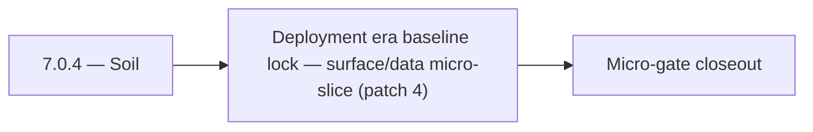

# 7.0.4 — Soil

- **Era:** `7.x` deployment — hub [`versions.md`](../versions.md) · minors start at [`7.0 — Deployment era baseline lock`](7.0%20%E2%80%94%20Deployment%20era%20baseline%20lock.md)
- **Minor:** [7.0 — Deployment era baseline lock](./7.0 — Deployment era baseline lock.md)
- **Codename:** Soil
- **Status:** planned

## Focus
Deployment era baseline lock — surface/data micro-slice (patch 4)

## Flowchart

## Micro-gate

| Track | Gate question | Answer / Evidence (fill at patch closeout) |
| --- | --- | --- |
| **Contract** | RBAC/authz, audit envelope, tenant isolation — `docs/backend/apis/` + `rbac-authz.md` updated? | Document at patch closeout. |
| **Service** | Handler guards, key rotation, retention hooks — smoke + parity tests documented? | Document smoke paths. |
| **Surface** | Admin/ops governance UI, role-gated flows — delta for this patch? | Document UX delta or N/A. |
| **Frontend** | Dashboard Era 7 deployment patterns (`tenant-security-observability.md`) touched? | Deployment era baseline; RBAC/authz vocabulary across gateway + admin. Document at closeout. |
| **Data** | Audit tables, lineage, legal-hold — migrations + `docs/backend/database/`? | Document lineage or N/A. |
| **Ops** | CI/CD gates, drift checks, runbooks (`contact360.io/admin/deploy/...`) — delta? | Document ops delta or N/A. |

## Tasks
### Surface
- 📌 Planned: **[appointment360]** — refine duplicate task (was: 📌 planned: **api**: shape v7.0 surface outcomes for rbac/aut…) | patch `7.0.4` band `4` | reason: specialize this file vs sibling patches; see docs/codebases/appointment360-codebase-analysis.md
- 📌 Planned: **[appointment360]** — refine duplicate task (was: 📌 planned: **sync**: shape v7.0 surface outcomes for tenant-…) | patch `7.0.4` band `4` | reason: specialize this file vs sibling patches; see docs/codebases/appointment360-codebase-analysis.md
- 📌 Planned: **[appointment360]** — refine duplicate task (was: 📌 planned: **emailapis**: shape v7.0 surface outcomes for de…) | patch `7.0.4` band `4` | reason: specialize this file vs sibling patches; see docs/codebases/appointment360-codebase-analysis.md
- 📌 Planned: **[appointment360]** — refine duplicate task (was: 📌 planned: validate tenant-safe user messaging for deny/erro…) | patch `7.0.4` band `4` | reason: specialize this file vs sibling patches; see docs/codebases/appointment360-codebase-analysis.md

### Data
- 📌 Planned: **[appointment360]** — refine duplicate task (was: 📌 planned: **api**: anchor v7.0 data outcomes for rbac/authz…) | patch `7.0.4` band `4` | reason: specialize this file vs sibling patches; see docs/codebases/appointment360-codebase-analysis.md
- 📌 Planned: **[appointment360]** — refine duplicate task (was: 📌 planned: **sync**: anchor v7.0 data outcomes for tenant-sa…) | patch `7.0.4` band `4` | reason: specialize this file vs sibling patches; see docs/codebases/appointment360-codebase-analysis.md
- 📌 Planned: **[appointment360]** — refine duplicate task (was: 📌 planned: **emailapis**: anchor v7.0 data outcomes for depl…) | patch `7.0.4` band `4` | reason: specialize this file vs sibling patches; see docs/codebases/appointment360-codebase-analysis.md
- 📌 Planned: **[appointment360]** — refine duplicate task (was: 📌 planned: validate lineage fields: actor, tenant, trace id,…) | patch `7.0.4` band `4` | reason: specialize this file vs sibling patches; see docs/codebases/appointment360-codebase-analysis.md

### Contract

- 📌 Planned: **[appointment360]** — Diff and document schema for operations like ConnectraClient, LAMBDA_AI_API_URL, LAMBDA_CONNECTRA_API_URL; align with roadmap | area: `backend-api` | files: `docs/backend/apis/*.md`, `contact360.io/api/app/graphql/schema.py` | reason: Keep GraphQL/REST contracts aligned for era 7.4 patch 7.0.4

### Service

- 📌 Planned: **[appointment360]** — refine duplicate task (was: 📌 planned: **[appointment360]** — service slice: - [x] ✅ com…) | patch `7.0.4` band `4` | reason: specialize this file vs sibling patches; see docs/codebases/appointment360-codebase-analysis.md

### Ops

- 📌 Planned: **[platform]** — Record smoke evidence, rollback, and alerts (patch band 4: surface/data) | area: `ops` | files: `docs/commands/`, `.github/workflows/` | reason: Smoke, rollback, and observability for patch 7.0.4

## Service task slices
> Merged from era `7.x` deployment task packs (P0→`.0`–`.2`, P1→`.3`–`.6`, Ops→`.7`–`.9`).

### contact.ai
- Implement role-gated AI features in dashboard: show/hide AI chat based on user plan.
- Feature flag: `ENABLE_AI_CHAT` per user plan; disabled → show upgrade prompt instead of chat page.
- Admin panel: show AI usage summary per user (chat count, message count, model usage).
- Add audit log schema: `{event: "chat_created|chat_deleted|message_sent", user_id, chat_id, model, timestamp}`.
- Retention policy: document max storage age for `ai_chats` and cleanup schedule.
- Add `7.x` lineage note to `contact_ai_data_lineage.md`: GDPR erasure cascade.
- Implement feature gate middleware: check user role/plan from JWT context before serving chat routes.
- Implement per-tenant API key store: validate against tenant key table instead of single env var.
- Implement `CASCADE DELETE` or scheduled erasure for `ai_chats` when user account is deleted.
- Emit audit log events (to `logs.api`) on: chat created, chat deleted, message sent, model used.
- Document and test blue-green Lambda deployment process for contact.ai.

### Appointment360 (gateway)
- Specify Mangum Lambda event format and response envelope
- Add graceful shutdown: complete in-flight requests before exit
- Configure Alembic to run migrations as separate Lambda invoke / ECS task (not at startup)
- Extension builds point to prod GraphQL endpoint (wss:// for subscription readiness)
- Dashboard graceful degradation when gateway is unreachable (network error boundary)
- Add table index review for all high-frequency query patterns
- Add GitHub Actions CD: build Docker → push ECR → deploy Lambda / EC2
- Create Terraform / CDK module for appointment360 Lambda + ALB + RDS
- Add CloudWatch alarm: Lambda invocation errors > 1% in 5 min
- Document rollback procedure: previous Lambda version alias swap

### Connectra
- Document role-gated admin/app controls tied to Connectra privileged actions.
- Validate tenant-safe user messaging for deny/error/retry flows.
- Record audit events for sensitive writes and mapping/schema changes.
- Validate lineage fields: actor, tenant, trace id, and action outcome.
- Enforce privileged path checks for `batch-upsert`, job creation, and filter mutations.
- Ensure handler-level authz mirrors gateway role checks (no role bypass).

### Jobs
- Document role-gated admin controls and retention/audit panels.
- Document deployment readiness checks visible in ops UI.
- Use `job_events` as primary deployment/audit trail evidence.
- Document retention and legal-hold expectations for job timelines.
- Add role-aware authorization path and key rotation support.
- Implement retention policy hooks and deletion governance controls.

## Evidence gate
Patch closeout includes contract diff, smoke output, data lineage delta, and ops note
