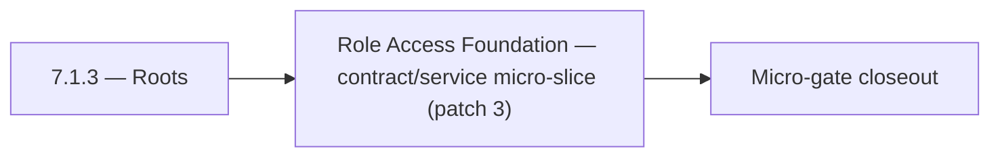

# 7.1.3 — Roots

- **Era:** `7.x` deployment — hub [`versions.md`](../versions.md) · minors start at [`7.0 — Deployment era baseline lock`](7.0%20%E2%80%94%20Deployment%20era%20baseline%20lock.md)
- **Minor:** [7.1 — Role Access Foundation](./7.1 — Role Access Foundation.md)
- **Codename:** Roots
- **Status:** planned

## Focus
Role Access Foundation — contract/service micro-slice (patch 3)

## Flowchart

## Micro-gate

| Track | Gate question | Answer / Evidence (fill at patch closeout) |
| --- | --- | --- |
| **Contract** | RBAC/authz, audit envelope, tenant isolation — `docs/backend/apis/` + `rbac-authz.md` updated? | Document at patch closeout. |
| **Service** | Handler guards, key rotation, retention hooks — smoke + parity tests documented? | Document smoke paths. |
| **Surface** | Admin/ops governance UI, role-gated flows — delta for this patch? | Document UX delta or N/A. |
| **Frontend** | Dashboard Era 7 deployment patterns (`tenant-security-observability.md`) touched? | Role access foundation — gateway role matrix alignment. Document at closeout. |
| **Data** | Audit tables, lineage, legal-hold — migrations + `docs/backend/database/`? | Document lineage or N/A. |
| **Ops** | CI/CD gates, drift checks, runbooks (`contact360.io/admin/deploy/...`) — delta? | Document ops delta or N/A. |

## Tasks
### Contract
- 📌 Planned: **[appointment360]** — refine duplicate task (was: 📌 planned: **sync**: define v7.1 contract outcomes for rbac …) | patch `7.1.3` band `3` | reason: specialize this file vs sibling patches; see docs/codebases/appointment360-codebase-analysis.md
- 📌 Planned: **[appointment360]** — refine duplicate task (was: 📌 planned: **emailapigo**: define v7.1 contract outcomes for…) | patch `7.1.3` band `3` | reason: specialize this file vs sibling patches; see docs/codebases/appointment360-codebase-analysis.md
- 📌 Planned: **[appointment360]** — refine duplicate task (was: chat (`/api/v1/ai-chats/`): prouser and above.) | patch `7.1.3` band `3` | reason: specialize this file vs sibling patches; see docs/codebases/appointment360-codebase-analysis.md
- 📌 Planned: **[appointment360]** — refine duplicate task (was: 📌 planned: lock api versioning: `/api/v1/` is stable; define…) | patch `7.1.3` band `3` | reason: specialize this file vs sibling patches; see docs/codebases/appointment360-codebase-analysis.md

### Service
- 📌 Planned: **[appointment360]** — refine duplicate task (was: 📌 planned: **sync**: deliver v7.1 service outcomes for rbac …) | patch `7.1.3` band `3` | reason: specialize this file vs sibling patches; see docs/codebases/appointment360-codebase-analysis.md
- 📌 Planned: **[appointment360]** — refine duplicate task (was: 📌 planned: **emailapigo**: deliver v7.1 service outcomes for…) | patch `7.1.3` band `3` | reason: specialize this file vs sibling patches; see docs/codebases/appointment360-codebase-analysis.md
- 📌 Planned: **[appointment360]** — refine duplicate task (was: 📌 planned: implement per-tenant api key store: validate agai…) | patch `7.1.3` band `3` | reason: specialize this file vs sibling patches; see docs/codebases/appointment360-codebase-analysis.md
- 📌 Planned: **[appointment360]** — refine duplicate task (was: 📌 planned: add role-aware authorization path and key rotatio…) | patch `7.1.3` band `3` | reason: specialize this file vs sibling patches; see docs/codebases/appointment360-codebase-analysis.md

### Surface

- 📌 Planned: **[admin]** — Verify UX for route `/` and bindings (patch 7.1.3 band 3) | area: `frontend-page` | files: `contact360/dashboard/app/page.tsx` | reason: Dashboard/extension surface for era 7 must match gateway contracts

### Data

- 📌 Planned: **[appointment360]** — refine duplicate task (was: 📌 planned: **[appointment360]** — update postgresql/es/s3 li…) | patch `7.1.3` band `3` | reason: specialize this file vs sibling patches; see docs/codebases/appointment360-codebase-analysis.md

### Ops

- 📌 Planned: **[platform]** — Record smoke evidence, rollback, and alerts (patch band 3: surface/data) | area: `ops` | files: `docs/commands/`, `.github/workflows/` | reason: Smoke, rollback, and observability for patch 7.1.3

## Service task slices
> Merged from era `7.x` deployment task packs (P0→`.0`–`.2`, P1→`.3`–`.6`, Ops→`.7`–`.9`).

### Appointment360 (gateway)
- Specify Mangum Lambda event format and response envelope
- Add graceful shutdown: complete in-flight requests before exit
- Configure Alembic to run migrations as separate Lambda invoke / ECS task (not at startup)
- Extension builds point to prod GraphQL endpoint (wss:// for subscription readiness)
- Dashboard graceful degradation when gateway is unreachable (network error boundary)
- Add table index review for all high-frequency query patterns
- Add GitHub Actions CD: build Docker → push ECR → deploy Lambda / EC2
- Create Terraform / CDK module for appointment360 Lambda + ALB + RDS
- Add CloudWatch alarm: Lambda invocation errors > 1% in 5 min
- Document rollback procedure: previous Lambda version alias swap

### Connectra
- Document role-gated admin/app controls tied to Connectra privileged actions.
- Validate tenant-safe user messaging for deny/error/retry flows.
- Record audit events for sensitive writes and mapping/schema changes.
- Validate lineage fields: actor, tenant, trace id, and action outcome.
- Enforce privileged path checks for `batch-upsert`, job creation, and filter mutations.
- Ensure handler-level authz mirrors gateway role checks (no role bypass).

### contact.ai
- Implement role-gated AI features in dashboard: show/hide AI chat based on user plan.
- Feature flag: `ENABLE_AI_CHAT` per user plan; disabled → show upgrade prompt instead of chat page.
- Admin panel: show AI usage summary per user (chat count, message count, model usage).
- Add audit log schema: `{event: "chat_created|chat_deleted|message_sent", user_id, chat_id, model, timestamp}`.
- Retention policy: document max storage age for `ai_chats` and cleanup schedule.
- Add `7.x` lineage note to `contact_ai_data_lineage.md`: GDPR erasure cascade.
- Implement feature gate middleware: check user role/plan from JWT context before serving chat routes.
- Implement per-tenant API key store: validate against tenant key table instead of single env var.
- Implement `CASCADE DELETE` or scheduled erasure for `ai_chats` when user account is deleted.
- Emit audit log events (to `logs.api`) on: chat created, chat deleted, message sent, model used.
- Document and test blue-green Lambda deployment process for contact.ai.

### Mailvetter
- Disable legacy static UI in production unless explicit flag is enabled.
- Backup/restore and retention runbooks for `jobs` and `results`.
- Add migration rollback scripts and test evidence.
- Validate retention policy execution and GDPR erasure cascade for verifier artifacts.
- Separate schema migrations from app startup execution.
- Add startup readiness checks for Redis/Postgres dependencies.
- Ensure worker drain logic without message loss.
- Emit audit events to `logs.api` for verifier write/update/reprocess flows.

### emailapis / emailapigo
- Document impacted pages/tabs/buttons/inputs/components for era 7.x.
- Document relevant hooks/services/contexts and UX states (loading/error/progress/checkbox/radio).
- Document email_finder_cache and email_patterns lineage impact for era 7.x.
- Record provider, status, and traceability expectations for this era (what audit fields exist, and how they are correlated).
- Implement/validate runtime behavior for era 7.x finder, verifier, pattern, and fallback paths.
- Verify auth, provider routing, error envelope, and health diagnostics behavior.
- Ensure gateway-enforced role checks are respected for finder/verifier operations (no privileged behavior based on client-supplied role).
- Emit audit/trace events to `logs.api` for bulk verify operations (include actor identity + trace/correlation ids; do not store raw PII in audit payloads).

## Evidence gate
Patch closeout includes contract diff, smoke output, data lineage delta, and ops note
