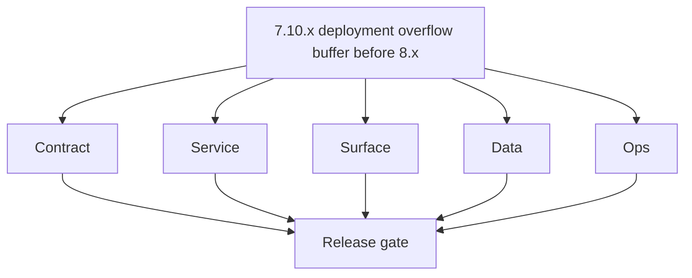
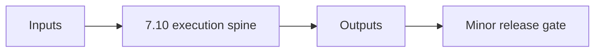

# Version 7.10

- **Status:** ✅ Completed
- **Era:** 7.x (Contact360 deployment)
- **Summary:** Deployment overflow patch buffer inside era 7.x.
- **Scope:** Non-breaking overflow fixes that preserve 7.x deployment/governance guarantees and support final stabilization before 8.x.

## Purpose

`7.10.x` is not a new analytics stage. It is a controlled overflow patch lane for deferred or late-discovered deployment/governance fixes that do not alter 8.0 scope boundaries.

## Flowchart

## Guardrails

- 📌 Planned: No analytics-era deliverables introduced here.
- 📌 Planned: No new product scope; only deployment/governance hardening.
- 📌 Planned: Changes must map to existing 7.x controls (RBAC/authz/audit/tenant/security/observability).
- 📌 Planned: Every patch must include rollback and evidence notes.

## References

- [`versions.md`](../versions.md) — era hub; **Micro-gate reference** (below) + per-patch **Micro-gate**
- [7.9 — 80 RC Fortress](7.9%20%E2%80%94%2080%20RC%20Fortress.md)

### Micro-gate reference (apply at every `7.N.P`)

| Track | Gate question (must answer Yes or document waiver) |
| --- | --- |
| **Contract** | RBAC/authz, audit envelope, tenant isolation — `docs/backend/apis/` + `rbac-authz.md` + matrices updated? |
| **Service** | Handler guards, key rotation, retention hooks — parity tests + deployment gates documented? |
| **Surface** | Admin/ops governance UI, role-gated flows — operator-visible delta? |
| **Frontend** | Era 7 patterns (`tenant-security-observability.md`, components) — delta? |
| **Data** | Audit tables, lineage, legal-hold — `docs/backend/database/` migrations recorded? |
| **Ops** | CI/CD, drift checks, `contact360.io/admin/deploy/` runbooks — recorded? |
| **Architecture** | Go/Gin satellites only via Python GraphQL gateway (`contact360.io/api`); Next.js `NEXT_PUBLIC_GRAPHQL_URL`; Postgres-first / Redis exit per `docs/docs/data-stores-postgres.md`. |

**Patch ladder:** See codename table below (`.0`–`.9` per minor; minors `7.6`–`7.9` use charter-style codenames).

## Patches

| Patch | Codename | Doc |
| --- | --- | --- |
| `7.10.0` | Void | [`7.10.0` — Void](7.10.0 — Void.md) |
| `7.10.1` | Seed | [`7.10.1` — Seed](7.10.1 — Seed.md) |
| `7.10.2` | Sprout | [`7.10.2` — Sprout](7.10.2 — Sprout.md) |
| `7.10.3` | Roots | [`7.10.3` — Roots](7.10.3 — Roots.md) |
| `7.10.4` | Soil | [`7.10.4` — Soil](7.10.4 — Soil.md) |
| `7.10.5` | Rain | [`7.10.5` — Rain](7.10.5 — Rain.md) |
| `7.10.6` | Stem | [`7.10.6` — Stem](7.10.6 — Stem.md) |
| `7.10.7` | Branch | [`7.10.7` — Branch](7.10.7 — Branch.md) |
| `7.10.8` | Leaf | [`7.10.8` — Leaf](7.10.8 — Leaf.md) |
| `7.10.9` | Bloom | [`7.10.9` — Bloom](7.10.9 — Bloom.md) |

### Runtime focus (unique to this minor)

## Patch ladder (7.10.0 - 7.10.9)

### Micro-gate reference (apply at every patch)

| Track | Gate question (must answer Yes or waiver) |
| --- | --- |
| **Contract** | Contract/API change captured with diff or explicit no-change note |
| **Service** | Service health and smoke for affected paths pass |
| **Surface** | UI/admin/extension impact documented or N/A |
| **Frontend** | Routes/components/hooks affected listed or N/A |
| **Data** | Migrations/index/lineage deltas linked or N/A |
| **Ops** | Rollback/secrets/CI/runbook delta linked or N/A |

**Patch intent bands:** `.0` charter, `.1-.2` scaffold, `.3-.5` hardening, `.6-.8` integration, `.9` freeze/handoff.

| Patch | Codename | Focus | Evidence gate |
| --- | --- | --- | --- |
| `7.10.0` | Void | patch focus | charter artifact linked |
| `7.10.1` | Seed | patch focus | closeout evidence attached |
| `7.10.2` | Sprout | patch focus | closeout evidence attached |
| `7.10.3` | Roots | patch focus | closeout evidence attached |
| `7.10.4` | Soil | patch focus | closeout evidence attached |
| `7.10.5` | Rain | patch focus | closeout evidence attached |
| `7.10.6` | Stem | patch focus | closeout evidence attached |
| `7.10.7` | Branch | patch focus | closeout evidence attached |
| `7.10.8` | Leaf | patch focus | closeout evidence attached |
| `7.10.9` | Bloom | patch focus | handoff documented |

## Release Gate and Evidence

### Master Task Checklist
- 📌 Planned: Track-level closure evidence linked

### Backend API and Endpoints
- 📌 Planned: Endpoint/contract parity verified

### Database and Data Lineage
- 📌 Planned: Migration and lineage references linked

### Frontend UX
- 📌 Planned: UX/route behavior evidence linked

### UI Elements
- 📌 Planned: Components/checklist closeout captured

### Flow and Graph
- 📌 Planned: Runtime graph reflects implementation

### Validation
- 📌 Planned: Smoke/CI/lint checks recorded

### Release Gate
- 📌 Planned: Minor ready for handoff to next minor
## Tasks

### Contract

- ✅ Completed: 📌 Planned: **[appointment360]** — Diff and document schema for operations like ConnectraClient, LAMBDA_AI_API_URL, LAMBDA_CONNECTRA_API_URL; align with roadmap | area: `backend-api` | files: `docs/backend/apis/*.md`, `contact360.io/api/app/graphql/schema.py` | reason: Keep GraphQL/REST contracts aligned for era 7.0 patch 7.10.0

- 📌 Planned: **[appointment360]** — refine duplicate task (was: 📌 planned: **[architecture]** — product **graphql** remains …) | patch `7.10.0` band `0` | reason: specialize this file vs sibling patches; see docs/codebases/appointment360-codebase-analysis.md
### Service

- ✅ Completed: 📌 Planned: **[appointment360]** — refine duplicate task (was: 📌 planned: **[appointment360]** — service slice: - [x] ✅ com…) | patch `7.10.0` band `0` | reason: specialize this file vs sibling patches; see docs/codebases/appointment360-codebase-analysis.md
- ✅ Completed: 📌 Planned: **[app]** — Harden primary worker/gateway integration and failure envelopes | area: `backend-api` | files: `docs/codebases/app-codebase-analysis.md` | reason: P0 band: critical path and idempotency

- 📌 Planned: **[appointment360]** — refine duplicate task (was: 📌 planned: **[architecture]** — **go/gin satellites** in sco…) | patch `7.10.0` band `0` | reason: specialize this file vs sibling patches; see docs/codebases/appointment360-codebase-analysis.md
### Surface

- 📌 Planned: **[appointment360]** — refine duplicate task (was: 📌 planned: **[appointment360]** — refine duplicate task (was…) | patch `7.10.0` band `0` | reason: specialize this file vs sibling patches; see docs/codebases/appointment360-codebase-analysis.md

### Data

- 📌 Planned: **[appointment360]** — refine duplicate task (was: 📌 planned: **[appointment360]** — refine duplicate task (was…) | patch `7.10.0` band `0` | reason: specialize this file vs sibling patches; see docs/codebases/appointment360-codebase-analysis.md

- 📌 Planned: **[appointment360]** — refine duplicate task (was: 📌 planned: **[architecture]** — **postgresql-first** per `do…) | patch `7.10.0` band `0` | reason: specialize this file vs sibling patches; see docs/codebases/appointment360-codebase-analysis.md
### Ops

- 📌 Planned: **[appointment360]** — refine duplicate task (was: 📌 planned: **[appointment360]** — refine duplicate task (was…) | patch `7.10.0` band `0` | reason: specialize this file vs sibling patches; see docs/codebases/appointment360-codebase-analysis.md

- 📌 Planned: **[appointment360]** — refine duplicate task (was: 📌 planned: **[architecture]** — **observability**: correlate…) | patch `7.10.0` band `0` | reason: specialize this file vs sibling patches; see docs/codebases/appointment360-codebase-analysis.md
- 📌 Planned: **[appointment360]** — refine duplicate task (was: 📌 planned: **[architecture]** — **django docsai** (`contact3…) | patch `7.10.0` band `0` | reason: specialize this file vs sibling patches; see docs/codebases/appointment360-codebase-analysis.md
