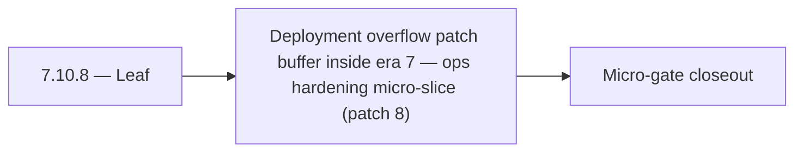

# 7.10.8 — Leaf

- **Era:** `7.x` deployment — hub [`versions.md`](../versions.md) · minors start at [`7.0 — Deployment era baseline lock`](7.0%20%E2%80%94%20Deployment%20era%20baseline%20lock.md)
- **Minor:** [7.10 — Deployment overflow patch buffer inside era 7](./7.10 — Deployment overflow patch buffer inside era 7.md)
- **Codename:** Leaf
- **Status:** planned

## Focus
Deployment overflow patch buffer inside era 7 — ops hardening micro-slice (patch 8)

## Flowchart

## Micro-gate

| Track | Gate question | Answer / Evidence (fill at patch closeout) |
| --- | --- | --- |
| **Contract** | RBAC/authz, audit envelope, tenant isolation — `docs/backend/apis/` + `rbac-authz.md` updated? | Document at patch closeout. |
| **Service** | Handler guards, key rotation, retention hooks — smoke + parity tests documented? | Document smoke paths. |
| **Surface** | Admin/ops governance UI, role-gated flows — delta for this patch? | Document UX delta or N/A. |
| **Frontend** | Dashboard Era 7 deployment patterns (`tenant-security-observability.md`) touched? | Buffer minor — deployment hotfix rail when chartered. Document at closeout. |
| **Data** | Audit tables, lineage, legal-hold — migrations + `docs/backend/database/`? | Document lineage or N/A. |
| **Ops** | CI/CD gates, drift checks, runbooks (`contact360.io/admin/deploy/...`) — delta? | Document ops delta or N/A. |

## Tasks
### Ops
- 📌 Planned: Publish release gate evidence: security checklist, authz tests, and retention/audit proof.
- 📌 Planned: Canary rollout for model version updates: 10% traffic to new model before full rollout.
- 📌 Planned: Add `contact.ai` to deployment checklist with health probe validation step.
- 📌 Planned: Add CI/CD gates for processor registry and endpoint parity tests.

### Contract

- 📌 Planned: **[appointment360]** — Diff and document schema for operations like ConnectraClient, LAMBDA_AI_API_URL, LAMBDA_CONNECTRA_API_URL; align with roadmap | area: `backend-api` | files: `docs/backend/apis/*.md`, `contact360.io/api/app/graphql/schema.py` | reason: Keep GraphQL/REST contracts aligned for era 7.8 patch 7.10.8

### Service

- 📌 Planned: **[appointment360]** — refine duplicate task (was: 📌 planned: **[appointment360]** — service slice: - [x] ✅ com…) | patch `7.10.8` band `8` | reason: specialize this file vs sibling patches; see docs/codebases/appointment360-codebase-analysis.md

### Surface

- 📌 Planned: **[admin]** — Verify UX for route `/` and bindings (patch 7.10.8 band 8) | area: `frontend-page` | files: `contact360/dashboard/app/page.tsx` | reason: Dashboard/extension surface for era 7 must match gateway contracts

### Data

- 📌 Planned: **[appointment360]** — refine duplicate task (was: 📌 planned: **[appointment360]** — update postgresql/es/s3 li…) | patch `7.10.8` band `8` | reason: specialize this file vs sibling patches; see docs/codebases/appointment360-codebase-analysis.md

## Service task slices
> Merged from era `7.x` deployment task packs (P0→`.0`–`.2`, P1→`.3`–`.6`, Ops→`.7`–`.9`).

### Appointment360 (gateway)
- Create Terraform / CDK module for appointment360 Lambda + ALB + RDS
- Add CloudWatch alarm: Lambda invocation errors > 1% in 5 min
- Document rollback procedure: previous Lambda version alias swap

### Connectra
- Validate tenant isolation on all query/write paths through gateway + Connectra.
- Publish release gate evidence: security checklist, authz tests, and retention/audit proof.

### contact.ai
- Blue-green Lambda deployment: deploy new version, run smoke tests, shift traffic.
- Canary rollout for model version updates: 10% traffic to new model before full rollout.
- Secret rotation: per-tenant API keys with automated rotation policy.
- Add `contact.ai` to deployment checklist with health probe validation step.
- Post-deployment smoke test: `GET /health`, `GET /health/db`, `POST /api/v1/ai/email/analyze` with test email.

### emailapis / emailapigo
- Add observability checks and release validation evidence for era 7.x (trace ids present in logs + audit viewable in logs.api).
- Capture rollback and incident-runbook notes for email-impacting releases (including how to identify/roll back problematic bulk verify batches).

### Emailcampaign
- Both API and worker Dockerfiles build and run in Kubernetes.
- Secrets not in env files; mounted from secret store.
- RBAC role check tested: `admin`/`member` can create according to policy, `read_only` cannot.
- Audit events visible in `logs.api` for campaign create and send complete.

### Jobs
- Add CI/CD gates for processor registry and endpoint parity tests.
- Add deployment runbook for auth, retention, and queue health checks.

### logs.api
- Add observability checks and release validation evidence for era `7.x`.
- Capture rollback and incident-runbook notes for logging-impacting releases.

### Mailvetter
- CI gates: lint, unit, integration, contract tests.
- CD gates: health checks and canary traffic checks.
- Add secrets isolation (`API_SECRET_KEY` vs `WEBHOOK_SECRET_KEY`).
- Add secret rotation runbook and quarterly validation drill for verifier credentials.

### S3Storage
- Run authz coverage checks for storage action matrix.
- Publish retention/deletion control validation report for release gate.

### Salesnavigator
- Blue-green Lambda deployment via SAM alias + traffic shifting
- Canary: 10% traffic to new version → validate CloudWatch metrics before 100% shift
- Environment-specific `template.yaml` param overrides for staging vs. production
- Secret rotation schedule: `API_KEY`, `CONNECTRA_API_KEY` rotated quarterly
- Runbook: procedure for emergency key rotation without downtime
- `docs/codebases/salesnavigator-codebase-analysis.md`
- `docs/backend/apis/SALESNAVIGATOR_ERA_TASK_PACKS.md`
- `docs/governance.md`
- `docs/audit-compliance.md`

## Evidence gate
Patch closeout includes contract diff, smoke output, data lineage delta, and ops note
