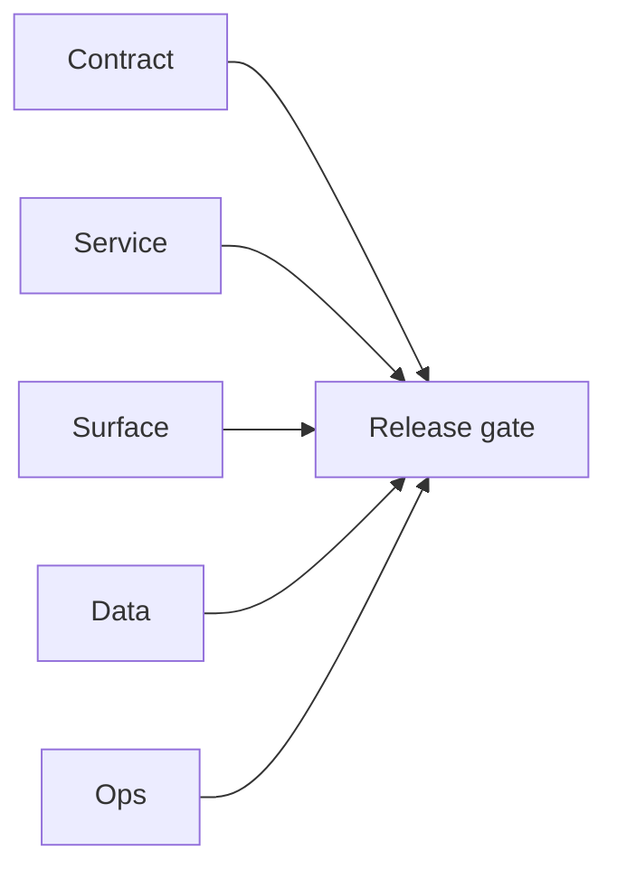

# 7.11.100 — EC2 email server deployment patch evidence

## Scope

Deployment-era patch evidence for EC2 email runtime packaging and environment behavior.

## Included patch intents

- `001-dockerization.patch`: API/worker Docker images and compose topology.
- `002-cors-hardening.patch`: runtime env support via `CORS_ALLOWED_ORIGINS`.

## Deployment outcome

- Improved deploy reproducibility and safer default runtime surface for external clients.

## Flowchart

Five-track delivery (contract / service / surface / data / ops) for this doc:

**Master hub:** [`docs/docs/flowchart.md`](../docs/flowchart.md) — cross-system diagrams and era strip (`0.x` → `10.x`).

## Task tracks

### Contract

- ✅ Completed: Dockerization + CORS patch intents documented; deploy contracts align with `7.x` gates.

### Service

- ✅ Completed: Reproducible images and configurable `CORS_ALLOWED_ORIGINS` on email.server.

### Surface

- ✅ Completed: Operators/clients see predictable CORS; no marketing-site change in this evidence file.

### Data

- ✅ Completed: No migration payload in listed patches.

### Ops

- ✅ Completed: Release packet should cite image tags + env matrix for this patch band.
