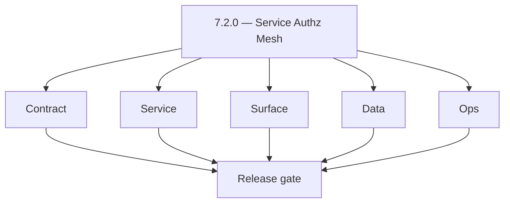
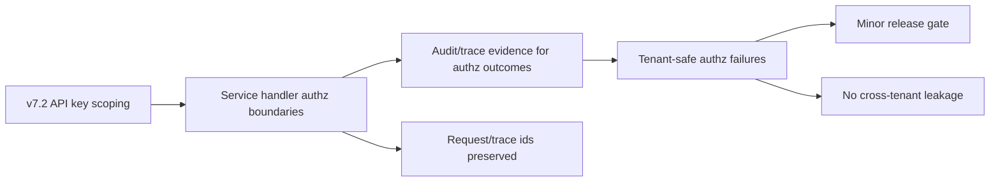
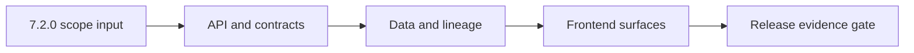

# Version 7.2

- **Status:** ✅ Completed
- **Target window:** TBD
- **Summary:** Service Authz Mesh. Cross-service execution pack for this minor across contract, service, surface, data, and ops.
- **Scope:** Service-to-service authorization enforcement, API key scoping, handler boundary authorization, and authz failure evidence wiring (tenant-safe).
- **Roadmap mapping:** `7.2`
- **Owner:** Data + Product Engineering
- **Patch closure:** Every codenamed patch file includes **Micro-gate** + **Service task slices**. Era hub: [`versions.md`](../versions.md).

## Scope

- Target minor: `7.2.0` aligned to current roadmap mapping in this file.
- In scope: contract, service, surface, data, and ops tasks across core Contact360 services.
- Primary owners: API, App, Jobs, Sync, Admin, and supporting platform services.
- Exclusions: work outside this minor unless required for compatibility or incident risk reduction.
- Output: actionable per-service task breakdown and execution queue for release readiness.

## Flowchart

Delivery work for this minor follows the five-track model (contract, service, surface, data, ops) through a release gate.

### Runtime focus (unique to this minor)

See also: [`docs/flowchart.md`](../flowchart.md) for system-wide and master views.

## Task tracks

### Contract
- ✅ Completed: 📌 Planned: **[appointment360]** — refine duplicate task (was: 📌 planned: **api**: define v7.2 contract outcomes for servic…) | patch `7.2.0` band `0` | reason: specialize this file vs sibling patches; see docs/codebases/appointment360-codebase-analysis.md
- ✅ Completed: 📌 Planned: **[appointment360]** — refine duplicate task (was: 📌 planned: **app**: define v7.2 contract outcomes for servic…) | patch `7.2.0` band `0` | reason: specialize this file vs sibling patches; see docs/codebases/appointment360-codebase-analysis.md
- ✅ Completed: 📌 Planned: **[appointment360]** — refine duplicate task (was: 📌 planned: **jobs**: define v7.2 contract outcomes for authz…) | patch `7.2.0` band `0` | reason: specialize this file vs sibling patches; see docs/codebases/appointment360-codebase-analysis.md
- ✅ Completed: 📌 Planned: **[appointment360]** — refine duplicate task (was: 📌 planned: **sync**: define v7.2 contract outcomes for authz…) | patch `7.2.0` band `0` | reason: specialize this file vs sibling patches; see docs/codebases/appointment360-codebase-analysis.md
- ✅ Completed: 📌 Planned: **[appointment360]** — refine duplicate task (was: 📌 planned: **admin**: define v7.2 contract outcomes for auth…) | patch `7.2.0` band `0` | reason: specialize this file vs sibling patches; see docs/codebases/appointment360-codebase-analysis.md
- ✅ Completed: 📌 Planned: **[appointment360]** — refine duplicate task (was: 📌 planned: **mailvetter**: define v7.2 contract outcomes for…) | patch `7.2.0` band `0` | reason: specialize this file vs sibling patches; see docs/codebases/appointment360-codebase-analysis.md
- ✅ Completed: 📌 Planned: **[appointment360]** — refine duplicate task (was: 📌 planned: **emailapis**: define v7.2 contract outcomes for …) | patch `7.2.0` band `0` | reason: specialize this file vs sibling patches; see docs/codebases/appointment360-codebase-analysis.md
- ✅ Completed: 📌 Planned: **[appointment360]** — refine duplicate task (was: 📌 planned: **emailapigo**: define v7.2 contract outcomes for…) | patch `7.2.0` band `0` | reason: specialize this file vs sibling patches; see docs/codebases/appointment360-codebase-analysis.md

### Service
- ✅ Completed: 📌 Planned: **[appointment360]** — refine duplicate task (was: 📌 planned: **api**: deliver v7.2 service outcomes for servic…) | patch `7.2.0` band `0` | reason: specialize this file vs sibling patches; see docs/codebases/appointment360-codebase-analysis.md
- ✅ Completed: 📌 Planned: **[appointment360]** — refine duplicate task (was: 📌 planned: **app**: deliver v7.2 service outcomes for servic…) | patch `7.2.0` band `0` | reason: specialize this file vs sibling patches; see docs/codebases/appointment360-codebase-analysis.md
- ✅ Completed: 📌 Planned: **[appointment360]** — refine duplicate task (was: 📌 planned: **jobs**: deliver v7.2 service outcomes for authz…) | patch `7.2.0` band `0` | reason: specialize this file vs sibling patches; see docs/codebases/appointment360-codebase-analysis.md
- ✅ Completed: 📌 Planned: **[appointment360]** — refine duplicate task (was: 📌 planned: **sync**: deliver v7.2 service outcomes for authz…) | patch `7.2.0` band `0` | reason: specialize this file vs sibling patches; see docs/codebases/appointment360-codebase-analysis.md
- ✅ Completed: 📌 Planned: **[appointment360]** — refine duplicate task (was: 📌 planned: **admin**: deliver v7.2 service outcomes for auth…) | patch `7.2.0` band `0` | reason: specialize this file vs sibling patches; see docs/codebases/appointment360-codebase-analysis.md
- ✅ Completed: 📌 Planned: **[appointment360]** — refine duplicate task (was: 📌 planned: **mailvetter**: deliver v7.2 service outcomes for…) | patch `7.2.0` band `0` | reason: specialize this file vs sibling patches; see docs/codebases/appointment360-codebase-analysis.md
- ✅ Completed: 📌 Planned: **[appointment360]** — refine duplicate task (was: 📌 planned: **emailapis**: deliver v7.2 service outcomes for …) | patch `7.2.0` band `0` | reason: specialize this file vs sibling patches; see docs/codebases/appointment360-codebase-analysis.md
- ✅ Completed: 📌 Planned: **[appointment360]** — refine duplicate task (was: 📌 planned: **emailapigo**: deliver v7.2 service outcomes for…) | patch `7.2.0` band `0` | reason: specialize this file vs sibling patches; see docs/codebases/appointment360-codebase-analysis.md

### Surface
- ✅ Completed: 📌 Planned: **[appointment360]** — refine duplicate task (was: 📌 planned: **api**: shape v7.2 surface outcomes for service …) | patch `7.2.0` band `0` | reason: specialize this file vs sibling patches; see docs/codebases/appointment360-codebase-analysis.md
- ✅ Completed: 📌 Planned: **[appointment360]** — refine duplicate task (was: 📌 planned: **app**: shape v7.2 surface outcomes for service …) | patch `7.2.0` band `0` | reason: specialize this file vs sibling patches; see docs/codebases/appointment360-codebase-analysis.md
- ✅ Completed: 📌 Planned: **[appointment360]** — refine duplicate task (was: 📌 planned: **jobs**: shape v7.2 surface outcomes for service…) | patch `7.2.0` band `0` | reason: specialize this file vs sibling patches; see docs/codebases/appointment360-codebase-analysis.md
- ✅ Completed: 📌 Planned: **[appointment360]** — refine duplicate task (was: 📌 planned: **sync**: shape v7.2 surface outcomes for authz; …) | patch `7.2.0` band `0` | reason: specialize this file vs sibling patches; see docs/codebases/appointment360-codebase-analysis.md
- ✅ Completed: 📌 Planned: **[appointment360]** — refine duplicate task (was: 📌 planned: **admin**: shape v7.2 surface outcomes for authz;…) | patch `7.2.0` band `0` | reason: specialize this file vs sibling patches; see docs/codebases/appointment360-codebase-analysis.md
- ✅ Completed: 📌 Planned: **[appointment360]** — refine duplicate task (was: 📌 planned: **mailvetter**: shape v7.2 surface outcomes for a…) | patch `7.2.0` band `0` | reason: specialize this file vs sibling patches; see docs/codebases/appointment360-codebase-analysis.md
- ✅ Completed: 📌 Planned: **[appointment360]** — refine duplicate task (was: 📌 planned: **emailapis**: shape v7.2 surface outcomes for au…) | patch `7.2.0` band `0` | reason: specialize this file vs sibling patches; see docs/codebases/appointment360-codebase-analysis.md
- ✅ Completed: 📌 Planned: **[appointment360]** — refine duplicate task (was: 📌 planned: **emailapigo**: shape v7.2 surface outcomes for a…) | patch `7.2.0` band `0` | reason: specialize this file vs sibling patches; see docs/codebases/appointment360-codebase-analysis.md

### Data
- ✅ Completed: 📌 Planned: **[appointment360]** — refine duplicate task (was: 📌 planned: **api**: anchor v7.2 data outcomes for service au…) | patch `7.2.0` band `0` | reason: specialize this file vs sibling patches; see docs/codebases/appointment360-codebase-analysis.md
- ✅ Completed: 📌 Planned: **[appointment360]** — refine duplicate task (was: 📌 planned: **app**: anchor v7.2 data outcomes for service au…) | patch `7.2.0` band `0` | reason: specialize this file vs sibling patches; see docs/codebases/appointment360-codebase-analysis.md
- ✅ Completed: 📌 Planned: **[appointment360]** — refine duplicate task (was: 📌 planned: **jobs**: anchor v7.2 data outcomes for authz; re…) | patch `7.2.0` band `0` | reason: specialize this file vs sibling patches; see docs/codebases/appointment360-codebase-analysis.md
- ✅ Completed: 📌 Planned: **[appointment360]** — refine duplicate task (was: 📌 planned: **sync**: anchor v7.2 data outcomes for authz; pr…) | patch `7.2.0` band `0` | reason: specialize this file vs sibling patches; see docs/codebases/appointment360-codebase-analysis.md
- ✅ Completed: 📌 Planned: **[appointment360]** — refine duplicate task (was: 📌 planned: **admin**: anchor v7.2 data outcomes for authz; p…) | patch `7.2.0` band `0` | reason: specialize this file vs sibling patches; see docs/codebases/appointment360-codebase-analysis.md
- ✅ Completed: 📌 Planned: **[appointment360]** — refine duplicate task (was: 📌 planned: **mailvetter**: anchor v7.2 data outcomes for aut…) | patch `7.2.0` band `0` | reason: specialize this file vs sibling patches; see docs/codebases/appointment360-codebase-analysis.md
- ✅ Completed: 📌 Planned: **[appointment360]** — refine duplicate task (was: 📌 planned: **emailapis**: anchor v7.2 data outcomes for auth…) | patch `7.2.0` band `0` | reason: specialize this file vs sibling patches; see docs/codebases/appointment360-codebase-analysis.md
- ✅ Completed: 📌 Planned: **[appointment360]** — refine duplicate task (was: 📌 planned: **emailapigo**: anchor v7.2 data outcomes for aut…) | patch `7.2.0` band `0` | reason: specialize this file vs sibling patches; see docs/codebases/appointment360-codebase-analysis.md

### Ops
- ✅ Completed: 📌 Planned: **[appointment360]** — refine duplicate task (was: 📌 planned: **api**: enforce v7.2 ops outcomes for service au…) | patch `7.2.0` band `0` | reason: specialize this file vs sibling patches; see docs/codebases/appointment360-codebase-analysis.md
- ✅ Completed: 📌 Planned: **[appointment360]** — refine duplicate task (was: 📌 planned: **app**: enforce v7.2 ops outcomes for service au…) | patch `7.2.0` band `0` | reason: specialize this file vs sibling patches; see docs/codebases/appointment360-codebase-analysis.md
- ✅ Completed: 📌 Planned: **[appointment360]** — refine duplicate task (was: 📌 planned: **jobs**: enforce v7.2 ops outcomes for authz; ex…) | patch `7.2.0` band `0` | reason: specialize this file vs sibling patches; see docs/codebases/appointment360-codebase-analysis.md
- ✅ Completed: 📌 Planned: **[appointment360]** — refine duplicate task (was: 📌 planned: **sync**: enforce v7.2 ops outcomes for authz; ad…) | patch `7.2.0` band `0` | reason: specialize this file vs sibling patches; see docs/codebases/appointment360-codebase-analysis.md
- ✅ Completed: 📌 Planned: **[appointment360]** — refine duplicate task (was: 📌 planned: **admin**: enforce v7.2 ops outcomes for authz; c…) | patch `7.2.0` band `0` | reason: specialize this file vs sibling patches; see docs/codebases/appointment360-codebase-analysis.md
- ✅ Completed: 📌 Planned: **[appointment360]** — refine duplicate task (was: 📌 planned: **mailvetter**: enforce v7.2 ops outcomes for aut…) | patch `7.2.0` band `0` | reason: specialize this file vs sibling patches; see docs/codebases/appointment360-codebase-analysis.md
- ✅ Completed: 📌 Planned: **[appointment360]** — refine duplicate task (was: 📌 planned: **emailapis**: enforce v7.2 ops outcomes for auth…) | patch `7.2.0` band `0` | reason: specialize this file vs sibling patches; see docs/codebases/appointment360-codebase-analysis.md
- ✅ Completed: 📌 Planned: **[appointment360]** — refine duplicate task (was: 📌 planned: **emailapigo**: enforce v7.2 ops outcomes for aut…) | patch `7.2.0` band `0` | reason: specialize this file vs sibling patches; see docs/codebases/appointment360-codebase-analysis.md

## Task Breakdown
### Version `7.2.0` per-service execution slices

#### api
- Contract: lock v7.2 service authz contracts in `contact360.io/api` (API key + authz-failure semantics).
- Service: enforce handler boundary authorization and deterministic error behavior.
- Surface: expose clear authorization outcomes and safe retry semantics for consumers.
- Data: preserve authz correlation keys (actor/trace ids) for governance evidence.
- Ops: validate runbooks, checks, and release evidence for `api`.
- Acceptance: v7.2 gate passes for `api` with authz boundaries validated end-to-end.

#### app
- Contract: lock v7.2 UI payload expectations for authz failures in `contact360.io/app`.
- Service: wire client flows to authz-aware endpoints and deterministic failure states.
- Surface: ensure role/service authz denials are surfaced consistently in UI.
- Data: capture UI telemetry mapping to authz outcomes.
- Ops: validate smoke evidence for authz rejection scenarios.
- Acceptance: v7.2 gate passes for `app` with authz denial UX consistent with backend enforcement.

#### jobs
- Contract: lock v7.2 worker schema to preserve authorization scope in `contact360.io/jobs`.
- Service: ensure retries and processing preserve authorized scope and correlation.
- Surface: operator visibility is gated by authz.
- Data: record queue attempts with reproducible governance markers.
- Ops: validate runbook and rollback notes for authz regressions.
- Acceptance: v7.2 gate passes for `jobs` with authz boundary integrity.

#### sync
- Contract: lock v7.2 tenant-safe + authz-bound sync semantics in `contact360.io/sync`.
- Service: enforce role/service authz boundaries for write/export behavior.
- Surface: expose sync health signals without forbidden metadata.
- Data: preserve delta lineage with tenant-safe identifiers.
- Ops: validate resync/governance incident playbooks.
- Acceptance: v7.2 gate passes for `sync` with authz boundaries validated.

#### admin
- Contract: lock v7.2 admin control-plane authz expectations in `contact360.io/admin`.
- Service: ensure privileged operator actions behave deterministically under authz checks.
- Surface: admin UI controls are shown/hidden and actions are confirmed as needed.
- Data: prepare governance/audit fields for 7.4 (authz outcome linkage).
- Ops: validate admin authz behavior with test roles.
- Acceptance: v7.2 gate passes for `admin` with authz boundary enforcement.

#### mailvetter
- Contract: lock v7.2 verifier runtime payload expectations under authz failures.
- Service: ensure safe error mapping and deterministic behavior.
- Surface: keep evidence states readable while preserving authz boundaries.
- Data: retain verdict evidence artifacts with replay metadata.
- Ops: validate release checks and rollback notes.
- Acceptance: v7.2 gate passes for `mailvetter` with authz-safe behavior.

#### emailapis
- Contract: lock v7.2 email finder/verifier compatibility notes and auth boundary expectations in `lambda/emailapis`.
- Service: enforce authorization behavior with consistent error envelopes.
- Surface: expose provider routing outcomes only when authorized.
- Data: retain provider decision lineage and correlation keys.
- Ops: validate provider health probes with audit/trace correlation.
- Acceptance: v7.2 gate passes for `emailapis` with authz boundaries validated.

#### emailapigo
- Contract: lock v7.2 Go adapter parity for authz failure mapping in `lambda/emailapigo`.
- Service: preserve trace/correlation ids under authorized access and safe errors under denial.
- Surface: keep diagnostics safe under authz outcomes.
- Data: maintain trace continuity across provider hops.
- Ops: validate Go KPIs and on-call diagnostics.
- Acceptance: v7.2 gate passes for `emailapigo` with authz boundaries validated.

## Immediate next execution queue
- 📌 Planned: Freeze v7.2 authz error vocabulary across `api`, `jobs`, and email services; capture before/after schema diff evidence.
- 📌 Planned: Execute one `app -> api -> emailapigo` role/service-authz governed action and archive request/response traces with owner signoff.
- 📌 Planned: Add regression coverage for authz context propagation loss in `jobs` worker paths.
- 📌 Planned: Validate `sync` write/export role/service authz is tenant-safe and does not leak forbidden metadata.
- 📌 Planned: Update `contact360.io/admin` operational checklist entries for v7.2, including escalation thresholds and rollback triggers for authz failures.
- 📌 Planned: Run a controlled retry/idempotency drill on one governance-relevant async workflow and ensure authz evidence remains consistent.
- 📌 Planned: Verify `app` messaging mirrors backend behavior for authz denials; include screenshots tied to API payload samples.
- 📌 Planned: Publish v7.2 cut-readiness notes with clear owners, unresolved blockers, and go/no-go criteria.

## Cross-service ownership

| Service | Version delivery focus |
|---|---|
| contact360.io/api | v7.2 RBAC-aware service authz boundary control |
| contact360.io/app | v7.2 role/service-authz outcome parity and safe UX |
| contact360.io/jobs | v7.2 async execution integrity with authz context |
| contact360.io/sync | v7.2 tenant-safe lineage parity for authz-bound writes |
| contact360.io/admin | v7.2 operator governance and authz failure handling |
| backend(dev)/mailvetter | v7.2 verifier evidence safety under authz outcomes |
| lambda/emailapis | v7.2 authorized finder/verifier routing and fallback safety |
| lambda/emailapigo | v7.2 Go adapter parity and safe authz-failure mapping |

## References

- [docs/versions.md](../versions.md)
- [docs/roadmap.md](../roadmap.md)
- [docs/version-policy.md](../version-policy.md)
- [docs/architecture.md](../architecture.md)
- [docs/codebase.md](../codebase.md)
- [Email system rule](../../.cursor/rules/email_system.md)
- [Email integration exploration](../../.cursor/rules/cursor_contact360_email_integration_exp.md)
- [lambda/emailapis breakdown](../../lambda/emailapis/docs/VERSION_TASK_BREAKDOWN_0.0_TO_10.10.md)
- [contact360.io/api README](../../contact360.io/api/README.md)
- [contact360.io/jobs README](../../contact360.io/jobs/README.md)
- [contact360.io/sync README](../../contact360.io/sync/README.md)
- [backend(dev)/mailvetter README](../../backend(dev)/mailvetter/README.md)

## Backend API and Endpoint Scope

- Era: `7.x`
- Logging service contract reference: `lambda/logs.api/docs/api.md`.
- Endpoint matrix reference: `docs/backend/endpoints/logsapi_endpoint_era_matrix.json`.
- Contract focus for `7.2`: logging evidence coverage for core flows in this minor.
- Public/private contract notes: enforce tenant-scoped access, authz boundaries, and API key governance for log queries/writes.

## Database and Data Lineage Scope

- PostgreSQL lineage touchpoints: correlate business entities with log `request_id` and `trace_id` where available.
- Elasticsearch index changes: include only when this minor expands analytics/search contracts that consume logs.
- S3 bucket/artifact changes: `logs/` CSV objects retained per lifecycle policy.
- MongoDB/audit/log lineage updates: canonical logs backend is S3 CSV for logs.api; update references accordingly.
- Data lineage reference: `docs/backend/database/logsapi_data_lineage.md`.

## Frontend UX Surface Scope

- Primary pages/surfaces: admin/activity/audit views and era-specific operational panels.
- Tabs/navigation changes: document concrete logs-facing tabs for this minor.
- Modal/dialog and state transitions: query/search/filter -> result/empty/error/retry states.
- Hook/service/context wiring: logging-aware services/hooks and role/tenant contexts.
- UI binding reference: `docs/frontend/logsapi-ui-bindings.md`.

## UI Elements Checklist

- Buttons (primary/secondary/link/loading): documented
- Inputs/textareas/selects: documented
- Checkboxes: documented
- Radio buttons: documented
- Progress bars: documented
- Toast/alert/error states: documented
- Loading and empty states: documented

## Flow/Graph Delta for This Minor

## Release Gate and Evidence

- 📌 Planned: API contract diff reviewed
- 📌 Planned: DB/index/storage migration evidence captured
- 📌 Planned: UI smoke path verified with screenshots or traces
- 📌 Planned: Flow diagram updated and validated
- 📌 Planned: Roadmap mapping and owner alignment confirmed

### Micro-gate reference (apply at every `7.N.P`)

| Track | Gate question (must answer Yes or document waiver) |
| --- | --- |
| **Contract** | RBAC/authz, audit envelope, tenant isolation — `docs/backend/apis/` + `rbac-authz.md` + matrices updated? |
| **Service** | Handler guards, key rotation, retention hooks — parity tests + deployment gates documented? |
| **Surface** | Admin/ops governance UI, role-gated flows — operator-visible delta? |
| **Frontend** | Era 7 patterns (`tenant-security-observability.md`, components) — delta? |
| **Data** | Audit tables, lineage, legal-hold — `docs/backend/database/` migrations recorded? |
| **Ops** | CI/CD, drift checks, `contact360.io/admin/deploy/` runbooks — recorded? |

**Patch ladder:** See codename table below (`.0`–`.9` per minor; minors `7.6`–`7.9` use charter-style codenames).

## Patches

| Patch | Codename | Doc |
| --- | --- | --- |
| `7.2.0` | Void | [`7.2.0` — Void](7.2.0 — Void.md) |
| `7.2.1` | Seed | [`7.2.1` — Seed](7.2.1 — Seed.md) |
| `7.2.2` | Sprout | [`7.2.2` — Sprout](7.2.2 — Sprout.md) |
| `7.2.3` | Roots | [`7.2.3` — Roots](7.2.3 — Roots.md) |
| `7.2.4` | Soil | [`7.2.4` — Soil](7.2.4 — Soil.md) |
| `7.2.5` | Rain | [`7.2.5` — Rain](7.2.5 — Rain.md) |
| `7.2.6` | Stem | [`7.2.6` — Stem](7.2.6 — Stem.md) |
| `7.2.7` | Branch | [`7.2.7` — Branch](7.2.7 — Branch.md) |
| `7.2.8` | Leaf | [`7.2.8` — Leaf](7.2.8 — Leaf.md) |
| `7.2.9` | Bloom | [`7.2.9` — Bloom](7.2.9 — Bloom.md) |

## Patch ladder (7.2.0 - 7.2.9)

### Micro-gate reference (apply at every patch)

| Track | Gate question (must answer Yes or waiver) |
| --- | --- |
| **Contract** | Contract/API change captured with diff or explicit no-change note |
| **Service** | Service health and smoke for affected paths pass |
| **Surface** | UI/admin/extension impact documented or N/A |
| **Frontend** | Routes/components/hooks affected listed or N/A |
| **Data** | Migrations/index/lineage deltas linked or N/A |
| **Ops** | Rollback/secrets/CI/runbook delta linked or N/A |

**Patch intent bands:** `.0` charter, `.1-.2` scaffold, `.3-.5` hardening, `.6-.8` integration, `.9` freeze/handoff.

| Patch | Codename | Focus | Evidence gate |
| --- | --- | --- | --- |
| `7.2.0` | Void | patch focus | charter artifact linked |
| `7.2.1` | Seed | patch focus | closeout evidence attached |
| `7.2.2` | Sprout | patch focus | closeout evidence attached |
| `7.2.3` | Roots | patch focus | closeout evidence attached |
| `7.2.4` | Soil | patch focus | closeout evidence attached |
| `7.2.5` | Rain | patch focus | closeout evidence attached |
| `7.2.6` | Stem | patch focus | closeout evidence attached |
| `7.2.7` | Branch | patch focus | closeout evidence attached |
| `7.2.8` | Leaf | patch focus | closeout evidence attached |
| `7.2.9` | Bloom | patch focus | handoff documented |
