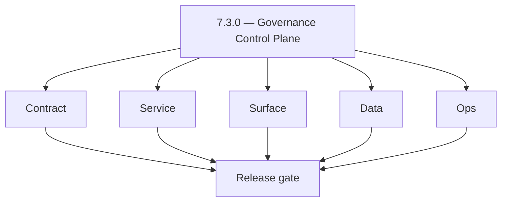
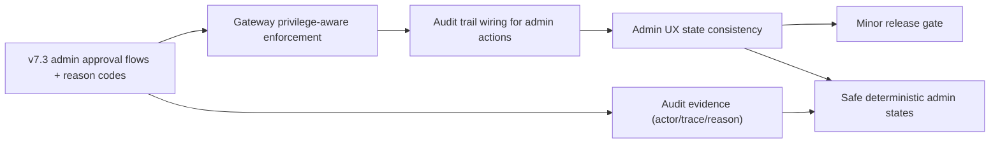
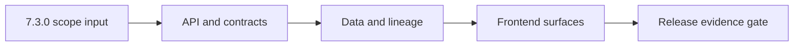

# Version 7.3

- **Status:** ✅ Completed
- **Target window:** TBD
- **Summary:** Governance Control Plane. Cross-service execution pack for this minor across contract, service, surface, data, and ops.
- **Scope:** Admin approval flows, audited admin actions, reason codes, and deterministic governance/audit evidence readiness.
- **Roadmap mapping:** `7.3`
- **Owner:** Data Platform
- **Patch closure:** Every codenamed patch file includes **Micro-gate** + **Service task slices**. Era hub: [`versions.md`](../versions.md).

## Scope

- Target minor: `7.3.0` aligned to current roadmap mapping in this file.
- In scope: contract, service, surface, data, and ops tasks across core Contact360 services.
- Primary owners: API, App, Jobs, Sync, Admin, and supporting platform services.
- Exclusions: work outside this minor unless required for compatibility or incident risk reduction.
- Output: actionable per-service task breakdown and execution queue for release readiness.

## Flowchart

Delivery work for this minor follows the five-track model (contract, service, surface, data, ops) through a release gate.

### Runtime focus (unique to this minor)

See also: [`docs/flowchart.md`](../flowchart.md) for system-wide and master views.

## Task tracks

### Contract
- ✅ Completed: 📌 Planned: **[appointment360]** — refine duplicate task (was: 📌 planned: **api**: define v7.3 contract outcomes for admin …) | patch `7.3.0` band `0` | reason: specialize this file vs sibling patches; see docs/codebases/appointment360-codebase-analysis.md
- ✅ Completed: 📌 Planned: **[appointment360]** — refine duplicate task (was: 📌 planned: **app**: define v7.3 contract outcomes for admin …) | patch `7.3.0` band `0` | reason: specialize this file vs sibling patches; see docs/codebases/appointment360-codebase-analysis.md
- ✅ Completed: 📌 Planned: **[appointment360]** — refine duplicate task (was: 📌 planned: **jobs**: define v7.3 contract outcomes for gover…) | patch `7.3.0` band `0` | reason: specialize this file vs sibling patches; see docs/codebases/appointment360-codebase-analysis.md
- ✅ Completed: 📌 Planned: **[appointment360]** — refine duplicate task (was: 📌 planned: **sync**: define v7.3 contract outcomes for gover…) | patch `7.3.0` band `0` | reason: specialize this file vs sibling patches; see docs/codebases/appointment360-codebase-analysis.md
- ✅ Completed: 📌 Planned: **[appointment360]** — refine duplicate task (was: 📌 planned: **admin**: define v7.3 contract outcomes for admi…) | patch `7.3.0` band `0` | reason: specialize this file vs sibling patches; see docs/codebases/appointment360-codebase-analysis.md
- ✅ Completed: 📌 Planned: **[appointment360]** — refine duplicate task (was: 📌 planned: **mailvetter**: define v7.3 contract outcomes for…) | patch `7.3.0` band `0` | reason: specialize this file vs sibling patches; see docs/codebases/appointment360-codebase-analysis.md
- ✅ Completed: 📌 Planned: **[appointment360]** — refine duplicate task (was: 📌 planned: **emailapis**: define v7.3 contract outcomes for …) | patch `7.3.0` band `0` | reason: specialize this file vs sibling patches; see docs/codebases/appointment360-codebase-analysis.md
- ✅ Completed: 📌 Planned: **[appointment360]** — refine duplicate task (was: 📌 planned: **emailapigo**: define v7.3 contract outcomes for…) | patch `7.3.0` band `0` | reason: specialize this file vs sibling patches; see docs/codebases/appointment360-codebase-analysis.md

### Service
- ✅ Completed: 📌 Planned: **[appointment360]** — refine duplicate task (was: 📌 planned: **api**: deliver v7.3 service outcomes for admin …) | patch `7.3.0` band `0` | reason: specialize this file vs sibling patches; see docs/codebases/appointment360-codebase-analysis.md
- ✅ Completed: 📌 Planned: **[appointment360]** — refine duplicate task (was: 📌 planned: **app**: deliver v7.3 service outcomes for admin …) | patch `7.3.0` band `0` | reason: specialize this file vs sibling patches; see docs/codebases/appointment360-codebase-analysis.md
- ✅ Completed: 📌 Planned: **[appointment360]** — refine duplicate task (was: 📌 planned: **jobs**: deliver v7.3 service outcomes for gover…) | patch `7.3.0` band `0` | reason: specialize this file vs sibling patches; see docs/codebases/appointment360-codebase-analysis.md
- ✅ Completed: 📌 Planned: **[appointment360]** — refine duplicate task (was: 📌 planned: **sync**: deliver v7.3 service outcomes for gover…) | patch `7.3.0` band `0` | reason: specialize this file vs sibling patches; see docs/codebases/appointment360-codebase-analysis.md
- ✅ Completed: 📌 Planned: **[appointment360]** — refine duplicate task (was: 📌 planned: **admin**: deliver v7.3 service outcomes for gove…) | patch `7.3.0` band `0` | reason: specialize this file vs sibling patches; see docs/codebases/appointment360-codebase-analysis.md
- ✅ Completed: 📌 Planned: **[appointment360]** — refine duplicate task (was: 📌 planned: **mailvetter**: deliver v7.3 service outcomes for…) | patch `7.3.0` band `0` | reason: specialize this file vs sibling patches; see docs/codebases/appointment360-codebase-analysis.md
- ✅ Completed: 📌 Planned: **[appointment360]** — refine duplicate task (was: 📌 planned: **emailapis**: deliver v7.3 service outcomes for …) | patch `7.3.0` band `0` | reason: specialize this file vs sibling patches; see docs/codebases/appointment360-codebase-analysis.md
- ✅ Completed: 📌 Planned: **[appointment360]** — refine duplicate task (was: 📌 planned: **emailapigo**: deliver v7.3 service outcomes for…) | patch `7.3.0` band `0` | reason: specialize this file vs sibling patches; see docs/codebases/appointment360-codebase-analysis.md

### Surface
- ✅ Completed: 📌 Planned: **[appointment360]** — refine duplicate task (was: 📌 planned: **api**: shape v7.3 surface outcomes for admin go…) | patch `7.3.0` band `0` | reason: specialize this file vs sibling patches; see docs/codebases/appointment360-codebase-analysis.md
- ✅ Completed: 📌 Planned: **[appointment360]** — refine duplicate task (was: 📌 planned: **app**: shape v7.3 surface outcomes for admin go…) | patch `7.3.0` band `0` | reason: specialize this file vs sibling patches; see docs/codebases/appointment360-codebase-analysis.md
- ✅ Completed: 📌 Planned: **[appointment360]** — refine duplicate task (was: 📌 planned: **jobs**: shape v7.3 surface outcomes for governa…) | patch `7.3.0` band `0` | reason: specialize this file vs sibling patches; see docs/codebases/appointment360-codebase-analysis.md
- ✅ Completed: 📌 Planned: **[appointment360]** — refine duplicate task (was: 📌 planned: **sync**: shape v7.3 surface outcomes for governe…) | patch `7.3.0` band `0` | reason: specialize this file vs sibling patches; see docs/codebases/appointment360-codebase-analysis.md
- ✅ Completed: 📌 Planned: **[appointment360]** — refine duplicate task (was: 📌 planned: **admin**: shape v7.3 surface outcomes for govern…) | patch `7.3.0` band `0` | reason: specialize this file vs sibling patches; see docs/codebases/appointment360-codebase-analysis.md
- ✅ Completed: 📌 Planned: **[appointment360]** — refine duplicate task (was: 📌 planned: **mailvetter**: shape v7.3 surface outcomes for g…) | patch `7.3.0` band `0` | reason: specialize this file vs sibling patches; see docs/codebases/appointment360-codebase-analysis.md
- ✅ Completed: 📌 Planned: **[appointment360]** — refine duplicate task (was: 📌 planned: **emailapis**: shape v7.3 surface outcomes for go…) | patch `7.3.0` band `0` | reason: specialize this file vs sibling patches; see docs/codebases/appointment360-codebase-analysis.md
- ✅ Completed: 📌 Planned: **[appointment360]** — refine duplicate task (was: 📌 planned: **emailapigo**: shape v7.3 surface outcomes for g…) | patch `7.3.0` band `0` | reason: specialize this file vs sibling patches; see docs/codebases/appointment360-codebase-analysis.md

### Data
- ✅ Completed: 📌 Planned: **[appointment360]** — refine duplicate task (was: 📌 planned: **api**: anchor v7.3 data outcomes for admin gove…) | patch `7.3.0` band `0` | reason: specialize this file vs sibling patches; see docs/codebases/appointment360-codebase-analysis.md
- ✅ Completed: 📌 Planned: **[appointment360]** — refine duplicate task (was: 📌 planned: **app**: anchor v7.3 data outcomes for admin gove…) | patch `7.3.0` band `0` | reason: specialize this file vs sibling patches; see docs/codebases/appointment360-codebase-analysis.md
- ✅ Completed: 📌 Planned: **[appointment360]** — refine duplicate task (was: 📌 planned: **jobs**: anchor v7.3 data outcomes for governanc…) | patch `7.3.0` band `0` | reason: specialize this file vs sibling patches; see docs/codebases/appointment360-codebase-analysis.md
- ✅ Completed: 📌 Planned: **[appointment360]** — refine duplicate task (was: 📌 planned: **sync**: anchor v7.3 data outcomes for governed …) | patch `7.3.0` band `0` | reason: specialize this file vs sibling patches; see docs/codebases/appointment360-codebase-analysis.md
- ✅ Completed: 📌 Planned: **[appointment360]** — refine duplicate task (was: 📌 planned: **admin**: anchor v7.3 data outcomes for governan…) | patch `7.3.0` band `0` | reason: specialize this file vs sibling patches; see docs/codebases/appointment360-codebase-analysis.md
- ✅ Completed: 📌 Planned: **[appointment360]** — refine duplicate task (was: 📌 planned: **mailvetter**: anchor v7.3 data outcomes for gov…) | patch `7.3.0` band `0` | reason: specialize this file vs sibling patches; see docs/codebases/appointment360-codebase-analysis.md
- ✅ Completed: 📌 Planned: **[appointment360]** — refine duplicate task (was: 📌 planned: **emailapis**: anchor v7.3 data outcomes for gove…) | patch `7.3.0` band `0` | reason: specialize this file vs sibling patches; see docs/codebases/appointment360-codebase-analysis.md
- ✅ Completed: 📌 Planned: **[appointment360]** — refine duplicate task (was: 📌 planned: **emailapigo**: anchor v7.3 data outcomes for gov…) | patch `7.3.0` band `0` | reason: specialize this file vs sibling patches; see docs/codebases/appointment360-codebase-analysis.md

### Ops
- ✅ Completed: 📌 Planned: **[appointment360]** — refine duplicate task (was: 📌 planned: **api**: enforce v7.3 ops outcomes for admin gove…) | patch `7.3.0` band `0` | reason: specialize this file vs sibling patches; see docs/codebases/appointment360-codebase-analysis.md
- ✅ Completed: 📌 Planned: **[appointment360]** — refine duplicate task (was: 📌 planned: **app**: enforce v7.3 ops outcomes for admin gove…) | patch `7.3.0` band `0` | reason: specialize this file vs sibling patches; see docs/codebases/appointment360-codebase-analysis.md
- ✅ Completed: 📌 Planned: **[appointment360]** — refine duplicate task (was: 📌 planned: **jobs**: enforce v7.3 ops outcomes for governanc…) | patch `7.3.0` band `0` | reason: specialize this file vs sibling patches; see docs/codebases/appointment360-codebase-analysis.md
- ✅ Completed: 📌 Planned: **[appointment360]** — refine duplicate task (was: 📌 planned: **sync**: enforce v7.3 ops outcomes for governed …) | patch `7.3.0` band `0` | reason: specialize this file vs sibling patches; see docs/codebases/appointment360-codebase-analysis.md
- ✅ Completed: 📌 Planned: **[appointment360]** — refine duplicate task (was: 📌 planned: **admin**: enforce v7.3 ops outcomes for governan…) | patch `7.3.0` band `0` | reason: specialize this file vs sibling patches; see docs/codebases/appointment360-codebase-analysis.md
- ✅ Completed: 📌 Planned: **[appointment360]** — refine duplicate task (was: 📌 planned: **mailvetter**: enforce v7.3 ops outcomes for gov…) | patch `7.3.0` band `0` | reason: specialize this file vs sibling patches; see docs/codebases/appointment360-codebase-analysis.md
- ✅ Completed: 📌 Planned: **[appointment360]** — refine duplicate task (was: 📌 planned: **emailapis**: enforce v7.3 ops outcomes for gove…) | patch `7.3.0` band `0` | reason: specialize this file vs sibling patches; see docs/codebases/appointment360-codebase-analysis.md
- ✅ Completed: 📌 Planned: **[appointment360]** — refine duplicate task (was: 📌 planned: **emailapigo**: enforce v7.3 ops outcomes for gov…) | patch `7.3.0` band `0` | reason: specialize this file vs sibling patches; see docs/codebases/appointment360-codebase-analysis.md

## Task Breakdown
### Version `7.3.0` per-service execution slices

#### api
- Contract: lock v7.3 admin-governance approval/reason request boundaries in `contact360.io/api`.
- Service: enforce deterministic privilege-aware governance handlers.
- Surface: expose clear governance outcomes for admin consumers.
- Data: persist approval/audit linkage keys for future immutable audit model.
- Ops: validate runbooks, checks, and release evidence for `api`.
- Acceptance: v7.3 gate passes for `api` with audited governance control-plane actions.

#### app
- Contract: lock v7.3 admin-governance UX payload expectations in `contact360.io/app`.
- Service: execute client wiring for approval flows and deterministic failure states.
- Surface: confirmation UX for destructive/admin actions works consistently.
- Data: capture UI telemetry mapping to governance actions.
- Ops: validate smoke evidence for admin approval journeys.
- Acceptance: v7.3 gate passes for `app` with governance UI consistent with backend enforcement.

#### jobs
- Contract: lock v7.3 schema for admin-triggered operational actions in `contact360.io/jobs`.
- Service: ensure async processing preserves governance/audit context.
- Surface: operator job visibility is linked to governance outcomes.
- Data: record queue attempt history with governance markers.
- Ops: validate runbook updates for governance operations.
- Acceptance: v7.3 gate passes for `jobs` with auditable governance-triggered execution.

#### sync
- Contract: lock v7.3 privileged sync operation request contracts in `contact360.io/sync`.
- Service: enforce privilege-aware write/export behavior with deterministic outcomes.
- Surface: show sync health signals for privileged operators only.
- Data: preserve lineage with privileged operation linkage.
- Ops: validate resync/governance incident playbooks.
- Acceptance: v7.3 gate passes for `sync` with governed ops auditable.

#### admin
- Contract: lock v7.3 control-plane request contracts and guardrails in `contact360.io/admin`.
- Service: enforce role-aware admin approvals and reason codes.
- Surface: admin UI includes deterministic approval UX and confirmation patterns.
- Data: write immutable governance attributes (or prepare fields for 7.4).
- Ops: validate audit readability and export controls.
- Acceptance: v7.3 gate passes for `admin` with audited governance actions.

#### mailvetter
- Contract: lock v7.3 evidence field expectations for governance audit readability in `backend(dev)/mailvetter`.
- Service: ensure governed operations and failures remain deterministic and safe.
- Surface: evidence states are presented in an audit-friendly way.
- Data: store evidence artifacts with replay metadata.
- Ops: validate retention/execution runbook steps.
- Acceptance: v7.3 gate passes for `mailvetter` with governance audit mapping.

#### emailapis
- Contract: lock v7.3 provider adapter contract with governance audit mapping in `lambda/emailapis`.
- Service: enforce consistent error/envelope mapping for governance-triggered operations.
- Surface: expose provider routing outcomes with traceability for admin.
- Data: retain decision lineage for reconciliation.
- Ops: validate release checks and rollback notes.
- Acceptance: v7.3 gate passes for `emailapis` with audited governance operations.

#### emailapigo
- Contract: lock v7.3 Go adapter parity for governance audit mapping in `lambda/emailapigo`.
- Service: preserve trace/correlation ids under governance actions.
- Surface: ensure diagnostics are safe under governance contexts.
- Data: maintain trace continuity across provider hops.
- Ops: validate Go KPIs and on-call diagnostics wiring.
- Acceptance: v7.3 gate passes for `emailapigo` with governance audit mapping.

## Immediate next execution queue
- 📌 Planned: Freeze v7.3 governance/approval status/error vocabulary across `api`, `jobs`, and email services; capture before/after schema diff evidence.
- 📌 Planned: Execute one `app -> api -> emailapigo` admin-governed approval action and archive traces with owner signoff.
- 📌 Planned: Land regression coverage for highest-risk async path where governance/audit context might be dropped (jobs workers).
- 📌 Planned: Validate privileged `sync` operations are auditable and do not leak forbidden metadata.
- 📌 Planned: Update `contact360.io/admin` operational checklist entries for v7.3, including escalation thresholds and rollback triggers for governance actions.
- 📌 Planned: Run a controlled retry/idempotency drill on one governance-relevant async workflow and confirm audit/governance evidence remains consistent.
- 📌 Planned: Verify `app` messaging mirrors backend behavior for governance approvals; include screenshots tied to API payload samples.
- 📌 Planned: Publish v7.3 cut-readiness notes with clear owners, unresolved blockers, and go/no-go criteria.

## Cross-service ownership

| Service | Version delivery focus |
|---|---|
| contact360.io/api | v7.3 admin-governance contract boundary control |
| contact360.io/app | v7.3 role-gated governance UX-state parity |
| contact360.io/jobs | v7.3 async execution integrity with governance/audit context |
| contact360.io/sync | v7.3 governed ops lineage parity (tenant-safe) |
| contact360.io/admin | v7.3 audited admin governance control plane |
| backend(dev)/mailvetter | v7.3 evidence safety under governed operations |
| lambda/emailapis | v7.3 authorized routing outcomes + governance audit mapping |
| lambda/emailapigo | v7.3 Go adapter parity + safe governance diagnostics |

## References

- [docs/versions.md](../versions.md)
- [docs/roadmap.md](../roadmap.md)
- [docs/version-policy.md](../version-policy.md)
- [docs/architecture.md](../architecture.md)
- [docs/codebase.md](../codebase.md)
- [Email system rule](../../.cursor/rules/email_system.md)
- [Email integration exploration](../../.cursor/rules/cursor_contact360_email_integration_exp.md)
- [lambda/emailapis breakdown](../../lambda/emailapis/docs/VERSION_TASK_BREAKDOWN_0.0_TO_10.10.md)
- [contact360.io/api README](../../contact360.io/api/README.md)
- [contact360.io/jobs README](../../contact360.io/jobs/README.md)
- [contact360.io/sync README](../../contact360.io/sync/README.md)
- [backend(dev)/mailvetter README](../../backend(dev)/mailvetter/README.md)

## Backend API and Endpoint Scope

- Era: `7.x`
- Logging service contract reference: `lambda/logs.api/docs/api.md`.
- Endpoint matrix reference: `docs/backend/endpoints/logsapi_endpoint_era_matrix.json`.
- Contract focus for `7.3`: logging evidence coverage for core flows in this minor.
- Public/private contract notes: enforce tenant-scoped access, authz boundaries, and API key governance for log queries/writes.

## Database and Data Lineage Scope

- PostgreSQL lineage touchpoints: correlate business entities with log `request_id` and `trace_id` where available.
- Elasticsearch index changes: include only when this minor expands analytics/search contracts that consume logs.
- S3 bucket/artifact changes: `logs/` CSV objects retained per lifecycle policy.
- MongoDB/audit/log lineage updates: canonical logs backend is S3 CSV for logs.api; update references accordingly.
- Data lineage reference: `docs/backend/database/logsapi_data_lineage.md`.

## Frontend UX Surface Scope

- Primary pages/surfaces: admin/activity/audit views and era-specific operational panels.
- Tabs/navigation changes: document concrete logs-facing tabs for this minor.
- Modal/dialog and state transitions: query/search/filter -> result/empty/error/retry states.
- Hook/service/context wiring: logging-aware services/hooks and role/tenant contexts.
- UI binding reference: `docs/frontend/logsapi-ui-bindings.md`.

## UI Elements Checklist

- Buttons (primary/secondary/link/loading): documented
- Inputs/textareas/selects: documented
- Checkboxes: documented
- Radio buttons: documented
- Progress bars: documented
- Toast/alert/error states: documented
- Loading and empty states: documented

## Flow/Graph Delta for This Minor

## Release Gate and Evidence

- 📌 Planned: API contract diff reviewed
- 📌 Planned: DB/index/storage migration evidence captured
- 📌 Planned: UI smoke path verified with screenshots or traces
- 📌 Planned: Flow diagram updated and validated
- 📌 Planned: Roadmap mapping and owner alignment confirmed

### Micro-gate reference (apply at every `7.N.P`)

| Track | Gate question (must answer Yes or document waiver) |
| --- | --- |
| **Contract** | RBAC/authz, audit envelope, tenant isolation — `docs/backend/apis/` + `rbac-authz.md` + matrices updated? |
| **Service** | Handler guards, key rotation, retention hooks — parity tests + deployment gates documented? |
| **Surface** | Admin/ops governance UI, role-gated flows — operator-visible delta? |
| **Frontend** | Era 7 patterns (`tenant-security-observability.md`, components) — delta? |
| **Data** | Audit tables, lineage, legal-hold — `docs/backend/database/` migrations recorded? |
| **Ops** | CI/CD, drift checks, `contact360.io/admin/deploy/` runbooks — recorded? |

**Patch ladder:** See codename table below (`.0`–`.9` per minor; minors `7.6`–`7.9` use charter-style codenames).

## Patches

| Patch | Codename | Doc |
| --- | --- | --- |
| `7.3.0` | Void | [`7.3.0` — Void](7.3.0 — Void.md) |
| `7.3.1` | Seed | [`7.3.1` — Seed](7.3.1 — Seed.md) |
| `7.3.2` | Sprout | [`7.3.2` — Sprout](7.3.2 — Sprout.md) |
| `7.3.3` | Roots | [`7.3.3` — Roots](7.3.3 — Roots.md) |
| `7.3.4` | Soil | [`7.3.4` — Soil](7.3.4 — Soil.md) |
| `7.3.5` | Rain | [`7.3.5` — Rain](7.3.5 — Rain.md) |
| `7.3.6` | Stem | [`7.3.6` — Stem](7.3.6 — Stem.md) |
| `7.3.7` | Branch | [`7.3.7` — Branch](7.3.7 — Branch.md) |
| `7.3.8` | Leaf | [`7.3.8` — Leaf](7.3.8 — Leaf.md) |
| `7.3.9` | Bloom | [`7.3.9` — Bloom](7.3.9 — Bloom.md) |

## Patch ladder (7.3.0 - 7.3.9)

### Micro-gate reference (apply at every patch)

| Track | Gate question (must answer Yes or waiver) |
| --- | --- |
| **Contract** | Contract/API change captured with diff or explicit no-change note |
| **Service** | Service health and smoke for affected paths pass |
| **Surface** | UI/admin/extension impact documented or N/A |
| **Frontend** | Routes/components/hooks affected listed or N/A |
| **Data** | Migrations/index/lineage deltas linked or N/A |
| **Ops** | Rollback/secrets/CI/runbook delta linked or N/A |

**Patch intent bands:** `.0` charter, `.1-.2` scaffold, `.3-.5` hardening, `.6-.8` integration, `.9` freeze/handoff.

| Patch | Codename | Focus | Evidence gate |
| --- | --- | --- | --- |
| `7.3.0` | Void | patch focus | charter artifact linked |
| `7.3.1` | Seed | patch focus | closeout evidence attached |
| `7.3.2` | Sprout | patch focus | closeout evidence attached |
| `7.3.3` | Roots | patch focus | closeout evidence attached |
| `7.3.4` | Soil | patch focus | closeout evidence attached |
| `7.3.5` | Rain | patch focus | closeout evidence attached |
| `7.3.6` | Stem | patch focus | closeout evidence attached |
| `7.3.7` | Branch | patch focus | closeout evidence attached |
| `7.3.8` | Leaf | patch focus | closeout evidence attached |
| `7.3.9` | Bloom | patch focus | handoff documented |
