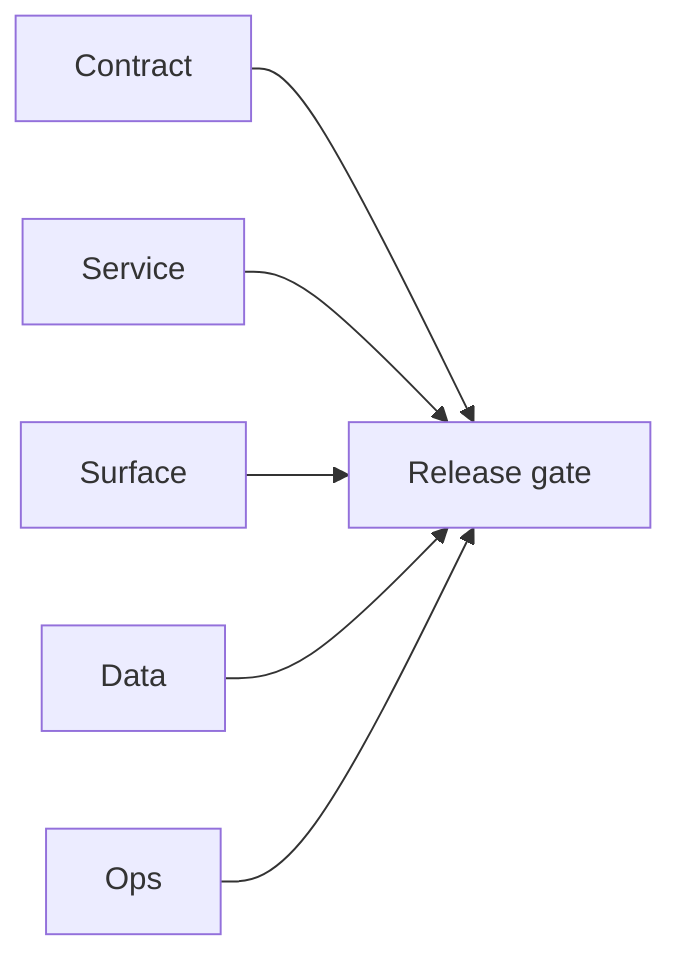

# 7.3.100 - Docker Go deployment smoke evidence

## Focus

Docker-first deployment evidence for all EC2 Go codebases, including container boot health and endpoint reachability.

## Micro-gate

- Image build status:
  - `sync.server`, `s3storage.server`, `ai.server`, `log.server`, `extension.server`, `email campaign` => build success.
- Runtime status:
  - `sync` container exits immediately (`HTTP 000`, `2.246460s`) with dependency/config failures and `non-positive interval for NewTicker`.
  - `email campaign` container exits before bind (`HTTP 000`, `2.229080s`) with missing `S3_TEMPLATE_BUCKET`.
  - `s3storage`, `ai`, `log`, `extension` containers bind and respond.

## Tasks

### Contract

- [ ] Publish a Docker runtime contract per Go service (`required env`, `required dependencies`, `default exposed port`, expected `/health` and `/health/ready` outcomes).

### Service

- [ ] Guard `sync` ticker interval with explicit non-zero fallback in container boot path.
- [x] ~~`job.server` runtime~~ — service removed from monorepo.
- [ ] Add required-env bootstrap diagnostics for `email campaign` (`S3_TEMPLATE_BUCKET`, `ADMIN_API_KEY`, SMTP/DB requirements).

### Surface

- [ ] Add deployment board signal for "container exited before health bind" with first-failure reason.

### Data

- [ ] Provide local docker profile for Postgres/OpenSearch/S3 emulation to satisfy `sync` default dependencies.

### Ops

- [ ] Add CI docker smoke step: `docker run` + `curl` gate for each EC2 Go image before merge.

## Evidence gate

- `tmp/evidence/docker-go/sync-health.txt`
- `tmp/evidence/docker-go/sync-logs.txt`
- `tmp/evidence/docker-go/job-health.txt`
- `tmp/evidence/docker-go/job-logs.txt`
- `tmp/evidence/docker-go/campaign-health.txt`
- `tmp/evidence/docker-go/campaign-logs.txt`

## Flowchart

Five-track delivery (contract / service / surface / data / ops) for this doc:

**Master hub:** [`docs/docs/flowchart.md`](../docs/flowchart.md) — cross-system diagrams and era strip (`0.x` → `10.x`).
