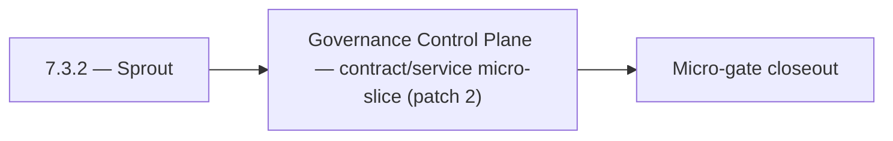

# 7.3.2 — Sprout

- **Era:** `7.x` deployment — hub [`versions.md`](../versions.md) · minors start at [`7.0 — Deployment era baseline lock`](7.0%20%E2%80%94%20Deployment%20era%20baseline%20lock.md)
- **Minor:** [7.3 — Governance Control Plane](./7.3 — Governance Control Plane.md)
- **Codename:** Sprout
- **Status:** planned

## Focus
Governance Control Plane — contract/service micro-slice (patch 2)

## Flowchart

## Micro-gate

| Track | Gate question | Answer / Evidence (fill at patch closeout) |
| --- | --- | --- |
| **Contract** | RBAC/authz, audit envelope, tenant isolation — `docs/backend/apis/` + `rbac-authz.md` updated? | Document at patch closeout. |
| **Service** | Handler guards, key rotation, retention hooks — smoke + parity tests documented? | Document smoke paths. |
| **Surface** | Admin/ops governance UI, role-gated flows — delta for this patch? | Document UX delta or N/A. |
| **Frontend** | Dashboard Era 7 deployment patterns (`tenant-security-observability.md`) touched? | Governance control plane — policy surfaces and approvals. Document at closeout. |
| **Data** | Audit tables, lineage, legal-hold — migrations + `docs/backend/database/`? | Document lineage or N/A. |
| **Ops** | CI/CD gates, drift checks, runbooks (`contact360.io/admin/deploy/...`) — delta? | Document ops delta or N/A. |

## Tasks
### Contract
- 📌 Planned: **[appointment360]** — refine duplicate task (was: 📌 planned: **jobs**: define v7.3 contract outcomes for gover…) | patch `7.3.2` band `2` | reason: specialize this file vs sibling patches; see docs/codebases/appointment360-codebase-analysis.md
- 📌 Planned: **[appointment360]** — refine duplicate task (was: 📌 planned: **emailapis**: define v7.3 contract outcomes for …) | patch `7.3.2` band `2` | reason: specialize this file vs sibling patches; see docs/codebases/appointment360-codebase-analysis.md
- 📌 Planned: **[appointment360]** — refine duplicate task (was: 📌 planned: define rbac for ai features: which subscription p…) | patch `7.3.2` band `2` | reason: specialize this file vs sibling patches; see docs/codebases/appointment360-codebase-analysis.md
- 📌 Planned: **[appointment360]** — refine duplicate task (was: 📌 planned: document chat retention policy: gdpr article 17 r…) | patch `7.3.2` band `2` | reason: specialize this file vs sibling patches; see docs/codebases/appointment360-codebase-analysis.md

### Service
- 📌 Planned: **[appointment360]** — refine duplicate task (was: 📌 planned: **jobs**: deliver v7.3 service outcomes for gover…) | patch `7.3.2` band `2` | reason: specialize this file vs sibling patches; see docs/codebases/appointment360-codebase-analysis.md
- 📌 Planned: **[appointment360]** — refine duplicate task (was: 📌 planned: **emailapis**: deliver v7.3 service outcomes for …) | patch `7.3.2` band `2` | reason: specialize this file vs sibling patches; see docs/codebases/appointment360-codebase-analysis.md
- 📌 Planned: **[appointment360]** — refine duplicate task (was: 📌 planned: implement feature gate middleware: check user rol…) | patch `7.3.2` band `2` | reason: specialize this file vs sibling patches; see docs/codebases/appointment360-codebase-analysis.md
- 📌 Planned: **[appointment360]** — refine duplicate task (was: 📌 planned: document and test blue-green lambda deployment pr…) | patch `7.3.2` band `2` | reason: specialize this file vs sibling patches; see docs/codebases/appointment360-codebase-analysis.md

### Surface

- 📌 Planned: **[admin]** — Verify UX for route `/` and bindings (patch 7.3.2 band 2) | area: `frontend-page` | files: `contact360/dashboard/app/page.tsx` | reason: Dashboard/extension surface for era 7 must match gateway contracts

### Data

- 📌 Planned: **[appointment360]** — refine duplicate task (was: 📌 planned: **[appointment360]** — update postgresql/es/s3 li…) | patch `7.3.2` band `2` | reason: specialize this file vs sibling patches; see docs/codebases/appointment360-codebase-analysis.md

### Ops

- 📌 Planned: **[platform]** — Record smoke evidence, rollback, and alerts (patch band 2: charter/P0) | area: `ops` | files: `docs/commands/`, `.github/workflows/` | reason: Smoke, rollback, and observability for patch 7.3.2

## Service task slices
> Merged from era `7.x` deployment task packs (P0→`.0`–`.2`, P1→`.3`–`.6`, Ops→`.7`–`.9`).

### Appointment360 (gateway)
- Finalize environment variable naming convention across all .env.* files
- Document EC2 vs Lambda execution differences in README.md
- Define /health readiness contract for load balancer health checks
- Define resolver-level RBAC contract using rbac-authz.md role model (admin, member, read_only)
- Validate Mangum handler Lambda cold-start time is < 3s
- Add lifespan event handler (FastAPI lifespan=) for DB engine startup/shutdown
- Configure trusted_hosts for production ALB host
- Configure CORS_ORIGINS whitelist for production dashboard domain
- Add health check-based deployment gate: Lambda alias swap only when /health/db passes
- Add --reload=false for uvicorn production command
- Enforce resolver and handler authz for privileged gateway mutations (no client-supplied role trust)
- Emit audit evidence to logs.api for governance-sensitive mutations with actor + tenant + trace id
- Dashboard environment detection: use NEXT_PUBLIC_GRAPHQL_URL per deploy environment
- Ensure Alembic migration history is clean before production deploy
- Create DB backup procedure before every migration
- Write Dockerfile with multi-stage build: pip install → copy app → CMD uvicorn
- Write docker-compose.yml for local dev: app + postgres + redis
- Add GitHub Actions CI: lint (flake8/ruff), type-check (mypy), test (pytest)
- Set ENVIRONMENT=production guard: disable DEBUG=true, GraphiQL, introspection

### logs.api
- Define and freeze era `7.x` logging schema additions and compatibility notes.
- Update endpoint/reference matrix in `docs/backend/endpoints/logsapi_endpoint_era_matrix.json`.
- Implement and validate service behavior for era `7.x` event sources and query expectations.
- Verify auth, error envelope, and health behavior for consuming services.
- Document S3 CSV storage and lineage impact for era `7.x`.
- Record retention, trace ids, and query-window expectations.

### Connectra
- Freeze RBAC and API key scope for write and export endpoints.
- Define tenant-safe request/response and failure semantics for privileged paths.
- Enforce privileged path checks for `batch-upsert`, job creation, and filter mutations.
- Ensure handler-level authz mirrors gateway role checks (no role bypass).
- Record audit events for sensitive writes and mapping/schema changes.
- Validate lineage fields: actor, tenant, trace id, and action outcome.

### Jobs
- Define per-role/per-service access model beyond shared API key.
- Tie role model to `docs/7. Contact360 deployment/rbac-authz.md` and gateway role semantics.
- Define deployment-time audit evidence contract for job lifecycle actions.
- Add role-aware authorization path and key rotation support.
- Implement retention policy hooks and deletion governance controls.
- Use `job_events` as primary deployment/audit trail evidence.
- Document retention and legal-hold expectations for job timelines.

## Evidence gate
Patch closeout includes contract diff, smoke output, data lineage delta, and ops note
