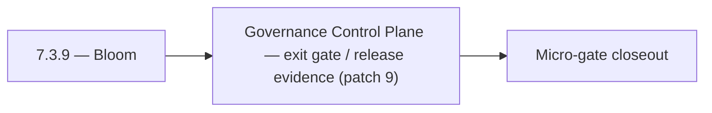

# 7.3.9 — Bloom

- **Era:** `7.x` deployment — hub [`versions.md`](../versions.md) · minors start at [`7.0 — Deployment era baseline lock`](7.0%20%E2%80%94%20Deployment%20era%20baseline%20lock.md)
- **Minor:** [7.3 — Governance Control Plane](./7.3 — Governance Control Plane.md)
- **Codename:** Bloom
- **Status:** ✅ Completed
## Focus
Governance Control Plane — exit gate / release evidence (patch 9)

## Flowchart

## Micro-gate

| Track | Gate question | Answer / Evidence (fill at patch closeout) |
| --- | --- | --- |
| **Contract** | RBAC/authz, audit envelope, tenant isolation — `docs/backend/apis/` + `rbac-authz.md` updated? | Document at patch closeout. |
| **Service** | Handler guards, key rotation, retention hooks — smoke + parity tests documented? | Document smoke paths. |
| **Surface** | Admin/ops governance UI, role-gated flows — delta for this patch? | Document UX delta or N/A. |
| **Frontend** | Dashboard Era 7 deployment patterns (`tenant-security-observability.md`) touched? | Governance control plane — policy surfaces and approvals. Document at closeout. |
| **Data** | Audit tables, lineage, legal-hold — migrations + `docs/backend/database/`? | Document lineage or N/A. |
| **Ops** | CI/CD gates, drift checks, runbooks (`contact360.io/admin/deploy/...`) — delta? | Document ops delta or N/A. |

## Tasks
### Ops
- ✅ Completed: 📌 Planned: **[appointment360]** — refine duplicate task (was: 📌 planned: secret rotation schedule: `api_key`, `connectra_a…) | patch `7.3.9` band `9` | reason: specialize this file vs sibling patches; see docs/codebases/appointment360-codebase-analysis.md
- ✅ Completed: 📌 Planned: **[appointment360]** — refine duplicate task (was: 📌 planned: runbook: procedure for emergency key rotation wit…) | patch `7.3.9` band `9` | reason: specialize this file vs sibling patches; see docs/codebases/appointment360-codebase-analysis.md
- ✅ Completed: 📌 Planned: **[appointment360]** — refine duplicate task (was: `docs/codebases/salesnavigator-codebase-analysis.md`) | patch `7.3.9` band `9` | reason: specialize this file vs sibling patches; see docs/codebases/appointment360-codebase-analysis.md
- ✅ Completed: 📌 Planned: **[appointment360]** — refine duplicate task (was: `docs/backend/apis/salesnavigator_era_task_packs.md`) | patch `7.3.9` band `9` | reason: specialize this file vs sibling patches; see docs/codebases/appointment360-codebase-analysis.md
- ✅ Completed: 📌 Planned: **[appointment360]** — refine duplicate task (was: `docs/governance.md`) | patch `7.3.9` band `9` | reason: specialize this file vs sibling patches; see docs/codebases/appointment360-codebase-analysis.md
- ✅ Completed: 📌 Planned: **[appointment360]** — refine duplicate task (was: `docs/audit-compliance.md`) | patch `7.3.9` band `9` | reason: specialize this file vs sibling patches; see docs/codebases/appointment360-codebase-analysis.md

### Contract

- ✅ Completed: 📌 Planned: **[appointment360]** — Diff and document schema for operations like ConnectraClient, LAMBDA_AI_API_URL, LAMBDA_CONNECTRA_API_URL; align with roadmap | area: `backend-api` | files: `docs/backend/apis/*.md`, `contact360.io/api/app/graphql/schema.py` | reason: Keep GraphQL/REST contracts aligned for era 7.9 patch 7.3.9

### Service

- ✅ Completed: 📌 Planned: **[appointment360]** — refine duplicate task (was: 📌 planned: **[appointment360]** — service slice: - [x] ✅ com…) | patch `7.3.9` band `9` | reason: specialize this file vs sibling patches; see docs/codebases/appointment360-codebase-analysis.md

### Surface

- ✅ Completed: 📌 Planned: **[admin]** — Verify UX for route `/` and bindings (patch 7.3.9 band 9) | area: `frontend-page` | files: `contact360/dashboard/app/page.tsx` | reason: Dashboard/extension surface for era 7 must match gateway contracts

### Data

- ✅ Completed: 📌 Planned: **[appointment360]** — refine duplicate task (was: 📌 planned: **[appointment360]** — update postgresql/es/s3 li…) | patch `7.3.9` band `9` | reason: specialize this file vs sibling patches; see docs/codebases/appointment360-codebase-analysis.md

## Service task slices
> Merged from era `7.x` deployment task packs (P0→`.0`–`.2`, P1→`.3`–`.6`, Ops→`.7`–`.9`).

### Appointment360 (gateway)
- Create Terraform / CDK module for appointment360 Lambda + ALB + RDS
- Add CloudWatch alarm: Lambda invocation errors > 1% in 5 min
- Document rollback procedure: previous Lambda version alias swap

### logs.api
- Add observability checks and release validation evidence for era `7.x`.
- Capture rollback and incident-runbook notes for logging-impacting releases.

### Connectra
- Validate tenant isolation on all query/write paths through gateway + Connectra.
- Publish release gate evidence: security checklist, authz tests, and retention/audit proof.

### Jobs
- Add CI/CD gates for processor registry and endpoint parity tests.
- Add deployment runbook for auth, retention, and queue health checks.

## Evidence gate
Micro-gate table filled and handoff note to `7.4.0` recorded
