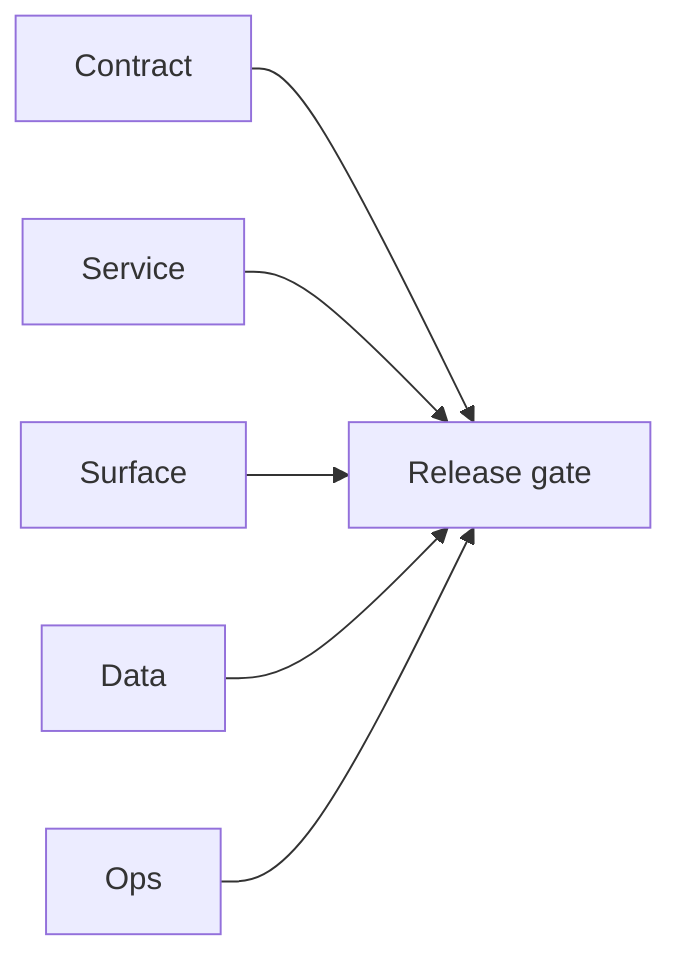

## Focus

Local deployment and boot blockers found while running service-by-service smoke checks.

## Micro-gate

- `EC2/sync.server` startup fails with:
  - Postgres auth failure (`postgres` credentials invalid)
  - OpenSearch connection refused (`localhost:9200`)
  - S3 invalid access key
  - runtime panic: `non-positive interval for NewTicker`
- `EC2/job.server` startup fails: `.env` not found in service root.
- `contact360.io/admin` runserver process starts autoreloader but no listener observed on `:8001` during smoke pass.

## Tasks

### Contract

- [ ] Define canonical local env bootstrap contract per service (`required env`, default ports, dependency matrix).

### Service

- [ ] Fix `sync` ticker interval guard to reject zero values gracefully instead of panic.
- [ ] Ship `.env.example` for `job.server` with mandatory keys and documented defaults.

### Surface

- [ ] Publish deployment-status visibility in admin/operator surface for failed local boots (service name, reason, fix hint).

### Data

- [ ] Align local DB credentials for sync/job stacks with active dockerized Postgres profile.

### Ops

- [ ] Add one-command local bootstrap that starts dependencies (Postgres/OpenSearch/S3-compatible mock) before app start.
- [ ] Add CI smoke checks for "process binds expected port" per service.

## Evidence gate

- Sync startup error trace captured in shell run output (`go run .` from `EC2/sync.server`)
- Job startup error trace (`Config File ".env" Not Found`)
- Admin listener probe on `:8001` with no bind during runserver smoke

## Flowchart

Five-track delivery (contract / service / surface / data / ops) for this doc:

**Master hub:** [`docs/docs/flowchart.md`](../docs/flowchart.md) — cross-system diagrams and era strip (`0.x` → `10.x`).
