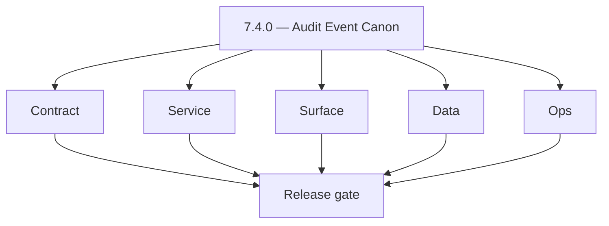
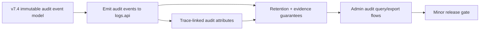
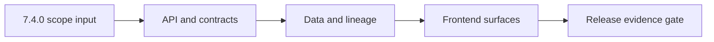

# Version 7.4

- **Status:** ✅ Completed
- **Target window:** TBD
- **Summary:** Audit Event Canon. Cross-service execution pack for this minor across contract, service, surface, data, and ops.
- **Scope:** Immutable audit event schema, audit query/export flows, compliance reporting readiness, and evidence retention/verification signals via `logs.api`.
- **Roadmap mapping:** `7.4`
- **Owner:** Data Governance
- **Patch closure:** Every codenamed patch file includes **Micro-gate** + **Service task slices**. Era hub: [`versions.md`](../versions.md).

## Scope

- Target minor: `7.4.0` aligned to current roadmap mapping in this file.
- In scope: contract, service, surface, data, and ops tasks across core Contact360 services.
- Primary owners: API, App, Jobs, Sync, Admin, and supporting platform services.
- Exclusions: work outside this minor unless required for compatibility or incident risk reduction.
- Output: actionable per-service task breakdown and execution queue for release readiness.

## Flowchart

Delivery work for this minor follows the five-track model (contract, service, surface, data, ops) through a release gate.

### Runtime focus (unique to this minor)

See also: [`docs/flowchart.md`](../flowchart.md) for system-wide and master views.

## Task tracks

### Contract
- ✅ Completed: 📌 Planned: **[appointment360]** — refine duplicate task (was: 📌 planned: **[appointment360]** — refine duplicate task (was…) | patch `7.4.0` band `0` | reason: specialize this file vs sibling patches; see docs/codebases/appointment360-codebase-analysis.md
- ✅ Completed: ✅ Completed: 📌 Planned: **[appointment360]** — refine duplicate task (was: 📌 planned: **app**: define v7.4 contract outcomes for audit …) | patch `7.4.0` band `0` | reason: specialize this file vs sibling patches; see docs/codebases/appointment360-codebase-analysis.md
- ✅ Completed: ✅ Completed: 📌 Planned: **[appointment360]** — refine duplicate task (was: 📌 planned: **jobs**: define v7.4 contract outcomes for audit…) | patch `7.4.0` band `0` | reason: specialize this file vs sibling patches; see docs/codebases/appointment360-codebase-analysis.md
- ✅ Completed: ✅ Completed: 📌 Planned: **[appointment360]** — refine duplicate task (was: 📌 planned: **sync**: define v7.4 contract outcomes for audit…) | patch `7.4.0` band `0` | reason: specialize this file vs sibling patches; see docs/codebases/appointment360-codebase-analysis.md
- ✅ Completed: 📌 Planned: **[appointment360]** — refine duplicate task (was: 📌 planned: **[appointment360]** — refine duplicate task (was…) | patch `7.4.0` band `0` | reason: specialize this file vs sibling patches; see docs/codebases/appointment360-codebase-analysis.md
- ✅ Completed: ✅ Completed: 📌 Planned: **[appointment360]** — refine duplicate task (was: 📌 planned: **mailvetter**: define v7.4 contract outcomes for…) | patch `7.4.0` band `0` | reason: specialize this file vs sibling patches; see docs/codebases/appointment360-codebase-analysis.md
- ✅ Completed: ✅ Completed: 📌 Planned: **[appointment360]** — refine duplicate task (was: 📌 planned: **emailapis**: define v7.4 contract outcomes for …) | patch `7.4.0` band `0` | reason: specialize this file vs sibling patches; see docs/codebases/appointment360-codebase-analysis.md
- ✅ Completed: ✅ Completed: 📌 Planned: **[appointment360]** — refine duplicate task (was: 📌 planned: **emailapigo**: define v7.4 contract outcomes for…) | patch `7.4.0` band `0` | reason: specialize this file vs sibling patches; see docs/codebases/appointment360-codebase-analysis.md

- ✅ Completed: 📌 Planned: **[appointment360]** — refine duplicate task (was: 📌 planned: **[architecture]** — product **graphql** remains …) | patch `7.4.0` band `0` | reason: specialize this file vs sibling patches; see docs/codebases/appointment360-codebase-analysis.md
### Service
- ✅ Completed: 📌 Planned: **[appointment360]** — refine duplicate task (was: 📌 planned: **[appointment360]** — refine duplicate task (was…) | patch `7.4.0` band `0` | reason: specialize this file vs sibling patches; see docs/codebases/appointment360-codebase-analysis.md
- ✅ Completed: ✅ Completed: 📌 Planned: **[appointment360]** — refine duplicate task (was: 📌 planned: **app**: deliver v7.4 service outcomes for audit …) | patch `7.4.0` band `0` | reason: specialize this file vs sibling patches; see docs/codebases/appointment360-codebase-analysis.md
- ✅ Completed: ✅ Completed: 📌 Planned: **[appointment360]** — refine duplicate task (was: 📌 planned: **jobs**: deliver v7.4 service outcomes for audit…) | patch `7.4.0` band `0` | reason: specialize this file vs sibling patches; see docs/codebases/appointment360-codebase-analysis.md
- ✅ Completed: ✅ Completed: 📌 Planned: **[appointment360]** — refine duplicate task (was: 📌 planned: **sync**: deliver v7.4 service outcomes for audit…) | patch `7.4.0` band `0` | reason: specialize this file vs sibling patches; see docs/codebases/appointment360-codebase-analysis.md
- ✅ Completed: 📌 Planned: **[appointment360]** — refine duplicate task (was: 📌 planned: **[appointment360]** — refine duplicate task (was…) | patch `7.4.0` band `0` | reason: specialize this file vs sibling patches; see docs/codebases/appointment360-codebase-analysis.md
- ✅ Completed: ✅ Completed: 📌 Planned: **[appointment360]** — refine duplicate task (was: 📌 planned: **mailvetter**: deliver v7.4 service outcomes for…) | patch `7.4.0` band `0` | reason: specialize this file vs sibling patches; see docs/codebases/appointment360-codebase-analysis.md
- ✅ Completed: ✅ Completed: 📌 Planned: **[appointment360]** — refine duplicate task (was: 📌 planned: **emailapis**: deliver v7.4 service outcomes for …) | patch `7.4.0` band `0` | reason: specialize this file vs sibling patches; see docs/codebases/appointment360-codebase-analysis.md
- ✅ Completed: ✅ Completed: 📌 Planned: **[appointment360]** — refine duplicate task (was: 📌 planned: **emailapigo**: deliver v7.4 service outcomes for…) | patch `7.4.0` band `0` | reason: specialize this file vs sibling patches; see docs/codebases/appointment360-codebase-analysis.md

- ✅ Completed: 📌 Planned: **[appointment360]** — refine duplicate task (was: 📌 planned: **[architecture]** — **go/gin satellites** in sco…) | patch `7.4.0` band `0` | reason: specialize this file vs sibling patches; see docs/codebases/appointment360-codebase-analysis.md
### Surface
- ✅ Completed: ✅ Completed: 📌 Planned: **[appointment360]** — refine duplicate task (was: 📌 planned: **api**: shape v7.4 surface outcomes for audit ev…) | patch `7.4.0` band `0` | reason: specialize this file vs sibling patches; see docs/codebases/appointment360-codebase-analysis.md
- ✅ Completed: ✅ Completed: 📌 Planned: **[appointment360]** — refine duplicate task (was: 📌 planned: **app**: shape v7.4 surface outcomes for audit re…) | patch `7.4.0` band `0` | reason: specialize this file vs sibling patches; see docs/codebases/appointment360-codebase-analysis.md
- ✅ Completed: ✅ Completed: 📌 Planned: **[appointment360]** — refine duplicate task (was: 📌 planned: **jobs**: shape v7.4 surface outcomes for audit e…) | patch `7.4.0` band `0` | reason: specialize this file vs sibling patches; see docs/codebases/appointment360-codebase-analysis.md
- ✅ Completed: ✅ Completed: 📌 Planned: **[appointment360]** — refine duplicate task (was: 📌 planned: **sync**: shape v7.4 surface outcomes for audit e…) | patch `7.4.0` band `0` | reason: specialize this file vs sibling patches; see docs/codebases/appointment360-codebase-analysis.md
- ✅ Completed: ✅ Completed: 📌 Planned: **[appointment360]** — refine duplicate task (was: 📌 planned: **admin**: shape v7.4 surface outcomes for audit …) | patch `7.4.0` band `0` | reason: specialize this file vs sibling patches; see docs/codebases/appointment360-codebase-analysis.md
- ✅ Completed: ✅ Completed: 📌 Planned: **[appointment360]** — refine duplicate task (was: 📌 planned: **mailvetter**: shape v7.4 surface outcomes for a…) | patch `7.4.0` band `0` | reason: specialize this file vs sibling patches; see docs/codebases/appointment360-codebase-analysis.md
- ✅ Completed: ✅ Completed: 📌 Planned: **[appointment360]** — refine duplicate task (was: 📌 planned: **emailapis**: shape v7.4 surface outcomes for au…) | patch `7.4.0` band `0` | reason: specialize this file vs sibling patches; see docs/codebases/appointment360-codebase-analysis.md
- ✅ Completed: ✅ Completed: 📌 Planned: **[appointment360]** — refine duplicate task (was: 📌 planned: **emailapigo**: shape v7.4 surface outcomes for a…) | patch `7.4.0` band `0` | reason: specialize this file vs sibling patches; see docs/codebases/appointment360-codebase-analysis.md

### Data
- ✅ Completed: ✅ Completed: 📌 Planned: **[appointment360]** — refine duplicate task (was: 📌 planned: **api**: anchor v7.4 data outcomes for immutable …) | patch `7.4.0` band `0` | reason: specialize this file vs sibling patches; see docs/codebases/appointment360-codebase-analysis.md
- ✅ Completed: ✅ Completed: 📌 Planned: **[appointment360]** — refine duplicate task (was: 📌 planned: **app**: anchor v7.4 data outcomes for audit even…) | patch `7.4.0` band `0` | reason: specialize this file vs sibling patches; see docs/codebases/appointment360-codebase-analysis.md
- ✅ Completed: ✅ Completed: 📌 Planned: **[appointment360]** — refine duplicate task (was: 📌 planned: **jobs**: anchor v7.4 data outcomes for audit eve…) | patch `7.4.0` band `0` | reason: specialize this file vs sibling patches; see docs/codebases/appointment360-codebase-analysis.md
- ✅ Completed: ✅ Completed: 📌 Planned: **[appointment360]** — refine duplicate task (was: 📌 planned: **sync**: anchor v7.4 data outcomes for audit eve…) | patch `7.4.0` band `0` | reason: specialize this file vs sibling patches; see docs/codebases/appointment360-codebase-analysis.md
- ✅ Completed: ✅ Completed: 📌 Planned: **[appointment360]** — refine duplicate task (was: 📌 planned: **admin**: anchor v7.4 data outcomes for audit ev…) | patch `7.4.0` band `0` | reason: specialize this file vs sibling patches; see docs/codebases/appointment360-codebase-analysis.md
- ✅ Completed: ✅ Completed: 📌 Planned: **[appointment360]** — refine duplicate task (was: 📌 planned: **mailvetter**: anchor v7.4 data outcomes for aud…) | patch `7.4.0` band `0` | reason: specialize this file vs sibling patches; see docs/codebases/appointment360-codebase-analysis.md
- ✅ Completed: ✅ Completed: 📌 Planned: **[appointment360]** — refine duplicate task (was: 📌 planned: **emailapis**: anchor v7.4 data outcomes for audi…) | patch `7.4.0` band `0` | reason: specialize this file vs sibling patches; see docs/codebases/appointment360-codebase-analysis.md
- ✅ Completed: ✅ Completed: 📌 Planned: **[appointment360]** — refine duplicate task (was: 📌 planned: **emailapigo**: anchor v7.4 data outcomes for aud…) | patch `7.4.0` band `0` | reason: specialize this file vs sibling patches; see docs/codebases/appointment360-codebase-analysis.md

- ✅ Completed: 📌 Planned: **[appointment360]** — refine duplicate task (was: 📌 planned: **[architecture]** — **postgresql-first** per `do…) | patch `7.4.0` band `0` | reason: specialize this file vs sibling patches; see docs/codebases/appointment360-codebase-analysis.md
### Ops
- ✅ Completed: ✅ Completed: 📌 Planned: **[appointment360]** — refine duplicate task (was: 📌 planned: **api**: enforce v7.4 ops outcomes for immutable …) | patch `7.4.0` band `0` | reason: specialize this file vs sibling patches; see docs/codebases/appointment360-codebase-analysis.md
- ✅ Completed: ✅ Completed: 📌 Planned: **[appointment360]** — refine duplicate task (was: 📌 planned: **app**: enforce v7.4 ops outcomes for audit repo…) | patch `7.4.0` band `0` | reason: specialize this file vs sibling patches; see docs/codebases/appointment360-codebase-analysis.md
- ✅ Completed: ✅ Completed: 📌 Planned: **[appointment360]** — refine duplicate task (was: 📌 planned: **jobs**: enforce v7.4 ops outcomes for audit eve…) | patch `7.4.0` band `0` | reason: specialize this file vs sibling patches; see docs/codebases/appointment360-codebase-analysis.md
- ✅ Completed: ✅ Completed: 📌 Planned: **[appointment360]** — refine duplicate task (was: 📌 planned: **sync**: enforce v7.4 ops outcomes for audit eve…) | patch `7.4.0` band `0` | reason: specialize this file vs sibling patches; see docs/codebases/appointment360-codebase-analysis.md
- ✅ Completed: ✅ Completed: 📌 Planned: **[appointment360]** — refine duplicate task (was: 📌 planned: **admin**: enforce v7.4 ops outcomes for audit re…) | patch `7.4.0` band `0` | reason: specialize this file vs sibling patches; see docs/codebases/appointment360-codebase-analysis.md
- ✅ Completed: ✅ Completed: 📌 Planned: **[appointment360]** — refine duplicate task (was: 📌 planned: **mailvetter**: enforce v7.4 ops outcomes for aud…) | patch `7.4.0` band `0` | reason: specialize this file vs sibling patches; see docs/codebases/appointment360-codebase-analysis.md
- ✅ Completed: ✅ Completed: 📌 Planned: **[appointment360]** — refine duplicate task (was: 📌 planned: **emailapis**: enforce v7.4 ops outcomes for audi…) | patch `7.4.0` band `0` | reason: specialize this file vs sibling patches; see docs/codebases/appointment360-codebase-analysis.md
- ✅ Completed: ✅ Completed: 📌 Planned: **[appointment360]** — refine duplicate task (was: 📌 planned: **emailapigo**: enforce v7.4 ops outcomes for aud…) | patch `7.4.0` band `0` | reason: specialize this file vs sibling patches; see docs/codebases/appointment360-codebase-analysis.md

- ✅ Completed: 📌 Planned: **[appointment360]** — refine duplicate task (was: 📌 planned: **[architecture]** — **observability**: correlate…) | patch `7.4.0` band `0` | reason: specialize this file vs sibling patches; see docs/codebases/appointment360-codebase-analysis.md
- ✅ Completed: 📌 Planned: **[appointment360]** — refine duplicate task (was: 📌 planned: **[architecture]** — **django docsai** (`contact3…) | patch `7.4.0` band `0` | reason: specialize this file vs sibling patches; see docs/codebases/appointment360-codebase-analysis.md
## Task Breakdown
### Version `7.4.0` per-service execution slices

#### api
- Contract: lock v7.4 immutable audit event schema boundaries in `contact360.io/api`.
- Service: ensure audit event emissions happen on governance-relevant writes and remain immutable.
- Surface: expose stable audit query/export outcome semantics.
- Data: persist trace-linked audit attributes (actor/trace/correlation).
- Ops: validate runbooks, checks, and release evidence for `api`.
- Acceptance: v7.4 gate passes for `api` with immutable audit event emission and trace linkage.

#### app
- Contract: lock v7.4 UI payload expectations for audit query/export in `contact360.io/app`.
- Service: wire client flows to audit query/export endpoints and safe errors.
- Surface: present deterministic audit states (empty/loading/error/retry) for admins.
- Data: capture UI telemetry mapped to audit actions.
- Ops: validate audit UI smoke flows.
- Acceptance: v7.4 gate passes for `app` with audit UX aligned to backend audit schema.

#### jobs
- Contract: lock v7.4 worker/audit linkage schema in `contact360.io/jobs`.
- Service: ensure async processing preserves correlation ids for immutable audit events.
- Surface: operator job visibility links to audit trails.
- Data: record queue attempt history with governance/audit markers.
- Ops: validate runbook coverage for audit consistency issues.
- Acceptance: v7.4 gate passes for `jobs` with immutable audit event linkage from actions to execution.

#### sync
- Contract: lock v7.4 auditable sync operation contracts in `contact360.io/sync`.
- Service: ensure privileged sync ops emit immutable audit outcomes.
- Surface: sync health signals presented to authorized operators only.
- Data: preserve delta lineage with trace-linked audit attributes.
- Ops: validate resync playbooks with audit proof expectations.
- Acceptance: v7.4 gate passes for `sync` with immutable audit event outcomes.

#### admin
- Contract: lock v7.4 audit query/export control-plane contracts in `contact360.io/admin`.
- Service: enforce audit reporting queries with strict authz.
- Surface: admin audit UI includes export/filters affordances and confirmation UX for sensitive actions.
- Data: track governance/audit events with immutable attributes.
- Ops: validate audit evidence readability and export.
- Acceptance: v7.4 gate passes for `admin` with complete immutable audit reporting.

#### mailvetter
- Contract: lock v7.4 verifier evidence fields that audits can render without ambiguity in `backend(dev)/mailvetter`.
- Service: ensure audit evidence payload mapping stays stable under failure.
- Surface: evidence states readable and audit-safe.
- Data: store verdict evidence artifacts with replay metadata.
- Ops: validate retention behavior.
- Acceptance: v7.4 gate passes for `mailvetter` with audit-readable evidence retention.

#### emailapis
- Contract: lock v7.4 audit-related provider decision fields in `lambda/emailapis`.
- Service: ensure provider routing outcomes map to immutable audit events.
- Surface: expose authorized audit-friendly outcomes.
- Data: retain provider decision lineage with correlation keys.
- Ops: validate provider health probes with audit trace correlation.
- Acceptance: v7.4 gate passes for `emailapis` with immutable audit mapping.

#### emailapigo
- Contract: lock v7.4 Go adapter parity for audit event payloads in `lambda/emailapigo`.
- Service: preserve trace/correlation ids and safe error mapping.
- Surface: show safe diagnostics for audit-related flows.
- Data: maintain trace continuity across provider hops.
- Ops: validate Go KPIs and audit emission coverage.
- Acceptance: v7.4 gate passes for `emailapigo` with immutable audit mapping.

## Immediate next execution queue
- 📌 Planned: Freeze v7.4 immutable audit event status/error vocabulary across `api`, `jobs`, and email services; capture before/after schema diff evidence.
- 📌 Planned: Execute one `app -> api -> emailapigo` admin audit-relevant action and archive traces with owner signoff.
- 📌 Planned: Add regression coverage for audit emission/correlation loss in async paths.
- 📌 Planned: Validate `sync` auditable operation outcomes preserve trace/correlation and do not leak forbidden metadata.
- 📌 Planned: Update `contact360.io/admin` operational checklist entries for v7.4, including escalation thresholds and rollback triggers for audit regressions.
- 📌 Planned: Run a controlled retry/idempotency drill on one governance-relevant async workflow and ensure audit evidence remains immutable.
- 📌 Planned: Verify `app` messaging mirrors backend behavior for audit query/export outcomes; include screenshots tied to API payload samples.
- 📌 Planned: Publish v7.4 cut-readiness notes with clear owners, unresolved blockers, and go/no-go criteria.

## Cross-service ownership

| Service | Version delivery focus |
|---|---|
| contact360.io/api | v7.4 immutable audit event schema + trace linkage |
| contact360.io/app | v7.4 audit query/export UX parity (role-gated) |
| contact360.io/jobs | v7.4 async execution integrity for immutable audit events |
| contact360.io/sync | v7.4 auditable sync operation lineage (tenant-safe) |
| contact360.io/admin | v7.4 operator governance + audited audit reporting control plane |
| backend(dev)/mailvetter | v7.4 audit-readable evidence retention |
| lambda/emailapis | v7.4 provider routing outcomes mapped to immutable audit |
| lambda/emailapigo | v7.4 Go adapter parity for audit payloads |

## References

- [docs/versions.md](../versions.md)
- [docs/roadmap.md](../roadmap.md)
- [docs/version-policy.md](../version-policy.md)
- [docs/architecture.md](../architecture.md)
- [docs/codebase.md](../codebase.md)
- [Email system rule](../../.cursor/rules/email_system.md)
- [Email integration exploration](../../.cursor/rules/cursor_contact360_email_integration_exp.md)
- [lambda/emailapis breakdown](../../lambda/emailapis/docs/VERSION_TASK_BREAKDOWN_0.0_TO_10.10.md)
- [contact360.io/api README](../../contact360.io/api/README.md)
- [contact360.io/jobs README](../../contact360.io/jobs/README.md)
- [contact360.io/sync README](../../contact360.io/sync/README.md)
- [backend(dev)/mailvetter README](../../backend(dev)/mailvetter/README.md)

## Backend API and Endpoint Scope

- Era: `7.x`
- Logging service contract reference: `lambda/logs.api/docs/api.md`.
- Endpoint matrix reference: `docs/backend/endpoints/logsapi_endpoint_era_matrix.json`.
- Contract focus for `7.4`: logging evidence coverage for core flows in this minor.
- Public/private contract notes: enforce tenant-scoped access, authz boundaries, and API key governance for log queries/writes.

## Database and Data Lineage Scope

- PostgreSQL lineage touchpoints: correlate business entities with log `request_id` and `trace_id` where available.
- Elasticsearch index changes: include only when this minor expands analytics/search contracts that consume logs.
- S3 bucket/artifact changes: `logs/` CSV objects retained per lifecycle policy.
- MongoDB/audit/log lineage updates: canonical logs backend is S3 CSV for logs.api; update references accordingly.
- Data lineage reference: `docs/backend/database/logsapi_data_lineage.md`.

## Frontend UX Surface Scope

- Primary pages/surfaces: admin/activity/audit views and era-specific operational panels.
- Tabs/navigation changes: document concrete logs-facing tabs for this minor.
- Modal/dialog and state transitions: query/search/filter -> result/empty/error/retry states.
- Hook/service/context wiring: logging-aware services/hooks and role/tenant contexts.
- UI binding reference: `docs/frontend/logsapi-ui-bindings.md`.

## UI Elements Checklist

- Buttons (primary/secondary/link/loading): documented
- Inputs/textareas/selects: documented
- Checkboxes: documented
- Radio buttons: documented
- Progress bars: documented
- Toast/alert/error states: documented
- Loading and empty states: documented

## Flow/Graph Delta for This Minor

## Release Gate and Evidence

- 📌 Planned: API contract diff reviewed
- 📌 Planned: DB/index/storage migration evidence captured
- 📌 Planned: UI smoke path verified with screenshots or traces
- 📌 Planned: Flow diagram updated and validated
- 📌 Planned: Roadmap mapping and owner alignment confirmed

### Micro-gate reference (apply at every `7.N.P`)

| Track | Gate question (must answer Yes or document waiver) |
| --- | --- |
| **Contract** | RBAC/authz, audit envelope, tenant isolation — `docs/backend/apis/` + `rbac-authz.md` + matrices updated? |
| **Service** | Handler guards, key rotation, retention hooks — parity tests + deployment gates documented? |
| **Surface** | Admin/ops governance UI, role-gated flows — operator-visible delta? |
| **Frontend** | Era 7 patterns (`tenant-security-observability.md`, components) — delta? |
| **Data** | Audit tables, lineage, legal-hold — `docs/backend/database/` migrations recorded? |
| **Ops** | CI/CD, drift checks, `contact360.io/admin/deploy/` runbooks — recorded? |
| **Architecture** | Go/Gin satellites only via Python GraphQL gateway (`contact360.io/api`); Next.js `NEXT_PUBLIC_GRAPHQL_URL`; Postgres-first / Redis exit per `docs/docs/data-stores-postgres.md`. |

**Patch ladder:** See codename table below (`.0`–`.9` per minor; minors `7.6`–`7.9` use charter-style codenames).

## Patches

| Patch | Codename | Doc |
| --- | --- | --- |
| `7.4.0` | Void | [`7.4.0` — Void](7.4.0 — Void.md) |
| `7.4.1` | Seed | [`7.4.1` — Seed](7.4.1 — Seed.md) |
| `7.4.2` | Sprout | [`7.4.2` — Sprout](7.4.2 — Sprout.md) |
| `7.4.3` | Roots | [`7.4.3` — Roots](7.4.3 — Roots.md) |
| `7.4.4` | Soil | [`7.4.4` — Soil](7.4.4 — Soil.md) |
| `7.4.5` | Rain | [`7.4.5` — Rain](7.4.5 — Rain.md) |
| `7.4.6` | Stem | [`7.4.6` — Stem](7.4.6 — Stem.md) |
| `7.4.7` | Branch | [`7.4.7` — Branch](7.4.7 — Branch.md) |
| `7.4.8` | Leaf | [`7.4.8` — Leaf](7.4.8 — Leaf.md) |
| `7.4.9` | Bloom | [`7.4.9` — Bloom](7.4.9 — Bloom.md) |

## Patch ladder (7.4.0 - 7.4.9)

### Micro-gate reference (apply at every patch)

| Track | Gate question (must answer Yes or waiver) |
| --- | --- |
| **Contract** | Contract/API change captured with diff or explicit no-change note |
| **Service** | Service health and smoke for affected paths pass |
| **Surface** | UI/admin/extension impact documented or N/A |
| **Frontend** | Routes/components/hooks affected listed or N/A |
| **Data** | Migrations/index/lineage deltas linked or N/A |
| **Ops** | Rollback/secrets/CI/runbook delta linked or N/A |

**Patch intent bands:** `.0` charter, `.1-.2` scaffold, `.3-.5` hardening, `.6-.8` integration, `.9` freeze/handoff.

| Patch | Codename | Focus | Evidence gate |
| --- | --- | --- | --- |
| `7.4.0` | Void | patch focus | charter artifact linked |
| `7.4.1` | Seed | patch focus | closeout evidence attached |
| `7.4.2` | Sprout | patch focus | closeout evidence attached |
| `7.4.3` | Roots | patch focus | closeout evidence attached |
| `7.4.4` | Soil | patch focus | closeout evidence attached |
| `7.4.5` | Rain | patch focus | closeout evidence attached |
| `7.4.6` | Stem | patch focus | closeout evidence attached |
| `7.4.7` | Branch | patch focus | closeout evidence attached |
| `7.4.8` | Leaf | patch focus | closeout evidence attached |
| `7.4.9` | Bloom | patch focus | handoff documented |
