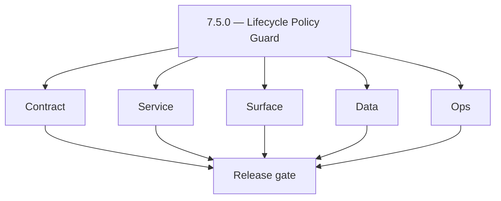
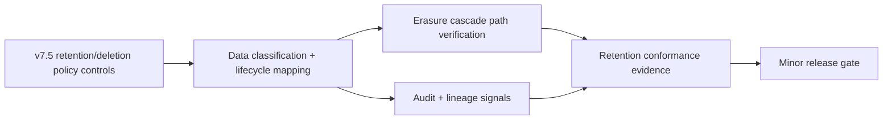
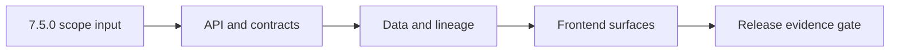

# Version 7.5

- **Status:** ✅ Completed
- **Target window:** TBD
- **Summary:** Lifecycle Policy Guard. Cross-service execution pack for this minor across contract, service, surface, data, and ops.
- **Scope:** Data governance and lifecycle controls: retention/deletion policy enforcement, GDPR-style erasure cascade readiness, and evidence retention conformance.
- **Roadmap mapping:** `7.5`
- **Owner:** Dashboard + Data
- **Patch closure:** Every codenamed patch file includes **Micro-gate** + **Service task slices**. Era hub: [`versions.md`](../versions.md).

## Scope

- Target minor: `7.5.0` aligned to current roadmap mapping in this file.
- In scope: contract, service, surface, data, and ops tasks across core Contact360 services.
- Primary owners: API, App, Jobs, Sync, Admin, and supporting platform services.
- Exclusions: work outside this minor unless required for compatibility or incident risk reduction.
- Output: actionable per-service task breakdown and execution queue for release readiness.

## Flowchart

Delivery work for this minor follows the five-track model (contract, service, surface, data, ops) through a release gate.

### Runtime focus (unique to this minor)

See also: [`docs/flowchart.md`](../flowchart.md) for system-wide and master views.

## Task tracks

### Contract
- ✅ Completed: 📌 Planned: **[appointment360]** — refine duplicate task (was: 📌 planned: **api**: define v7.5 contract outcomes for lifecy…) | patch `7.5.0` band `0` | reason: specialize this file vs sibling patches; see docs/codebases/appointment360-codebase-analysis.md
- ✅ Completed: 📌 Planned: **[appointment360]** — refine duplicate task (was: 📌 planned: **app**: define v7.5 contract outcomes for lifecy…) | patch `7.5.0` band `0` | reason: specialize this file vs sibling patches; see docs/codebases/appointment360-codebase-analysis.md
- ✅ Completed: 📌 Planned: **[appointment360]** — refine duplicate task (was: 📌 planned: **jobs**: define v7.5 contract outcomes for lifec…) | patch `7.5.0` band `0` | reason: specialize this file vs sibling patches; see docs/codebases/appointment360-codebase-analysis.md
- ✅ Completed: 📌 Planned: **[appointment360]** — refine duplicate task (was: 📌 planned: **sync**: define v7.5 contract outcomes for lifec…) | patch `7.5.0` band `0` | reason: specialize this file vs sibling patches; see docs/codebases/appointment360-codebase-analysis.md
- ✅ Completed: 📌 Planned: **[appointment360]** — refine duplicate task (was: 📌 planned: **admin**: define v7.5 contract outcomes for life…) | patch `7.5.0` band `0` | reason: specialize this file vs sibling patches; see docs/codebases/appointment360-codebase-analysis.md
- ✅ Completed: 📌 Planned: **[appointment360]** — refine duplicate task (was: 📌 planned: **mailvetter**: define v7.5 contract outcomes for…) | patch `7.5.0` band `0` | reason: specialize this file vs sibling patches; see docs/codebases/appointment360-codebase-analysis.md
- ✅ Completed: 📌 Planned: **[appointment360]** — refine duplicate task (was: 📌 planned: **emailapis**: define v7.5 contract outcomes for …) | patch `7.5.0` band `0` | reason: specialize this file vs sibling patches; see docs/codebases/appointment360-codebase-analysis.md
- ✅ Completed: 📌 Planned: **[appointment360]** — refine duplicate task (was: 📌 planned: **emailapigo**: define v7.5 contract outcomes for…) | patch `7.5.0` band `0` | reason: specialize this file vs sibling patches; see docs/codebases/appointment360-codebase-analysis.md

### Service
- ✅ Completed: 📌 Planned: **[appointment360]** — refine duplicate task (was: 📌 planned: **api**: deliver v7.5 service outcomes for lifecy…) | patch `7.5.0` band `0` | reason: specialize this file vs sibling patches; see docs/codebases/appointment360-codebase-analysis.md
- ✅ Completed: 📌 Planned: **[appointment360]** — refine duplicate task (was: 📌 planned: **app**: deliver v7.5 service outcomes for lifecy…) | patch `7.5.0` band `0` | reason: specialize this file vs sibling patches; see docs/codebases/appointment360-codebase-analysis.md
- ✅ Completed: 📌 Planned: **[appointment360]** — refine duplicate task (was: 📌 planned: **jobs**: deliver v7.5 service outcomes for lifec…) | patch `7.5.0` band `0` | reason: specialize this file vs sibling patches; see docs/codebases/appointment360-codebase-analysis.md
- ✅ Completed: 📌 Planned: **[appointment360]** — refine duplicate task (was: 📌 planned: **sync**: deliver v7.5 service outcomes for lifec…) | patch `7.5.0` band `0` | reason: specialize this file vs sibling patches; see docs/codebases/appointment360-codebase-analysis.md
- ✅ Completed: 📌 Planned: **[appointment360]** — refine duplicate task (was: 📌 planned: **admin**: deliver v7.5 service outcomes for life…) | patch `7.5.0` band `0` | reason: specialize this file vs sibling patches; see docs/codebases/appointment360-codebase-analysis.md
- ✅ Completed: 📌 Planned: **[appointment360]** — refine duplicate task (was: 📌 planned: **mailvetter**: deliver v7.5 service outcomes for…) | patch `7.5.0` band `0` | reason: specialize this file vs sibling patches; see docs/codebases/appointment360-codebase-analysis.md
- ✅ Completed: 📌 Planned: **[appointment360]** — refine duplicate task (was: 📌 planned: **emailapis**: deliver v7.5 service outcomes for …) | patch `7.5.0` band `0` | reason: specialize this file vs sibling patches; see docs/codebases/appointment360-codebase-analysis.md
- ✅ Completed: 📌 Planned: **[appointment360]** — refine duplicate task (was: 📌 planned: **emailapigo**: deliver v7.5 service outcomes for…) | patch `7.5.0` band `0` | reason: specialize this file vs sibling patches; see docs/codebases/appointment360-codebase-analysis.md

### Surface
- ✅ Completed: 📌 Planned: **[appointment360]** — refine duplicate task (was: 📌 planned: **api**: shape v7.5 surface outcomes for lifecycl…) | patch `7.5.0` band `0` | reason: specialize this file vs sibling patches; see docs/codebases/appointment360-codebase-analysis.md
- ✅ Completed: 📌 Planned: **[appointment360]** — refine duplicate task (was: 📌 planned: **app**: shape v7.5 surface outcomes for lifecycl…) | patch `7.5.0` band `0` | reason: specialize this file vs sibling patches; see docs/codebases/appointment360-codebase-analysis.md
- ✅ Completed: 📌 Planned: **[appointment360]** — refine duplicate task (was: 📌 planned: **jobs**: shape v7.5 surface outcomes for lifecyc…) | patch `7.5.0` band `0` | reason: specialize this file vs sibling patches; see docs/codebases/appointment360-codebase-analysis.md
- ✅ Completed: 📌 Planned: **[appointment360]** — refine duplicate task (was: 📌 planned: **sync**: shape v7.5 surface outcomes for lifecyc…) | patch `7.5.0` band `0` | reason: specialize this file vs sibling patches; see docs/codebases/appointment360-codebase-analysis.md
- ✅ Completed: 📌 Planned: **[appointment360]** — refine duplicate task (was: 📌 planned: **admin**: shape v7.5 surface outcomes for lifecy…) | patch `7.5.0` band `0` | reason: specialize this file vs sibling patches; see docs/codebases/appointment360-codebase-analysis.md
- ✅ Completed: 📌 Planned: **[appointment360]** — refine duplicate task (was: 📌 planned: **mailvetter**: shape v7.5 surface outcomes for l…) | patch `7.5.0` band `0` | reason: specialize this file vs sibling patches; see docs/codebases/appointment360-codebase-analysis.md
- ✅ Completed: 📌 Planned: **[appointment360]** — refine duplicate task (was: 📌 planned: **emailapis**: shape v7.5 surface outcomes for li…) | patch `7.5.0` band `0` | reason: specialize this file vs sibling patches; see docs/codebases/appointment360-codebase-analysis.md
- ✅ Completed: 📌 Planned: **[appointment360]** — refine duplicate task (was: 📌 planned: **emailapigo**: shape v7.5 surface outcomes for l…) | patch `7.5.0` band `0` | reason: specialize this file vs sibling patches; see docs/codebases/appointment360-codebase-analysis.md

### Data
- ✅ Completed: 📌 Planned: **[appointment360]** — refine duplicate task (was: 📌 planned: **api**: anchor v7.5 data outcomes for lifecycle …) | patch `7.5.0` band `0` | reason: specialize this file vs sibling patches; see docs/codebases/appointment360-codebase-analysis.md
- ✅ Completed: 📌 Planned: **[appointment360]** — refine duplicate task (was: 📌 planned: **app**: anchor v7.5 data outcomes for lifecycle …) | patch `7.5.0` band `0` | reason: specialize this file vs sibling patches; see docs/codebases/appointment360-codebase-analysis.md
- ✅ Completed: 📌 Planned: **[appointment360]** — refine duplicate task (was: 📌 planned: **jobs**: anchor v7.5 data outcomes for lifecycle…) | patch `7.5.0` band `0` | reason: specialize this file vs sibling patches; see docs/codebases/appointment360-codebase-analysis.md
- ✅ Completed: 📌 Planned: **[appointment360]** — refine duplicate task (was: 📌 planned: **sync**: anchor v7.5 data outcomes for lifecycle…) | patch `7.5.0` band `0` | reason: specialize this file vs sibling patches; see docs/codebases/appointment360-codebase-analysis.md
- ✅ Completed: 📌 Planned: **[appointment360]** — refine duplicate task (was: 📌 planned: **admin**: anchor v7.5 data outcomes for lifecycl…) | patch `7.5.0` band `0` | reason: specialize this file vs sibling patches; see docs/codebases/appointment360-codebase-analysis.md
- ✅ Completed: 📌 Planned: **[appointment360]** — refine duplicate task (was: 📌 planned: **mailvetter**: anchor v7.5 data outcomes for lif…) | patch `7.5.0` band `0` | reason: specialize this file vs sibling patches; see docs/codebases/appointment360-codebase-analysis.md
- ✅ Completed: 📌 Planned: **[appointment360]** — refine duplicate task (was: 📌 planned: **emailapis**: anchor v7.5 data outcomes for life…) | patch `7.5.0` band `0` | reason: specialize this file vs sibling patches; see docs/codebases/appointment360-codebase-analysis.md
- ✅ Completed: 📌 Planned: **[appointment360]** — refine duplicate task (was: 📌 planned: **emailapigo**: anchor v7.5 data outcomes for lif…) | patch `7.5.0` band `0` | reason: specialize this file vs sibling patches; see docs/codebases/appointment360-codebase-analysis.md

### Ops
- ✅ Completed: 📌 Planned: **[appointment360]** — refine duplicate task (was: 📌 planned: **api**: enforce v7.5 ops outcomes for lifecycle …) | patch `7.5.0` band `0` | reason: specialize this file vs sibling patches; see docs/codebases/appointment360-codebase-analysis.md
- ✅ Completed: 📌 Planned: **[appointment360]** — refine duplicate task (was: 📌 planned: **app**: enforce v7.5 ops outcomes for lifecycle …) | patch `7.5.0` band `0` | reason: specialize this file vs sibling patches; see docs/codebases/appointment360-codebase-analysis.md
- ✅ Completed: 📌 Planned: **[appointment360]** — refine duplicate task (was: 📌 planned: **jobs**: enforce v7.5 ops outcomes for lifecycle…) | patch `7.5.0` band `0` | reason: specialize this file vs sibling patches; see docs/codebases/appointment360-codebase-analysis.md
- ✅ Completed: 📌 Planned: **[appointment360]** — refine duplicate task (was: 📌 planned: **sync**: enforce v7.5 ops outcomes for lifecycle…) | patch `7.5.0` band `0` | reason: specialize this file vs sibling patches; see docs/codebases/appointment360-codebase-analysis.md
- ✅ Completed: 📌 Planned: **[appointment360]** — refine duplicate task (was: 📌 planned: **admin**: enforce v7.5 ops outcomes for lifecycl…) | patch `7.5.0` band `0` | reason: specialize this file vs sibling patches; see docs/codebases/appointment360-codebase-analysis.md
- ✅ Completed: 📌 Planned: **[appointment360]** — refine duplicate task (was: 📌 planned: **mailvetter**: enforce v7.5 ops outcomes for lif…) | patch `7.5.0` band `0` | reason: specialize this file vs sibling patches; see docs/codebases/appointment360-codebase-analysis.md
- ✅ Completed: 📌 Planned: **[appointment360]** — refine duplicate task (was: 📌 planned: **emailapis**: enforce v7.5 ops outcomes for life…) | patch `7.5.0` band `0` | reason: specialize this file vs sibling patches; see docs/codebases/appointment360-codebase-analysis.md
- ✅ Completed: 📌 Planned: **[appointment360]** — refine duplicate task (was: 📌 planned: **emailapigo**: enforce v7.5 ops outcomes for lif…) | patch `7.5.0` band `0` | reason: specialize this file vs sibling patches; see docs/codebases/appointment360-codebase-analysis.md

## Task Breakdown

### Version `7.5.0` per-service execution slices

#### api
- Contract: lock v7.5 retention/deletion schema semantics in `contact360.io/api`.
- Service: execute runtime refinements to ensure lifecycle actions are deterministic and auditable.
- Surface: expose clear lifecycle policy outcomes and recovery states.
- Data: retain lifecycle lineage markers for policy conformance evidence.
- Ops: validate runbooks, checks, and release evidence for `api` with concrete pass/fail criteria.
- Acceptance: v7.5 gate passes for `api` with lifecycle policy conformance validated end to end.

#### app
- Contract: lock v7.5 lifecycle UI payload semantics in `contact360.io/app`.
- Service: execute runtime refinements for lifecycle actions and safe failure handling.
- Surface: expose clear user/operator cues for retention/deletion outcomes.
- Data: retain lifecycle lineage markers through UI telemetry.
- Ops: validate runbooks, checks, and release evidence for `app` with concrete pass/fail criteria.
- Acceptance: v7.5 gate passes for `app` with lifecycle controls validated end to end.

#### jobs
- Contract: lock v7.5 lifecycle operation semantics in `contact360.io/jobs`.
- Service: execute runtime refinements for policy-sensitive async workflows.
- Surface: expose clear operator cues for lifecycle workflow state.
- Data: retain lineage markers proving lifecycle policy conformance.
- Ops: validate runbooks, checks, and release evidence for `jobs` with concrete pass/fail criteria.
- Acceptance: v7.5 gate passes for `jobs` with lifecycle controls validated end to end.

#### sync
- Contract: lock v7.5 lifecycle operation semantics in `contact360.io/sync`.
- Service: execute runtime refinements for retention/deletion-sensitive sync actions.
- Surface: expose clear operator cues without leaking forbidden details.
- Data: retain lineage markers proving lifecycle policy conformance.
- Ops: validate runbooks, checks, and release evidence for `sync` with concrete pass/fail criteria.
- Acceptance: v7.5 gate passes for `sync` with lifecycle controls validated end to end.

#### admin
- Contract: lock v7.5 lifecycle governance semantics in `contact360.io/admin`.
- Service: execute runtime refinements for policy-sensitive operator actions.
- Surface: expose clear operator cues for lifecycle policy outcomes.
- Data: retain lineage and reconciliation markers that prove lifecycle policy conformance.
- Ops: validate runbooks, checks, and release evidence for `admin` with concrete pass/fail criteria.
- Acceptance: v7.5 gate passes for `admin` with lifecycle controls validated end to end.

#### mailvetter
- Contract: lock v7.5 lifecycle evidence semantics in `backend(dev)/mailvetter`.
- Service: execute runtime refinements for policy-sensitive verification/evidence flows.
- Surface: expose clear operator/user cues for lifecycle evidence behavior.
- Data: retain lineage and reconciliation markers that prove lifecycle policy conformance.
- Ops: validate runbooks, checks, and release evidence for `mailvetter` with concrete pass/fail criteria.
- Acceptance: v7.5 gate passes for `mailvetter` with lifecycle controls validated end to end.

#### emailapis
- Contract: lock v7.5 lifecycle semantics in `lambda/emailapis`.
- Service: execute runtime refinements for policy-sensitive provider flows.
- Surface: expose clear operator/user cues for lifecycle outcomes.
- Data: retain lineage and reconciliation markers that prove lifecycle policy conformance.
- Ops: validate runbooks, checks, and release evidence for `emailapis` with concrete pass/fail criteria.
- Acceptance: v7.5 gate passes for `emailapis` with lifecycle controls validated end to end.

#### emailapigo
- Contract: lock v7.5 lifecycle semantics in `lambda/emailapigo`.
- Service: execute runtime refinements for policy-sensitive provider flows.
- Surface: expose clear operator/user cues for lifecycle outcomes.
- Data: retain lineage and reconciliation markers that prove lifecycle policy conformance.
- Ops: validate runbooks, checks, and release evidence for `emailapigo` with concrete pass/fail criteria.
- Acceptance: v7.5 gate passes for `emailapigo` with lifecycle controls validated end to end.

## Immediate next execution queue

- 📌 Planned: Freeze v7.5 lifecycle status/error vocabulary across `api`, `jobs`, and `emailapis`; capture before/after schema diff evidence.
- 📌 Planned: Execute one `app -> api -> emailapigo` golden-path run for v7.5 and archive request/response traces with owner signoff.
- 📌 Planned: Isolate the highest-risk async fault in `jobs` affecting lifecycle policy execution, then land a regression test that reproduces the prior failure.
- 📌 Planned: Reconcile `sync` index fields against `mailvetter` verdict outputs for v7.5 and document any residual lineage gaps.
- 📌 Planned: Update `contact360.io/admin` operational checklist entries for v7.5, including escalation thresholds and rollback triggers.
- 📌 Planned: Run a controlled retry/idempotency drill on one lifecycle-sensitive workload and record checkpoint integrity under retention/deletion policy rules.
- 📌 Planned: Verify `app` messaging mirrors backend behavior for lifecycle controls; include screenshots tied to API payload samples.
- 📌 Planned: Publish v7.5 cut-readiness notes with clear owners, unresolved blockers, and go/no-go criteria.

## Cross-service ownership

| Service | Version delivery focus |
|---|---|
| contact360.io/api | v7.5 retention/deletion contract boundary control |
| contact360.io/app | v7.5 lifecycle UX-state parity |
| contact360.io/jobs | v7.5 async lifecycle execution integrity |
| contact360.io/sync | v7.5 lifecycle lineage parity |
| contact360.io/admin | v7.5 operator governance and release controls |
| backend(dev)/mailvetter | v7.5 verifier evidence quality and scoring trust |
| lambda/emailapis | v7.5 provider routing policy and fallback safety |
| lambda/emailapigo | v7.5 Go-path performance and contract fidelity |

## References

- [docs/versions.md](../versions.md)
- [docs/roadmap.md](../roadmap.md)
- [docs/version-policy.md](../version-policy.md)
- [docs/architecture.md](../architecture.md)
- [docs/codebase.md](../codebase.md)
- [Email system rule](../../.cursor/rules/email_system.md)
- [Email integration exploration](../../.cursor/rules/cursor_contact360_email_integration_exp.md)
- [lambda/emailapis breakdown](../../lambda/emailapis/docs/VERSION_TASK_BREAKDOWN_0.0_TO_10.10.md)
- [contact360.io/api README](../../contact360.io/api/README.md)
- [contact360.io/jobs README](../../contact360.io/jobs/README.md)
- [contact360.io/sync README](../../contact360.io/sync/README.md)
- [backend(dev)/mailvetter README](../../backend(dev)/mailvetter/README.md)

## Backend API and Endpoint Scope

- Era: `7.x`
- Logging service contract reference: `lambda/logs.api/docs/api.md`.
- Endpoint matrix reference: `docs/backend/endpoints/logsapi_endpoint_era_matrix.json`.
- Contract focus for `7.5`: logging evidence coverage for core flows in this minor.
- Public/private contract notes: enforce tenant-scoped access, authz boundaries, and API key governance for log queries/writes.

## Database and Data Lineage Scope

- PostgreSQL lineage touchpoints: correlate business entities with log `request_id` and `trace_id` where available.
- Elasticsearch index changes: include only when this minor expands analytics/search contracts that consume logs.
- S3 bucket/artifact changes: `logs/` CSV objects retained per lifecycle policy.
- MongoDB/audit/log lineage updates: canonical logs backend is S3 CSV for logs.api; update references accordingly.
- Data lineage reference: `docs/backend/database/logsapi_data_lineage.md`.

## Frontend UX Surface Scope

- Primary pages/surfaces: admin/activity/audit views and era-specific operational panels.
- Tabs/navigation changes: document concrete logs-facing tabs for this minor.
- Modal/dialog and state transitions: query/search/filter -> result/empty/error/retry states.
- Hook/service/context wiring: logging-aware services/hooks and role/tenant contexts.
- UI binding reference: `docs/frontend/logsapi-ui-bindings.md`.

## UI Elements Checklist

- Buttons (primary/secondary/link/loading): documented
- Inputs/textareas/selects: documented
- Checkboxes: documented
- Radio buttons: documented
- Progress bars: documented
- Toast/alert/error states: documented
- Loading and empty states: documented

## Flow/Graph Delta for This Minor

## Release Gate and Evidence

- 📌 Planned: API contract diff reviewed
- 📌 Planned: DB/index/storage migration evidence captured
- 📌 Planned: UI smoke path verified with screenshots or traces
- 📌 Planned: Flow diagram updated and validated
- 📌 Planned: Roadmap mapping and owner alignment confirmed

### Micro-gate reference (apply at every `7.N.P`)

| Track | Gate question (must answer Yes or document waiver) |
| --- | --- |
| **Contract** | RBAC/authz, audit envelope, tenant isolation — `docs/backend/apis/` + `rbac-authz.md` + matrices updated? |
| **Service** | Handler guards, key rotation, retention hooks — parity tests + deployment gates documented? |
| **Surface** | Admin/ops governance UI, role-gated flows — operator-visible delta? |
| **Frontend** | Era 7 patterns (`tenant-security-observability.md`, components) — delta? |
| **Data** | Audit tables, lineage, legal-hold — `docs/backend/database/` migrations recorded? |
| **Ops** | CI/CD, drift checks, `contact360.io/admin/deploy/` runbooks — recorded? |

**Patch ladder:** See codename table below (`.0`–`.9` per minor; minors `7.6`–`7.9` use charter-style codenames).

## Patches

| Patch | Codename | Doc |
| --- | --- | --- |
| `7.5.0` | Void | [`7.5.0` — Void](7.5.0 — Void.md) |
| `7.5.1` | Seed | [`7.5.1` — Seed](7.5.1 — Seed.md) |
| `7.5.2` | Sprout | [`7.5.2` — Sprout](7.5.2 — Sprout.md) |
| `7.5.3` | Roots | [`7.5.3` — Roots](7.5.3 — Roots.md) |
| `7.5.4` | Soil | [`7.5.4` — Soil](7.5.4 — Soil.md) |
| `7.5.5` | Rain | [`7.5.5` — Rain](7.5.5 — Rain.md) |
| `7.5.6` | Stem | [`7.5.6` — Stem](7.5.6 — Stem.md) |
| `7.5.7` | Branch | [`7.5.7` — Branch](7.5.7 — Branch.md) |
| `7.5.8` | Leaf | [`7.5.8` — Leaf](7.5.8 — Leaf.md) |
| `7.5.9` | Bloom | [`7.5.9` — Bloom](7.5.9 — Bloom.md) |

## Patch ladder (7.5.0 - 7.5.9)

### Micro-gate reference (apply at every patch)

| Track | Gate question (must answer Yes or waiver) |
| --- | --- |
| **Contract** | Contract/API change captured with diff or explicit no-change note |
| **Service** | Service health and smoke for affected paths pass |
| **Surface** | UI/admin/extension impact documented or N/A |
| **Frontend** | Routes/components/hooks affected listed or N/A |
| **Data** | Migrations/index/lineage deltas linked or N/A |
| **Ops** | Rollback/secrets/CI/runbook delta linked or N/A |

**Patch intent bands:** `.0` charter, `.1-.2` scaffold, `.3-.5` hardening, `.6-.8` integration, `.9` freeze/handoff.

| Patch | Codename | Focus | Evidence gate |
| --- | --- | --- | --- |
| `7.5.0` | Void | patch focus | charter artifact linked |
| `7.5.1` | Seed | patch focus | closeout evidence attached |
| `7.5.2` | Sprout | patch focus | closeout evidence attached |
| `7.5.3` | Roots | patch focus | closeout evidence attached |
| `7.5.4` | Soil | patch focus | closeout evidence attached |
| `7.5.5` | Rain | patch focus | closeout evidence attached |
| `7.5.6` | Stem | patch focus | closeout evidence attached |
| `7.5.7` | Branch | patch focus | closeout evidence attached |
| `7.5.8` | Leaf | patch focus | closeout evidence attached |
| `7.5.9` | Bloom | patch focus | handoff documented |
