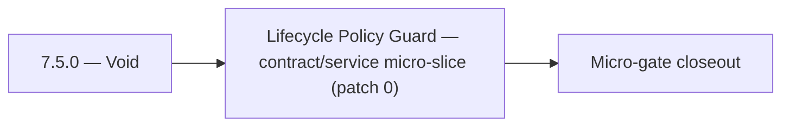

# 7.5.0 — Void

- **Era:** `7.x` deployment — hub [`versions.md`](../versions.md) · minors start at [`7.0 — Deployment era baseline lock`](7.0%20%E2%80%94%20Deployment%20era%20baseline%20lock.md)
- **Minor:** [7.5 — Lifecycle Policy Guard](./7.5 — Lifecycle Policy Guard.md)
- **Codename:** Void
- **Status:** planned

## Focus
Lifecycle Policy Guard — contract/service micro-slice (patch 0)

## Flowchart

## Micro-gate

| Track | Gate question | Answer / Evidence (fill at patch closeout) |
| --- | --- | --- |
| **Contract** | RBAC/authz, audit envelope, tenant isolation — `docs/backend/apis/` + `rbac-authz.md` updated? | Document at patch closeout. |
| **Service** | Handler guards, key rotation, retention hooks — smoke + parity tests documented? | Document smoke paths. |
| **Surface** | Admin/ops governance UI, role-gated flows — delta for this patch? | Document UX delta or N/A. |
| **Frontend** | Dashboard Era 7 deployment patterns (`tenant-security-observability.md`) touched? | Lifecycle policy guard — retention/deletion enforcement. Document at closeout. |
| **Data** | Audit tables, lineage, legal-hold — migrations + `docs/backend/database/`? | Document lineage or N/A. |
| **Ops** | CI/CD gates, drift checks, runbooks (`contact360.io/admin/deploy/...`) — delta? | Document ops delta or N/A. |

## Tasks
### Contract
- 📌 Planned: **[appointment360]** — refine duplicate task (was: 📌 planned: **api**: define v7.5 contract outcomes for lifecy…) | patch `7.5.0` band `0` | reason: specialize this file vs sibling patches; see docs/codebases/appointment360-codebase-analysis.md
- 📌 Planned: **[appointment360]** — refine duplicate task (was: 📌 planned: **admin**: define v7.5 contract outcomes for life…) | patch `7.5.0` band `0` | reason: specialize this file vs sibling patches; see docs/codebases/appointment360-codebase-analysis.md
- 📌 Planned: **[appointment360]** — refine duplicate task (was: 📌 planned: freeze rbac and api key scope for write and expor…) | patch `7.5.0` band `0` | reason: specialize this file vs sibling patches; see docs/codebases/appointment360-codebase-analysis.md
- 📌 Planned: **[appointment360]** — refine duplicate task (was: email risk, company summary, filter parsing: all authenticat…) | patch `7.5.0` band `0` | reason: specialize this file vs sibling patches; see docs/codebases/appointment360-codebase-analysis.md

### Service
- 📌 Planned: **[appointment360]** — refine duplicate task (was: 📌 planned: **api**: deliver v7.5 service outcomes for lifecy…) | patch `7.5.0` band `0` | reason: specialize this file vs sibling patches; see docs/codebases/appointment360-codebase-analysis.md
- 📌 Planned: **[appointment360]** — refine duplicate task (was: 📌 planned: **admin**: deliver v7.5 service outcomes for life…) | patch `7.5.0` band `0` | reason: specialize this file vs sibling patches; see docs/codebases/appointment360-codebase-analysis.md
- 📌 Planned: **[appointment360]** — refine duplicate task (was: 📌 planned: enforce privileged path checks for `batch-upsert`…) | patch `7.5.0` band `0` | reason: specialize this file vs sibling patches; see docs/codebases/appointment360-codebase-analysis.md
- 📌 Planned: **[appointment360]** — refine duplicate task (was: 📌 planned: implement `cascade delete` or scheduled erasure f…) | patch `7.5.0` band `0` | reason: specialize this file vs sibling patches; see docs/codebases/appointment360-codebase-analysis.md

### Surface

- 📌 Planned: **[admin]** — Verify UX for route `/` and bindings (patch 7.5.0 band 0) | area: `frontend-page` | files: `contact360/dashboard/app/page.tsx` | reason: Dashboard/extension surface for era 7 must match gateway contracts

### Data

- 📌 Planned: **[appointment360]** — refine duplicate task (was: 📌 planned: **[appointment360]** — update postgresql/es/s3 li…) | patch `7.5.0` band `0` | reason: specialize this file vs sibling patches; see docs/codebases/appointment360-codebase-analysis.md

### Ops

- 📌 Planned: **[platform]** — Record smoke evidence, rollback, and alerts (patch band 0: charter/P0) | area: `ops` | files: `docs/commands/`, `.github/workflows/` | reason: Smoke, rollback, and observability for patch 7.5.0

## Service task slices
> Merged from era `7.x` deployment task packs (P0→`.0`–`.2`, P1→`.3`–`.6`, Ops→`.7`–`.9`).

### S3Storage
- Define service-to-service auth contract for storage endpoints.
- Define retention/deletion policy contract for object classes.
- Enforce endpoint authz and environment-driven worker routing config.
- Remove static/hardcoded deployment-specific function bindings.
- Ensure retention/deletion operations produce auditable evidence.
- Validate lineage fields for object lifecycle actions.

### contact.ai
- Define RBAC for AI features: which subscription plans / user roles can access:
- Chat (`/api/v1/ai-chats/`): ProUser and above.
- Email risk, company summary, filter parsing: all authenticated users.
- Per-tenant API key contract: replace single global `API_KEY` with per-tenant keys.
- Document chat retention policy: GDPR Article 17 right-to-erasure must cascade to `ai_chats`.
- Lock API versioning: `/api/v1/` is stable; define deprecation policy for future `/api/v2/`.
- Implement feature gate middleware: check user role/plan from JWT context before serving chat routes.
- Implement per-tenant API key store: validate against tenant key table instead of single env var.
- Implement `CASCADE DELETE` or scheduled erasure for `ai_chats` when user account is deleted.
- Emit audit log events (to `logs.api`) on: chat created, chat deleted, message sent, model used.
- Document and test blue-green Lambda deployment process for contact.ai.
- Add audit log schema: `{event: "chat_created|chat_deleted|message_sent", user_id, chat_id, model, timestamp}`.
- Retention policy: document max storage age for `ai_chats` and cleanup schedule.

### Mailvetter
- Versioning policy: `/v1` remains stable; legacy routes officially deprecated.
- Release checklist contract for schema and API compatibility.
- Define audit event contract for verification outcomes and privileged override actions.
- Define retention/deletion policy contract for verification evidence artifacts.
- Separate schema migrations from app startup execution.
- Add startup readiness checks for Redis/Postgres dependencies.
- Ensure worker drain logic without message loss.
- Emit audit events to `logs.api` for verifier write/update/reprocess flows.
- Backup/restore and retention runbooks for `jobs` and `results`.
- Add migration rollback scripts and test evidence.

### emailapis / emailapigo
- Define and freeze era 7.x email endpoint and payload compatibility notes.
- Update endpoint/reference matrix in docs/backend/endpoints/emailapis_endpoint_era_matrix.json.
- Define RBAC requirements for who can invoke email finder/verifier and related bulk operations; map roles using `docs/7. Contact360 deployment/rbac-authz.md`.
- Implement/validate runtime behavior for era 7.x finder, verifier, pattern, and fallback paths.
- Verify auth, provider routing, error envelope, and health diagnostics behavior.
- Ensure gateway-enforced role checks are respected for finder/verifier operations (no privileged behavior based on client-supplied role).
- Emit audit/trace events to `logs.api` for bulk verify operations (include actor identity + trace/correlation ids; do not store raw PII in audit payloads).
- Document email_finder_cache and email_patterns lineage impact for era 7.x.
- Record provider, status, and traceability expectations for this era (what audit fields exist, and how they are correlated).

## Evidence gate
Primary charter artifact created and linked in the parent minor doc
