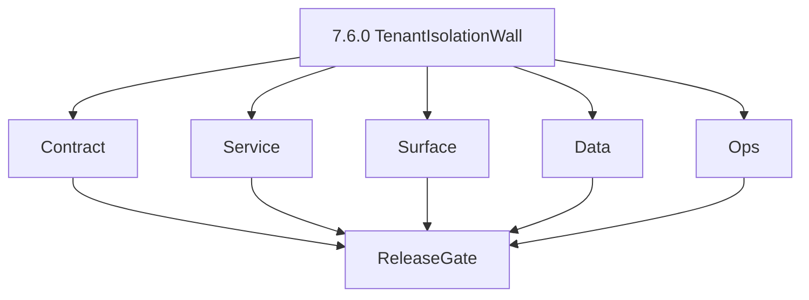
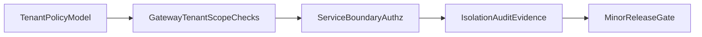

# Version 7.6

- **Status:** ✅ Completed
- **Target window:** TBD
- **Codename:** Tenant Isolation Wall
- **Summary:** Tenant and policy isolation. Cross-service execution pack for this minor across contract, service, surface, data, and ops.
- **Scope:** Validate cross-tenant isolation and policy boundaries end-to-end across gateway, services, storage, logs, and admin surfaces.
- **Roadmap mapping:** `7.6`
- **Owner:** Platform + Security
- **Patch closure:** Every codenamed patch file includes **Micro-gate** + **Service task slices**. Era hub: [`versions.md`](../versions.md).

## Scope

- Target minor: `7.6.0` aligned to roadmap stage 7.6.
- In scope: tenant boundary enforcement, tenant-safe authz, and no-leak failure semantics.
- Exclusions: 8.x partner/public API expansion and ecosystem-level tenant monetization controls.
- Output: actionable per-service task breakdown with isolation test evidence.

## Flowchart

### Runtime focus (unique to this minor)

## Task tracks

### Contract
- ✅ Completed: 📌 Planned: **[appointment360]** — refine duplicate task (was: 📌 planned: **[appointment360]** — refine duplicate task (was…) | patch `7.6.0` band `0` | reason: specialize this file vs sibling patches; see docs/codebases/appointment360-codebase-analysis.md
- ✅ Completed: 📌 Planned: **[appointment360]** — refine duplicate task (was: 📌 planned: **[appointment360]** — refine duplicate task (was…) | patch `7.6.0` band `0` | reason: specialize this file vs sibling patches; see docs/codebases/appointment360-codebase-analysis.md
- ✅ Completed: 📌 Planned: **[appointment360]** — refine duplicate task (was: 📌 planned: **[appointment360]** — refine duplicate task (was…) | patch `7.6.0` band `0` | reason: specialize this file vs sibling patches; see docs/codebases/appointment360-codebase-analysis.md
- ✅ Completed: 📌 Planned: **[appointment360]** — refine duplicate task (was: 📌 planned: **[appointment360]** — refine duplicate task (was…) | patch `7.6.0` band `0` | reason: specialize this file vs sibling patches; see docs/codebases/appointment360-codebase-analysis.md
- ✅ Completed: 📌 Planned: **[appointment360]** — refine duplicate task (was: 📌 planned: **[appointment360]** — refine duplicate task (was…) | patch `7.6.0` band `0` | reason: specialize this file vs sibling patches; see docs/codebases/appointment360-codebase-analysis.md

- ✅ Completed: 📌 Planned: **[appointment360]** — refine duplicate task (was: 📌 planned: **[architecture]** — product **graphql** remains …) | patch `7.6.0` band `0` | reason: specialize this file vs sibling patches; see docs/codebases/appointment360-codebase-analysis.md
### Service
- ✅ Completed: 📌 Planned: **[appointment360]** — refine duplicate task (was: 📌 planned: **[appointment360]** — refine duplicate task (was…) | patch `7.6.0` band `0` | reason: specialize this file vs sibling patches; see docs/codebases/appointment360-codebase-analysis.md
- ✅ Completed: 📌 Planned: **[appointment360]** — refine duplicate task (was: 📌 planned: **[appointment360]** — refine duplicate task (was…) | patch `7.6.0` band `0` | reason: specialize this file vs sibling patches; see docs/codebases/appointment360-codebase-analysis.md
- ✅ Completed: 📌 Planned: **[appointment360]** — refine duplicate task (was: 📌 planned: **[appointment360]** — refine duplicate task (was…) | patch `7.6.0` band `0` | reason: specialize this file vs sibling patches; see docs/codebases/appointment360-codebase-analysis.md

- ✅ Completed: 📌 Planned: **[appointment360]** — refine duplicate task (was: 📌 planned: **[architecture]** — **go/gin satellites** in sco…) | patch `7.6.0` band `0` | reason: specialize this file vs sibling patches; see docs/codebases/appointment360-codebase-analysis.md
### Surface
- ✅ Completed: 📌 Planned: **[appointment360]** — refine duplicate task (was: 📌 planned: **[appointment360]** — refine duplicate task (was…) | patch `7.6.0` band `0` | reason: specialize this file vs sibling patches; see docs/codebases/appointment360-codebase-analysis.md
- ✅ Completed: 📌 Planned: **[appointment360]** — refine duplicate task (was: 📌 planned: **[appointment360]** — refine duplicate task (was…) | patch `7.6.0` band `0` | reason: specialize this file vs sibling patches; see docs/codebases/appointment360-codebase-analysis.md
- ✅ Completed: 📌 Planned: **[appointment360]** — refine duplicate task (was: 📌 planned: **[appointment360]** — refine duplicate task (was…) | patch `7.6.0` band `0` | reason: specialize this file vs sibling patches; see docs/codebases/appointment360-codebase-analysis.md

### Data
- ✅ Completed: 📌 Planned: **[appointment360]** — refine duplicate task (was: 📌 planned: **[appointment360]** — refine duplicate task (was…) | patch `7.6.0` band `0` | reason: specialize this file vs sibling patches; see docs/codebases/appointment360-codebase-analysis.md
- ✅ Completed: 📌 Planned: **[appointment360]** — refine duplicate task (was: 📌 planned: **[appointment360]** — refine duplicate task (was…) | patch `7.6.0` band `0` | reason: specialize this file vs sibling patches; see docs/codebases/appointment360-codebase-analysis.md
- ✅ Completed: 📌 Planned: **[appointment360]** — refine duplicate task (was: 📌 planned: **[appointment360]** — refine duplicate task (was…) | patch `7.6.0` band `0` | reason: specialize this file vs sibling patches; see docs/codebases/appointment360-codebase-analysis.md

- ✅ Completed: 📌 Planned: **[appointment360]** — refine duplicate task (was: 📌 planned: **[architecture]** — **postgresql-first** per `do…) | patch `7.6.0` band `0` | reason: specialize this file vs sibling patches; see docs/codebases/appointment360-codebase-analysis.md
### Ops
- ✅ Completed: 📌 Planned: **[appointment360]** — refine duplicate task (was: 📌 planned: **[appointment360]** — refine duplicate task (was…) | patch `7.6.0` band `0` | reason: specialize this file vs sibling patches; see docs/codebases/appointment360-codebase-analysis.md
- ✅ Completed: 📌 Planned: **[appointment360]** — refine duplicate task (was: 📌 planned: **[appointment360]** — refine duplicate task (was…) | patch `7.6.0` band `0` | reason: specialize this file vs sibling patches; see docs/codebases/appointment360-codebase-analysis.md
- ✅ Completed: 📌 Planned: **[appointment360]** — refine duplicate task (was: 📌 planned: **[appointment360]** — refine duplicate task (was…) | patch `7.6.0` band `0` | reason: specialize this file vs sibling patches; see docs/codebases/appointment360-codebase-analysis.md

- ✅ Completed: 📌 Planned: **[appointment360]** — refine duplicate task (was: 📌 planned: **[architecture]** — **observability**: correlate…) | patch `7.6.0` band `0` | reason: specialize this file vs sibling patches; see docs/codebases/appointment360-codebase-analysis.md
- ✅ Completed: 📌 Planned: **[appointment360]** — refine duplicate task (was: 📌 planned: **[architecture]** — **django docsai** (`contact3…) | patch `7.6.0` band `0` | reason: specialize this file vs sibling patches; see docs/codebases/appointment360-codebase-analysis.md
## Patch ladder (`7.6.0`–`7.6.9`)

| Patch | Codename | Focus |
|---|---|---|
| `7.6.0` | Charter | Freeze tenant isolation contract and boundary tests |
| `7.6.1` | Gateway | Enforce tenant checks in gateway resolvers |
| `7.6.2` | Services | Enforce tenant checks in downstream handlers |
| `7.6.3` | Surface | App/admin tenant-safe UX and messaging |
| `7.6.4` | Data | Tenant-linked lineage and audit fields |
| `7.6.5` | Tenant | Cross-tenant boundary test matrix |
| `7.6.6` | Observability | Tenant-aware trace/log verification |
| `7.6.7` | Hardening | Leak-prevention and edge-case authz hardening |
| `7.6.8` | Evidence | Isolation evidence pack + smoke artifacts |
| `7.6.9` | Gate | Release sign-off and handoff to 7.7 |

## Immediate next execution queue

- 📌 Planned: Validate one end-to-end no-leak scenario per core service.
- 📌 Planned: Add regression tests for IDOR-like resolver patterns.
- 📌 Planned: Verify tenant-safe error payloads and UI messages.

## Cross-service ownership

| Service | Version delivery focus |
|---|---|
| `contact360.io/api` | Tenant-scoped resolver and authz boundaries |
| `contact360.io/sync` | Tenant-safe write/export behavior |
| `contact360.io/jobs` | Tenant-scoped async execution |
| `lambda/logs.api` | Tenant-safe audit query/export |
| `lambda/s3storage` | Tenant-safe storage path policy |

## References

- [docs/roadmap.md](../roadmap.md)
- [docs/versions.md](../versions.md)
- [docs/audit-compliance.md](../audit-compliance.md)
- [docs/7. Contact360 deployment/rbac-authz.md](rbac-authz.md)
- [docs/7. Contact360 deployment/tenant-security-observability.md](tenant-security-observability.md)

## Release gate and evidence

- 📌 Planned: Tenant isolation test pass rate meets target.
- 📌 Planned: No cross-tenant identifiers appear in forbidden paths.
- 📌 Planned: Audit evidence and traceability artifacts attached.

### Micro-gate reference (apply at every `7.N.P`)

| Track | Gate question (must answer Yes or document waiver) |
| --- | --- |
| **Contract** | RBAC/authz, audit envelope, tenant isolation — `docs/backend/apis/` + `rbac-authz.md` + matrices updated? |
| **Service** | Handler guards, key rotation, retention hooks — parity tests + deployment gates documented? |
| **Surface** | Admin/ops governance UI, role-gated flows — operator-visible delta? |
| **Frontend** | Era 7 patterns (`tenant-security-observability.md`, components) — delta? |
| **Data** | Audit tables, lineage, legal-hold — `docs/backend/database/` migrations recorded? |
| **Ops** | CI/CD, drift checks, `contact360.io/admin/deploy/` runbooks — recorded? |
| **Architecture** | Go/Gin satellites only via Python GraphQL gateway (`contact360.io/api`); Next.js `NEXT_PUBLIC_GRAPHQL_URL`; Postgres-first / Redis exit per `docs/docs/data-stores-postgres.md`. |

**Patch ladder:** See codename table below (`.0`–`.9` per minor; minors `7.6`–`7.9` use charter-style codenames).

## Patches

| Patch | Codename | Doc |
| --- | --- | --- |
| `7.6.0` | Charter | [`7.6.0` — Charter](7.6.0 — Charter.md) |
| `7.6.1` | Gateway | [`7.6.1` — Gateway](7.6.1 — Gateway.md) |
| `7.6.2` | Services | [`7.6.2` — Services](7.6.2 — Services.md) |
| `7.6.3` | Surface | [`7.6.3` — Surface](7.6.3 — Surface.md) |
| `7.6.4` | Data | [`7.6.4` — Data](7.6.4 — Data.md) |
| `7.6.5` | Tenant | [`7.6.5` — Tenant](7.6.5 — Tenant.md) |
| `7.6.6` | Observability | [`7.6.6` — Observability](7.6.6 — Observability.md) |
| `7.6.7` | Hardening | [`7.6.7` — Hardening](7.6.7 — Hardening.md) |
| `7.6.8` | Evidence | [`7.6.8` — Evidence](7.6.8 — Evidence.md) |
| `7.6.9` | Gate | [`7.6.9` — Gate](7.6.9 — Gate.md) |

## Release Gate and Evidence

### Master Task Checklist
- 📌 Planned: Track-level closure evidence linked

### Backend API and Endpoints
- 📌 Planned: Endpoint/contract parity verified

### Database and Data Lineage
- 📌 Planned: Migration and lineage references linked

### Frontend UX
- 📌 Planned: UX/route behavior evidence linked

### UI Elements
- 📌 Planned: Components/checklist closeout captured

### Flow and Graph
- 📌 Planned: Runtime graph reflects implementation

### Validation
- 📌 Planned: Smoke/CI/lint checks recorded

### Release Gate
- 📌 Planned: Minor ready for handoff to next minor
