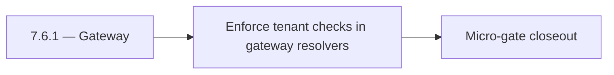

# 7.6.1 — Gateway

- **Era:** `7.x` deployment — hub [`versions.md`](../versions.md) · minors start at [`7.0 — Deployment era baseline lock`](7.0%20%E2%80%94%20Deployment%20era%20baseline%20lock.md)
- **Minor:** [7.6 — Tenant Isolation Wall](./7.6 — Tenant Isolation Wall.md)
- **Codename:** Gateway
- **Status:** ✅ Completed
## Focus
Enforce tenant checks in gateway resolvers

## Flowchart

## Micro-gate

| Track | Gate question | Answer / Evidence (fill at patch closeout) |
| --- | --- | --- |
| **Contract** | RBAC/authz, audit envelope, tenant isolation — `docs/backend/apis/` + `rbac-authz.md` updated? | Document at patch closeout. |
| **Service** | Handler guards, key rotation, retention hooks — smoke + parity tests documented? | Document smoke paths. |
| **Surface** | Admin/ops governance UI, role-gated flows — delta for this patch? | Document UX delta or N/A. |
| **Frontend** | Dashboard Era 7 deployment patterns (`tenant-security-observability.md`) touched? | Tenant isolation wall — boundary tests and deny semantics. Document at closeout. |
| **Data** | Audit tables, lineage, legal-hold — migrations + `docs/backend/database/`? | Document lineage or N/A. |
| **Ops** | CI/CD gates, drift checks, runbooks (`contact360.io/admin/deploy/...`) — delta? | Document ops delta or N/A. |

## Tasks
### Contract
- ✅ Completed: 📌 Planned: **[appointment360]** — refine duplicate task (was: 📌 planned: **api**: enforce tenant-scoped request contracts …) | patch `7.6.1` band `1` | reason: specialize this file vs sibling patches; see docs/codebases/appointment360-codebase-analysis.md
- ✅ Completed: 📌 Planned: **[appointment360]** — refine duplicate task (was: 📌 planned: **sync**: define tenant-safe write/export contrac…) | patch `7.6.1` band `1` | reason: specialize this file vs sibling patches; see docs/codebases/appointment360-codebase-analysis.md
- ✅ Completed: 📌 Planned: **[appointment360]** — refine duplicate task (was: 📌 planned: **jobs**: define tenant-safe async execution cont…) | patch `7.6.1` band `1` | reason: specialize this file vs sibling patches; see docs/codebases/appointment360-codebase-analysis.md
- ✅ Completed: 📌 Planned: **[appointment360]** — refine duplicate task (was: 📌 planned: **s3storage**: define tenant-safe storage/read/wr…) | patch `7.6.1` band `1` | reason: specialize this file vs sibling patches; see docs/codebases/appointment360-codebase-analysis.md
- ✅ Completed: 📌 Planned: **[appointment360]** — refine duplicate task (was: 📌 planned: **logs.api**: define tenant-safe audit query/expo…) | patch `7.6.1` band `1` | reason: specialize this file vs sibling patches; see docs/codebases/appointment360-codebase-analysis.md

### Service
- ✅ Completed: 📌 Planned: **[appointment360]** — refine duplicate task (was: 📌 planned: implement tenant boundary checks on all id-based …) | patch `7.6.1` band `1` | reason: specialize this file vs sibling patches; see docs/codebases/appointment360-codebase-analysis.md
- ✅ Completed: 📌 Planned: **[appointment360]** — refine duplicate task (was: 📌 planned: ensure service-to-service calls preserve tenant c…) | patch `7.6.1` band `1` | reason: specialize this file vs sibling patches; see docs/codebases/appointment360-codebase-analysis.md
- ✅ Completed: 📌 Planned: **[appointment360]** — refine duplicate task (was: 📌 planned: harden failure paths so unauthorized or wrong-ten…) | patch `7.6.1` band `1` | reason: specialize this file vs sibling patches; see docs/codebases/appointment360-codebase-analysis.md

### Surface
- ✅ Completed: 📌 Planned: **[appointment360]** — refine duplicate task (was: 📌 planned: **app/admin**: role + tenant gating on pages/tabs…) | patch `7.6.1` band `1` | reason: specialize this file vs sibling patches; see docs/codebases/appointment360-codebase-analysis.md
- ✅ Completed: 📌 Planned: **[appointment360]** — refine duplicate task (was: 📌 planned: ensure error states and empty states are tenant-s…) | patch `7.6.1` band `1` | reason: specialize this file vs sibling patches; see docs/codebases/appointment360-codebase-analysis.md
- ✅ Completed: 📌 Planned: **[appointment360]** — refine duplicate task (was: 📌 planned: validate filters/search do not leak foreign tenan…) | patch `7.6.1` band `1` | reason: specialize this file vs sibling patches; see docs/codebases/appointment360-codebase-analysis.md

### Data
- ✅ Completed: 📌 Planned: **[appointment360]** — refine duplicate task (was: 📌 planned: persist tenant-linked lineage keys across gateway…) | patch `7.6.1` band `1` | reason: specialize this file vs sibling patches; see docs/codebases/appointment360-codebase-analysis.md
- ✅ Completed: 📌 Planned: **[appointment360]** — refine duplicate task (was: 📌 planned: ensure deletion/retention actions remain tenant-s…) | patch `7.6.1` band `1` | reason: specialize this file vs sibling patches; see docs/codebases/appointment360-codebase-analysis.md
- ✅ Completed: 📌 Planned: **[appointment360]** — refine duplicate task (was: 📌 planned: confirm audit events include tenant + actor + tra…) | patch `7.6.1` band `1` | reason: specialize this file vs sibling patches; see docs/codebases/appointment360-codebase-analysis.md

### Ops
- ✅ Completed: 📌 Planned: **[appointment360]** — refine duplicate task (was: 📌 planned: run cross-tenant test matrix (positive + negative…) | patch `7.6.1` band `1` | reason: specialize this file vs sibling patches; see docs/codebases/appointment360-codebase-analysis.md
- ✅ Completed: 📌 Planned: **[appointment360]** — refine duplicate task (was: 📌 planned: capture rollback notes for isolation regressions.) | patch `7.6.1` band `1` | reason: specialize this file vs sibling patches; see docs/codebases/appointment360-codebase-analysis.md
- ✅ Completed: 📌 Planned: **[appointment360]** — refine duplicate task (was: 📌 planned: publish isolation evidence bundle for release sig…) | patch `7.6.1` band `1` | reason: specialize this file vs sibling patches; see docs/codebases/appointment360-codebase-analysis.md

## Service task slices
> Merged from era `7.x` deployment task packs (P0→`.0`–`.2`, P1→`.3`–`.6`, Ops→`.7`–`.9`).

### Connectra
- Freeze RBAC and API key scope for write and export endpoints.
- Define tenant-safe request/response and failure semantics for privileged paths.
- Enforce privileged path checks for `batch-upsert`, job creation, and filter mutations.
- Ensure handler-level authz mirrors gateway role checks (no role bypass).
- Record audit events for sensitive writes and mapping/schema changes.
- Validate lineage fields: actor, tenant, trace id, and action outcome.

### Appointment360 (gateway)
- Finalize environment variable naming convention across all .env.* files
- Document EC2 vs Lambda execution differences in README.md
- Define /health readiness contract for load balancer health checks
- Define resolver-level RBAC contract using rbac-authz.md role model (admin, member, read_only)
- Validate Mangum handler Lambda cold-start time is < 3s
- Add lifespan event handler (FastAPI lifespan=) for DB engine startup/shutdown
- Configure trusted_hosts for production ALB host
- Configure CORS_ORIGINS whitelist for production dashboard domain
- Add health check-based deployment gate: Lambda alias swap only when /health/db passes
- Add --reload=false for uvicorn production command
- Enforce resolver and handler authz for privileged gateway mutations (no client-supplied role trust)
- Emit audit evidence to logs.api for governance-sensitive mutations with actor + tenant + trace id
- Dashboard environment detection: use NEXT_PUBLIC_GRAPHQL_URL per deploy environment
- Ensure Alembic migration history is clean before production deploy
- Create DB backup procedure before every migration
- Write Dockerfile with multi-stage build: pip install → copy app → CMD uvicorn
- Write docker-compose.yml for local dev: app + postgres + redis
- Add GitHub Actions CI: lint (flake8/ruff), type-check (mypy), test (pytest)
- Set ENVIRONMENT=production guard: disable DEBUG=true, GraphiQL, introspection

### Salesnavigator
- Define role-based access for SN ingestion:
- `admin`: bulk save, access to ingestion history
- `member`: save own profiles (up to N per day)
- `read_only`: no save access
- Define scoped service key contract: per-environment key (dev/staging/prod) replacing single global key
- Define immutable audit event schema: `{event: sn_save, user_id, org_id, profiles_submitted, saved_count, failed_count, session_id, timestamp, source_ip}`
- Define GDPR right-to-erasure cascade: SN-sourced contact deletion → Connectra delete by UUID
- Replace single global `API_KEY` with per-environment/per-tenant scoped keys
- Emit immutable audit event on each `save-profiles` call (event bus or PostgreSQL audit log)
- Implement RBAC check on `save-profiles`: validate role from `X-User-Role` or token claims
- Add `org_id` to Connectra contact metadata for tenant isolation
- Immutable audit event per save session: written to `audit_events` table or event bus
- GDPR: SN contact provenance tracked in Connectra (`source=sales_navigator`, `lead_id`, `search_id`) for selective erasure
- Data retention: define retention policy for SN-sourced contacts (default: follow org retention settings)

### contact.ai
- Define RBAC for AI features: which subscription plans / user roles can access:
- Chat (`/api/v1/ai-chats/`): ProUser and above.
- Email risk, company summary, filter parsing: all authenticated users.
- Per-tenant API key contract: replace single global `API_KEY` with per-tenant keys.
- Document chat retention policy: GDPR Article 17 right-to-erasure must cascade to `ai_chats`.
- Lock API versioning: `/api/v1/` is stable; define deprecation policy for future `/api/v2/`.
- Implement feature gate middleware: check user role/plan from JWT context before serving chat routes.
- Implement per-tenant API key store: validate against tenant key table instead of single env var.
- Implement `CASCADE DELETE` or scheduled erasure for `ai_chats` when user account is deleted.
- Emit audit log events (to `logs.api`) on: chat created, chat deleted, message sent, model used.
- Document and test blue-green Lambda deployment process for contact.ai.
- Add audit log schema: `{event: "chat_created|chat_deleted|message_sent", user_id, chat_id, model, timestamp}`.
- Retention policy: document max storage age for `ai_chats` and cleanup schedule.

## Evidence gate
Patch closeout includes contract diff, smoke output, data lineage delta, and ops note
