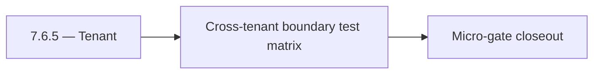

# 7.6.5 — Tenant

- **Era:** `7.x` deployment — hub [`versions.md`](../versions.md) · minors start at [`7.0 — Deployment era baseline lock`](7.0%20%E2%80%94%20Deployment%20era%20baseline%20lock.md)
- **Minor:** [7.6 — Tenant Isolation Wall](./7.6 — Tenant Isolation Wall.md)
- **Codename:** Tenant
- **Status:** ✅ Completed
## Focus
Cross-tenant boundary test matrix

## Flowchart

## Micro-gate

| Track | Gate question | Answer / Evidence (fill at patch closeout) |
| --- | --- | --- |
| **Contract** | RBAC/authz, audit envelope, tenant isolation — `docs/backend/apis/` + `rbac-authz.md` updated? | Document at patch closeout. |
| **Service** | Handler guards, key rotation, retention hooks — smoke + parity tests documented? | Document smoke paths. |
| **Surface** | Admin/ops governance UI, role-gated flows — delta for this patch? | Document UX delta or N/A. |
| **Frontend** | Dashboard Era 7 deployment patterns (`tenant-security-observability.md`) touched? | Tenant isolation wall — boundary tests and deny semantics. Document at closeout. |
| **Data** | Audit tables, lineage, legal-hold — migrations + `docs/backend/database/`? | Document lineage or N/A. |
| **Ops** | CI/CD gates, drift checks, runbooks (`contact360.io/admin/deploy/...`) — delta? | Document ops delta or N/A. |

## Tasks
### Contract
- ✅ Completed: 📌 Planned: **[appointment360]** — refine duplicate task (was: 📌 planned: **api**: enforce tenant-scoped request contracts …) | patch `7.6.5` band `5` | reason: specialize this file vs sibling patches; see docs/codebases/appointment360-codebase-analysis.md
- ✅ Completed: 📌 Planned: **[appointment360]** — refine duplicate task (was: 📌 planned: **sync**: define tenant-safe write/export contrac…) | patch `7.6.5` band `5` | reason: specialize this file vs sibling patches; see docs/codebases/appointment360-codebase-analysis.md
- ✅ Completed: 📌 Planned: **[appointment360]** — refine duplicate task (was: 📌 planned: **jobs**: define tenant-safe async execution cont…) | patch `7.6.5` band `5` | reason: specialize this file vs sibling patches; see docs/codebases/appointment360-codebase-analysis.md
- ✅ Completed: 📌 Planned: **[appointment360]** — refine duplicate task (was: 📌 planned: **s3storage**: define tenant-safe storage/read/wr…) | patch `7.6.5` band `5` | reason: specialize this file vs sibling patches; see docs/codebases/appointment360-codebase-analysis.md
- ✅ Completed: 📌 Planned: **[appointment360]** — refine duplicate task (was: 📌 planned: **logs.api**: define tenant-safe audit query/expo…) | patch `7.6.5` band `5` | reason: specialize this file vs sibling patches; see docs/codebases/appointment360-codebase-analysis.md

### Service
- ✅ Completed: 📌 Planned: **[appointment360]** — refine duplicate task (was: 📌 planned: implement tenant boundary checks on all id-based …) | patch `7.6.5` band `5` | reason: specialize this file vs sibling patches; see docs/codebases/appointment360-codebase-analysis.md
- ✅ Completed: 📌 Planned: **[appointment360]** — refine duplicate task (was: 📌 planned: ensure service-to-service calls preserve tenant c…) | patch `7.6.5` band `5` | reason: specialize this file vs sibling patches; see docs/codebases/appointment360-codebase-analysis.md
- ✅ Completed: 📌 Planned: **[appointment360]** — refine duplicate task (was: 📌 planned: harden failure paths so unauthorized or wrong-ten…) | patch `7.6.5` band `5` | reason: specialize this file vs sibling patches; see docs/codebases/appointment360-codebase-analysis.md

### Surface
- ✅ Completed: 📌 Planned: **[appointment360]** — refine duplicate task (was: 📌 planned: **app/admin**: role + tenant gating on pages/tabs…) | patch `7.6.5` band `5` | reason: specialize this file vs sibling patches; see docs/codebases/appointment360-codebase-analysis.md
- ✅ Completed: 📌 Planned: **[appointment360]** — refine duplicate task (was: 📌 planned: ensure error states and empty states are tenant-s…) | patch `7.6.5` band `5` | reason: specialize this file vs sibling patches; see docs/codebases/appointment360-codebase-analysis.md
- ✅ Completed: 📌 Planned: **[appointment360]** — refine duplicate task (was: 📌 planned: validate filters/search do not leak foreign tenan…) | patch `7.6.5` band `5` | reason: specialize this file vs sibling patches; see docs/codebases/appointment360-codebase-analysis.md

### Data
- ✅ Completed: 📌 Planned: **[appointment360]** — refine duplicate task (was: 📌 planned: persist tenant-linked lineage keys across gateway…) | patch `7.6.5` band `5` | reason: specialize this file vs sibling patches; see docs/codebases/appointment360-codebase-analysis.md
- ✅ Completed: 📌 Planned: **[appointment360]** — refine duplicate task (was: 📌 planned: ensure deletion/retention actions remain tenant-s…) | patch `7.6.5` band `5` | reason: specialize this file vs sibling patches; see docs/codebases/appointment360-codebase-analysis.md
- ✅ Completed: 📌 Planned: **[appointment360]** — refine duplicate task (was: 📌 planned: confirm audit events include tenant + actor + tra…) | patch `7.6.5` band `5` | reason: specialize this file vs sibling patches; see docs/codebases/appointment360-codebase-analysis.md

### Ops
- ✅ Completed: 📌 Planned: **[appointment360]** — refine duplicate task (was: 📌 planned: run cross-tenant test matrix (positive + negative…) | patch `7.6.5` band `5` | reason: specialize this file vs sibling patches; see docs/codebases/appointment360-codebase-analysis.md
- ✅ Completed: 📌 Planned: **[appointment360]** — refine duplicate task (was: 📌 planned: capture rollback notes for isolation regressions.) | patch `7.6.5` band `5` | reason: specialize this file vs sibling patches; see docs/codebases/appointment360-codebase-analysis.md
- ✅ Completed: 📌 Planned: **[appointment360]** — refine duplicate task (was: 📌 planned: publish isolation evidence bundle for release sig…) | patch `7.6.5` band `5` | reason: specialize this file vs sibling patches; see docs/codebases/appointment360-codebase-analysis.md

## Service task slices
> Merged from era `7.x` deployment task packs (P0→`.0`–`.2`, P1→`.3`–`.6`, Ops→`.7`–`.9`).

### Connectra
- Document role-gated admin/app controls tied to Connectra privileged actions.
- Validate tenant-safe user messaging for deny/error/retry flows.
- Record audit events for sensitive writes and mapping/schema changes.
- Validate lineage fields: actor, tenant, trace id, and action outcome.
- Enforce privileged path checks for `batch-upsert`, job creation, and filter mutations.
- Ensure handler-level authz mirrors gateway role checks (no role bypass).

### Appointment360 (gateway)
- Specify Mangum Lambda event format and response envelope
- Add graceful shutdown: complete in-flight requests before exit
- Configure Alembic to run migrations as separate Lambda invoke / ECS task (not at startup)
- Extension builds point to prod GraphQL endpoint (wss:// for subscription readiness)
- Dashboard graceful degradation when gateway is unreachable (network error boundary)
- Add table index review for all high-frequency query patterns
- Add GitHub Actions CD: build Docker → push ECR → deploy Lambda / EC2
- Create Terraform / CDK module for appointment360 Lambda + ALB + RDS
- Add CloudWatch alarm: Lambda invocation errors > 1% in 5 min
- Document rollback procedure: previous Lambda version alias swap

### Salesnavigator
- Role-gated save actions: `SNSaveButton` disabled for `read_only`; `member` follows quota and `admin` has full access.
- Admin-only: bulk export / full SN session history visible only to admin
- Audit log view: `/settings/audit-log` shows SN save events with actor, count, timestamp
- GDPR delete request: SN-sourced contacts eligible for erasure via Connectra cascade
- Immutable audit event per save session: written to `audit_events` table or event bus
- GDPR: SN contact provenance tracked in Connectra (`source=sales_navigator`, `lead_id`, `search_id`) for selective erasure
- Data retention: define retention policy for SN-sourced contacts (default: follow org retention settings)
- Blue-green deploy: confirm SAM `--no-fail-on-empty-changeset` allows zero-downtime swap
- Replace single global `API_KEY` with per-environment/per-tenant scoped keys
- Emit immutable audit event on each `save-profiles` call (event bus or PostgreSQL audit log)
- Implement RBAC check on `save-profiles`: validate role from `X-User-Role` or token claims
- Add `org_id` to Connectra contact metadata for tenant isolation

### contact.ai
- Implement role-gated AI features in dashboard: show/hide AI chat based on user plan.
- Feature flag: `ENABLE_AI_CHAT` per user plan; disabled → show upgrade prompt instead of chat page.
- Admin panel: show AI usage summary per user (chat count, message count, model usage).
- Add audit log schema: `{event: "chat_created|chat_deleted|message_sent", user_id, chat_id, model, timestamp}`.
- Retention policy: document max storage age for `ai_chats` and cleanup schedule.
- Add `7.x` lineage note to `contact_ai_data_lineage.md`: GDPR erasure cascade.
- Implement feature gate middleware: check user role/plan from JWT context before serving chat routes.
- Implement per-tenant API key store: validate against tenant key table instead of single env var.
- Implement `CASCADE DELETE` or scheduled erasure for `ai_chats` when user account is deleted.
- Emit audit log events (to `logs.api`) on: chat created, chat deleted, message sent, model used.
- Document and test blue-green Lambda deployment process for contact.ai.

## Evidence gate
Patch closeout includes contract diff, smoke output, data lineage delta, and ops note
