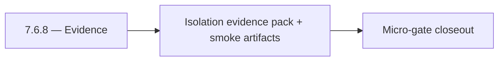

# 7.6.8 — Evidence

- **Era:** `7.x` deployment — hub [`versions.md`](../versions.md) · minors start at [`7.0 — Deployment era baseline lock`](7.0%20%E2%80%94%20Deployment%20era%20baseline%20lock.md)
- **Minor:** [7.6 — Tenant Isolation Wall](./7.6 — Tenant Isolation Wall.md)
- **Codename:** Evidence
- **Status:** planned

## Focus
Isolation evidence pack + smoke artifacts

## Flowchart

## Micro-gate

| Track | Gate question | Answer / Evidence (fill at patch closeout) |
| --- | --- | --- |
| **Contract** | RBAC/authz, audit envelope, tenant isolation — `docs/backend/apis/` + `rbac-authz.md` updated? | Document at patch closeout. |
| **Service** | Handler guards, key rotation, retention hooks — smoke + parity tests documented? | Document smoke paths. |
| **Surface** | Admin/ops governance UI, role-gated flows — delta for this patch? | Document UX delta or N/A. |
| **Frontend** | Dashboard Era 7 deployment patterns (`tenant-security-observability.md`) touched? | Tenant isolation wall — boundary tests and deny semantics. Document at closeout. |
| **Data** | Audit tables, lineage, legal-hold — migrations + `docs/backend/database/`? | Document lineage or N/A. |
| **Ops** | CI/CD gates, drift checks, runbooks (`contact360.io/admin/deploy/...`) — delta? | Document ops delta or N/A. |

## Tasks
### Contract
- 📌 Planned: **[appointment360]** — refine duplicate task (was: 📌 planned: **api**: enforce tenant-scoped request contracts …) | patch `7.6.8` band `8` | reason: specialize this file vs sibling patches; see docs/codebases/appointment360-codebase-analysis.md
- 📌 Planned: **[appointment360]** — refine duplicate task (was: 📌 planned: **sync**: define tenant-safe write/export contrac…) | patch `7.6.8` band `8` | reason: specialize this file vs sibling patches; see docs/codebases/appointment360-codebase-analysis.md
- 📌 Planned: **[appointment360]** — refine duplicate task (was: 📌 planned: **jobs**: define tenant-safe async execution cont…) | patch `7.6.8` band `8` | reason: specialize this file vs sibling patches; see docs/codebases/appointment360-codebase-analysis.md
- 📌 Planned: **[appointment360]** — refine duplicate task (was: 📌 planned: **s3storage**: define tenant-safe storage/read/wr…) | patch `7.6.8` band `8` | reason: specialize this file vs sibling patches; see docs/codebases/appointment360-codebase-analysis.md
- 📌 Planned: **[appointment360]** — refine duplicate task (was: 📌 planned: **logs.api**: define tenant-safe audit query/expo…) | patch `7.6.8` band `8` | reason: specialize this file vs sibling patches; see docs/codebases/appointment360-codebase-analysis.md

### Service
- 📌 Planned: **[appointment360]** — refine duplicate task (was: 📌 planned: implement tenant boundary checks on all id-based …) | patch `7.6.8` band `8` | reason: specialize this file vs sibling patches; see docs/codebases/appointment360-codebase-analysis.md
- 📌 Planned: **[appointment360]** — refine duplicate task (was: 📌 planned: ensure service-to-service calls preserve tenant c…) | patch `7.6.8` band `8` | reason: specialize this file vs sibling patches; see docs/codebases/appointment360-codebase-analysis.md
- 📌 Planned: **[appointment360]** — refine duplicate task (was: 📌 planned: harden failure paths so unauthorized or wrong-ten…) | patch `7.6.8` band `8` | reason: specialize this file vs sibling patches; see docs/codebases/appointment360-codebase-analysis.md

### Surface
- 📌 Planned: **[appointment360]** — refine duplicate task (was: 📌 planned: **app/admin**: role + tenant gating on pages/tabs…) | patch `7.6.8` band `8` | reason: specialize this file vs sibling patches; see docs/codebases/appointment360-codebase-analysis.md
- 📌 Planned: **[appointment360]** — refine duplicate task (was: 📌 planned: ensure error states and empty states are tenant-s…) | patch `7.6.8` band `8` | reason: specialize this file vs sibling patches; see docs/codebases/appointment360-codebase-analysis.md
- 📌 Planned: **[appointment360]** — refine duplicate task (was: 📌 planned: validate filters/search do not leak foreign tenan…) | patch `7.6.8` band `8` | reason: specialize this file vs sibling patches; see docs/codebases/appointment360-codebase-analysis.md

### Data
- 📌 Planned: **[appointment360]** — refine duplicate task (was: 📌 planned: persist tenant-linked lineage keys across gateway…) | patch `7.6.8` band `8` | reason: specialize this file vs sibling patches; see docs/codebases/appointment360-codebase-analysis.md
- 📌 Planned: **[appointment360]** — refine duplicate task (was: 📌 planned: ensure deletion/retention actions remain tenant-s…) | patch `7.6.8` band `8` | reason: specialize this file vs sibling patches; see docs/codebases/appointment360-codebase-analysis.md
- 📌 Planned: **[appointment360]** — refine duplicate task (was: 📌 planned: confirm audit events include tenant + actor + tra…) | patch `7.6.8` band `8` | reason: specialize this file vs sibling patches; see docs/codebases/appointment360-codebase-analysis.md

### Ops
- 📌 Planned: **[appointment360]** — refine duplicate task (was: 📌 planned: run cross-tenant test matrix (positive + negative…) | patch `7.6.8` band `8` | reason: specialize this file vs sibling patches; see docs/codebases/appointment360-codebase-analysis.md
- 📌 Planned: **[appointment360]** — refine duplicate task (was: 📌 planned: capture rollback notes for isolation regressions.) | patch `7.6.8` band `8` | reason: specialize this file vs sibling patches; see docs/codebases/appointment360-codebase-analysis.md
- 📌 Planned: **[appointment360]** — refine duplicate task (was: 📌 planned: publish isolation evidence bundle for release sig…) | patch `7.6.8` band `8` | reason: specialize this file vs sibling patches; see docs/codebases/appointment360-codebase-analysis.md

## Service task slices
> Merged from era `7.x` deployment task packs (P0→`.0`–`.2`, P1→`.3`–`.6`, Ops→`.7`–`.9`).

### Connectra
- Validate tenant isolation on all query/write paths through gateway + Connectra.
- Publish release gate evidence: security checklist, authz tests, and retention/audit proof.

### Appointment360 (gateway)
- Create Terraform / CDK module for appointment360 Lambda + ALB + RDS
- Add CloudWatch alarm: Lambda invocation errors > 1% in 5 min
- Document rollback procedure: previous Lambda version alias swap

### Salesnavigator
- Blue-green Lambda deployment via SAM alias + traffic shifting
- Canary: 10% traffic to new version → validate CloudWatch metrics before 100% shift
- Environment-specific `template.yaml` param overrides for staging vs. production
- Secret rotation schedule: `API_KEY`, `CONNECTRA_API_KEY` rotated quarterly
- Runbook: procedure for emergency key rotation without downtime
- `docs/codebases/salesnavigator-codebase-analysis.md`
- `docs/backend/apis/SALESNAVIGATOR_ERA_TASK_PACKS.md`
- `docs/governance.md`
- `docs/audit-compliance.md`

### contact.ai
- Blue-green Lambda deployment: deploy new version, run smoke tests, shift traffic.
- Canary rollout for model version updates: 10% traffic to new model before full rollout.
- Secret rotation: per-tenant API keys with automated rotation policy.
- Add `contact.ai` to deployment checklist with health probe validation step.
- Post-deployment smoke test: `GET /health`, `GET /health/db`, `POST /api/v1/ai/email/analyze` with test email.

## Evidence gate
Patch closeout includes contract diff, smoke output, data lineage delta, and ops note
