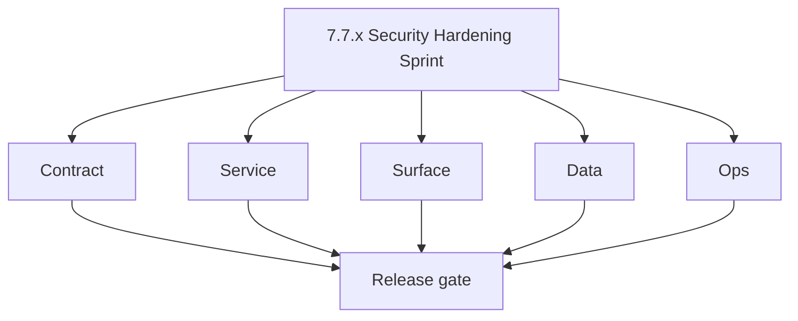

# Version 7.7

- **Status:** ✅ Completed
- **Target window:** TBD
- **Codename:** Security Hardening Sprint
- **Summary:** Security posture hardening for deployment era services.
- **Scope:** Secret rotation, CORS hardening, debug/unsafe mode shutdown, privileged controls and security runbooks.
- **Roadmap mapping:** `7.7`
- **Owner:** Security + Platform

## Task tracks

### Contract
- ✅ Completed: 📌 Planned: **[appointment360]** — refine duplicate task (was: 📌 planned: freeze secure defaults for auth, cors, and privil…) | patch `7.7.0` band `0` | reason: specialize this file vs sibling patches; see docs/codebases/appointment360-codebase-analysis.md
- ✅ Completed: 📌 Planned: **[appointment360]** — refine duplicate task (was: 📌 planned: document secret/key rotation contracts and rollba…) | patch `7.7.0` band `0` | reason: specialize this file vs sibling patches; see docs/codebases/appointment360-codebase-analysis.md

### Service
- ✅ Completed: 📌 Planned: **[appointment360]** — refine duplicate task (was: 📌 planned: disable insecure debug paths in production profil…) | patch `7.7.0` band `0` | reason: specialize this file vs sibling patches; see docs/codebases/appointment360-codebase-analysis.md
- ✅ Completed: 📌 Planned: **[appointment360]** — refine duplicate task (was: 📌 planned: harden privileged action handlers with explicit r…) | patch `7.7.0` band `0` | reason: specialize this file vs sibling patches; see docs/codebases/appointment360-codebase-analysis.md
- ✅ Completed: 📌 Planned: **[appointment360]** — refine duplicate task (was: 📌 planned: enforce strict origin/method/header cors allowlis…) | patch `7.7.0` band `0` | reason: specialize this file vs sibling patches; see docs/codebases/appointment360-codebase-analysis.md

### Surface
- ✅ Completed: 📌 Planned: **[appointment360]** — refine duplicate task (was: 📌 planned: ensure admin/app surfaces expose only role-author…) | patch `7.7.0` band `0` | reason: specialize this file vs sibling patches; see docs/codebases/appointment360-codebase-analysis.md
- ✅ Completed: 📌 Planned: **[appointment360]** — refine duplicate task (was: 📌 planned: add clear ux for security-related denials and act…) | patch `7.7.0` band `0` | reason: specialize this file vs sibling patches; see docs/codebases/appointment360-codebase-analysis.md

### Data
- ✅ Completed: 📌 Planned: **[appointment360]** — refine duplicate task (was: 📌 planned: ensure security/audit events are immutable and tr…) | patch `7.7.0` band `0` | reason: specialize this file vs sibling patches; see docs/codebases/appointment360-codebase-analysis.md
- ✅ Completed: 📌 Planned: **[appointment360]** — refine duplicate task (was: 📌 planned: validate sensitive fields are redacted in logs an…) | patch `7.7.0` band `0` | reason: specialize this file vs sibling patches; see docs/codebases/appointment360-codebase-analysis.md

### Ops
- ✅ Completed: 📌 Planned: **[appointment360]** — refine duplicate task (was: 📌 planned: run secret rotation drill and verify service cont…) | patch `7.7.0` band `0` | reason: specialize this file vs sibling patches; see docs/codebases/appointment360-codebase-analysis.md
- ✅ Completed: 📌 Planned: **[appointment360]** — refine duplicate task (was: 📌 planned: validate security baseline checklist across all 7…) | patch `7.7.0` band `0` | reason: specialize this file vs sibling patches; see docs/codebases/appointment360-codebase-analysis.md
- ✅ Completed: 📌 Planned: **[appointment360]** — refine duplicate task (was: 📌 planned: publish hardened deployment runbook updates.) | patch `7.7.0` band `0` | reason: specialize this file vs sibling patches; see docs/codebases/appointment360-codebase-analysis.md

## Patch ladder (`7.7.0`–`7.7.9`)

| Patch | Codename | Focus |
|---|---|---|
| `7.7.0` | Charter | Security baseline freeze |
| `7.7.1` | Secrets | Key/secret rotation path |
| `7.7.2` | CORS | Strict CORS and network hardening |
| `7.7.3` | Debug | Disable debug/unsafe runtime paths |
| `7.7.4` | Privilege | Harden privileged controls |
| `7.7.5` | Audit | Security event integrity |
| `7.7.6` | Surface | Security-aware UX messaging |
| `7.7.7` | Resilience | Incident and rollback readiness |
| `7.7.8` | Evidence | Security test and runbook artifacts |
| `7.7.9` | Gate | Release sign-off to 7.8 |

## References

- [docs/7. Contact360 deployment/tenant-security-observability.md](tenant-security-observability.md)
- [docs/7. Contact360 deployment/rbac-authz.md](rbac-authz.md)
- [docs/version-policy.md](../version-policy.md)

### Micro-gate reference (apply at every `7.N.P`)

| Track | Gate question (must answer Yes or document waiver) |
| --- | --- |
| **Contract** | RBAC/authz, audit envelope, tenant isolation — `docs/backend/apis/` + `rbac-authz.md` + matrices updated? |
| **Service** | Handler guards, key rotation, retention hooks — parity tests + deployment gates documented? |
| **Surface** | Admin/ops governance UI, role-gated flows — operator-visible delta? |
| **Frontend** | Era 7 patterns (`tenant-security-observability.md`, components) — delta? |
| **Data** | Audit tables, lineage, legal-hold — `docs/backend/database/` migrations recorded? |
| **Ops** | CI/CD, drift checks, `contact360.io/admin/deploy/` runbooks — recorded? |

**Patch ladder:** See codename table below (`.0`–`.9` per minor; minors `7.6`–`7.9` use charter-style codenames).

## Patches

| Patch | Codename | Doc |
| --- | --- | --- |
| `7.7.0` | Charter | [`7.7.0` — Charter](7.7.0 — Charter.md) |
| `7.7.1` | Secrets | [`7.7.1` — Secrets](7.7.1 — Secrets.md) |
| `7.7.2` | CORS | [`7.7.2` — CORS](7.7.2 — CORS.md) |
| `7.7.3` | Debug | [`7.7.3` — Debug](7.7.3 — Debug.md) |
| `7.7.4` | Privilege | [`7.7.4` — Privilege](7.7.4 — Privilege.md) |
| `7.7.5` | Audit | [`7.7.5` — Audit](7.7.5 — Audit.md) |
| `7.7.6` | Surface | [`7.7.6` — Surface](7.7.6 — Surface.md) |
| `7.7.7` | Resilience | [`7.7.7` — Resilience](7.7.7 — Resilience.md) |
| `7.7.8` | Evidence | [`7.7.8` — Evidence](7.7.8 — Evidence.md) |
| `7.7.9` | Gate | [`7.7.9` — Gate](7.7.9 — Gate.md) |

## Flowchart

## Release Gate and Evidence

### Master Task Checklist
- 📌 Planned: Track-level closure evidence linked

### Backend API and Endpoints
- 📌 Planned: Endpoint/contract parity verified

### Database and Data Lineage
- 📌 Planned: Migration and lineage references linked

### Frontend UX
- 📌 Planned: UX/route behavior evidence linked

### UI Elements
- 📌 Planned: Components/checklist closeout captured

### Flow and Graph
- 📌 Planned: Runtime graph reflects implementation

### Validation
- 📌 Planned: Smoke/CI/lint checks recorded

### Release Gate
- 📌 Planned: Minor ready for handoff to next minor
