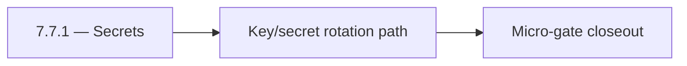

# 7.7.1 — Secrets

- **Era:** `7.x` deployment — hub [`versions.md`](../versions.md) · minors start at [`7.0 — Deployment era baseline lock`](7.0%20%E2%80%94%20Deployment%20era%20baseline%20lock.md)
- **Minor:** [7.7 — Security Hardening Sprint](./7.7 — Security Hardening Sprint.md)
- **Codename:** Secrets
- **Status:** planned

## Focus
Key/secret rotation path

## Flowchart

## Micro-gate

| Track | Gate question | Answer / Evidence (fill at patch closeout) |
| --- | --- | --- |
| **Contract** | RBAC/authz, audit envelope, tenant isolation — `docs/backend/apis/` + `rbac-authz.md` updated? | Document at patch closeout. |
| **Service** | Handler guards, key rotation, retention hooks — smoke + parity tests documented? | Document smoke paths. |
| **Surface** | Admin/ops governance UI, role-gated flows — delta for this patch? | Document UX delta or N/A. |
| **Frontend** | Dashboard Era 7 deployment patterns (`tenant-security-observability.md`) touched? | Security hardening sprint — secrets, CORS, privilege paths. Document at closeout. |
| **Data** | Audit tables, lineage, legal-hold — migrations + `docs/backend/database/`? | Document lineage or N/A. |
| **Ops** | CI/CD gates, drift checks, runbooks (`contact360.io/admin/deploy/...`) — delta? | Document ops delta or N/A. |

## Tasks
### Contract
- 📌 Planned: **[appointment360]** — refine duplicate task (was: 📌 planned: freeze secure defaults for auth, cors, and privil…) | patch `7.7.1` band `1` | reason: specialize this file vs sibling patches; see docs/codebases/appointment360-codebase-analysis.md
- 📌 Planned: **[appointment360]** — refine duplicate task (was: 📌 planned: document secret/key rotation contracts and rollba…) | patch `7.7.1` band `1` | reason: specialize this file vs sibling patches; see docs/codebases/appointment360-codebase-analysis.md

### Service
- 📌 Planned: **[appointment360]** — refine duplicate task (was: 📌 planned: disable insecure debug paths in production profil…) | patch `7.7.1` band `1` | reason: specialize this file vs sibling patches; see docs/codebases/appointment360-codebase-analysis.md
- 📌 Planned: **[appointment360]** — refine duplicate task (was: 📌 planned: harden privileged action handlers with explicit r…) | patch `7.7.1` band `1` | reason: specialize this file vs sibling patches; see docs/codebases/appointment360-codebase-analysis.md
- 📌 Planned: **[appointment360]** — refine duplicate task (was: 📌 planned: enforce strict origin/method/header cors allowlis…) | patch `7.7.1` band `1` | reason: specialize this file vs sibling patches; see docs/codebases/appointment360-codebase-analysis.md

### Surface
- 📌 Planned: **[appointment360]** — refine duplicate task (was: 📌 planned: ensure admin/app surfaces expose only role-author…) | patch `7.7.1` band `1` | reason: specialize this file vs sibling patches; see docs/codebases/appointment360-codebase-analysis.md
- 📌 Planned: **[appointment360]** — refine duplicate task (was: 📌 planned: add clear ux for security-related denials and act…) | patch `7.7.1` band `1` | reason: specialize this file vs sibling patches; see docs/codebases/appointment360-codebase-analysis.md

### Data
- 📌 Planned: **[appointment360]** — refine duplicate task (was: 📌 planned: ensure security/audit events are immutable and tr…) | patch `7.7.1` band `1` | reason: specialize this file vs sibling patches; see docs/codebases/appointment360-codebase-analysis.md
- 📌 Planned: **[appointment360]** — refine duplicate task (was: 📌 planned: validate sensitive fields are redacted in logs an…) | patch `7.7.1` band `1` | reason: specialize this file vs sibling patches; see docs/codebases/appointment360-codebase-analysis.md

### Ops
- 📌 Planned: **[appointment360]** — refine duplicate task (was: 📌 planned: run secret rotation drill and verify service cont…) | patch `7.7.1` band `1` | reason: specialize this file vs sibling patches; see docs/codebases/appointment360-codebase-analysis.md
- 📌 Planned: **[appointment360]** — refine duplicate task (was: 📌 planned: validate security baseline checklist across all 7…) | patch `7.7.1` band `1` | reason: specialize this file vs sibling patches; see docs/codebases/appointment360-codebase-analysis.md
- 📌 Planned: **[appointment360]** — refine duplicate task (was: 📌 planned: publish hardened deployment runbook updates.) | patch `7.7.1` band `1` | reason: specialize this file vs sibling patches; see docs/codebases/appointment360-codebase-analysis.md

## Service task slices
> Merged from era `7.x` deployment task packs (P0→`.0`–`.2`, P1→`.3`–`.6`, Ops→`.7`–`.9`).

### Appointment360 (gateway)
- Finalize environment variable naming convention across all .env.* files
- Document EC2 vs Lambda execution differences in README.md
- Define /health readiness contract for load balancer health checks
- Define resolver-level RBAC contract using rbac-authz.md role model (admin, member, read_only)
- Validate Mangum handler Lambda cold-start time is < 3s
- Add lifespan event handler (FastAPI lifespan=) for DB engine startup/shutdown
- Configure trusted_hosts for production ALB host
- Configure CORS_ORIGINS whitelist for production dashboard domain
- Add health check-based deployment gate: Lambda alias swap only when /health/db passes
- Add --reload=false for uvicorn production command
- Enforce resolver and handler authz for privileged gateway mutations (no client-supplied role trust)
- Emit audit evidence to logs.api for governance-sensitive mutations with actor + tenant + trace id
- Dashboard environment detection: use NEXT_PUBLIC_GRAPHQL_URL per deploy environment
- Ensure Alembic migration history is clean before production deploy
- Create DB backup procedure before every migration
- Write Dockerfile with multi-stage build: pip install → copy app → CMD uvicorn
- Write docker-compose.yml for local dev: app + postgres + redis
- Add GitHub Actions CI: lint (flake8/ruff), type-check (mypy), test (pytest)
- Set ENVIRONMENT=production guard: disable DEBUG=true, GraphiQL, introspection

### Mailvetter
- Versioning policy: `/v1` remains stable; legacy routes officially deprecated.
- Release checklist contract for schema and API compatibility.
- Define audit event contract for verification outcomes and privileged override actions.
- Define retention/deletion policy contract for verification evidence artifacts.
- Separate schema migrations from app startup execution.
- Add startup readiness checks for Redis/Postgres dependencies.
- Ensure worker drain logic without message loss.
- Emit audit events to `logs.api` for verifier write/update/reprocess flows.
- Backup/restore and retention runbooks for `jobs` and `results`.
- Add migration rollback scripts and test evidence.

### emailapis / emailapigo
- Define and freeze era 7.x email endpoint and payload compatibility notes.
- Update endpoint/reference matrix in docs/backend/endpoints/emailapis_endpoint_era_matrix.json.
- Define RBAC requirements for who can invoke email finder/verifier and related bulk operations; map roles using `docs/7. Contact360 deployment/rbac-authz.md`.
- Implement/validate runtime behavior for era 7.x finder, verifier, pattern, and fallback paths.
- Verify auth, provider routing, error envelope, and health diagnostics behavior.
- Ensure gateway-enforced role checks are respected for finder/verifier operations (no privileged behavior based on client-supplied role).
- Emit audit/trace events to `logs.api` for bulk verify operations (include actor identity + trace/correlation ids; do not store raw PII in audit payloads).
- Document email_finder_cache and email_patterns lineage impact for era 7.x.
- Record provider, status, and traceability expectations for this era (what audit fields exist, and how they are correlated).

### Connectra
- Freeze RBAC and API key scope for write and export endpoints.
- Define tenant-safe request/response and failure semantics for privileged paths.
- Enforce privileged path checks for `batch-upsert`, job creation, and filter mutations.
- Ensure handler-level authz mirrors gateway role checks (no role bypass).
- Record audit events for sensitive writes and mapping/schema changes.
- Validate lineage fields: actor, tenant, trace id, and action outcome.

## Evidence gate
Patch closeout includes contract diff, smoke output, data lineage delta, and ops note
