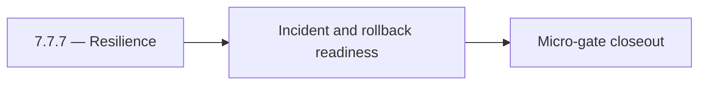

# 7.7.7 — Resilience

- **Era:** `7.x` deployment — hub [`versions.md`](../versions.md) · minors start at [`7.0 — Deployment era baseline lock`](7.0%20%E2%80%94%20Deployment%20era%20baseline%20lock.md)
- **Minor:** [7.7 — Security Hardening Sprint](./7.7 — Security Hardening Sprint.md)
- **Codename:** Resilience
- **Status:** planned

## Focus
Incident and rollback readiness

## Flowchart

## Micro-gate

| Track | Gate question | Answer / Evidence (fill at patch closeout) |
| --- | --- | --- |
| **Contract** | RBAC/authz, audit envelope, tenant isolation — `docs/backend/apis/` + `rbac-authz.md` updated? | Document at patch closeout. |
| **Service** | Handler guards, key rotation, retention hooks — smoke + parity tests documented? | Document smoke paths. |
| **Surface** | Admin/ops governance UI, role-gated flows — delta for this patch? | Document UX delta or N/A. |
| **Frontend** | Dashboard Era 7 deployment patterns (`tenant-security-observability.md`) touched? | Security hardening sprint — secrets, CORS, privilege paths. Document at closeout. |
| **Data** | Audit tables, lineage, legal-hold — migrations + `docs/backend/database/`? | Document lineage or N/A. |
| **Ops** | CI/CD gates, drift checks, runbooks (`contact360.io/admin/deploy/...`) — delta? | Document ops delta or N/A. |

## Tasks
### Contract
- 📌 Planned: **[appointment360]** — refine duplicate task (was: 📌 planned: freeze secure defaults for auth, cors, and privil…) | patch `7.7.7` band `7` | reason: specialize this file vs sibling patches; see docs/codebases/appointment360-codebase-analysis.md
- 📌 Planned: **[appointment360]** — refine duplicate task (was: 📌 planned: document secret/key rotation contracts and rollba…) | patch `7.7.7` band `7` | reason: specialize this file vs sibling patches; see docs/codebases/appointment360-codebase-analysis.md

### Service
- 📌 Planned: **[appointment360]** — refine duplicate task (was: 📌 planned: disable insecure debug paths in production profil…) | patch `7.7.7` band `7` | reason: specialize this file vs sibling patches; see docs/codebases/appointment360-codebase-analysis.md
- 📌 Planned: **[appointment360]** — refine duplicate task (was: 📌 planned: harden privileged action handlers with explicit r…) | patch `7.7.7` band `7` | reason: specialize this file vs sibling patches; see docs/codebases/appointment360-codebase-analysis.md
- 📌 Planned: **[appointment360]** — refine duplicate task (was: 📌 planned: enforce strict origin/method/header cors allowlis…) | patch `7.7.7` band `7` | reason: specialize this file vs sibling patches; see docs/codebases/appointment360-codebase-analysis.md

### Surface
- 📌 Planned: **[appointment360]** — refine duplicate task (was: 📌 planned: ensure admin/app surfaces expose only role-author…) | patch `7.7.7` band `7` | reason: specialize this file vs sibling patches; see docs/codebases/appointment360-codebase-analysis.md
- 📌 Planned: **[appointment360]** — refine duplicate task (was: 📌 planned: add clear ux for security-related denials and act…) | patch `7.7.7` band `7` | reason: specialize this file vs sibling patches; see docs/codebases/appointment360-codebase-analysis.md

### Data
- 📌 Planned: **[appointment360]** — refine duplicate task (was: 📌 planned: ensure security/audit events are immutable and tr…) | patch `7.7.7` band `7` | reason: specialize this file vs sibling patches; see docs/codebases/appointment360-codebase-analysis.md
- 📌 Planned: **[appointment360]** — refine duplicate task (was: 📌 planned: validate sensitive fields are redacted in logs an…) | patch `7.7.7` band `7` | reason: specialize this file vs sibling patches; see docs/codebases/appointment360-codebase-analysis.md

### Ops
- 📌 Planned: **[appointment360]** — refine duplicate task (was: 📌 planned: run secret rotation drill and verify service cont…) | patch `7.7.7` band `7` | reason: specialize this file vs sibling patches; see docs/codebases/appointment360-codebase-analysis.md
- 📌 Planned: **[appointment360]** — refine duplicate task (was: 📌 planned: validate security baseline checklist across all 7…) | patch `7.7.7` band `7` | reason: specialize this file vs sibling patches; see docs/codebases/appointment360-codebase-analysis.md
- 📌 Planned: **[appointment360]** — refine duplicate task (was: 📌 planned: publish hardened deployment runbook updates.) | patch `7.7.7` band `7` | reason: specialize this file vs sibling patches; see docs/codebases/appointment360-codebase-analysis.md

## Service task slices
> Merged from era `7.x` deployment task packs (P0→`.0`–`.2`, P1→`.3`–`.6`, Ops→`.7`–`.9`).

### Appointment360 (gateway)
- Create Terraform / CDK module for appointment360 Lambda + ALB + RDS
- Add CloudWatch alarm: Lambda invocation errors > 1% in 5 min
- Document rollback procedure: previous Lambda version alias swap

### Mailvetter
- CI gates: lint, unit, integration, contract tests.
- CD gates: health checks and canary traffic checks.
- Add secrets isolation (`API_SECRET_KEY` vs `WEBHOOK_SECRET_KEY`).
- Add secret rotation runbook and quarterly validation drill for verifier credentials.

### emailapis / emailapigo
- Add observability checks and release validation evidence for era 7.x (trace ids present in logs + audit viewable in logs.api).
- Capture rollback and incident-runbook notes for email-impacting releases (including how to identify/roll back problematic bulk verify batches).

### Connectra
- Validate tenant isolation on all query/write paths through gateway + Connectra.
- Publish release gate evidence: security checklist, authz tests, and retention/audit proof.

## Evidence gate
Patch closeout includes contract diff, smoke output, data lineage delta, and ops note
