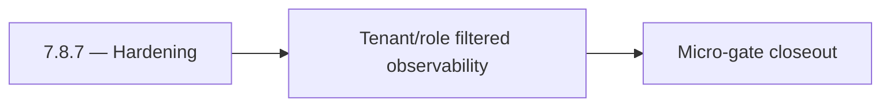

# 7.8.7 — Hardening

- **Era:** `7.x` deployment — hub [`versions.md`](../versions.md) · minors start at [`7.0 — Deployment era baseline lock`](7.0%20%E2%80%94%20Deployment%20era%20baseline%20lock.md)
- **Minor:** [7.8 — Observability Command Stage](./7.8 — Observability Command Stage.md)
- **Codename:** Hardening
- **Status:** planned

## Focus
Tenant/role filtered observability

## Flowchart

## Micro-gate

| Track | Gate question | Answer / Evidence (fill at patch closeout) |
| --- | --- | --- |
| **Contract** | RBAC/authz, audit envelope, tenant isolation — `docs/backend/apis/` + `rbac-authz.md` updated? | Document at patch closeout. |
| **Service** | Handler guards, key rotation, retention hooks — smoke + parity tests documented? | Document smoke paths. |
| **Surface** | Admin/ops governance UI, role-gated flows — delta for this patch? | Document UX delta or N/A. |
| **Frontend** | Dashboard Era 7 deployment patterns (`tenant-security-observability.md`) touched? | Observability command stage — tracing, logging, metrics gates. Document at closeout. |
| **Data** | Audit tables, lineage, legal-hold — migrations + `docs/backend/database/`? | Document lineage or N/A. |
| **Ops** | CI/CD gates, drift checks, runbooks (`contact360.io/admin/deploy/...`) — delta? | Document ops delta or N/A. |

## Tasks
### Contract
- 📌 Planned: **[appointment360]** — refine duplicate task (was: 📌 planned: define stable observability event contracts acros…) | patch `7.8.7` band `7` | reason: specialize this file vs sibling patches; see docs/codebases/appointment360-codebase-analysis.md
- 📌 Planned: **[appointment360]** — refine duplicate task (was: 📌 planned: define admin deployment dashboard data contract a…) | patch `7.8.7` band `7` | reason: specialize this file vs sibling patches; see docs/codebases/appointment360-codebase-analysis.md

### Service
- 📌 Planned: **[appointment360]** — refine duplicate task (was: 📌 planned: ensure trace/correlation propagation across all d…) | patch `7.8.7` band `7` | reason: specialize this file vs sibling patches; see docs/codebases/appointment360-codebase-analysis.md
- 📌 Planned: **[appointment360]** — refine duplicate task (was: 📌 planned: ensure logs.api retains evidence artifacts per li…) | patch `7.8.7` band `7` | reason: specialize this file vs sibling patches; see docs/codebases/appointment360-codebase-analysis.md
- 📌 Planned: **[appointment360]** — refine duplicate task (was: 📌 planned: add deployment-state aggregation services for gov…) | patch `7.8.7` band `7` | reason: specialize this file vs sibling patches; see docs/codebases/appointment360-codebase-analysis.md

### Surface
- 📌 Planned: **[appointment360]** — refine duplicate task (was: 📌 planned: implement `/admin/deployments` governance dashboa…) | patch `7.8.7` band `7` | reason: specialize this file vs sibling patches; see docs/codebases/appointment360-codebase-analysis.md
- 📌 Planned: **[appointment360]** — refine duplicate task (was: 📌 planned: add release health, rollback risk, and evidence c…) | patch `7.8.7` band `7` | reason: specialize this file vs sibling patches; see docs/codebases/appointment360-codebase-analysis.md
- 📌 Planned: **[appointment360]** — refine duplicate task (was: 📌 planned: ensure role/tenant-aware visibility rules for dep…) | patch `7.8.7` band `7` | reason: specialize this file vs sibling patches; see docs/codebases/appointment360-codebase-analysis.md

### Data
- 📌 Planned: **[appointment360]** — refine duplicate task (was: 📌 planned: validate retention proofs and queryability window…) | patch `7.8.7` band `7` | reason: specialize this file vs sibling patches; see docs/codebases/appointment360-codebase-analysis.md
- 📌 Planned: **[appointment360]** — refine duplicate task (was: 📌 planned: add lineage links from deployment actions to audi…) | patch `7.8.7` band `7` | reason: specialize this file vs sibling patches; see docs/codebases/appointment360-codebase-analysis.md

### Ops
- 📌 Planned: **[appointment360]** — refine duplicate task (was: 📌 planned: define slo/sla checks for deployment observabilit…) | patch `7.8.7` band `7` | reason: specialize this file vs sibling patches; see docs/codebases/appointment360-codebase-analysis.md
- 📌 Planned: **[appointment360]** — refine duplicate task (was: 📌 planned: add release gate requiring evidence completeness …) | patch `7.8.7` band `7` | reason: specialize this file vs sibling patches; see docs/codebases/appointment360-codebase-analysis.md

## Service task slices
> Merged from era `7.x` deployment task packs (P0→`.0`–`.2`, P1→`.3`–`.6`, Ops→`.7`–`.9`).

### logs.api
- Add observability checks and release validation evidence for era `7.x`.
- Capture rollback and incident-runbook notes for logging-impacting releases.

### Appointment360 (gateway)
- Create Terraform / CDK module for appointment360 Lambda + ALB + RDS
- Add CloudWatch alarm: Lambda invocation errors > 1% in 5 min
- Document rollback procedure: previous Lambda version alias swap

### Jobs
- Add CI/CD gates for processor registry and endpoint parity tests.
- Add deployment runbook for auth, retention, and queue health checks.

### contact.ai
- Blue-green Lambda deployment: deploy new version, run smoke tests, shift traffic.
- Canary rollout for model version updates: 10% traffic to new model before full rollout.
- Secret rotation: per-tenant API keys with automated rotation policy.
- Add `contact.ai` to deployment checklist with health probe validation step.
- Post-deployment smoke test: `GET /health`, `GET /health/db`, `POST /api/v1/ai/email/analyze` with test email.

## Evidence gate
Patch closeout includes contract diff, smoke output, data lineage delta, and ops note
