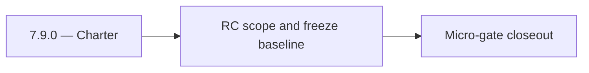

# 7.9.0 — Charter

- **Era:** `7.x` deployment — hub [`versions.md`](../versions.md) · minors start at [`7.0 — Deployment era baseline lock`](7.0%20%E2%80%94%20Deployment%20era%20baseline%20lock.md)
- **Minor:** [7.9 — 80 RC Fortress](./7.9 — 80 RC Fortress.md)
- **Codename:** Charter
- **Status:** ✅ Completed
## Focus
RC scope and freeze baseline

## Flowchart

## Micro-gate

| Track | Gate question | Answer / Evidence (fill at patch closeout) |
| --- | --- | --- |
| **Contract** | RBAC/authz, audit envelope, tenant isolation — `docs/backend/apis/` + `rbac-authz.md` updated? | Document at patch closeout. |
| **Service** | Handler guards, key rotation, retention hooks — smoke + parity tests documented? | Document smoke paths. |
| **Surface** | Admin/ops governance UI, role-gated flows — delta for this patch? | Document UX delta or N/A. |
| **Frontend** | Dashboard Era 7 deployment patterns (`tenant-security-observability.md`) touched? | RC fortress — `analytics-era-rc.md` / deployment RC evidence. Document at closeout. |
| **Data** | Audit tables, lineage, legal-hold — migrations + `docs/backend/database/`? | Document lineage or N/A. |
| **Ops** | CI/CD gates, drift checks, runbooks (`contact360.io/admin/deploy/...`) — delta? | Document ops delta or N/A. |

## Tasks
### Contract
- 📌 Planned: **[appointment360]** — refine duplicate task (was: 📌 planned: **[appointment360]** — refine duplicate task (was…) | patch `7.9.0` band `0` | reason: specialize this file vs sibling patches; see docs/codebases/appointment360-codebase-analysis.md
- 📌 Planned: **[appointment360]** — refine duplicate task (was: 📌 planned: **[appointment360]** — refine duplicate task (was…) | patch `7.9.0` band `0` | reason: specialize this file vs sibling patches; see docs/codebases/appointment360-codebase-analysis.md

### Service
- 📌 Planned: **[appointment360]** — refine duplicate task (was: 📌 planned: **[appointment360]** — refine duplicate task (was…) | patch `7.9.0` band `0` | reason: specialize this file vs sibling patches; see docs/codebases/appointment360-codebase-analysis.md
- 📌 Planned: **[appointment360]** — refine duplicate task (was: 📌 planned: **[appointment360]** — refine duplicate task (was…) | patch `7.9.0` band `0` | reason: specialize this file vs sibling patches; see docs/codebases/appointment360-codebase-analysis.md
- 📌 Planned: **[appointment360]** — refine duplicate task (was: 📌 planned: **[appointment360]** — refine duplicate task (was…) | patch `7.9.0` band `0` | reason: specialize this file vs sibling patches; see docs/codebases/appointment360-codebase-analysis.md

### Surface
- 📌 Planned: **[appointment360]** — refine duplicate task (was: 📌 planned: **[appointment360]** — refine duplicate task (was…) | patch `7.9.0` band `0` | reason: specialize this file vs sibling patches; see docs/codebases/appointment360-codebase-analysis.md
- 📌 Planned: **[appointment360]** — refine duplicate task (was: 📌 planned: **[appointment360]** — refine duplicate task (was…) | patch `7.9.0` band `0` | reason: specialize this file vs sibling patches; see docs/codebases/appointment360-codebase-analysis.md

### Data
- 📌 Planned: **[appointment360]** — refine duplicate task (was: 📌 planned: **[appointment360]** — refine duplicate task (was…) | patch `7.9.0` band `0` | reason: specialize this file vs sibling patches; see docs/codebases/appointment360-codebase-analysis.md
- 📌 Planned: **[appointment360]** — refine duplicate task (was: 📌 planned: **[appointment360]** — refine duplicate task (was…) | patch `7.9.0` band `0` | reason: specialize this file vs sibling patches; see docs/codebases/appointment360-codebase-analysis.md

### Ops
- 📌 Planned: **[appointment360]** — refine duplicate task (was: 📌 planned: **[appointment360]** — refine duplicate task (was…) | patch `7.9.0` band `0` | reason: specialize this file vs sibling patches; see docs/codebases/appointment360-codebase-analysis.md
- 📌 Planned: **[appointment360]** — refine duplicate task (was: 📌 planned: **[appointment360]** — refine duplicate task (was…) | patch `7.9.0` band `0` | reason: specialize this file vs sibling patches; see docs/codebases/appointment360-codebase-analysis.md
- 📌 Planned: **[appointment360]** — refine duplicate task (was: 📌 planned: **[appointment360]** — refine duplicate task (was…) | patch `7.9.0` band `0` | reason: specialize this file vs sibling patches; see docs/codebases/appointment360-codebase-analysis.md

## Service task slices
> Merged from era `7.x` deployment task packs (P0→`.0`–`.2`, P1→`.3`–`.6`, Ops→`.7`–`.9`).

### Appointment360 (gateway)
- Finalize environment variable naming convention across all .env.* files
- Document EC2 vs Lambda execution differences in README.md
- Define /health readiness contract for load balancer health checks
- Define resolver-level RBAC contract using rbac-authz.md role model (admin, member, read_only)
- Validate Mangum handler Lambda cold-start time is < 3s
- Add lifespan event handler (FastAPI lifespan=) for DB engine startup/shutdown
- Configure trusted_hosts for production ALB host
- Configure CORS_ORIGINS whitelist for production dashboard domain
- Add health check-based deployment gate: Lambda alias swap only when /health/db passes
- Add --reload=false for uvicorn production command
- Enforce resolver and handler authz for privileged gateway mutations (no client-supplied role trust)
- Emit audit evidence to logs.api for governance-sensitive mutations with actor + tenant + trace id
- Dashboard environment detection: use NEXT_PUBLIC_GRAPHQL_URL per deploy environment
- Ensure Alembic migration history is clean before production deploy
- Create DB backup procedure before every migration
- Write Dockerfile with multi-stage build: pip install → copy app → CMD uvicorn
- Write docker-compose.yml for local dev: app + postgres + redis
- Add GitHub Actions CI: lint (flake8/ruff), type-check (mypy), test (pytest)
- Set ENVIRONMENT=production guard: disable DEBUG=true, GraphiQL, introspection

### Connectra
- Freeze RBAC and API key scope for write and export endpoints.
- Define tenant-safe request/response and failure semantics for privileged paths.
- Enforce privileged path checks for `batch-upsert`, job creation, and filter mutations.
- Ensure handler-level authz mirrors gateway role checks (no role bypass).
- Record audit events for sensitive writes and mapping/schema changes.
- Validate lineage fields: actor, tenant, trace id, and action outcome.

### contact.ai
- Define RBAC for AI features: which subscription plans / user roles can access:
- Chat (`/api/v1/ai-chats/`): ProUser and above.
- Email risk, company summary, filter parsing: all authenticated users.
- Per-tenant API key contract: replace single global `API_KEY` with per-tenant keys.
- Document chat retention policy: GDPR Article 17 right-to-erasure must cascade to `ai_chats`.
- Lock API versioning: `/api/v1/` is stable; define deprecation policy for future `/api/v2/`.
- Implement feature gate middleware: check user role/plan from JWT context before serving chat routes.
- Implement per-tenant API key store: validate against tenant key table instead of single env var.
- Implement `CASCADE DELETE` or scheduled erasure for `ai_chats` when user account is deleted.
- Emit audit log events (to `logs.api`) on: chat created, chat deleted, message sent, model used.
- Document and test blue-green Lambda deployment process for contact.ai.
- Add audit log schema: `{event: "chat_created|chat_deleted|message_sent", user_id, chat_id, model, timestamp}`.
- Retention policy: document max storage age for `ai_chats` and cleanup schedule.

### emailapis / emailapigo
- Define and freeze era 7.x email endpoint and payload compatibility notes.
- Update endpoint/reference matrix in docs/backend/endpoints/emailapis_endpoint_era_matrix.json.
- Define RBAC requirements for who can invoke email finder/verifier and related bulk operations; map roles using `docs/7. Contact360 deployment/rbac-authz.md`.
- Implement/validate runtime behavior for era 7.x finder, verifier, pattern, and fallback paths.
- Verify auth, provider routing, error envelope, and health diagnostics behavior.
- Ensure gateway-enforced role checks are respected for finder/verifier operations (no privileged behavior based on client-supplied role).
- Emit audit/trace events to `logs.api` for bulk verify operations (include actor identity + trace/correlation ids; do not store raw PII in audit payloads).
- Document email_finder_cache and email_patterns lineage impact for era 7.x.
- Record provider, status, and traceability expectations for this era (what audit fields exist, and how they are correlated).

### Emailcampaign
- Both API and worker Dockerfiles build and run in Kubernetes.
- Secrets not in env files; mounted from secret store.
- RBAC role check tested: `admin`/`member` can create according to policy, `read_only` cannot.
- Audit events visible in `logs.api` for campaign create and send complete.

### Jobs
- Define per-role/per-service access model beyond shared API key.
- Tie role model to `docs/7. Contact360 deployment/rbac-authz.md` and gateway role semantics.
- Define deployment-time audit evidence contract for job lifecycle actions.
- Add role-aware authorization path and key rotation support.
- Implement retention policy hooks and deletion governance controls.
- Use `job_events` as primary deployment/audit trail evidence.
- Document retention and legal-hold expectations for job timelines.

### logs.api
- Define and freeze era `7.x` logging schema additions and compatibility notes.
- Update endpoint/reference matrix in `docs/backend/endpoints/logsapi_endpoint_era_matrix.json`.
- Implement and validate service behavior for era `7.x` event sources and query expectations.
- Verify auth, error envelope, and health behavior for consuming services.
- Document S3 CSV storage and lineage impact for era `7.x`.
- Record retention, trace ids, and query-window expectations.

### Mailvetter
- Versioning policy: `/v1` remains stable; legacy routes officially deprecated.
- Release checklist contract for schema and API compatibility.
- Define audit event contract for verification outcomes and privileged override actions.
- Define retention/deletion policy contract for verification evidence artifacts.
- Separate schema migrations from app startup execution.
- Add startup readiness checks for Redis/Postgres dependencies.
- Ensure worker drain logic without message loss.
- Emit audit events to `logs.api` for verifier write/update/reprocess flows.
- Backup/restore and retention runbooks for `jobs` and `results`.
- Add migration rollback scripts and test evidence.

### S3Storage
- Define service-to-service auth contract for storage endpoints.
- Define retention/deletion policy contract for object classes.
- Enforce endpoint authz and environment-driven worker routing config.
- Remove static/hardcoded deployment-specific function bindings.
- Ensure retention/deletion operations produce auditable evidence.
- Validate lineage fields for object lifecycle actions.

### Salesnavigator
- Define role-based access for SN ingestion:
- `admin`: bulk save, access to ingestion history
- `member`: save own profiles (up to N per day)
- `read_only`: no save access
- Define scoped service key contract: per-environment key (dev/staging/prod) replacing single global key
- Define immutable audit event schema: `{event: sn_save, user_id, org_id, profiles_submitted, saved_count, failed_count, session_id, timestamp, source_ip}`
- Define GDPR right-to-erasure cascade: SN-sourced contact deletion → Connectra delete by UUID
- Replace single global `API_KEY` with per-environment/per-tenant scoped keys
- Emit immutable audit event on each `save-profiles` call (event bus or PostgreSQL audit log)
- Implement RBAC check on `save-profiles`: validate role from `X-User-Role` or token claims
- Add `org_id` to Connectra contact metadata for tenant isolation
- Immutable audit event per save session: written to `audit_events` table or event bus
- GDPR: SN contact provenance tracked in Connectra (`source=sales_navigator`, `lead_id`, `search_id`) for selective erasure
- Data retention: define retention policy for SN-sourced contacts (default: follow org retention settings)

## Evidence gate
Primary charter artifact created and linked in the parent minor doc
