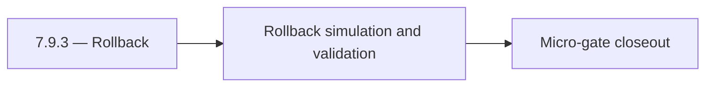

# 7.9.3 — Rollback

- **Era:** `7.x` deployment — hub [`versions.md`](../versions.md) · minors start at [`7.0 — Deployment era baseline lock`](7.0%20%E2%80%94%20Deployment%20era%20baseline%20lock.md)
- **Minor:** [7.9 — 80 RC Fortress](./7.9 — 80 RC Fortress.md)
- **Codename:** Rollback
- **Status:** ✅ Completed
## Focus
Rollback simulation and validation

## Flowchart

## Micro-gate

| Track | Gate question | Answer / Evidence (fill at patch closeout) |
| --- | --- | --- |
| **Contract** | RBAC/authz, audit envelope, tenant isolation — `docs/backend/apis/` + `rbac-authz.md` updated? | Document at patch closeout. |
| **Service** | Handler guards, key rotation, retention hooks — smoke + parity tests documented? | Document smoke paths. |
| **Surface** | Admin/ops governance UI, role-gated flows — delta for this patch? | Document UX delta or N/A. |
| **Frontend** | Dashboard Era 7 deployment patterns (`tenant-security-observability.md`) touched? | RC fortress — `analytics-era-rc.md` / deployment RC evidence. Document at closeout. |
| **Data** | Audit tables, lineage, legal-hold — migrations + `docs/backend/database/`? | Document lineage or N/A. |
| **Ops** | CI/CD gates, drift checks, runbooks (`contact360.io/admin/deploy/...`) — delta? | Document ops delta or N/A. |

## Tasks
### Contract
- ✅ Completed: 📌 Planned: **[appointment360]** — refine duplicate task (was: 📌 planned: freeze all 7.x deployment-era contracts and 8.0 e…) | patch `7.9.3` band `3` | reason: specialize this file vs sibling patches; see docs/codebases/appointment360-codebase-analysis.md
- ✅ Completed: 📌 Planned: **[appointment360]** — refine duplicate task (was: 📌 planned: confirm no unresolved contract drift across gatew…) | patch `7.9.3` band `3` | reason: specialize this file vs sibling patches; see docs/codebases/appointment360-codebase-analysis.md

### Service
- ✅ Completed: 📌 Planned: **[appointment360]** — refine duplicate task (was: 📌 planned: execute rc dry-run across core services under pro…) | patch `7.9.3` band `3` | reason: specialize this file vs sibling patches; see docs/codebases/appointment360-codebase-analysis.md
- ✅ Completed: 📌 Planned: **[appointment360]** — refine duplicate task (was: 📌 planned: verify rollback scripts for each critical deploym…) | patch `7.9.3` band `3` | reason: specialize this file vs sibling patches; see docs/codebases/appointment360-codebase-analysis.md
- ✅ Completed: 📌 Planned: **[appointment360]** — refine duplicate task (was: 📌 planned: confirm privileged workflows are protected and au…) | patch `7.9.3` band `3` | reason: specialize this file vs sibling patches; see docs/codebases/appointment360-codebase-analysis.md

### Surface
- ✅ Completed: 📌 Planned: **[appointment360]** — refine duplicate task (was: 📌 planned: validate critical admin/app release workflows wit…) | patch `7.9.3` band `3` | reason: specialize this file vs sibling patches; see docs/codebases/appointment360-codebase-analysis.md
- ✅ Completed: 📌 Planned: **[appointment360]** — refine duplicate task (was: 📌 planned: confirm no stale analytics-era labels remain in d…) | patch `7.9.3` band `3` | reason: specialize this file vs sibling patches; see docs/codebases/appointment360-codebase-analysis.md

### Data
- ✅ Completed: 📌 Planned: **[appointment360]** — refine duplicate task (was: 📌 planned: finalize evidence lineage: action -> trace -> aud…) | patch `7.9.3` band `3` | reason: specialize this file vs sibling patches; see docs/codebases/appointment360-codebase-analysis.md
- ✅ Completed: 📌 Planned: **[appointment360]** — refine duplicate task (was: 📌 planned: ensure retention/deletion and tenant isolation re…) | patch `7.9.3` band `3` | reason: specialize this file vs sibling patches; see docs/codebases/appointment360-codebase-analysis.md

### Ops
- ✅ Completed: 📌 Planned: **[appointment360]** — refine duplicate task (was: 📌 planned: run cross-service go/no-go checklist.) | patch `7.9.3` band `3` | reason: specialize this file vs sibling patches; see docs/codebases/appointment360-codebase-analysis.md
- ✅ Completed: 📌 Planned: **[appointment360]** — refine duplicate task (was: 📌 planned: simulate partial failure and rollback.) | patch `7.9.3` band `3` | reason: specialize this file vs sibling patches; see docs/codebases/appointment360-codebase-analysis.md
- ✅ Completed: 📌 Planned: **[appointment360]** — refine duplicate task (was: 📌 planned: publish final rc evidence bundle and sign-off.) | patch `7.9.3` band `3` | reason: specialize this file vs sibling patches; see docs/codebases/appointment360-codebase-analysis.md

## Service task slices
> Merged from era `7.x` deployment task packs (P0→`.0`–`.2`, P1→`.3`–`.6`, Ops→`.7`–`.9`).

### Appointment360 (gateway)
- Specify Mangum Lambda event format and response envelope
- Add graceful shutdown: complete in-flight requests before exit
- Configure Alembic to run migrations as separate Lambda invoke / ECS task (not at startup)
- Extension builds point to prod GraphQL endpoint (wss:// for subscription readiness)
- Dashboard graceful degradation when gateway is unreachable (network error boundary)
- Add table index review for all high-frequency query patterns
- Add GitHub Actions CD: build Docker → push ECR → deploy Lambda / EC2
- Create Terraform / CDK module for appointment360 Lambda + ALB + RDS
- Add CloudWatch alarm: Lambda invocation errors > 1% in 5 min
- Document rollback procedure: previous Lambda version alias swap

### Connectra
- Document role-gated admin/app controls tied to Connectra privileged actions.
- Validate tenant-safe user messaging for deny/error/retry flows.
- Record audit events for sensitive writes and mapping/schema changes.
- Validate lineage fields: actor, tenant, trace id, and action outcome.
- Enforce privileged path checks for `batch-upsert`, job creation, and filter mutations.
- Ensure handler-level authz mirrors gateway role checks (no role bypass).

### contact.ai
- Implement role-gated AI features in dashboard: show/hide AI chat based on user plan.
- Feature flag: `ENABLE_AI_CHAT` per user plan; disabled → show upgrade prompt instead of chat page.
- Admin panel: show AI usage summary per user (chat count, message count, model usage).
- Add audit log schema: `{event: "chat_created|chat_deleted|message_sent", user_id, chat_id, model, timestamp}`.
- Retention policy: document max storage age for `ai_chats` and cleanup schedule.
- Add `7.x` lineage note to `contact_ai_data_lineage.md`: GDPR erasure cascade.
- Implement feature gate middleware: check user role/plan from JWT context before serving chat routes.
- Implement per-tenant API key store: validate against tenant key table instead of single env var.
- Implement `CASCADE DELETE` or scheduled erasure for `ai_chats` when user account is deleted.
- Emit audit log events (to `logs.api`) on: chat created, chat deleted, message sent, model used.
- Document and test blue-green Lambda deployment process for contact.ai.

### emailapis / emailapigo
- Document impacted pages/tabs/buttons/inputs/components for era 7.x.
- Document relevant hooks/services/contexts and UX states (loading/error/progress/checkbox/radio).
- Document email_finder_cache and email_patterns lineage impact for era 7.x.
- Record provider, status, and traceability expectations for this era (what audit fields exist, and how they are correlated).
- Implement/validate runtime behavior for era 7.x finder, verifier, pattern, and fallback paths.
- Verify auth, provider routing, error envelope, and health diagnostics behavior.
- Ensure gateway-enforced role checks are respected for finder/verifier operations (no privileged behavior based on client-supplied role).
- Emit audit/trace events to `logs.api` for bulk verify operations (include actor identity + trace/correlation ids; do not store raw PII in audit payloads).

### Emailcampaign
- Both API and worker Dockerfiles build and run in Kubernetes.
- Secrets not in env files; mounted from secret store.
- RBAC role check tested: `admin`/`member` can create according to policy, `read_only` cannot.
- Audit events visible in `logs.api` for campaign create and send complete.

### Jobs
- Document role-gated admin controls and retention/audit panels.
- Document deployment readiness checks visible in ops UI.
- Use `job_events` as primary deployment/audit trail evidence.
- Document retention and legal-hold expectations for job timelines.
- Add role-aware authorization path and key rotation support.
- Implement retention policy hooks and deletion governance controls.

### logs.api
- Define concrete deployment-governance surfaces: `/admin/deployments`, audit/event explorer, retention report export.
- Document role-gated UI states for query/filter/export, including loading/error/retry states.
- Document S3 CSV storage and lineage impact for era `7.x`.
- Record retention, trace ids, and query-window expectations.
- Implement and validate service behavior for era `7.x` event sources and query expectations.
- Verify auth, error envelope, and health behavior for consuming services.

### Mailvetter
- Disable legacy static UI in production unless explicit flag is enabled.
- Backup/restore and retention runbooks for `jobs` and `results`.
- Add migration rollback scripts and test evidence.
- Validate retention policy execution and GDPR erasure cascade for verifier artifacts.
- Separate schema migrations from app startup execution.
- Add startup readiness checks for Redis/Postgres dependencies.
- Ensure worker drain logic without message loss.
- Emit audit events to `logs.api` for verifier write/update/reprocess flows.

### S3Storage
- Document role-gated storage controls in admin/app surfaces.
- Validate lifecycle-policy status and failure messaging for operators.
- Ensure retention/deletion operations produce auditable evidence.
- Validate lineage fields for object lifecycle actions.
- Enforce endpoint authz and environment-driven worker routing config.
- Remove static/hardcoded deployment-specific function bindings.

### Salesnavigator
- Role-gated save actions: `SNSaveButton` disabled for `read_only`; `member` follows quota and `admin` has full access.
- Admin-only: bulk export / full SN session history visible only to admin
- Audit log view: `/settings/audit-log` shows SN save events with actor, count, timestamp
- GDPR delete request: SN-sourced contacts eligible for erasure via Connectra cascade
- Immutable audit event per save session: written to `audit_events` table or event bus
- GDPR: SN contact provenance tracked in Connectra (`source=sales_navigator`, `lead_id`, `search_id`) for selective erasure
- Data retention: define retention policy for SN-sourced contacts (default: follow org retention settings)
- Blue-green deploy: confirm SAM `--no-fail-on-empty-changeset` allows zero-downtime swap
- Replace single global `API_KEY` with per-environment/per-tenant scoped keys
- Emit immutable audit event on each `save-profiles` call (event bus or PostgreSQL audit log)
- Implement RBAC check on `save-profiles`: validate role from `X-User-Role` or token claims
- Add `org_id` to Connectra contact metadata for tenant isolation

## Evidence gate
Patch closeout includes contract diff, smoke output, data lineage delta, and ops note
