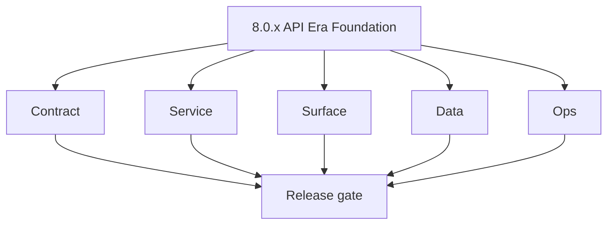
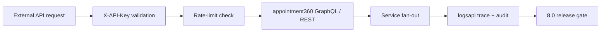
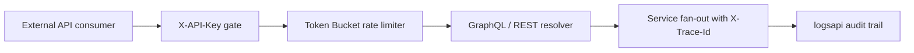

# Version 8.0 — API Era Foundation

- **Status:** ✅ Completed
- **Codename:** API Era Foundation
- **Era:** 8.x (Contact360 public and private APIs and endpoints)
- **Roadmap:** API launch baseline — ships as **`8.0.0`** per [`docs/versions.md`](../versions.md)
- **Summary:** Freeze **service inventory boundaries**, lock **public vs private API surface** contracts, establish **endpoint matrix alignment**, harden **`X-API-Key`** governance, **rate-limit headers**, and **error envelope** standardization across all Contact360 services. Foundation for `8.1+` telemetry, ingestion quality, and external developer portal work.
- **Owner:** Integrations Engineering + Platform API
- **Patch closure:** Every codenamed patch file includes **Micro-gate** + **Service task slices**. Era hub: [`versions.md`](../versions.md).

## Scope

- **Target:** `8.0.x` patches — stable foundation for 8.1–8.9 increments.
- **In scope:** Service inventory lock, contract boundary lock, baseline endpoint/data/UI references, `X-API-Key` scoping, rate-limit response headers, error taxonomy, Postman compatibility gate.
- **Out of scope:** Webhook v1 rollout (`8.4`); partner identity mesh (`8.5`/`9.x`); reporting APIs (`8.7`).
- **Owners:** Integrations Engineering + Platform API.

## Flowchart

### Runtime focus (unique to this minor)

## Task tracks

### Contract

- ✅ Completed: ✅ Completed: 📌 Planned: Lock **gateway** public vs private API surface boundaries — which GraphQL modules are public-facing vs internal-only.
- ✅ Completed: ✅ Completed: 📌 Planned: Lock **data services** (Connectra, Jobs) contract boundaries for external consumption.
- ✅ Completed: ✅ Completed: 📌 Planned: Lock **async services** (emailapis, emailapigo, Mailvetter) rate-limit and error response contracts.
- ✅ Completed: ✅ Completed: 📌 Planned: Lock **AI service** (contact.ai) external access policy and model selection contract.
- ✅ Completed: ✅ Completed: 📌 Planned: Lock **storage/logs** (s3storage, logs.api) tenant-scoped access contracts.
- ✅ Completed: ✅ Completed: 📌 Planned: Lock **ingestion** (salesnavigator) external API key governance.
- ✅ Completed: ✅ Completed: 📌 Planned: Lock **campaign** (emailcampaign) API surface and status enum for external use.
- ✅ Completed: ✅ Completed: 📌 Planned: Programmatically sync live **OpenAPI `/v1` configurations** from backend into the public-facing API Documentation surface on `contact360.io/root`.
- ✅ Completed: ✅ Completed: 📌 Planned: **logs.api:** Confirm API Gateway / custom domain maps a `/v1` base path to the FastAPI app (`app/api/v1/router.py` mounts `/logs`, `/health`); document whether callers use `/v1/logs` vs root-mounted paths.
- ✅ Completed: ✅ Completed: 📌 Planned: **logs.api:** Rate limiting for `POST /logs/batch` and bulk delete paths — token bucket per `X-API-Key`, respect `BATCH_SIZE_LIMIT`, return `X-RateLimit-Limit` / `X-RateLimit-Remaining` / `Retry-After` on exhaustion.
- ✅ Completed: ✅ Completed: 📌 Planned: **s3storage:** Publish versioning and deprecation policy for `/api/v1/` storage endpoints; document breaking vs non-breaking change rules.
- ✅ Completed: ✅ Completed: 📌 Planned: **s3storage:** Emit lifecycle webhook/event on upload complete/delete/update with replay-safe event IDs; define event contract in `docs/backend/apis/`.
- ✅ Completed: ✅ Completed: 📌 Planned: **emailapis** — confirm `/v1/` base-path mapping in API Gateway; Python routes are `/email/finder/`, `/email-patterns/`, `/web/` without a version prefix — document whether callers use a `/v1/` prefix or root-mounted paths; if root-mounted, add `/api/v1/` prefix to `app/api/v1/router.py` and document the cutover.
- ✅ Completed: ✅ Completed: 📌 Planned: **emailapigo** — same as emailapis: Go Gin routes are `/email/finder/`, `/email/single/verifier/` etc. — align versioning with Python adapter and document breaking change policy.
- ✅ Completed: ✅ Completed: 📌 Planned: **emailapis / emailapigo** — publish and lock `docs/backend/apis/emailapis_endpoint_era_matrix.json` covering both Python and Go adapters: endpoint, method, request schema, response schema, provider routing, status vocabulary, era `2.x`–`8.x` notes.
- ✅ Completed: ✅ Completed: ⬜ Incomplete: **extension/contact360 salesnavigator Lambda** — `POST /v1/save-profiles` has no `X-Idempotency-Key` support; identical payloads sent on retry will double-insert to Connectra; add idempotency key validation and cache in DynamoDB TTL or Lambda ephemeral cache.
- ✅ Completed: ✅ Completed: 📌 Planned: **extension/contact360 salesnavigator Lambda** — add `X-RateLimit-Limit`, `X-RateLimit-Remaining`, `Retry-After` response headers to `POST /v1/save-profiles` and `POST /v1/scrape` endpoints; align rate-limit budget with Connectra API capacity.
- ✅ Completed: ✅ Completed: 📌 Planned: **extension/contact360 salesnavigator Lambda** — publish OpenAPI v3 spec to `docs/backend/apis/salesnavigator_openapi.yaml`; lock request/response schema for `POST /v1/save-profiles` (input profiles array, response saved_count + errors) and `POST /v1/scrape`; add to Postman collection.
- ✅ Completed: ✅ Completed: 📌 Planned: **extension/contact360 salesnavigator Lambda** — add Postman collection for `/v1/health`, `/v1/save-profiles`, `/v1/scrape`; publish to `docs/backend/endpoints/salesnavigator_endpoint_era_matrix.json`.
- ✅ Completed: ✅ Completed: ⬜ Incomplete: **contact360.io/sync (Connectra)** — `rateMiddleware.go` token-bucket rate limiter returns `429 Too Many Requests` but no `X-RateLimit-Limit`, `X-RateLimit-Remaining`, or `Retry-After` headers; clients cannot back off intelligently; add all three headers to both normal responses and 429 responses.
- ✅ Completed: ✅ Completed: ⬜ Incomplete: **contact360.io/sync (Connectra)** — `GET /health` returns `{"status":"ok"}` regardless of PG/ES state; add `{"status":"degraded","dependencies":{"postgres":"unhealthy","elasticsearch":"unhealthy"}}` pattern with HTTP 503 when any dependency is unreachable.
- ✅ Completed: ✅ Completed: 📌 Planned: **contact360.io/sync (Connectra)** — publish OpenAPI v3 spec to `docs/backend/apis/connectra_openapi.yaml` covering all endpoints: `POST /contacts/`, `POST /contacts/count`, `POST /contacts/batch-upsert`, `POST /companies/`, `POST /companies/count`, `POST /companies/batch-upsert`, `GET /common/upload-url`, `POST /common/batch-upsert`, `POST /common/jobs`, `POST /common/jobs/create`, `GET /common/:service/filters`, `POST /common/:service/filters/data`, `GET /health`.
- ✅ Completed: ✅ Completed: 📌 Planned: **contact360.io/sync (Connectra)** — add Postman collection for Connectra REST API; publish to `docs/backend/endpoints/connectra_endpoint_era_matrix.json`; include request/response examples for batch-upsert, ListByFilters, CountByFilters.
- ✅ Completed: ✅ Completed: ⬜ Incomplete: **contact360.io/root (marketing)** — `next.config.js` has no `headers()` export; the marketing site serves all pages without `Content-Security-Policy`, `X-Frame-Options`, `X-Content-Type-Options`, or `Referrer-Policy` headers — add `headers()` to `next.config.js` returning these security headers for `source: "/(.*)"`.
- ✅ Completed: ✅ Completed: ⬜ Incomplete: **contact360.io/root (marketing)** — `usePricing` hook defaults `fetchPlans: false` on all public-facing pages, meaning the `Pricing` component on the landing page always shows static fallback data and never fetches live pricing from the GraphQL API; either change the default or ensure the Pricing component explicitly sets `fetchPlans: true` so live plan changes are reflected without code deployments.
- ✅ Completed: ✅ Completed: ⬜ Incomplete: **contact360.io/root (marketing)** — `app/(marketing)/api-docs/page.tsx` renders via `MarketingPageContainer` which fetches from the Pages GraphQL API; but there is no dedicated interactive OpenAPI explorer component — the `/api-docs` route only renders whatever CMS markdown the backend returns; integrate Swagger UI or Redoc as a React component pointed at the published OpenAPI v3 spec URL for a developer-grade API reference page.
- ✅ Completed: ✅ Completed: 📌 Planned: **contact360.io/root (marketing)** — add `app/sitemap.ts` generating dynamic `sitemap.xml` with all marketing routes: `/`, `/about`, `/pricing`, `/integrations`, `/docs`, `/products/*`, `/careers`, `/privacy`, `/terms`; set `lastModified` from `Date.now()` for dynamic pages.
- ✅ Completed: ✅ Completed: 📌 Planned: **contact360.io/root (marketing)** — add `app/robots.ts` generating `robots.txt` with `Allow: /` for all crawlers, `Disallow: /api/*`, and `Sitemap: https://contact360.io/sitemap.xml`; currently no `robots.txt` is served by the Next.js app.
- ✅ Completed: ✅ Completed: ⬜ Incomplete: **contact360.io/jobs** — `rate_limit.py` `RateLimitMiddleware` returns `{"success": false, "error": "rate limit exceeded"}` on 429 with no `X-RateLimit-Limit`, `X-RateLimit-Remaining`, or `Retry-After` headers; add all three response headers to the 429 JSONResponse and include them on every successful response so callers can track their budget.
- ✅ Completed: ✅ Completed: ⬜ Incomplete: **contact360.io/jobs** — no `PUT /v1/jobs/{uuid}/cancel` endpoint exists; a running or queued job cannot be stopped by API callers; add a cancel endpoint that marks `processing`/`in_queue` → `failed` with a `cancellation_reason` in `job_response` and emits a `cancelled` event to `job_events`.
- ✅ Completed: ✅ Completed: 📌 Planned: **contact360.io/jobs** — publish OpenAPI v3 spec to `docs/backend/apis/jobs_openapi.yaml`; document all endpoints: `POST /v1/jobs/email-export`, `email-verify`, `email-pattern-import`, `contact360-import`, `contact360-export`, `bulk-insert/complete-graph`, `GET /v1/jobs/{uuid}`, `GET /v1/jobs/{uuid}/status`, `GET /v1/jobs/{uuid}/timeline`, `GET /v1/jobs/{uuid}/dag`, `PUT /v1/jobs/{uuid}/retry`, `POST /v1/jobs/validate/vql`.
- ✅ Completed: ✅ Completed: 📌 Planned: **contact360.io/jobs** — add Postman collection for the jobs API; publish to `docs/backend/endpoints/jobs_endpoint_era_matrix.json`; include end-to-end workflow examples (create email export → poll status → download result from S3).
- ✅ Completed: ✅ Completed: ⬜ Incomplete: **contact360.io/email (Mailhub)** — `src/components/email-list.tsx` and `src/app/email/[mailId]/page.tsx` send the raw IMAP password as an `X-Password` HTTP header on every single API request (`"X-Password": activeAccount.password`); this is a critical security practice — IMAP credentials should never be sent as headers; implement session-scoped credential exchange: on IMAP account connect, the backend should return an opaque session token that is used for subsequent email fetches instead of the raw password.
- ✅ Completed: ✅ Completed: ⬜ Incomplete: **contact360.io/email (Mailhub)** — `src/context/imap-context.tsx` stores the full `ImapConfig` (including `password`) in `localStorage` as `mailhub_active_account` via `JSON.stringify(account)`; `localStorage` is accessible to any JavaScript on the page (XSS risk); replace with `sessionStorage` for the active account to limit exposure, and never store plaintext passwords — store only the session token returned after IMAP credential verification.
- ✅ Completed: ✅ Completed: 📌 Planned: **contact360.io/email (Mailhub)** — document the Mailhub backend API contract in `docs/backend/apis/mailhub_openapi.yaml`: endpoints `POST /auth/login`, `POST /auth/signup`, `GET /auth/user/:userId`, `GET /api/emails/:folder`, `GET /api/emails/:mailId`, `POST /api/emails/send`, `GET /api/user/:userId`, `PUT /api/user/update/:userId`, `POST /api/user/imap/:userId` — these are inferred from the frontend but no API spec exists.
- ✅ Completed: ✅ Completed: ✅ Completed: **contact360.io/app (Dashboard)** — GraphQL API client fully implemented: `graphqlClient.ts` uses `graphql-request`, handles JWT auth injection (`Authorization: Bearer`), token refresh on 401 (with `skipAuth` bypass for the refresh mutation itself), retry with exponential backoff, and structured error parsing via `parseGraphQLError`.
- ✅ Completed: ✅ Completed: ✅ Completed: **contact360.io/app (Dashboard)** — API key management UI exists in `ProfileTabAPI` component: users can view, create, and revoke API keys via `useAPIKeys` hook → `profileService.ts` GraphQL mutations.
- ✅ Completed: ✅ Completed: ⬜ Incomplete: **contact360.io/app (Dashboard)** — `tokenManager.ts` stores JWT access/refresh tokens in `localStorage` which is accessible to any JavaScript on the page (XSS risk); consider migrating to `HttpOnly` cookies managed by the Next.js server-side or `sessionStorage` for the access token, with an `HttpOnly` cookie for the refresh token only.
- ✅ Completed: ✅ Completed: ⬜ Incomplete: **contact360.io/app (Dashboard)** — `graphqlClient.ts` `MAX_RETRY_ATTEMPTS = 3` retries ALL GraphQL errors including non-idempotent mutations (e.g., `Subscribe`, `PurchaseAddon`); retrying a mutation that partially succeeded at the backend could create double charges — add a `skipRetry` option to `GraphQLRequestOptions` and set it for all billing mutations.
- ✅ Completed: ✅ Completed: 📌 Planned: **contact360.io/app (Dashboard)** — publish the full GraphQL schema consumed by the dashboard to `docs/backend/apis/dashboard_graphql_schema.graphql`; currently the GraphQL types are inferred from inline `gql` strings scattered across 18 service files — consolidate into a single schema document for API contract visibility.

- ✅ Completed: 📌 Planned: **[appointment360]** — refine duplicate task (was: 📌 planned: **[architecture]** — product **graphql** remains …) | patch `8.0.0` band `0` | reason: specialize this file vs sibling patches; see docs/codebases/appointment360-codebase-analysis.md
### Service

- ✅ Completed: ✅ Completed: 📌 Planned: **appointment360:** Enable `X-API-Key` scoped key validation for external API consumers (distinct from JWT session auth).
- ✅ Completed: ✅ Completed: 📌 Planned: **appointment360:** Implement Token Bucket rate limiting with `X-RateLimit-Limit`, `X-RateLimit-Remaining`, `X-RateLimit-Reset` response headers.
- ✅ Completed: ✅ Completed: 📌 Planned: **emailapis/emailapigo:** Harden provider adapter contract for external invocation paths.
- ✅ Completed: ✅ Completed: 📌 Planned: **s3storage:** Enforce tenant-scoped access for all upload/download/list operations.
- ✅ Completed: ✅ Completed: 📌 Planned: **s3storage:** Add compatibility test suite (old/new contract variants) and SDK-grade usage examples for partner/internal consumers in `lambda/s3storage/docs/API.md`.
- ✅ Completed: ✅ Completed: 📌 Planned: **All services:** Standardize error taxonomy: `4xx` → `UserError` with `code`, `message`, `details`; `5xx` → `InternalError` with `request_id` only.

- ✅ Completed: 📌 Planned: **[appointment360]** — refine duplicate task (was: 📌 planned: **[architecture]** — **go/gin satellites** in sco…) | patch `8.0.0` band `0` | reason: specialize this file vs sibling patches; see docs/codebases/appointment360-codebase-analysis.md
### Surface

- ✅ Completed: ✅ Completed: 📌 Planned: **app:** API key management UI — create, rotate, revoke API keys with scoped permissions.
- ✅ Completed: ✅ Completed: 📌 Planned: **app:** Rate-limit feedback surfaces — display current usage vs limits in dashboard header.
- ✅ Completed: ✅ Completed: 📌 Planned: **app:** Error envelope rendering — structured error display for API-originated failures.
- ✅ Completed: ✅ Completed: 📌 Planned: **root:** Public API documentation pages with interactive endpoint explorer (synced from OpenAPI specs).
- ✅ Completed: ✅ Completed: 📌 Planned: **admin:** API key audit log and usage analytics panel.

### Data

- ✅ Completed: ✅ Completed: 📌 Planned: Lock baseline lineage docs for all services touched by external API access.
- ✅ Completed: ✅ Completed: 📌 Planned: Ensure `X-Trace-Id` propagation from external requests through to `logsapi` CSV rows.
- ✅ Completed: ✅ Completed: 📌 Planned: API key metadata tables: `api_keys` (key_hash, user_uuid, scopes, created_at, last_used_at).

- ✅ Completed: 📌 Planned: **[appointment360]** — refine duplicate task (was: 📌 planned: **[architecture]** — **postgresql-first** per `do…) | patch `8.0.0` band `0` | reason: specialize this file vs sibling patches; see docs/codebases/appointment360-codebase-analysis.md
### Ops

- ✅ Completed: ✅ Completed: 📌 Planned: Establish Postman collection for all public API endpoints — compatibility gate.
- ✅ Completed: ✅ Completed: 📌 Planned: Define API versioning strategy: `/v1/` prefix conventions and deprecation policy.
- ✅ Completed: ✅ Completed: 📌 Planned: Rate-limit monitoring alerts and abuse detection thresholds.
- ✅ Completed: ✅ Completed: 📌 Planned: API key rotation runbook and revocation emergency procedure.

- ✅ Completed: 📌 Planned: **[appointment360]** — refine duplicate task (was: 📌 planned: **[architecture]** — **observability**: correlate…) | patch `8.0.0` band `0` | reason: specialize this file vs sibling patches; see docs/codebases/appointment360-codebase-analysis.md
## Task Breakdown

| Slice | Outcome |
| --- | --- |
| Gateway | Public/private API boundary + rate limiting + error taxonomy |
| Services | `X-API-Key` validation + tenant scoping across all services |
| App | API key management UI + rate-limit feedback |
| Root | Public API documentation with OpenAPI sync |
| Ops | Postman gate + versioning strategy + monitoring |

## Immediate next execution queue

- 📌 Planned: Inventory all currently exposed endpoints and classify as public/private/internal.
- 📌 Planned: Draft OpenAPI v3 spec for first public API surface cut.
- 📌 Planned: Prototype `X-API-Key` → `X-RateLimit-*` response header flow.

## Cross-service ownership

| Service | Focus |
| --- | --- |
| `contact360.io/api` | Gateway boundary control + rate limiting + API key validation |
| `contact360.io/app` | API key management UI + rate-limit display |
| `contact360.io/root` | Public API documentation pages (OpenAPI sync) |
| `contact360.io/admin` | API key audit and usage analytics |
| `lambda/emailapis` | External finder/verifier contract lock |
| `lambda/emailapigo` | Go adapter parity for external calls |
| `backend(dev)/mailvetter` | Verifier rate-limit and auth for external paths |
| `lambda/s3storage` | Tenant-scoped storage access |
| `lambda/logs.api` | Trace propagation and audit evidence |
| `backend(dev)/salesnavigator` | Ingestion API key governance |

## References

- [`docs/versions.md`](../versions.md)
- [`docs/roadmap.md`](../roadmap.md) — VERSION 8.x
- [`docs/architecture.md`](../architecture.md)
- [`docs/codebases/appointment360-codebase-analysis.md`](../codebases/appointment360-codebase-analysis.md)

## Backend API and Endpoint Scope

- **Primary matrix:** `docs/backend/endpoints/appointment360_endpoint_era_matrix.json`
- **API references:** `docs/backend/apis/README.md`
- **Contract focus for `8.0`:** service inventory freeze + public/private boundary lock.

## Database and Data Lineage Scope

- **Primary lineage:** `docs/backend/database/appointment360_data_lineage.md`
- **New tables:** `api_keys` (key management for external consumers).
- **Trace propagation:** `X-Trace-Id` → `logsapi` CSV `request_id` column.

## Frontend UX Surface Scope

- **Primary UI map:** `docs/frontend/hooks-services-contexts.md`
- API key management pages, rate-limit dashboard widgets, error feedback surfaces.

Frontend components and hooks (8.0 baseline):

- **Components:** `ApiKeyManager`, `RateLimitBadge`, `ApiErrorDisplay`, `EndpointExplorer`
- **Hooks:** `useApiKeys`, `useRateLimitStatus`, `useApiDocs`
- **Context:** `ApiKeyContext` (manages active key state for developer tools)

## UI Elements Checklist

- 📌 Planned: API key create/rotate/revoke actions with confirmation modals
- 📌 Planned: Rate-limit usage bar in dashboard header
- 📌 Planned: Error envelope rendering with structured code + message + details
- 📌 Planned: Session/auth fallback states for API key failures
- 📌 Planned: Public API documentation interactive endpoint explorer

## Flow / Graph Delta for This Minor

- **Delta:** Introduces formal **ingress → gateway → downstream → logs** trace chain for external API consumers; replaces implicit internal-only access patterns.

## Audit and Compliance Notes

- External API access must be logged with: `api_key_id`, `user_uuid`, `endpoint`, `timestamp`, `response_status`.
- Rate-limit events logged for abuse detection.
- API key rotation must not break active sessions (grace period policy).
- See [`docs/audit-compliance.md`](../audit-compliance.md).

## Patch ladder (`8.0.0` – `8.0.9`)

### Micro-gate reference (apply at every `8.N.P`)

| Track | Gate question (must answer Yes or document waiver) |
| --- | --- |
| **Contract** | Versioning, public vs private API surface, module/OpenAPI docs — `docs/backend/apis/` + endpoint matrices updated? |
| **Service** | `X-API-Key`, rate-limit headers, webhook/callback contracts — smoke + parity documented? |
| **Surface** | Developer docs, external portal, profile/API-key UX — delta? |
| **Frontend** | `public-api-surface.md`, hooks/bindings, extension/email — delta? |
| **Data** | External API lineage, audit fields — `docs/backend/database/` updated? |
| **Ops** | Postman, compatibility tests, replay runbooks — recorded? |
| **Architecture** | Go/Gin satellites only via Python GraphQL gateway (`contact360.io/api`); Next.js `NEXT_PUBLIC_GRAPHQL_URL`; Postgres-first / Redis exit per `docs/docs/data-stores-postgres.md`. |

**Patch intent bands:** `.0` charter · `.1`–`.2` scaffold · `.3`–`.5` hardening · `.6`–`.8` integration · `.9` minor freeze / handoff.

Theme: **Gateway** — codenames in per-patch `8.0.P — *.md` files.

| Patch | Codename | Focus | Evidence gate |
| --- | --- | --- | --- |
| `8.0.0` | Void | Scope freeze, owner map, service inventory | Charter artifact + service classification table linked |
| `8.0.1` | Seed | Endpoint contract lock via API docs and matrix | OpenAPI v3 draft for public surface committed |
| `8.0.2` | Sprout | Data lineage lock for appointment360 | Lineage doc updated with API key tables |
| `8.0.3` | Roots | Service hardening: `X-API-Key` + rate limiting | Rate-limit headers visible in response; key validation smoke |
| `8.0.4` | Soil | UI integration: API key management surface | `ApiKeyManager` renders; create/revoke key works |
| `8.0.5` | Rain | Async reliability: retry/replay hooks | Retry policy documented for external API calls |
| `8.0.6` | Stem | Security: `X-API-Key`, RBAC, tenant isolation | Tenant isolation smoke: key A cannot access key B resources |
| `8.0.7` | Branch | Observability: `X-Trace-Id`, error taxonomy | Trace ID appears in `logsapi` CSV for external request |
| `8.0.8` | Leaf | Postman + compatibility gate pass | Postman collection green; no breaking changes vs spec |
| `8.0.9` | Bloom | Release evidence and signoff sync | Rollback steps documented; handoff to **8.1** |

## Release Gate and Evidence

#

## Patches

| Patch | Codename | Doc |
| --- | --- | --- |
| `8.0.0` | Void | [`8.0.0` — Void](8.0.0 — Void.md) |
| `8.0.1` | Seed | [`8.0.1` — Seed](8.0.1 — Seed.md) |
| `8.0.2` | Sprout | [`8.0.2` — Sprout](8.0.2 — Sprout.md) |
| `8.0.3` | Roots | [`8.0.3` — Roots](8.0.3 — Roots.md) |
| `8.0.4` | Soil | [`8.0.4` — Soil](8.0.4 — Soil.md) |
| `8.0.5` | Rain | [`8.0.5` — Rain](8.0.5 — Rain.md) |
| `8.0.6` | Stem | [`8.0.6` — Stem](8.0.6 — Stem.md) |
| `8.0.7` | Branch | [`8.0.7` — Branch](8.0.7 — Branch.md) |
| `8.0.8` | Leaf | [`8.0.8` — Leaf](8.0.8 — Leaf.md) |
| `8.0.9` | Bloom | [`8.0.9` — Bloom](8.0.9 — Bloom.md) |
