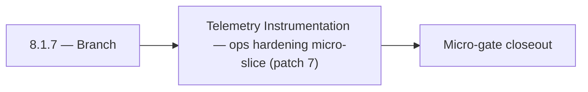

# 8.1.7 — Branch

- **Era:** `8.x` public/private APIs — hub [`versions.md`](../versions.md) · minors start at [`8.0 — API Era Foundation`](8.0%20%E2%80%94%20API%20Era%20Foundation.md)
- **Minor:** [8.1 — Telemetry Instrumentation](./8.1 — Telemetry Instrumentation.md)
- **Codename:** Branch
- **Status:** ✅ Completed
## Focus
Telemetry Instrumentation — ops hardening micro-slice (patch 7)

## Flowchart

## Micro-gate

| Track | Gate question | Answer / Evidence (fill at patch closeout) |
| --- | --- | --- |
| **Contract** | Versioning, public vs private surface, OpenAPI/module docs — `docs/backend/apis/` + endpoint matrices updated? | Document at patch closeout. |
| **Service** | `X-API-Key`, rate-limit headers, webhook/callback schemas — parity + smoke documented? | Document smoke paths. |
| **Surface** | Developer docs, external portal, profile/API-key UX — delta? | Document UX delta or N/A. |
| **Frontend** | `public-api-surface.md`, hooks/bindings, extension/email surfaces touched? | Telemetry instrumentation — `X-Trace-Id`, analytics taxonomy. Document at closeout. |
| **Data** | Lineage for external API usage, audit fields — `docs/backend/database/`? | Document lineage or N/A. |
| **Ops** | Postman, compatibility tests, replay runbooks — delta? | Document ops delta or N/A. |

## Tasks
### Ops
- ✅ Completed: 📌 Planned: **[appointment360]** — refine duplicate task (was: 📌 planned: api gateway throttle policies: align lambda concu…) | patch `8.1.7` band `7` | reason: specialize this file vs sibling patches; see docs/codebases/appointment360-codebase-analysis.md
- ✅ Completed: 📌 Planned: **[appointment360]** — refine duplicate task (was: 📌 planned: publish contact.ai api to internal developer port…) | patch `8.1.7` band `7` | reason: specialize this file vs sibling patches; see docs/codebases/appointment360-codebase-analysis.md
- ✅ Completed: 📌 Planned: **[appointment360]** — refine duplicate task (was: add compatibility gate: no contract drift between python and…) | patch `8.1.7` band `7` | reason: specialize this file vs sibling patches; see docs/codebases/appointment360-codebase-analysis.md
- ✅ Completed: 📌 Planned: **[appointment360]** — refine duplicate task (was: publish incident triage playbook for timeout spikes, 429 sto…) | patch `8.1.7` band `7` | reason: specialize this file vs sibling patches; see docs/codebases/appointment360-codebase-analysis.md

### Contract

- ✅ Completed: 📌 Planned: **[appointment360]** — Diff and document schema for operations like ConnectraClient, LAMBDA_AI_API_URL, LAMBDA_CONNECTRA_API_URL; align with roadmap | area: `backend-api` | files: `docs/backend/apis/*.md`, `contact360.io/api/app/graphql/schema.py` | reason: Keep GraphQL/REST contracts aligned for era 8.7 patch 8.1.7

### Service

- ✅ Completed: 📌 Planned: **[appointment360]** — refine duplicate task (was: 📌 planned: **[appointment360]** — service slice: - [ ] 🟡 in …) | patch `8.1.7` band `7` | reason: specialize this file vs sibling patches; see docs/codebases/appointment360-codebase-analysis.md

### Surface

- ✅ Completed: 📌 Planned: **[jobs]** — Verify UX for route `/` and bindings (patch 8.1.7 band 7) | area: `frontend-page` | files: `contact360/dashboard/app/page.tsx` | reason: Dashboard/extension surface for era 8 must match gateway contracts

### Data

- ✅ Completed: 📌 Planned: **[appointment360]** — refine duplicate task (was: 📌 planned: **[appointment360]** — update postgresql/es/s3 li…) | patch `8.1.7` band `7` | reason: specialize this file vs sibling patches; see docs/codebases/appointment360-codebase-analysis.md

## Service task slices
> Merged from era `8.x` public/private API task packs (P0→`.0`–`.2`, P1→`.3`–`.6`, Ops→`.7`–`.9`).

### logs.api
- compatibility and incident triage workflows tied to logs evidence

### Appointment360 (gateway)
- Rate-limit public API key requests separately from authenticated user requests
- Write test: createApiKey → query contacts with X-API-Key → verify access
- Document rate limit tiers for public API in developer docs

### contact.ai
- API gateway throttle policies: align Lambda concurrency limits with token bucket rate limits.
- Add contact.ai endpoints to public API monitoring dashboard.
- Publish contact.ai API to internal developer portal with OpenAPI spec and Postman collection.
- Run API contract tests in CI: validate response shape against OpenAPI spec on every deploy.

### Jobs
- backward compatibility gate per release
- deprecation and replay runbook

## Evidence gate
Patch closeout includes contract diff, smoke output, data lineage delta, and ops note
