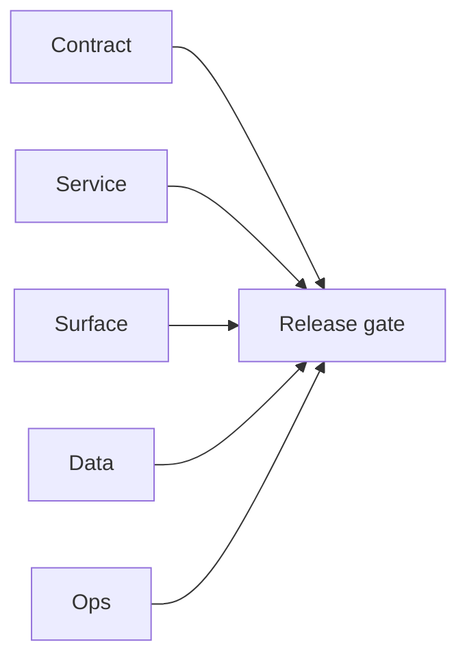

# 8.11.100 — EC2 email server api-endpoint patch linkage

## Scope

API-endpoint era mapping for EC2 email runtime contract and safety updates.

## Included patch intents

- `004-endpoint-contract-fixes.patch`: endpoint request contract alignment.
- `006-error-handling.patch`: endpoint result decoding/logging hardening.
- `002-cors-hardening.patch`: controlled cross-origin access policy.

## API outcome

- Better endpoint consistency, safer exposure posture, and clearer runtime error signals.

## Flowchart

Five-track delivery (contract / service / surface / data / ops) for this doc:

**Master hub:** [`docs/docs/flowchart.md`](../docs/flowchart.md) — cross-system diagrams and era strip (`0.x` → `10.x`).
