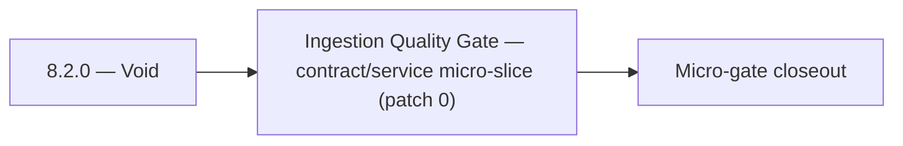

# 8.2.0 — Void

- **Era:** `8.x` public/private APIs — hub [`versions.md`](../versions.md) · minors start at [`8.0 — API Era Foundation`](8.0%20%E2%80%94%20API%20Era%20Foundation.md)
- **Minor:** [8.2 — Ingestion Quality Gate](./8.2 — Ingestion Quality Gate.md)
- **Codename:** Void
- **Status:** planned

## Focus
Ingestion Quality Gate — contract/service micro-slice (patch 0)

## Flowchart

## Micro-gate

| Track | Gate question | Answer / Evidence (fill at patch closeout) |
| --- | --- | --- |
| **Contract** | Versioning, public vs private surface, OpenAPI/module docs — `docs/backend/apis/` + endpoint matrices updated? | Document at patch closeout. |
| **Service** | `X-API-Key`, rate-limit headers, webhook/callback schemas — parity + smoke documented? | Document smoke paths. |
| **Surface** | Developer docs, external portal, profile/API-key UX — delta? | Document UX delta or N/A. |
| **Frontend** | `public-api-surface.md`, hooks/bindings, extension/email surfaces touched? | Ingestion quality gate — SN/partner payload contracts. Document at closeout. |
| **Data** | Lineage for external API usage, audit fields — `docs/backend/database/`? | Document lineage or N/A. |
| **Ops** | Postman, compatibility tests, replay runbooks — delta? | Document ops delta or N/A. |

## Tasks
### Contract
- 📌 Planned: **[appointment360]** — refine duplicate task (was: 📌 planned: publish internal api documentation for `/api/v1/a…) | patch `8.2.0` band `0` | reason: specialize this file vs sibling patches; see docs/codebases/appointment360-codebase-analysis.md
- 📌 Planned: **[appointment360]** — refine duplicate task (was: `retry-after`: seconds until reset) | patch `8.2.0` band `0` | reason: specialize this file vs sibling patches; see docs/codebases/appointment360-codebase-analysis.md
- 📌 Planned: **[appointment360]** — refine duplicate task (was: replace all era references with `8.x` and lock this pack to …) | patch `8.2.0` band `0` | reason: specialize this file vs sibling patches; see docs/codebases/appointment360-codebase-analysis.md
- 📌 Planned: **[appointment360]** — refine duplicate task (was: add idempotency contract for bulk/batch requests using `idem…) | patch `8.2.0` band `0` | reason: specialize this file vs sibling patches; see docs/codebases/appointment360-codebase-analysis.md

### Service
- 📌 Planned: **[appointment360]** — refine duplicate task (was: 📌 planned: implement rate limit response headers on all cont…) | patch `8.2.0` band `0` | reason: specialize this file vs sibling patches; see docs/codebases/appointment360-codebase-analysis.md
- 📌 Planned: **[appointment360]** — refine duplicate task (was: 📌 planned: expose usage stats endpoint or integrate with `ap…) | patch `8.2.0` band `0` | reason: specialize this file vs sibling patches; see docs/codebases/appointment360-codebase-analysis.md
- 📌 Planned: **[appointment360]** — refine duplicate task (was: ensure retry semantics are deterministic for provider transi…) | patch `8.2.0` band `0` | reason: specialize this file vs sibling patches; see docs/codebases/appointment360-codebase-analysis.md
- 📌 Planned: **[appointment360]** — refine duplicate task (was: 📌 planned: add endpoint version header and deprecation metad…) | patch `8.2.0` band `0` | reason: specialize this file vs sibling patches; see docs/codebases/appointment360-codebase-analysis.md

### Surface

- 📌 Planned: **[appointment360]** — refine duplicate task (was: 📌 planned: **[jobs]** — verify ux for route `/` and bindings…) | patch `8.2.0` band `0` | reason: specialize this file vs sibling patches; see docs/codebases/appointment360-codebase-analysis.md

### Data

- 📌 Planned: **[appointment360]** — refine duplicate task (was: 📌 planned: **[appointment360]** — update postgresql/es/s3 li…) | patch `8.2.0` band `0` | reason: specialize this file vs sibling patches; see docs/codebases/appointment360-codebase-analysis.md

### Ops

- 📌 Planned: **[appointment360]** — refine duplicate task (was: 📌 planned: **[platform]** — record smoke evidence, rollback,…) | patch `8.2.0` band `0` | reason: specialize this file vs sibling patches; see docs/codebases/appointment360-codebase-analysis.md

## Service task slices
> Merged from era `8.x` public/private API task packs (P0→`.0`–`.2`, P1→`.3`–`.6`, Ops→`.7`–`.9`).

### Salesnavigator
- Migrate route prefix from `/v1/` to `/api/v1/` for consistency with other services (or document as intentional divergence)
- Add standard rate-limit response headers: `X-RateLimit-Limit`, `X-RateLimit-Remaining`, `X-RateLimit-Reset`, `Retry-After`
- Add `X-Request-ID` request/response header as first-class contract
- Publish OpenAPI spec to developer docs portal
- Define per-key quota model: free tier (N profiles/day), paid tiers, enterprise unlimited
- Rate limiting middleware with `X-RateLimit-*` headers per API key
- `Retry-After` header on `429` response (seconds until quota reset)
- Usage counter increment on each `save-profiles` call — write to `api_usage` table keyed by `api_key_id`
- Return `X-Request-ID` in all responses
- `api_usage` table or row: `{api_key_id, service: "salesnavigator", date, call_count, profiles_saved}`
- Usage aggregation: daily and monthly totals per key

### Connectra
- versioned REST contract for partner/private usage
- partner key scope model by endpoint family
- webhook-ready job event envelope for async handoffs
- per-tenant rate limiting and `X-RateLimit-*` headers
- persistent job queue backing for ingestion/search jobs
- ES-PG reconciliation strategy with consistency checks
- API usage counters keyed by partner key + endpoint + version
- compatibility evidence artifacts for each released contract

### Emailcampaign
- GraphQL schema for `Campaign`, `Recipient`, `Template`, `Sequence`
- public REST contract `/v1/campaigns`
- webhook events: `campaign.created`, `campaign.completed`, `recipient.unsubscribed`
- GraphQL resolver module for create/get/list campaign operations
- webhook dispatcher with exponential backoff retry
- public API rate limit: 100 req/min per API key
- migrations for `webhook_subscriptions`
- migrations for `webhook_delivery_log`

## Evidence gate
Primary charter artifact created and linked in the parent minor doc
