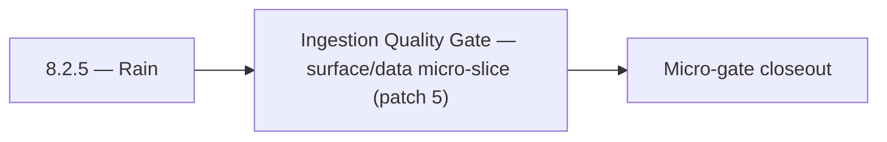

# 8.2.5 — Rain

- **Era:** `8.x` public/private APIs — hub [`versions.md`](../versions.md) · minors start at [`8.0 — API Era Foundation`](8.0%20%E2%80%94%20API%20Era%20Foundation.md)
- **Minor:** [8.2 — Ingestion Quality Gate](./8.2 — Ingestion Quality Gate.md)
- **Codename:** Rain
- **Status:** ✅ Completed
## Focus
Ingestion Quality Gate — surface/data micro-slice (patch 5)

## Flowchart

## Micro-gate

| Track | Gate question | Answer / Evidence (fill at patch closeout) |
| --- | --- | --- |
| **Contract** | Versioning, public vs private surface, OpenAPI/module docs — `docs/backend/apis/` + endpoint matrices updated? | Document at patch closeout. |
| **Service** | `X-API-Key`, rate-limit headers, webhook/callback schemas — parity + smoke documented? | Document smoke paths. |
| **Surface** | Developer docs, external portal, profile/API-key UX — delta? | Document UX delta or N/A. |
| **Frontend** | `public-api-surface.md`, hooks/bindings, extension/email surfaces touched? | Ingestion quality gate — SN/partner payload contracts. Document at closeout. |
| **Data** | Lineage for external API usage, audit fields — `docs/backend/database/`? | Document lineage or N/A. |
| **Ops** | Postman, compatibility tests, replay runbooks — delta? | Document ops delta or N/A. |

## Tasks
### Surface
- ✅ Completed: 📌 Planned: **[appointment360]** — refine duplicate task (was: 📌 planned: rate limit exceeded ui: show `retry-after` countd…) | patch `8.2.5` band `5` | reason: specialize this file vs sibling patches; see docs/codebases/appointment360-codebase-analysis.md
- ✅ Completed: 📌 Planned: **[appointment360]** — refine duplicate task (was: 📌 planned: postman public collection aligned to v1 only (no …) | patch `8.2.5` band `5` | reason: specialize this file vs sibling patches; see docs/codebases/appointment360-codebase-analysis.md
- ✅ Completed: 📌 Planned: **[appointment360]** — refine duplicate task (was: 📌 planned: api key management: sn service key visible in key…) | patch `8.2.5` band `5` | reason: specialize this file vs sibling patches; see docs/codebases/appointment360-codebase-analysis.md

### Data
- ✅ Completed: 📌 Planned: **[appointment360]** — refine duplicate task (was: 📌 planned: document usage data schema in `contact_ai_data_li…) | patch `8.2.5` band `5` | reason: specialize this file vs sibling patches; see docs/codebases/appointment360-codebase-analysis.md
- ✅ Completed: 📌 Planned: **[appointment360]** — refine duplicate task (was: 📌 planned: add request audit logs keyed by api key and endpo…) | patch `8.2.5` band `5` | reason: specialize this file vs sibling patches; see docs/codebases/appointment360-codebase-analysis.md
- ✅ Completed: 📌 Planned: **[appointment360]** — refine duplicate task (was: 📌 planned: quota enforcement: check usage before processing;…) | patch `8.2.5` band `5` | reason: specialize this file vs sibling patches; see docs/codebases/appointment360-codebase-analysis.md

### Contract

- ✅ Completed: 📌 Planned: **[appointment360]** — Diff and document schema for operations like ConnectraClient, LAMBDA_AI_API_URL, LAMBDA_CONNECTRA_API_URL; align with roadmap | area: `backend-api` | files: `docs/backend/apis/*.md`, `contact360.io/api/app/graphql/schema.py` | reason: Keep GraphQL/REST contracts aligned for era 8.5 patch 8.2.5

### Service

- ✅ Completed: 📌 Planned: **[appointment360]** — refine duplicate task (was: 📌 planned: **[appointment360]** — service slice: - [ ] 🟡 in …) | patch `8.2.5` band `5` | reason: specialize this file vs sibling patches; see docs/codebases/appointment360-codebase-analysis.md

### Ops

- ✅ Completed: 📌 Planned: **[platform]** — Record smoke evidence, rollback, and alerts (patch band 5: surface/data) | area: `ops` | files: `docs/commands/`, `.github/workflows/` | reason: Smoke, rollback, and observability for patch 8.2.5

## Service task slices
> Merged from era `8.x` public/private API task packs (P0→`.0`–`.2`, P1→`.3`–`.6`, Ops→`.7`–`.9`).

### Salesnavigator
- API settings page: show SN ingest usage vs. quota (progress bar: N / quota)
- Developer docs: document `POST /v1/save-profiles` and `POST /v1/scrape` for private API consumers
- API key management: SN service key visible in key list with usage stats
- Quota exceeded state: `SNSaveButton` disabled with "Quota exceeded" tooltip; link to upgrade
- `api_usage` table or row: `{api_key_id, service: "salesnavigator", date, call_count, profiles_saved}`
- Usage aggregation: daily and monthly totals per key
- Quota enforcement: check usage before processing; return `429` if exceeded
- Rate limiting middleware with `X-RateLimit-*` headers per API key
- `Retry-After` header on `429` response (seconds until quota reset)
- Usage counter increment on each `save-profiles` call — write to `api_usage` table keyed by `api_key_id`
- Return `X-Request-ID` in all responses

### Connectra
- API usage counters keyed by partner key + endpoint + version
- compatibility evidence artifacts for each released contract
- per-tenant rate limiting and `X-RateLimit-*` headers
- persistent job queue backing for ingestion/search jobs
- ES-PG reconciliation strategy with consistency checks

### Emailcampaign
- migrations for `webhook_subscriptions`
- migrations for `webhook_delivery_log`
- endpoint usage metrics by key/endpoint/version
- GraphQL resolver module for create/get/list campaign operations
- webhook dispatcher with exponential backoff retry
- public API rate limit: 100 req/min per API key

## Evidence gate
Patch closeout includes contract diff, smoke output, data lineage delta, and ops note
