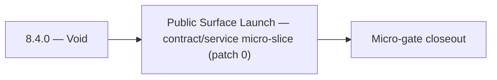

# 8.4.0 — Void

- **Era:** `8.x` public/private APIs — hub [`versions.md`](../versions.md) · minors start at [`8.0 — API Era Foundation`](8.0%20%E2%80%94%20API%20Era%20Foundation.md)
- **Minor:** [8.4 — Public Surface Launch](./8.4 — Public Surface Launch.md)
- **Codename:** Void
- **Status:** planned

## Focus
Public Surface Launch — contract/service micro-slice (patch 0)

## Flowchart

## Micro-gate

| Track | Gate question | Answer / Evidence (fill at patch closeout) |
| --- | --- | --- |
| **Contract** | Versioning, public vs private surface, OpenAPI/module docs — `docs/backend/apis/` + endpoint matrices updated? | Document at patch closeout. |
| **Service** | `X-API-Key`, rate-limit headers, webhook/callback schemas — parity + smoke documented? | Document smoke paths. |
| **Surface** | Developer docs, external portal, profile/API-key UX — delta? | Document UX delta or N/A. |
| **Frontend** | `public-api-surface.md`, hooks/bindings, extension/email surfaces touched? | Public surface launch — `X-API-Key`, public modules, developer docs. Document at closeout. |
| **Data** | Lineage for external API usage, audit fields — `docs/backend/database/`? | Document lineage or N/A. |
| **Ops** | Postman, compatibility tests, replay runbooks — delta? | Document ops delta or N/A. |

## Tasks
### Contract
- 📌 Planned: **[appointment360]** — refine duplicate task (was: 📌 planned: publish internal api documentation for `/api/v1/a…) | patch `8.4.0` band `0` | reason: specialize this file vs sibling patches; see docs/codebases/appointment360-codebase-analysis.md
- 📌 Planned: **[appointment360]** — refine duplicate task (was: `retry-after`: seconds until reset) | patch `8.4.0` band `0` | reason: specialize this file vs sibling patches; see docs/codebases/appointment360-codebase-analysis.md
- 📌 Planned: **[appointment360]** — refine duplicate task (was: replace all era references with `8.x` and lock this pack to …) | patch `8.4.0` band `0` | reason: specialize this file vs sibling patches; see docs/codebases/appointment360-codebase-analysis.md
- 📌 Planned: **[appointment360]** — refine duplicate task (was: add idempotency contract for bulk/batch requests using `idem…) | patch `8.4.0` band `0` | reason: specialize this file vs sibling patches; see docs/codebases/appointment360-codebase-analysis.md

### Service
- 📌 Planned: **[appointment360]** — refine duplicate task (was: 📌 planned: implement rate limit response headers on all cont…) | patch `8.4.0` band `0` | reason: specialize this file vs sibling patches; see docs/codebases/appointment360-codebase-analysis.md
- 📌 Planned: **[appointment360]** — refine duplicate task (was: 📌 planned: expose usage stats endpoint or integrate with `ap…) | patch `8.4.0` band `0` | reason: specialize this file vs sibling patches; see docs/codebases/appointment360-codebase-analysis.md
- 📌 Planned: **[appointment360]** — refine duplicate task (was: ensure retry semantics are deterministic for provider transi…) | patch `8.4.0` band `0` | reason: specialize this file vs sibling patches; see docs/codebases/appointment360-codebase-analysis.md
- 📌 Planned: **[appointment360]** — refine duplicate task (was: 📌 planned: add endpoint version header and deprecation metad…) | patch `8.4.0` band `0` | reason: specialize this file vs sibling patches; see docs/codebases/appointment360-codebase-analysis.md

### Surface

- 📌 Planned: **[appointment360]** — refine duplicate task (was: 📌 planned: **[jobs]** — verify ux for route `/` and bindings…) | patch `8.4.0` band `0` | reason: specialize this file vs sibling patches; see docs/codebases/appointment360-codebase-analysis.md

### Data

- 📌 Planned: **[appointment360]** — refine duplicate task (was: 📌 planned: **[appointment360]** — update postgresql/es/s3 li…) | patch `8.4.0` band `0` | reason: specialize this file vs sibling patches; see docs/codebases/appointment360-codebase-analysis.md

### Ops

- 📌 Planned: **[appointment360]** — refine duplicate task (was: 📌 planned: **[platform]** — record smoke evidence, rollback,…) | patch `8.4.0` band `0` | reason: specialize this file vs sibling patches; see docs/codebases/appointment360-codebase-analysis.md

## Service task slices
> Merged from era `8.x` public/private API task packs (P0→`.0`–`.2`, P1→`.3`–`.6`, Ops→`.7`–`.9`).

### Appointment360 (gateway)
- Define PagesQuery { page(id), pages(type) } for DocsAI-backed content
- Define SavedSearchQuery { savedSearch(id), savedSearches(type) }
- Define SavedSearchMutation { createSavedSearch, updateSavedSearch, deleteSavedSearch }
- Define ProfileQuery { apiKeys(), sessions() }
- Define ProfileMutation { createApiKey, deleteApiKey, updateProfile }
- Define TwoFactorQuery { twoFactorStatus() }
- Define TwoFactorMutation { enableTwoFactor, verifyTwoFactor, disableTwoFactor }
- Define public API key authentication path: X-API-Key header → apikey_auth_guard
- Implement DocsAIClient in app/clients/docsai_client.py
- Wire pages(type) query → DocsAIClient.list_pages(type)
- Wire page(id) query → DocsAIClient.get_page(id)
- Set DOCSAI_ENABLED flag; pages module gracefully returns empty if disabled
- Implement savedSearches CRUD in app/repositories/saved_search.py
- Implement apiKeys CRUD in app/repositories/profile.py
- Implement sessions list in app/repositories/profile.py
- Implement public API key auth guard: X-API-Key → user lookup → Context.user
- Wire public API key auth through same context layer (bypass JWT)
- Profile page → query apiKeys() + mutation createApiKey / deleteApiKey
- Profile page, sessions tab → query sessions()
- Saved searches sidebar on /contacts and /companies → query savedSearches(type)
- Save search button → mutation createSavedSearch(name, type, vql_json)
- API key copy button with one-time display + masked subsequent views
- useSavedSearches hook: load, apply, create, delete
- useApiKeys hook: create, revoke, list
- Create api_keys table: uuid, user_uuid, key_hash, name, last_used_at, created_at
- Create saved_searches table: uuid, user_uuid, type (contact/company), name, vql_json, created_at
- Run Alembic migration for all 8.x tables
- Configure DOCSAI_API_URL, DOCSAI_API_KEY, DOCSAI_ENABLED in .env.example

### contact.ai
- Publish internal API documentation for `/api/v1/ai-chats/` and `/api/v1/ai/` in Contact360 developer docs.
- Define rate limit contract:
- `X-RateLimit-Limit`: total requests per window
- `X-RateLimit-Remaining`: remaining requests
- `Retry-After`: seconds until reset
- Add `X-Request-ID` request tracing header to all responses.
- Define private API key scopes: `ai:chat`, `ai:utilities`; document in API key management.
- Lock OpenAPI spec as contract artifact for `8.x`; publish to DocsAI.
- Implement rate limit response headers on all contact.ai endpoints (align with token bucket state).
- Implement scoped API key validation: key must have `ai:chat` scope for chat routes, `ai:utilities` for utility routes.
- Add `X-Request-ID` header generation and propagation through Lambda context.
- Implement AI usage counter per user/key: increment on each successful API call.
- Expose usage stats endpoint or integrate with `appointment360` usage tracking.
- Add AI usage counters to `api_usage` table or dedicated `ai_usage_log` table: `{user_id, key_id, endpoint, model, timestamp}`.
- Document usage data schema in `contact_ai_data_lineage.md`.

### Salesnavigator
- Migrate route prefix from `/v1/` to `/api/v1/` for consistency with other services (or document as intentional divergence)
- Add standard rate-limit response headers: `X-RateLimit-Limit`, `X-RateLimit-Remaining`, `X-RateLimit-Reset`, `Retry-After`
- Add `X-Request-ID` request/response header as first-class contract
- Publish OpenAPI spec to developer docs portal
- Define per-key quota model: free tier (N profiles/day), paid tiers, enterprise unlimited
- Rate limiting middleware with `X-RateLimit-*` headers per API key
- `Retry-After` header on `429` response (seconds until quota reset)
- Usage counter increment on each `save-profiles` call — write to `api_usage` table keyed by `api_key_id`
- Return `X-Request-ID` in all responses
- `api_usage` table or row: `{api_key_id, service: "salesnavigator", date, call_count, profiles_saved}`
- Usage aggregation: daily and monthly totals per key

## Evidence gate
Primary charter artifact created and linked in the parent minor doc
