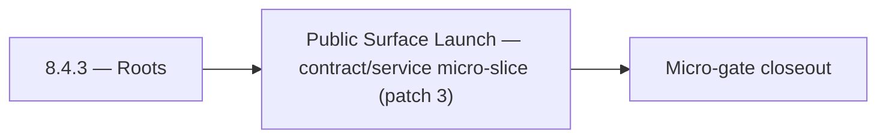

# 8.4.3 — Roots

- **Era:** `8.x` public/private APIs — hub [`versions.md`](../versions.md) · minors start at [`8.0 — API Era Foundation`](8.0%20%E2%80%94%20API%20Era%20Foundation.md)
- **Minor:** [8.4 — Public Surface Launch](./8.4 — Public Surface Launch.md)
- **Codename:** Roots
- **Status:** ✅ Completed
## Focus
Public Surface Launch — contract/service micro-slice (patch 3)

## Flowchart

## Micro-gate

| Track | Gate question | Answer / Evidence (fill at patch closeout) |
| --- | --- | --- |
| **Contract** | Versioning, public vs private surface, OpenAPI/module docs — `docs/backend/apis/` + endpoint matrices updated? | Document at patch closeout. |
| **Service** | `X-API-Key`, rate-limit headers, webhook/callback schemas — parity + smoke documented? | Document smoke paths. |
| **Surface** | Developer docs, external portal, profile/API-key UX — delta? | Document UX delta or N/A. |
| **Frontend** | `public-api-surface.md`, hooks/bindings, extension/email surfaces touched? | Public surface launch — `X-API-Key`, public modules, developer docs. Document at closeout. |
| **Data** | Lineage for external API usage, audit fields — `docs/backend/database/`? | Document lineage or N/A. |
| **Ops** | Postman, compatibility tests, replay runbooks — delta? | Document ops delta or N/A. |

## Tasks
### Contract
- ✅ Completed: 📌 Planned: **[appointment360]** — refine duplicate task (was: `x-ratelimit-remaining`: remaining requests) | patch `8.4.3` band `3` | reason: specialize this file vs sibling patches; see docs/codebases/appointment360-codebase-analysis.md
- ✅ Completed: 📌 Planned: **[appointment360]** — refine duplicate task (was: 📌 planned: lock openapi spec as contract artifact for `8.x`;…) | patch `8.4.3` band `3` | reason: specialize this file vs sibling patches; see docs/codebases/appointment360-codebase-analysis.md
- ✅ Completed: 📌 Planned: **[appointment360]** — refine duplicate task (was: define partner-safe error envelope (`code`, `message`, `requ…) | patch `8.4.3` band `3` | reason: specialize this file vs sibling patches; see docs/codebases/appointment360-codebase-analysis.md
- ✅ Completed: 📌 Planned: **[appointment360]** — refine duplicate task (was: 📌 planned: define webhook signature and retry contract as pu…) | patch `8.4.3` band `3` | reason: specialize this file vs sibling patches; see docs/codebases/appointment360-codebase-analysis.md

### Service
- ✅ Completed: 📌 Planned: **[appointment360]** — refine duplicate task (was: 📌 planned: implement ai usage counter per user/key: incremen…) | patch `8.4.3` band `3` | reason: specialize this file vs sibling patches; see docs/codebases/appointment360-codebase-analysis.md
- ✅ Completed: 📌 Planned: **[appointment360]** — refine duplicate task (was: add endpoint-level rate-limit policy and response headers (`…) | patch `8.4.3` band `3` | reason: specialize this file vs sibling patches; see docs/codebases/appointment360-codebase-analysis.md
- ✅ Completed: 📌 Planned: **[appointment360]** — refine duplicate task (was: 📌 planned: add key rotation and key revocation path.) | patch `8.4.3` band `3` | reason: specialize this file vs sibling patches; see docs/codebases/appointment360-codebase-analysis.md
- ✅ Completed: 📌 Planned: **[appointment360]** — refine duplicate task (was: 📌 planned: usage counter increment on each `save-profiles` c…) | patch `8.4.3` band `3` | reason: specialize this file vs sibling patches; see docs/codebases/appointment360-codebase-analysis.md

### Surface

- ✅ Completed: 📌 Planned: **[jobs]** — Verify UX for route `/` and bindings (patch 8.4.3 band 3) | area: `frontend-page` | files: `contact360/dashboard/app/page.tsx` | reason: Dashboard/extension surface for era 8 must match gateway contracts

### Data

- ✅ Completed: 📌 Planned: **[appointment360]** — refine duplicate task (was: 📌 planned: **[appointment360]** — update postgresql/es/s3 li…) | patch `8.4.3` band `3` | reason: specialize this file vs sibling patches; see docs/codebases/appointment360-codebase-analysis.md

### Ops

- ✅ Completed: 📌 Planned: **[platform]** — Record smoke evidence, rollback, and alerts (patch band 3: surface/data) | area: `ops` | files: `docs/commands/`, `.github/workflows/` | reason: Smoke, rollback, and observability for patch 8.4.3

## Service task slices
> Merged from era `8.x` public/private API task packs (P0→`.0`–`.2`, P1→`.3`–`.6`, Ops→`.7`–`.9`).

### Appointment360 (gateway)
- Document public vs private API surface in docs/backend/apis/08_PUBLIC_API_MODULE.md
- Create API key usage docs for external developers
- Add /health check for DocsAI dependency
- Implement TOTP-based 2FA: pyotp library, totp_secret column in users
- Profile page, 2FA section → query twoFactorStatus() + mutations
- DocsAI-powered help widget → query pages(type: "help")
- useTwoFactor hook: enable flow, verify OTP, disable
- Create sessions table: uuid, user_uuid, ip, user_agent, created_at, last_seen_at
- Add totp_secret column to users table for 2FA
- Write Postman collection for public API: X-API-Key authentication path
- Rate-limit public API key requests separately from authenticated user requests
- Write test: createApiKey → query contacts with X-API-Key → verify access
- Document rate limit tiers for public API in developer docs

### contact.ai
- API settings page: show AI-specific quota (chat calls/month, utility calls/month) alongside other API metrics.
- Rate limit exceeded UI: show `Retry-After` countdown in `AIErrorState` component.
- Developer documentation page: document AI endpoints, auth model, rate limits, request/response examples.
- Add AI usage counters to `api_usage` table or dedicated `ai_usage_log` table: `{user_id, key_id, endpoint, model, timestamp}`.
- Document usage data schema in `contact_ai_data_lineage.md`.
- Confirm usage data does not contain message content (privacy).
- Implement rate limit response headers on all contact.ai endpoints (align with token bucket state).
- Implement scoped API key validation: key must have `ai:chat` scope for chat routes, `ai:utilities` for utility routes.
- Add `X-Request-ID` header generation and propagation through Lambda context.
- Implement AI usage counter per user/key: increment on each successful API call.
- Expose usage stats endpoint or integrate with `appointment360` usage tracking.

### Salesnavigator
- API settings page: show SN ingest usage vs. quota (progress bar: N / quota)
- Developer docs: document `POST /v1/save-profiles` and `POST /v1/scrape` for private API consumers
- API key management: SN service key visible in key list with usage stats
- Quota exceeded state: `SNSaveButton` disabled with "Quota exceeded" tooltip; link to upgrade
- `api_usage` table or row: `{api_key_id, service: "salesnavigator", date, call_count, profiles_saved}`
- Usage aggregation: daily and monthly totals per key
- Quota enforcement: check usage before processing; return `429` if exceeded
- Rate limiting middleware with `X-RateLimit-*` headers per API key
- `Retry-After` header on `429` response (seconds until quota reset)
- Usage counter increment on each `save-profiles` call — write to `api_usage` table keyed by `api_key_id`
- Return `X-Request-ID` in all responses

## Evidence gate
Patch closeout includes contract diff, smoke output, data lineage delta, and ops note
