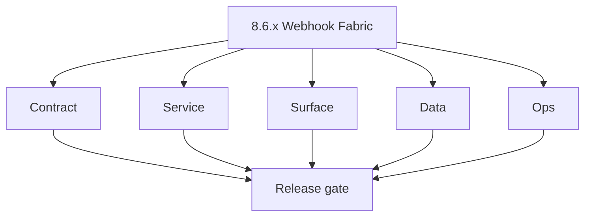
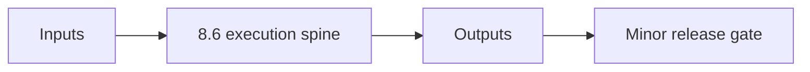

# Version 8.6 - Webhook Fabric

- Focus: webhook delivery v1, HMAC signing, retry/DLQ across jobs + emailcampaign.

## Patch Checklist
8.6.0 scope freeze, 8.6.1 contracts, 8.6.2 lineage, 8.6.3 services, 8.6.4 UI, 8.6.5 retry/replay, 8.6.6 secrets isolation, 8.6.7 observability, 8.6.8 Postman compat, 8.6.9 release evidence.

## References
- Endpoints: `docs/backend/endpoints/jobs_endpoint_era_matrix.json`, `docs/backend/endpoints/emailcampaign_endpoint_era_matrix.json`
- Lineage: `docs/backend/database/jobs_data_lineage.md`, `docs/backend/database/emailcampaign_data_lineage.md`
- UI: `docs/frontend/jobs-ui-bindings.md`
- **Patch closure:** Every codenamed patch file includes **Micro-gate** + **Service task slices**. Era hub: [`versions.md`](../versions.md).
### Micro-gate reference (apply at every `8.N.P`)

| Track | Gate question (must answer Yes or document waiver) |
| --- | --- |
| **Contract** | Versioning, public vs private API surface, module/OpenAPI docs — `docs/backend/apis/` + endpoint matrices updated? |
| **Service** | `X-API-Key`, rate-limit headers, webhook/callback contracts — smoke + parity documented? |
| **Surface** | Developer docs, external portal, profile/API-key UX — delta? |
| **Frontend** | `public-api-surface.md`, hooks/bindings, extension/email — delta? |
| **Data** | External API lineage, audit fields — `docs/backend/database/` updated? |
| **Ops** | Postman, compatibility tests, replay runbooks — recorded? |
| **Architecture** | Go/Gin satellites only via Python GraphQL gateway (`contact360.io/api`); Next.js `NEXT_PUBLIC_GRAPHQL_URL`; Postgres-first / Redis exit per `docs/docs/data-stores-postgres.md`. |

**Patch ladder:** Codenames per minor — see patch table below (`Void`→`Bloom` unless minor defines a custom ladder).

## Patches

| Patch | Codename | Doc |
| --- | --- | --- |
| `8.6.0` | Void | [`8.6.0` — Void](8.6.0 — Void.md) |
| `8.6.1` | Seed | [`8.6.1` — Seed](8.6.1 — Seed.md) |
| `8.6.2` | Sprout | [`8.6.2` — Sprout](8.6.2 — Sprout.md) |
| `8.6.3` | Roots | [`8.6.3` — Roots](8.6.3 — Roots.md) |
| `8.6.4` | Soil | [`8.6.4` — Soil](8.6.4 — Soil.md) |
| `8.6.5` | Rain | [`8.6.5` — Rain](8.6.5 — Rain.md) |
| `8.6.6` | Stem | [`8.6.6` — Stem](8.6.6 — Stem.md) |
| `8.6.7` | Branch | [`8.6.7` — Branch](8.6.7 — Branch.md) |
| `8.6.8` | Leaf | [`8.6.8` — Leaf](8.6.8 — Leaf.md) |
| `8.6.9` | Bloom | [`8.6.9` — Bloom](8.6.9 — Bloom.md) |

## Flowchart

### Runtime focus (unique to this minor)

## Patch ladder (8.6.0 - 8.6.9)

### Micro-gate reference (apply at every patch)

| Track | Gate question (must answer Yes or waiver) |
| --- | --- |
| **Contract** | Contract/API change captured with diff or explicit no-change note |
| **Service** | Service health and smoke for affected paths pass |
| **Surface** | UI/admin/extension impact documented or N/A |
| **Frontend** | Routes/components/hooks affected listed or N/A |
| **Data** | Migrations/index/lineage deltas linked or N/A |
| **Ops** | Rollback/secrets/CI/runbook delta linked or N/A |

**Patch intent bands:** `.0` charter, `.1-.2` scaffold, `.3-.5` hardening, `.6-.8` integration, `.9` freeze/handoff.

| Patch | Codename | Focus | Evidence gate |
| --- | --- | --- | --- |
| `8.6.0` | Void | patch focus | charter artifact linked |
| `8.6.1` | Seed | patch focus | closeout evidence attached |
| `8.6.2` | Sprout | patch focus | closeout evidence attached |
| `8.6.3` | Roots | patch focus | closeout evidence attached |
| `8.6.4` | Soil | patch focus | closeout evidence attached |
| `8.6.5` | Rain | patch focus | closeout evidence attached |
| `8.6.6` | Stem | patch focus | closeout evidence attached |
| `8.6.7` | Branch | patch focus | closeout evidence attached |
| `8.6.8` | Leaf | patch focus | closeout evidence attached |
| `8.6.9` | Bloom | patch focus | handoff documented |

## Release Gate and Evidence

### Master Task Checklist
- 📌 Planned: Track-level closure evidence linked

### Backend API and Endpoints
- 📌 Planned: Endpoint/contract parity verified

### Database and Data Lineage
- 📌 Planned: Migration and lineage references linked

### Frontend UX
- 📌 Planned: UX/route behavior evidence linked

### UI Elements
- 📌 Planned: Components/checklist closeout captured

### Flow and Graph
- 📌 Planned: Runtime graph reflects implementation

### Validation
- 📌 Planned: Smoke/CI/lint checks recorded

### Release Gate
- 📌 Planned: Minor ready for handoff to next minor
## Tasks

### Contract

- ✅ Completed: 📌 Planned: **[appointment360]** — Diff and document schema for operations like ConnectraClient, LAMBDA_AI_API_URL, LAMBDA_CONNECTRA_API_URL; align with roadmap | area: `backend-api` | files: `docs/backend/apis/*.md`, `contact360.io/api/app/graphql/schema.py` | reason: Keep GraphQL/REST contracts aligned for era 8.0 patch 8.6.0

- 📌 Planned: **[appointment360]** — refine duplicate task (was: 📌 planned: **[architecture]** — product **graphql** remains …) | patch `8.6.0` band `0` | reason: specialize this file vs sibling patches; see docs/codebases/appointment360-codebase-analysis.md
### Service

- ✅ Completed: 📌 Planned: **[appointment360]** — refine duplicate task (was: 📌 planned: **[appointment360]** — service slice: - [ ] 🟡 in …) | patch `8.6.0` band `0` | reason: specialize this file vs sibling patches; see docs/codebases/appointment360-codebase-analysis.md
- ✅ Completed: 📌 Planned: **[appointment360]** — refine duplicate task (was: 📌 planned: **[logsapi]** — harden primary worker/gateway int…) | patch `8.6.0` band `0` | reason: specialize this file vs sibling patches; see docs/codebases/appointment360-codebase-analysis.md

- 📌 Planned: **[appointment360]** — refine duplicate task (was: 📌 planned: **[architecture]** — **go/gin satellites** in sco…) | patch `8.6.0` band `0` | reason: specialize this file vs sibling patches; see docs/codebases/appointment360-codebase-analysis.md
### Surface

- 📌 Planned: **[appointment360]** — refine duplicate task (was: 📌 planned: **[appointment360]** — refine duplicate task (was…) | patch `8.6.0` band `0` | reason: specialize this file vs sibling patches; see docs/codebases/appointment360-codebase-analysis.md

### Data

- 📌 Planned: **[appointment360]** — refine duplicate task (was: 📌 planned: **[appointment360]** — refine duplicate task (was…) | patch `8.6.0` band `0` | reason: specialize this file vs sibling patches; see docs/codebases/appointment360-codebase-analysis.md

- 📌 Planned: **[appointment360]** — refine duplicate task (was: 📌 planned: **[architecture]** — **postgresql-first** per `do…) | patch `8.6.0` band `0` | reason: specialize this file vs sibling patches; see docs/codebases/appointment360-codebase-analysis.md
### Ops

- 📌 Planned: **[appointment360]** — refine duplicate task (was: 📌 planned: **[appointment360]** — refine duplicate task (was…) | patch `8.6.0` band `0` | reason: specialize this file vs sibling patches; see docs/codebases/appointment360-codebase-analysis.md

- 📌 Planned: **[appointment360]** — refine duplicate task (was: 📌 planned: **[architecture]** — **observability**: correlate…) | patch `8.6.0` band `0` | reason: specialize this file vs sibling patches; see docs/codebases/appointment360-codebase-analysis.md
