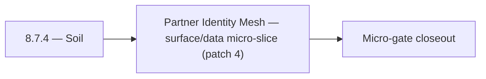

# 8.7.4 — Soil

- **Era:** `8.x` public/private APIs — hub [`versions.md`](../versions.md) · minors start at [`8.0 — API Era Foundation`](8.0%20%E2%80%94%20API%20Era%20Foundation.md)
- **Minor:** [8.7 — Partner Identity Mesh](./8.7 — Partner Identity Mesh.md)
- **Codename:** Soil
- **Status:** planned

## Focus
Partner Identity Mesh — surface/data micro-slice (patch 4)

## Flowchart

## Micro-gate

| Track | Gate question | Answer / Evidence (fill at patch closeout) |
| --- | --- | --- |
| **Contract** | Versioning, public vs private surface, OpenAPI/module docs — `docs/backend/apis/` + endpoint matrices updated? | Document at patch closeout. |
| **Service** | `X-API-Key`, rate-limit headers, webhook/callback schemas — parity + smoke documented? | Document smoke paths. |
| **Surface** | Developer docs, external portal, profile/API-key UX — delta? | Document UX delta or N/A. |
| **Frontend** | `public-api-surface.md`, hooks/bindings, extension/email surfaces touched? | Partner identity mesh — scoped keys, partner auth paths. Document at closeout. |
| **Data** | Lineage for external API usage, audit fields — `docs/backend/database/`? | Document lineage or N/A. |
| **Ops** | Postman, compatibility tests, replay runbooks — delta? | Document ops delta or N/A. |

## Tasks
### Surface
- 📌 Planned: **[appointment360]** — refine duplicate task (was: 📌 planned: api settings page: show ai-specific quota (chat c…) | patch `8.7.4` band `4` | reason: specialize this file vs sibling patches; see docs/codebases/appointment360-codebase-analysis.md
- 📌 Planned: **[appointment360]** — refine duplicate task (was: 📌 planned: developer portal docs for verify, bulk, jobs, and…) | patch `8.7.4` band `4` | reason: specialize this file vs sibling patches; see docs/codebases/appointment360-codebase-analysis.md
- 📌 Planned: **[appointment360]** — refine duplicate task (was: 📌 planned: developer docs: document `post /v1/save-profiles`…) | patch `8.7.4` band `4` | reason: specialize this file vs sibling patches; see docs/codebases/appointment360-codebase-analysis.md

### Data
- 📌 Planned: **[appointment360]** — refine duplicate task (was: 📌 planned: add ai usage counters to `api_usage` table or ded…) | patch `8.7.4` band `4` | reason: specialize this file vs sibling patches; see docs/codebases/appointment360-codebase-analysis.md
- 📌 Planned: **[appointment360]** — refine duplicate task (was: 📌 planned: add `api_key_scopes` and `api_key_audit` tables.) | patch `8.7.4` band `4` | reason: specialize this file vs sibling patches; see docs/codebases/appointment360-codebase-analysis.md
- 📌 Planned: **[appointment360]** — refine duplicate task (was: 📌 planned: usage aggregation: daily and monthly totals per k…) | patch `8.7.4` band `4` | reason: specialize this file vs sibling patches; see docs/codebases/appointment360-codebase-analysis.md

### Contract

- 📌 Planned: **[appointment360]** — Diff and document schema for operations like ConnectraClient, LAMBDA_AI_API_URL, LAMBDA_CONNECTRA_API_URL; align with roadmap | area: `backend-api` | files: `docs/backend/apis/*.md`, `contact360.io/api/app/graphql/schema.py` | reason: Keep GraphQL/REST contracts aligned for era 8.4 patch 8.7.4

### Service

- 📌 Planned: **[appointment360]** — refine duplicate task (was: 📌 planned: **[appointment360]** — service slice: - [ ] 🟡 in …) | patch `8.7.4` band `4` | reason: specialize this file vs sibling patches; see docs/codebases/appointment360-codebase-analysis.md

### Ops

- 📌 Planned: **[platform]** — Record smoke evidence, rollback, and alerts (patch band 4: surface/data) | area: `ops` | files: `docs/commands/`, `.github/workflows/` | reason: Smoke, rollback, and observability for patch 8.7.4

## Service task slices
> Merged from era `8.x` public/private API task packs (P0→`.0`–`.2`, P1→`.3`–`.6`, Ops→`.7`–`.9`).

### Salesnavigator
- API settings page: show SN ingest usage vs. quota (progress bar: N / quota)
- Developer docs: document `POST /v1/save-profiles` and `POST /v1/scrape` for private API consumers
- API key management: SN service key visible in key list with usage stats
- Quota exceeded state: `SNSaveButton` disabled with "Quota exceeded" tooltip; link to upgrade
- `api_usage` table or row: `{api_key_id, service: "salesnavigator", date, call_count, profiles_saved}`
- Usage aggregation: daily and monthly totals per key
- Quota enforcement: check usage before processing; return `429` if exceeded
- Rate limiting middleware with `X-RateLimit-*` headers per API key
- `Retry-After` header on `429` response (seconds until quota reset)
- Usage counter increment on each `save-profiles` call — write to `api_usage` table keyed by `api_key_id`
- Return `X-Request-ID` in all responses

### Mailvetter
- Developer portal docs for verify, bulk, jobs, and results flows.
- Postman public collection aligned to v1 only (no legacy).
- Add `api_key_scopes` and `api_key_audit` tables.
- Add request audit logs keyed by API key and endpoint.
- Implement key scope enforcement middleware.
- Add key rotation and key revocation path.
- Add endpoint version header and deprecation metadata.

### Appointment360 (gateway)
- Document public vs private API surface in docs/backend/apis/08_PUBLIC_API_MODULE.md
- Create API key usage docs for external developers
- Add /health check for DocsAI dependency
- Implement TOTP-based 2FA: pyotp library, totp_secret column in users
- Profile page, 2FA section → query twoFactorStatus() + mutations
- DocsAI-powered help widget → query pages(type: "help")
- useTwoFactor hook: enable flow, verify OTP, disable
- Create sessions table: uuid, user_uuid, ip, user_agent, created_at, last_seen_at
- Add totp_secret column to users table for 2FA
- Write Postman collection for public API: X-API-Key authentication path
- Rate-limit public API key requests separately from authenticated user requests
- Write test: createApiKey → query contacts with X-API-Key → verify access
- Document rate limit tiers for public API in developer docs

## Evidence gate
Patch closeout includes contract diff, smoke output, data lineage delta, and ops note
