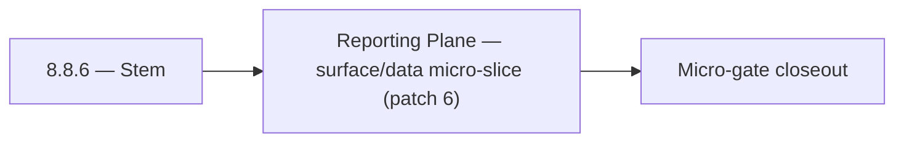

# 8.8.6 — Stem

- **Era:** `8.x` public/private APIs — hub [`versions.md`](../versions.md) · minors start at [`8.0 — API Era Foundation`](8.0%20%E2%80%94%20API%20Era%20Foundation.md)
- **Minor:** [8.8 — Reporting Plane](./8.8 — Reporting Plane.md)
- **Codename:** Stem
- **Status:** planned

## Focus
Reporting Plane — surface/data micro-slice (patch 6)

## Flowchart

## Micro-gate

| Track | Gate question | Answer / Evidence (fill at patch closeout) |
| --- | --- | --- |
| **Contract** | Versioning, public vs private surface, OpenAPI/module docs — `docs/backend/apis/` + endpoint matrices updated? | Document at patch closeout. |
| **Service** | `X-API-Key`, rate-limit headers, webhook/callback schemas — parity + smoke documented? | Document smoke paths. |
| **Surface** | Developer docs, external portal, profile/API-key UX — delta? | Document UX delta or N/A. |
| **Frontend** | `public-api-surface.md`, hooks/bindings, extension/email surfaces touched? | Reporting plane — analytics/reporting APIs and evidence. Document at closeout. |
| **Data** | Lineage for external API usage, audit fields — `docs/backend/database/`? | Document lineage or N/A. |
| **Ops** | Postman, compatibility tests, replay runbooks — delta? | Document ops delta or N/A. |

## Tasks
### Surface
- 📌 Planned: **[appointment360]** — refine duplicate task (was: 📌 planned: developer documentation page: document ai endpoin…) | patch `8.8.6` band `6` | reason: specialize this file vs sibling patches; see docs/codebases/appointment360-codebase-analysis.md
- 📌 Planned: **[appointment360]** — refine duplicate task (was: 📌 planned: api settings page: show sn ingest usage vs. quota…) | patch `8.8.6` band `6` | reason: specialize this file vs sibling patches; see docs/codebases/appointment360-codebase-analysis.md
- 📌 Planned: **[appointment360]** — refine duplicate task (was: 📌 planned: quota exceeded state: `snsavebutton` disabled wit…) | patch `8.8.6` band `6` | reason: specialize this file vs sibling patches; see docs/codebases/appointment360-codebase-analysis.md

### Data
- 📌 Planned: **[appointment360]** — refine duplicate task (was: 📌 planned: confirm usage data does not contain message conte…) | patch `8.8.6` band `6` | reason: specialize this file vs sibling patches; see docs/codebases/appointment360-codebase-analysis.md
- 📌 Planned: **[appointment360]** — refine duplicate task (was: 📌 planned: `api_usage` table or row: `{api_key_id, service: …) | patch `8.8.6` band `6` | reason: specialize this file vs sibling patches; see docs/codebases/appointment360-codebase-analysis.md

### Contract

- 📌 Planned: **[appointment360]** — Diff and document schema for operations like ConnectraClient, LAMBDA_AI_API_URL, LAMBDA_CONNECTRA_API_URL; align with roadmap | area: `backend-api` | files: `docs/backend/apis/*.md`, `contact360.io/api/app/graphql/schema.py` | reason: Keep GraphQL/REST contracts aligned for era 8.6 patch 8.8.6

### Service

- 📌 Planned: **[appointment360]** — refine duplicate task (was: 📌 planned: **[appointment360]** — service slice: - [ ] 🟡 in …) | patch `8.8.6` band `6` | reason: specialize this file vs sibling patches; see docs/codebases/appointment360-codebase-analysis.md

### Ops

- 📌 Planned: **[platform]** — Record smoke evidence, rollback, and alerts (patch band 6: surface/data) | area: `ops` | files: `docs/commands/`, `.github/workflows/` | reason: Smoke, rollback, and observability for patch 8.8.6

## Service task slices
> Merged from era `8.x` public/private API task packs (P0→`.0`–`.2`, P1→`.3`–`.6`, Ops→`.7`–`.9`).

### logs.api
- API log viewer with presets, filtering, and export
- lineage using `trace_id` and `request_id` across webhook/public paths
- endpoint-scoped and key-scoped query support
- endpoint-level audit writes for all public/private calls

### Appointment360 (gateway)
- Document public vs private API surface in docs/backend/apis/08_PUBLIC_API_MODULE.md
- Create API key usage docs for external developers
- Add /health check for DocsAI dependency
- Implement TOTP-based 2FA: pyotp library, totp_secret column in users
- Profile page, 2FA section → query twoFactorStatus() + mutations
- DocsAI-powered help widget → query pages(type: "help")
- useTwoFactor hook: enable flow, verify OTP, disable
- Create sessions table: uuid, user_uuid, ip, user_agent, created_at, last_seen_at
- Add totp_secret column to users table for 2FA
- Write Postman collection for public API: X-API-Key authentication path
- Rate-limit public API key requests separately from authenticated user requests
- Write test: createApiKey → query contacts with X-API-Key → verify access
- Document rate limit tiers for public API in developer docs

### Emailcampaign
- migrations for `webhook_subscriptions`
- migrations for `webhook_delivery_log`
- endpoint usage metrics by key/endpoint/version
- GraphQL resolver module for create/get/list campaign operations
- webhook dispatcher with exponential backoff retry
- public API rate limit: 100 req/min per API key

### contact.ai
- API settings page: show AI-specific quota (chat calls/month, utility calls/month) alongside other API metrics.
- Rate limit exceeded UI: show `Retry-After` countdown in `AIErrorState` component.
- Developer documentation page: document AI endpoints, auth model, rate limits, request/response examples.
- Add AI usage counters to `api_usage` table or dedicated `ai_usage_log` table: `{user_id, key_id, endpoint, model, timestamp}`.
- Document usage data schema in `contact_ai_data_lineage.md`.
- Confirm usage data does not contain message content (privacy).
- Implement rate limit response headers on all contact.ai endpoints (align with token bucket state).
- Implement scoped API key validation: key must have `ai:chat` scope for chat routes, `ai:utilities` for utility routes.
- Add `X-Request-ID` header generation and propagation through Lambda context.
- Implement AI usage counter per user/key: increment on each successful API call.
- Expose usage stats endpoint or integrate with `appointment360` usage tracking.

## Evidence gate
Patch closeout includes contract diff, smoke output, data lineage delta, and ops note
