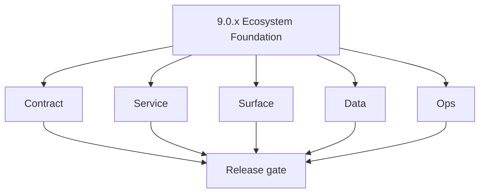
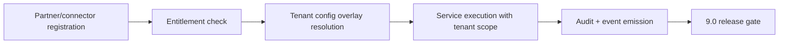
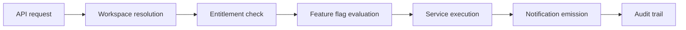

# Version 9.0 — Ecosystem Foundation

- **Status:** planned
- **Codename:** Ecosystem Foundation
- **Era:** 9.x (Contact360 Ecosystem integrations and Platform productization)
- **Roadmap:** Platform productization baseline — ships as **`9.0.0`** per [`docs/versions.md`](../versions.md)
- **Summary:** Freeze **partner and connector taxonomy**, establish **multi-tenant controls**, **self-service operations**, and **SLA/support readiness** before deeper productization cuts in `9.1+`. Must-land data contracts: `notifications`, `events`, `feature_flags`, and `workspaces` model expectations for gateway and dashboard parity.
- **Owner:** Product + Platform Engineering
- **Patch closure:** Every codenamed patch file includes **Micro-gate** + **Service task slices**. Era hub: [`versions.md`](../versions.md).

## Scope

- **Target:** `9.0.x` patches — stable ecosystem foundation before deep integration slices.
- **In scope:** Partner identity taxonomy, connector contract templates, entitlement fabric baseline, tenant config overlay model, workspace isolation primitives, notification system contracts.
- **Out of scope:** Full marketplace (`9.5`); enterprise SSO (`9.4`); third-party app store (`9.8`).
- **Owners:** Product + Platform Engineering.

## Version identity

- **Primary intent:** Freeze partner and connector taxonomy before deeper productization cuts.
- **Must-land data contracts:** `notifications`, `events`, `feature_flags`, and `workspaces` model expectations for gateway and dashboard parity.

## Flowchart

### Runtime focus (unique to this minor)

## Task tracks

### Contract

- 📌 Planned: **api:** Define workspace and tenant-scoping model for GraphQL queries — how `workspace_id` propagates through context.
- 📌 Planned: **api:** Define `notifications` module types: in-app notification CRUD, read/unread state, notification preferences.
- 📌 Planned: **api:** Define `feature_flags` query contract — how tenant-specific feature toggles are exposed to frontend.
- 📌 Planned: **api:** Establish connector lifecycle contract: `register` → `configure` → `enable` → `disable` → `delete`.
- 📌 Planned: **emailapis:** Normalize provider adapter contract with tenant-scoped API key rotation.
- 📌 Planned: **salesnavigator:** Replace singular shared API key with Tenant/User-scoped tokens tracking ingestion credit deductions.
- 📌 Planned: **contact.ai:** Define AI connector contract baseline and async callback contract for partner-initiated AI enrichment.

### Service

- 📌 Planned: **api:** Implement multi-tenant quota enforcement at gateway level — per-tenant rate limits and credit pools.
- 📌 Planned: **api:** Implement entitlement check middleware — validate tenant plan tier before allowing access to premium features.
- 📌 Planned: **jobs:** Implement tenant-aware job scheduling — workspace-scoped job isolation to prevent cross-tenant interference.
- 📌 Planned: **sync:** Implement tenant-safe ownership checks in Connectra replication paths.
- 📌 Planned: **admin:** Implement self-service tenant provisioning and onboarding workflow.
- 📌 Planned: **emailcampaign:** Implement tenant campaign quota and suppression sync baseline.
- 📌 Planned: **s3storage:** Define entitlement-aware storage capability matrix by plan; implement quota/size/rate throttling with `X-Storage-Quota-Remaining` headers.
- 📌 Planned: **s3storage:** Add cost attribution and residency metadata overlays (per-tenant bucket cost tags).

### Surface

- 📌 Planned: **app:** Workspace switcher UI — allow users to switch between workspaces.
- 📌 Planned: **app:** Integrations marketplace hub — list available connectors with enable/disable toggles.
- 📌 Planned: **app:** Notification center — bell icon with dropdown, notification list, read/unread state.
- 📌 Planned: **app:** Feature flag-gated premium feature badges and upgrade CTAs.
- 📌 Planned: **admin:** Partner onboarding dashboard — connector registration and configuration management.
- 📌 Planned: **admin:** Tenant health monitoring — per-tenant usage metrics and quota alerts.
- ⬜ Incomplete: **contact360.io/root (marketing)** — `app/(marketing)/integrations/page.tsx` renders a `MarketingPageContainer` with a CMS-driven `IntegrationsPage` component, but no real integration catalog exists; the page will display only whatever static CMS content is in the backend — implement a client-side integrations grid fetching actual connector data from the `9.0` connector registry (or seed static catalog of CRM, email provider, data export connectors) so visitors see a credible integrations page.
- ⬜ Incomplete: **contact360.io/root (marketing)** — no analytics integration exists in the marketing site; there is no GA4, Plausible, PostHog, or equivalent event tracking; the `logService.ts` logs to the backend (`NEXT_PUBLIC_ENABLE_BACKEND_LOGGING`) but this is a backend log, not visitor analytics — add `@next/third-parties/google` GA4 integration or Plausible `<Script>` tag with privacy-first configuration; connect key conversion events (CTA clicks, pricing plan views, sign-up redirects).
- 📌 Planned: **contact360.io/root (marketing)** — `/careers` and `/about` pages are CMS-driven stubs with `MarketingPageContainer`; implement actual static content for `about` (team, mission, founding story) and `careers` (job listings fetched from an HR API or static JSON) rather than relying entirely on backend CMS pages being populated.
- 📌 Planned: **contact360.io/root (marketing)** — implement OpenGraph preview images: add `opengraph-image.png` (1200×630px) to the `app/` directory for the default OG image, and create product-specific OG images (or use `next/og` dynamic generation via `generateImageMetadata`) for `/products/*` pages to enable rich social sharing previews on LinkedIn and Twitter.

### Data

- 📌 Planned: **PostgreSQL:** `workspaces`, `workspace_members`, `tenant_configs` tables.
- 📌 Planned: **PostgreSQL:** `notifications`, `notification_preferences` tables.
- 📌 Planned: **PostgreSQL:** `feature_flags`, `tenant_feature_overrides` tables.
- 📌 Planned: **PostgreSQL:** `connectors`, `connector_configs`, `connector_events` tables.
- 📌 Planned: Ensure all existing entities (contacts, companies, campaigns, jobs) are workspace-scoped.

### Ops

- 📌 Planned: SLA monitoring dashboard: per-tenant uptime and response time tracking.
- 📌 Planned: Partner onboarding runbook: connector registration → testing → production promotion.
- 📌 Planned: Tenant quota alert thresholds and automatic throttling policy.
- 📌 Planned: Feature flag rollout/rollback procedure.
- ✅ Completed: **contact360.io/email (Mailhub)** — multi-provider IMAP UI exists: `account/[userId]/page.tsx` allows connecting Gmail, Outlook, Yahoo, iCloud, and Custom IMAP accounts via a provider picker grid and a credential form that calls `POST /api/user/imap/:userId`.
- ⬜ Incomplete: **contact360.io/email (Mailhub)** — `AVAILABLE_PROVIDERS` in `account/[userId]/page.tsx` includes Google (`google`) and Microsoft (`outlook`) but these providers require OAuth 2.0 (not username/password) for IMAP access; the current form only accepts email + password (App Password) — add OAuth2 flow for Gmail and Outlook via the IMAP backend so users can authorize via browser redirect instead of entering app passwords.
- ⬜ Incomplete: **contact360.io/email (Mailhub)** — `ImapConfigRequest` only has `provider`, `email`, and `password` fields; for the `custom` IMAP provider, users cannot specify the IMAP server hostname or port — add `imapHost` and `imapPort` fields to the `ImapConfigRequest` interface and show them in the form only when `selectedProvider === 'custom'`.
- 📌 Planned: **contact360.io/email (Mailhub)** — add account disconnect/delete functionality: `account/[userId]/page.tsx` shows connected accounts but has no delete button; add `DELETE /api/user/imap/:userId/:imapConfigId` integration so users can remove connected accounts.
- 📌 Planned: **contact360.io/email (Mailhub)** — implement email search: the `app-sidebar.tsx` has a search icon in `navSecondary` pointing to `"#"`; add a search route or command palette (`/search?q=`) that calls `GET /api/emails/search?q={query}&email={}&password={}` and renders results in a `DataTable`.
- ✅ Completed: **contact360.io/app (Dashboard)** — team management implemented: `ProfileTabTeam` component uses `useTeam` hook → `profileService.ts` to invite and remove team members; `ProfileTabSecurity` uses `useSessions` hook for active session listing and revoke; `ProfileTabAPI` uses `useAPIKeys` hook for API key management.
- ✅ Completed: **contact360.io/app (Dashboard)** — `DashboardAccessGate` component provides server-rendered page access control using `useDashboardPageAccess(pageId)` which checks `authPages` from `AuthContext`; pages are gated by plan/role as determined by the backend `refreshToken` response.
- ⬜ Incomplete: **contact360.io/app (Dashboard)** — `DashboardAccessGate` returns `null` (renders nothing) when `hasAccess` is false and no `fallback` prop is provided; users whose plan does not include a feature see an empty page with no upgrade prompt — add a default `UpgradePrompt` fallback that links to `/billing` so users understand why they see a blank page.
- 📌 Planned: **contact360.io/app (Dashboard)** — implement workspace switcher: `profile/page.tsx` manages user profile and team but there is no workspace concept exposed in the UI; add a workspace selector in the sidebar header that allows users in multi-workspace organizations to switch context without logging out and back in.
- 📌 Planned: **contact360.io/app (Dashboard)** — implement notifications center: `ProfileTabNotifications` component tab exists in `components/profile` but its implementation needs to be audited — if it is a stub, wire it to a real backend notification endpoint (e.g., `usageService` credit alerts, job completion notifications, team invitation events).

## Task Breakdown

| Slice | Outcome |
| --- | --- |
| Gateway | Multi-tenant quota + entitlement + workspace context |
| App | Workspace switcher + integrations hub + notification center |
| Admin | Partner onboarding + tenant health monitoring |
| Data | Workspace/notification/feature flag/connector schema |
| Services | Tenant-scoped execution across jobs, sync, campaign |

## Immediate next execution queue

- 📌 Planned: Define workspace model and demonstrate workspace isolation for contacts query.
- 📌 Planned: Draft connector lifecycle contract and validate with one test connector (e.g., CRM import adapter).
- 📌 Planned: Prototype notification center UI with mock data.

## Cross-service ownership

| Service | Focus |
| --- | --- |
| `contact360.io/api` | Multi-tenant gateway + entitlement + workspace + notification modules |
| `contact360.io/app` | Workspace switcher + integrations hub + notification center |
| `contact360.io/admin` | Partner onboarding + tenant health + connector management |
| `contact360.io/jobs` | Tenant-aware job scheduling and isolation |
| `contact360.io/sync` | Tenant-safe ownership + connector data ingestion |
| `backend(dev)/mailvetter` | Partner verifier SLA and scoring trust |
| `lambda/emailapis` | Tenant-scoped provider routing |
| `lambda/emailapigo` | Go-path tenant context propagation |
| `backend(dev)/contact.ai` | AI connector contract + async callback |
| `backend(dev)/salesnavigator` | Connector adapter normalization + ingestion lineage |
| `lambda/s3storage` | Storage entitlement + tenant economics |
| `lambda/logs.api` | Audit evidence + tenant-safe logging |
| `backend(dev)/emailcampaign` | Tenant campaign quota + suppression sync |
| `extension/contact360` | Ecosystem ingestion channel for SN-originated sources |

## References

- [`docs/versions.md`](../versions.md)
- [`docs/roadmap.md`](../roadmap.md) — VERSION 9.x
- [`docs/architecture.md`](../architecture.md)
- [`docs/governance.md`](../governance.md)

## Backend API and Endpoint Scope

- **GraphQL:** New modules: `workspaces`, `notifications`, `featureFlags`, `connectors`.
- **REST:** Connector lifecycle endpoints; tenant config overlay API.
- **Endpoint matrix:** `docs/backend/endpoints/appointment360_endpoint_era_matrix.json` (era `9.x` rows).

## Database and Data Lineage Scope

- **PostgreSQL:** `workspaces`, `workspace_members`, `tenant_configs`, `notifications`, `notification_preferences`, `feature_flags`, `tenant_feature_overrides`, `connectors`, `connector_configs`, `connector_events`.
- **Elasticsearch:** Workspace-scoped index aliases for contacts/companies.
- **S3:** Tenant-scoped storage prefix isolation.

## Frontend UX Surface Scope

- Workspace management, integrations marketplace, notification center, feature flag gating.

Frontend components and hooks (9.0 baseline):

- **Components:** `WorkspaceSwitcher`, `IntegrationsHub`, `ConnectorCard`, `NotificationCenter`, `NotificationBell`, `FeatureGateBadge`, `UpgradeCTA`
- **Hooks:** `useWorkspace`, `useNotifications`, `useFeatureFlags`, `useConnectors`, `useTenantConfig`
- **Context:** `WorkspaceContext` (active workspace state), `NotificationContext` (unread count polling)

## UI Elements Checklist

- 📌 Planned: Workspace switcher dropdown in sidebar header
- 📌 Planned: Integrations hub with connector cards (enable/disable toggle, configuration modal)
- 📌 Planned: Notification bell with unread badge count
- 📌 Planned: Notification dropdown list with read/unread state
- 📌 Planned: Feature-gated premium badges and "Upgrade to Pro" CTAs
- 📌 Planned: Tenant health cards in admin dashboard
- 📌 Planned: Partner onboarding step-by-step wizard in admin

## Flow / Graph Delta for This Minor

- **Delta:** Introduces **workspace-scoped multi-tenancy** and **connector lifecycle** graph; replaces single-tenant assumptions in earlier Eras.

## Audit and Compliance Notes

- All workspace-scoped operations must include `workspace_id` in audit trail.
- Connector configuration changes logged as governance events.
- Feature flag changes require admin approval and audit entry.
- Tenant data isolation must be provable via query: no cross-tenant data leakage.
- See [`docs/audit-compliance.md`](../audit-compliance.md).

## Patch ladder (`9.0.0` – `9.0.9`)

### Micro-gate reference (apply at every `9.N.P`)

| Track | Gate question (must answer Yes or document waiver) |
| --- | --- |
| **Contract** | Connector lifecycle, entitlement model — `docs/backend/apis/` + integration matrices updated? |
| **Service** | Multi-tenant enforcement, adapters, webhook delivery — smoke + parity documented? |
| **Surface** | Integrations UI, marketplace/admin, self-serve — delta? |
| **Frontend** | `docs/frontend/` hooks, partner flows, extension/email — delta? |
| **Data** | Tenant lineage, connector fields — `docs/backend/database/` updated? |
| **Ops** | SLA runbooks, partner onboarding, integration RC — recorded? |

**Patch intent bands:** `.0` charter · `.1`–`.2` scaffold · `.3`–`.5` hardening · `.6`–`.8` integration · `.9` minor freeze / handoff.

Theme: **Ecosystem** — codenames in per-patch `9.0.P — *.md` files.

| Patch | Codename | Focus | Evidence gate |
| --- | --- | --- | --- |
| `9.0.0` | Void | Ecosystem charter: partner taxonomy + connector contract template | Charter artifact linked |
| `9.0.1` | Seed | Workspace model: `workspaces` table + context propagation | Workspace creation smoke passing |
| `9.0.2` | Sprout | Entitlement fabric: plan tier validation middleware | Premium feature blocked for free tier |
| `9.0.3` | Roots | Notification system: `notifications` table + bell UI | Notification appears in UI after trigger event |
| `9.0.4` | Soil | Feature flags: `feature_flags` table + frontend gating | Feature gated behind flag toggle |
| `9.0.5` | Rain | Connector lifecycle: register → configure → enable flow | One test connector enabled and functional |
| `9.0.6` | Stem | Tenant config overlays: per-tenant settings resolution | Tenant-specific config overrides applied |
| `9.0.7` | Branch | Integration hub UI: connector cards + enable/disable | IntegrationsHub renders connector cards |
| `9.0.8` | Leaf | SLA monitoring: per-tenant usage metrics baseline | Tenant usage metrics emitted to dashboard |
| `9.0.9` | Bloom | Release gate: docs sync + Postman + rollback | Handoff documented for **9.1** |

## Release Gate and Evidence

### Master Task Checklist
- 📌 Planned: Partner taxonomy frozen
- 📌 Planned: Workspace isolation demonstrated
- 📌 Planned: Entitlement check middleware deployed
- 📌 Planned: Notification system baseline functional

### Backend API and Endpoints
- 📌 Planned: Endpoint/contract parity verified
- ✅ Completed: **contact360.io/api** — `app/graphql/modules/notifications/` fully implemented: `markNotificationAsRead`, `markAllNotificationsAsRead`, `deleteNotification`, `deleteNotifications`, `updateNotificationPreferences` mutations + `notifications`, `notificationPreferences` queries backed by `NotificationService` + `NotificationRepository`.
- ✅ Completed: **contact360.io/api** — `app/graphql/modules/pages/` implements `PagesQuery` to fetch DocsAI-served documentation pages per user role; `DocsAIClient` (`app/clients/docsai_client.py`) proxies to `DOCSAI_API_URL` (Django docs service).
- ✅ Completed: **contact360.io/api** — DocsAI integration in `app/integrations/docsai/` — storage adapter in `app/storage/docsai/` — `DOCSAI_ENABLED=True` in production `.env` enabling live pages.
- ⬜ Incomplete: **contact360.io/api** — `app/graphql/modules/postman/` module directory is empty (no `__init__.py`, no files) — the Postman collection generation / workspace API export integration was planned but never scaffolded; create at minimum a stub `__init__.py` and placeholder types file.
- 📌 Planned: **contact360.io/api** — `app/graphql/modules/activities/` exists — verify `ActivityQuery` exposes user activity feed (recent actions) and that `ActivityService.log_activity()` is called consistently across all domain mutations for full audit trail.
- 📌 Planned: **contact360.io/api** — Feature flags system (`9.0.4 — Soil`) is planned but no `feature_flags` model or table exists in `app/models/`; the current feature gating is role-based only (no per-flag granularity) — add `FeatureFlag` model + `FeatureFlagService` for operator-controlled rollouts.
- ✅ Completed: **contact360.io/admin** — `durgasflow` workflow automation app fully scaffolded: `Workflow`, `WorkflowNode`, `WorkflowExecution`, `WorkflowCredential`, `NodeTemplate` models; `WorkflowService`, `ExecutionEngine`, `WorkflowStorageService`, `N8nWorkflowLibraryService` services; LiteGraph.js visual editor UI; supports `manual`, `webhook`, `schedule`, `event` trigger types; node categories include `ai_agent`, `action`, `logic`, `docsai`.
- ✅ Completed: **contact360.io/admin** — `knowledge` app implements a knowledge base with search, tagging, and CRUD; `KnowledgeBaseService` supports `pattern`, `documentation`, `code_snippet`, `best_practice`, `api_pattern`, `architecture` pattern types; storage backed by S3 or local JSON.
- ✅ Completed: **contact360.io/admin** — `graph/views.py` builds a dependency graph of DocsAI pages and endpoints using `PagesService`, `EndpointsService`, `RelationshipsService` — project architecture is visualizable as an interactive graph.
- ✅ Completed: **contact360.io/admin** — `roadmap/views.py` implements roadmap management (S3-backed JSON `docsai/contact360/roadmap.json`) with `CONTACT360_ROADMAP_STAGES` constants; SuperAdmin can edit the roadmap via the admin UI.
- ⬜ Incomplete: **contact360.io/admin** — `durgasflow` `ExecutionEngine` exists but n8n workflow library reads from local `media/` filesystem (`N8nWorkflowLibraryService`) — workflow templates are file-system dependent; migrate workflow library storage to S3 or database so it works in containerized/stateless deployments.
- ⬜ Incomplete: **contact360.io/admin** — `page_builder/views.py` `page_builder_view` returns a minimal context with hardcoded component types (`text`, `image`, `code`, `table`) — the visual page builder is a shell with no drag-and-drop implementation, no save/preview, and no WYSIWYG functionality; implement or document as planned.
- 📌 Planned: **contact360.io/admin** — `test_runner` app stores and executes API test suites via `TestSuiteStorageService` — wire it to the Appointment360 GraphQL API so SuperAdmins can run automated smoke tests (auth, billing, contact search) directly from the admin panel with pass/fail reporting.
- 📌 Planned: **contact360.io/admin** — `durgasflow` webhook trigger type is defined in `TriggerType.WEBHOOK` but webhook ingestion endpoint (`POST /durgasflow/webhook/<workflow_id>/`) is not visible in the URL routes — implement the webhook receiver endpoint so external events can trigger workflows.

### Database and Data Lineage
- 📌 Planned: Migration and lineage references linked

### Frontend UX
- 📌 Planned: UX/route behavior evidence linked

### UI Elements
- 📌 Planned: Components/checklist closeout captured

### Flow and Graph
- 📌 Planned: Runtime graph reflects implementation

### Validation
- 📌 Planned: Smoke/CI/lint checks recorded

### Release Gate
- 📌 Planned: Minor ready for handoff to **`9.1` Partner Identity**

## Patches

| Patch | Codename | Doc |
| --- | --- | --- |
| `9.0.0` | Void | [`9.0.0` — Void](9.0.0 — Void.md) |
| `9.0.1` | Seed | [`9.0.1` — Seed](9.0.1 — Seed.md) |
| `9.0.2` | Sprout | [`9.0.2` — Sprout](9.0.2 — Sprout.md) |
| `9.0.3` | Roots | [`9.0.3` — Roots](9.0.3 — Roots.md) |
| `9.0.4` | Soil | [`9.0.4` — Soil](9.0.4 — Soil.md) |
| `9.0.5` | Rain | [`9.0.5` — Rain](9.0.5 — Rain.md) |
| `9.0.6` | Stem | [`9.0.6` — Stem](9.0.6 — Stem.md) |
| `9.0.7` | Branch | [`9.0.7` — Branch](9.0.7 — Branch.md) |
| `9.0.8` | Leaf | [`9.0.8` — Leaf](9.0.8 — Leaf.md) |
| `9.0.9` | Bloom | [`9.0.9` — Bloom](9.0.9 — Bloom.md) |
