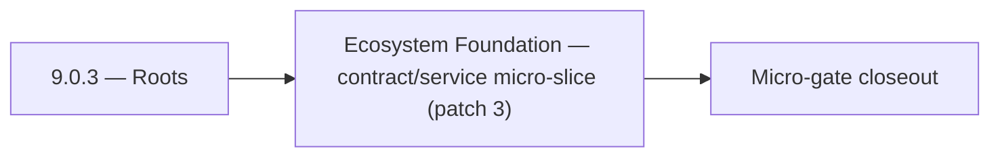

# 9.0.3 — Roots

- **Era:** `9.x` ecosystem integrations — hub [`versions.md`](../versions.md) · minors start at [`9.0 — Ecosystem Foundation`](9.0%20%E2%80%94%20Ecosystem%20Foundation.md)
- **Minor:** [9.0 — Ecosystem Foundation](./9.0 — Ecosystem Foundation.md)
- **Codename:** Roots
- **Status:** planned

## Focus
Ecosystem Foundation — contract/service micro-slice (patch 3)

## Flowchart

## Micro-gate

| Track | Gate question | Answer / Evidence (fill at patch closeout) |
| --- | --- | --- |
| **Contract** | Connector lifecycle, entitlement model — `docs/backend/apis/` + integration matrices updated? | Document at patch closeout. |
| **Service** | Multi-tenant enforcement, connector adapters, webhook delivery — parity + smoke documented? | Document smoke paths. |
| **Surface** | Integrations UI, marketplace/admin, self-serve flows — delta? | Document UX delta or N/A. |
| **Frontend** | `docs/frontend/` hooks, partner surfaces, extension/email integrations touched? | Ecosystem foundation — partner taxonomy, connector inventory, integration matrices. Document at closeout. |
| **Data** | Tenant lineage, `connector_id`, entitlement tables — `docs/backend/database/`? | Document lineage or N/A. |
| **Ops** | SLA runbooks, partner onboarding, `connectors-commercial.md` / integration RC evidence — delta? | Document ops delta or N/A. |

## Tasks
### Contract
- 📌 Planned: **sync**: define v9.0 contract outcomes for tenant config overlays; stabilize sync payload mapping and delta semantics in `contact360.io/sync` while advancing entitlement enforcement.
- 📌 Planned: **emailapigo**: define v9.0 contract outcomes for tenant config overlays; enforce Go adapter contract parity with shared models in `lambda/emailapigo` while advancing tenant config overlays.
- `POST /companies/batch-upsert`
- 📌 Planned: Define Contact AI connector spec for external integration platforms (Zapier, Make, HubSpot).

### Service
- 📌 Planned: **sync**: deliver v9.0 service outcomes for tenant config overlays; tighten replication loops and conflict-resolution behavior in `contact360.io/sync` while advancing entitlement enforcement.
- 📌 Planned: **emailapigo**: deliver v9.0 service outcomes for tenant config overlays; optimize Go runtime execution path and error wrapping in `lambda/emailapigo` while advancing tenant config overlays.
- 📌 Planned: Add fairness controls for mixed-tenant high-volume batch upsert traffic.
- 📌 Planned: Add `organization_id` to `ai_chats` if multi-tenant isolation requires org-level partitioning.

## Service task slices
> Merged from era `9.x` ecosystem productization task packs (P0→`.0`–`.2`, P1→`.3`–`.6`, Ops→`.7`–`.9`).

### contact.ai
- Integration panel in dashboard: AI-powered connectors configuration (webhook URL, trigger events).
- Connector card: shows AI connector status (active/inactive), last delivery, error rate.
- Webhook delivery log: show recent deliveries, status codes, retry count per webhook.
- If `organization_id` added: migration file to add column to `ai_chats`; update `contact_ai_data_lineage.md`.
- Webhook delivery log schema: `{webhook_id, chat_id, payload_hash, status_code, retries, timestamp}`.
- Connector audit trail: log all connector-initiated AI calls with `source: "connector"` tag.
- Implement webhook delivery: on AI response completion, POST result to registered webhook URL.
- Implement connector adapter: standardized input/output format for external platform integrations.
- Implement organization-level AI usage aggregation (for tenant billing/quota).
- Add `organization_id` to `ai_chats` if multi-tenant isolation requires org-level partitioning.

### Appointment360 (gateway)
- Define FeatureOverviewQuery { featureOverview() } returning era/feature matrix
- Define tenant model: Workspace / Organization type with multi-tenant guards
- Document tenant entitlement enforcement contract in docs/governance.md
- Implement analytics service: aggregate event counts from events table
- Implement featureOverview(): return feature flags / credits matrix per plan
- Wire notifications polling in background task: dispatch on billing events, job completions
- Add plan-based entitlement guard: require_plan_feature(info, feature)
- Webhook support: outbound webhook on job completion / campaign send
- Analytics dashboard page → query analytics(...) with date range picker
- Feature overview page (pricing/plan) → query featureOverview()
- Plan upgrade modal → triggered by require_plan_feature guard response
- Create feature_flags table: feature, plan_id, enabled, credit_cost
- Create workspaces table for multi-tenant model: uuid, name, owner_uuid, plan_id
- Configure webhook secret WEBHOOK_SECRET for outbound events
- Write test: trackEvent → query analytics round-trip
- Write test: notifications() → markAllRead → notifications() = []
- Load test admin panel with 10,000 user dataset
- Document multi-tenant entitlement enforcement in ops runbook

### emailapis / emailapigo
- Bind integrations UX to runtime diagnostics:
- `docs/frontend/emailapis-ui-bindings.md`
- `docs/frontend/components.md`
- `docs/frontend/hooks-services-contexts.md`
- Define user-facing status vocabulary for email connector outcomes (`success`, `partial_success`, `quota_blocked`, `provider_degraded`).
- Add connector health and fallback explanation copy for settings and integrations pages.
- Document loading/error/progress patterns for bulk operations and webhook-triggered runs.
- Document 9.x lineage changes for `email_finder_cache` and `email_patterns` in `docs/backend/database`.
- Record per-request provider decision lineage (`provider`, `fallback_provider`, `status`, `latency_ms`, `tenant_id`, `trace_id`).
- Add tenant-safe usage attribution fields required for commercial metering reconciliation.
- Implement entitlement-aware execution guard for finder/verifier paths (per-tenant caps before provider fanout).
- Align provider orchestration behavior between runtimes (mailvetter/icypeas/truelist fallback order and timeout windows).
- Validate auth behavior (`X-API-Key` and gateway-issued context headers) across both runtimes.
- Add deterministic idempotency key support for bulk finder/verifier requests to avoid duplicate partner billing.

### Connectra
- Expose tenant quota and connector health signals to integrations/admin surfaces in:
- `docs/frontend/README.md`
- `docs/frontend/components.md`
- `docs/frontend/hooks-services-contexts.md`
- Define user-facing messaging for quota blocked / degraded connector outcomes.
- Add support-facing reconciliation view requirements for created-vs-updated entity counts.
- Store tenant usage aggregates for billing, quota, and SLA reporting.
- Persist connector lineage fields: `tenant_id`, `connector_id`, `source`, `session_id`, `trace_id`.
- Define audit table expectations for UUID collisions, dedup merges, and replay attempts.
- Add per-tenant quota/throttle middleware for heavy query/export workloads.
- Enforce tenant filter injection before VQL execution in route handlers under `app/api/routes/`.
- Validate UUID5 dedup behavior and ensure connector ingestion is replay-safe under retries.
- Add fairness controls for mixed-tenant high-volume batch upsert traffic.

## Evidence gate
Patch closeout includes contract diff, smoke output, data lineage delta, and ops note
