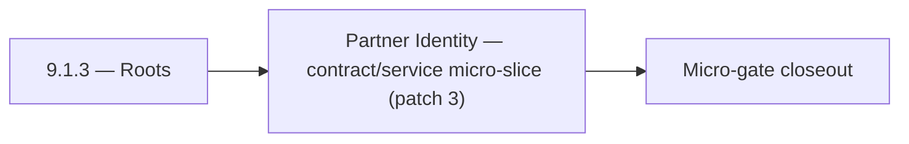

# 9.1.3 — Roots

- **Era:** `9.x` ecosystem integrations — hub [`versions.md`](../versions.md) · minors start at [`9.0 — Ecosystem Foundation`](9.0%20%E2%80%94%20Ecosystem%20Foundation.md)
- **Minor:** [9.1 — Partner Identity](./9.1 — Partner Identity.md)
- **Codename:** Roots
- **Status:** ✅ Completed
## Focus
Partner Identity — contract/service micro-slice (patch 3)

## Flowchart

## Micro-gate

| Track | Gate question | Answer / Evidence (fill at patch closeout) |
| --- | --- | --- |
| **Contract** | Connector lifecycle, entitlement model — `docs/backend/apis/` + integration matrices updated? | Document at patch closeout. |
| **Service** | Multi-tenant enforcement, connector adapters, webhook delivery — parity + smoke documented? | Document smoke paths. |
| **Surface** | Integrations UI, marketplace/admin, self-serve flows — delta? | Document UX delta or N/A. |
| **Frontend** | `docs/frontend/` hooks, partner surfaces, extension/email integrations touched? | Partner identity — OAuth/scoped credentials, partner registry. Document at closeout. |
| **Data** | Tenant lineage, `connector_id`, entitlement tables — `docs/backend/database/`? | Document lineage or N/A. |
| **Ops** | SLA runbooks, partner onboarding, `connectors-commercial.md` / integration RC evidence — delta? | Document ops delta or N/A. |

## Tasks
### Contract
- 📌 Planned: **[appointment360]** — refine duplicate task (was: ✅ completed: 📌 planned: **sync**: define v9.1 contract outco…) | patch `9.1.3` band `3` | reason: specialize this file vs sibling patches; see docs/codebases/appointment360-codebase-analysis.md
- 📌 Planned: **[appointment360]** — refine duplicate task (was: ✅ completed: 📌 planned: **emailapigo**: define v9.1 contract…) | patch `9.1.3` band `3` | reason: specialize this file vs sibling patches; see docs/codebases/appointment360-codebase-analysis.md
- 📌 Planned: **[appointment360]** — refine duplicate task (was: ✅ completed: `post /companies/batch-upsert`) | patch `9.1.3` band `3` | reason: specialize this file vs sibling patches; see docs/codebases/appointment360-codebase-analysis.md
- 📌 Planned: **[appointment360]** — refine duplicate task (was: ✅ completed: 📌 planned: define contact ai connector spec for…) | patch `9.1.3` band `3` | reason: specialize this file vs sibling patches; see docs/codebases/appointment360-codebase-analysis.md

### Service
- 📌 Planned: **[appointment360]** — refine duplicate task (was: ✅ completed: 📌 planned: **sync**: deliver v9.1 service outco…) | patch `9.1.3` band `3` | reason: specialize this file vs sibling patches; see docs/codebases/appointment360-codebase-analysis.md
- 📌 Planned: **[appointment360]** — refine duplicate task (was: ✅ completed: 📌 planned: **emailapigo**: deliver v9.1 service…) | patch `9.1.3` band `3` | reason: specialize this file vs sibling patches; see docs/codebases/appointment360-codebase-analysis.md
- 📌 Planned: **[appointment360]** — refine duplicate task (was: ✅ completed: 📌 planned: add fairness controls for mixed-tena…) | patch `9.1.3` band `3` | reason: specialize this file vs sibling patches; see docs/codebases/appointment360-codebase-analysis.md
- 📌 Planned: **[appointment360]** — refine duplicate task (was: ✅ completed: 📌 planned: add `organization_id` to `ai_chats` …) | patch `9.1.3` band `3` | reason: specialize this file vs sibling patches; see docs/codebases/appointment360-codebase-analysis.md

### Surface

- ✅ Completed: 📌 Planned: **[app]** — Verify UX for route `/email` and bindings (patch 9.1.3 band 3) | area: `frontend-page` | files: `contact360.io/app/...` | reason: Dashboard/extension surface for era 9 must match gateway contracts

### Data

- 📌 Planned: **[appointment360]** — refine duplicate task (was: ✅ completed: 📌 planned: **[appointment360]** — update postgr…) | patch `9.1.3` band `3` | reason: specialize this file vs sibling patches; see docs/codebases/appointment360-codebase-analysis.md

### Ops

- ✅ Completed: 📌 Planned: **[platform]** — Record smoke evidence, rollback, and alerts (patch band 3: surface/data) | area: `ops` | files: `docs/commands/`, `.github/workflows/` | reason: Smoke, rollback, and observability for patch 9.1.3

## Service task slices
> Merged from era `9.x` ecosystem productization task packs (P0→`.0`–`.2`, P1→`.3`–`.6`, Ops→`.7`–`.9`).

### logs.api
- Document impacted pages/tabs/components for audit and integrations evidence views.
- Document hooks/services/contexts for logs and diagnostics flows in frontend bindings.
- Define UX states for long-running evidence exports (queued, ready, failed, expired).
- Add operator-facing wording for trace correlation and redaction-safe support workflows.
- Document tenant-prefixed S3 CSV object convention and lineage.
- Define retention policy and archive expectations per tenant tier.
- Record SLA evidence table expectations for incident and monthly reliability reports.
- Update lineage reference in `docs/backend/database/logsapi_data_lineage.md`.
- Implement/validate event ingestion and query behavior in `app/services/log_service.py`.
- Add tenant-safe filtering defaults for query/search/stat endpoints.
- Verify auth and error envelope behavior for gateway and service consumers.
- Add audit-bundle export path with bounded query window and deterministic CSV formatting.

### Appointment360 (gateway)
- Define FeatureOverviewQuery { featureOverview() } returning era/feature matrix
- Define tenant model: Workspace / Organization type with multi-tenant guards
- Document tenant entitlement enforcement contract in docs/governance.md
- Implement analytics service: aggregate event counts from events table
- Implement featureOverview(): return feature flags / credits matrix per plan
- Wire notifications polling in background task: dispatch on billing events, job completions
- Add plan-based entitlement guard: require_plan_feature(info, feature)
- Webhook support: outbound webhook on job completion / campaign send
- Analytics dashboard page → query analytics(...) with date range picker
- Feature overview page (pricing/plan) → query featureOverview()
- Plan upgrade modal → triggered by require_plan_feature guard response
- Create feature_flags table: feature, plan_id, enabled, credit_cost
- Create workspaces table for multi-tenant model: uuid, name, owner_uuid, plan_id
- Configure webhook secret WEBHOOK_SECRET for outbound events
- Write test: trackEvent → query analytics round-trip
- Write test: notifications() → markAllRead → notifications() = []
- Load test admin panel with 10,000 user dataset
- Document multi-tenant entitlement enforcement in ops runbook

### contact.ai
- Integration panel in dashboard: AI-powered connectors configuration (webhook URL, trigger events).
- Connector card: shows AI connector status (active/inactive), last delivery, error rate.
- Webhook delivery log: show recent deliveries, status codes, retry count per webhook.
- If `organization_id` added: migration file to add column to `ai_chats`; update `contact_ai_data_lineage.md`.
- Webhook delivery log schema: `{webhook_id, chat_id, payload_hash, status_code, retries, timestamp}`.
- Connector audit trail: log all connector-initiated AI calls with `source: "connector"` tag.
- Implement webhook delivery: on AI response completion, POST result to registered webhook URL.
- Implement connector adapter: standardized input/output format for external platform integrations.
- Implement organization-level AI usage aggregation (for tenant billing/quota).
- Add `organization_id` to `ai_chats` if multi-tenant isolation requires org-level partitioning.

### Jobs
- Document tenant quota cards, entitlement warnings, and escalation controls in jobs UI bindings.
- Define tenant-filtered jobs tables and timeline views for admin/operator users.
- Add workflow messaging for `quota_exhausted`, `tenant_blocked`, and `retry_deferred` states.
- Record `tenant_id` and entitlement snapshot in `job_node` lifecycle lineage.
- Define isolation boundary expectations for `job_events`, DAG edges, and metrics.
- Add reconciliation evidence model for quota decisions vs observed scheduler behavior.
- Implement entitlement checks at create/retry boundaries in:
- `app/services/job_service.py`
- `app/workers/scheduler.py`
- Add fairness-aware tenant partitioning policy in scheduler queue dispatch.
- Add processor-level quota guard hooks in `app/processors/` registry.
- Ensure tenant context propagation across scheduler -> worker -> processor -> event timeline.

## Evidence gate
Patch closeout includes contract diff, smoke output, data lineage delta, and ops note
