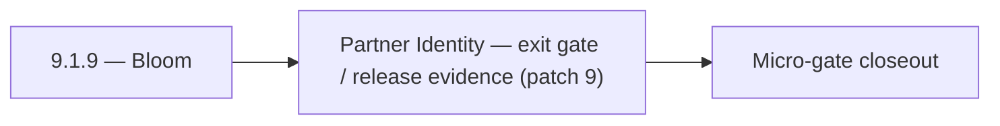

# 9.1.9 — Bloom

- **Era:** `9.x` ecosystem integrations — hub [`versions.md`](../versions.md) · minors start at [`9.0 — Ecosystem Foundation`](9.0%20%E2%80%94%20Ecosystem%20Foundation.md)
- **Minor:** [9.1 — Partner Identity](./9.1 — Partner Identity.md)
- **Codename:** Bloom
- **Status:** ✅ Completed
## Focus
Partner Identity — exit gate / release evidence (patch 9)

## Flowchart

## Micro-gate

| Track | Gate question | Answer / Evidence (fill at patch closeout) |
| --- | --- | --- |
| **Contract** | Connector lifecycle, entitlement model — `docs/backend/apis/` + integration matrices updated? | Document at patch closeout. |
| **Service** | Multi-tenant enforcement, connector adapters, webhook delivery — parity + smoke documented? | Document smoke paths. |
| **Surface** | Integrations UI, marketplace/admin, self-serve flows — delta? | Document UX delta or N/A. |
| **Frontend** | `docs/frontend/` hooks, partner surfaces, extension/email integrations touched? | Partner identity — OAuth/scoped credentials, partner registry. Document at closeout. |
| **Data** | Tenant lineage, `connector_id`, entitlement tables — `docs/backend/database/`? | Document lineage or N/A. |
| **Ops** | SLA runbooks, partner onboarding, `connectors-commercial.md` / integration RC evidence — delta? | Document ops delta or N/A. |

## Tasks
### Ops
- 📌 Planned: **[appointment360]** — refine duplicate task (was: ✅ completed: 📌 planned: connector sla dashboard: per-tenant …) | patch `9.1.9` band `9` | reason: specialize this file vs sibling patches; see docs/codebases/appointment360-codebase-analysis.md
- 📌 Planned: **[appointment360]** — refine duplicate task (was: ✅ completed: 📌 planned: quota controls per connector type) | patch `9.1.9` band `9` | reason: specialize this file vs sibling patches; see docs/codebases/appointment360-codebase-analysis.md
- 📌 Planned: **[appointment360]** — refine duplicate task (was: ✅ completed: 📌 planned: alert: webhook delivery failure rate…) | patch `9.1.9` band `9` | reason: specialize this file vs sibling patches; see docs/codebases/appointment360-codebase-analysis.md
- 📌 Planned: **[appointment360]** — refine duplicate task (was: ✅ completed: 📌 planned: documentation: connector integration…) | patch `9.1.9` band `9` | reason: specialize this file vs sibling patches; see docs/codebases/appointment360-codebase-analysis.md
- 📌 Planned: **[appointment360]** — refine duplicate task (was: ✅ completed: `docs/codebases/salesnavigator-codebase-analysi…) | patch `9.1.9` band `9` | reason: specialize this file vs sibling patches; see docs/codebases/appointment360-codebase-analysis.md
- 📌 Planned: **[appointment360]** — refine duplicate task (was: ✅ completed: `docs/backend/apis/salesnavigator_era_task_pack…) | patch `9.1.9` band `9` | reason: specialize this file vs sibling patches; see docs/codebases/appointment360-codebase-analysis.md

### Contract

- ✅ Completed: 📌 Planned: **[appointment360]** — Diff and document schema for operations like ConnectraClient, LAMBDA_AI_API_URL, LAMBDA_CONNECTRA_API_URL; align with roadmap | area: `backend-api` | files: `docs/backend/apis/*.md`, `contact360.io/api/app/graphql/schema.py` | reason: Keep GraphQL/REST contracts aligned for era 9.9 patch 9.1.9

### Service

- 📌 Planned: **[appointment360]** — refine duplicate task (was: ✅ completed: 📌 planned: **[appointment360]** — service slice…) | patch `9.1.9` band `9` | reason: specialize this file vs sibling patches; see docs/codebases/appointment360-codebase-analysis.md

### Surface

- ✅ Completed: 📌 Planned: **[app]** — Verify UX for route `/email` and bindings (patch 9.1.9 band 9) | area: `frontend-page` | files: `contact360.io/app/...` | reason: Dashboard/extension surface for era 9 must match gateway contracts

### Data

- 📌 Planned: **[appointment360]** — refine duplicate task (was: ✅ completed: 📌 planned: **[appointment360]** — update postgr…) | patch `9.1.9` band `9` | reason: specialize this file vs sibling patches; see docs/codebases/appointment360-codebase-analysis.md

## Service task slices
> Merged from era `9.x` ecosystem productization task packs (P0→`.0`–`.2`, P1→`.3`–`.6`, Ops→`.7`–`.9`).

### logs.api
- Add observability checks for query latency, ingestion lag, and export failures.
- Add release validation evidence for 9.x logging schema and audit export compatibility.
- Capture rollback and incident runbook notes for logging-impacting releases.
- Define alerting thresholds for abnormal error rates by tenant/connector cohort.

### Appointment360 (gateway)
- Write test: notifications() → markAllRead → notifications() = []
- Load test admin panel with 10,000 user dataset
- Document multi-tenant entitlement enforcement in ops runbook

### contact.ai
- Webhook delivery retry: exponential backoff, max 3 retries, dead-letter queue on final failure.
- Connector health monitoring: track delivery success rate per connector.
- Tenant isolation audit: verify no cross-tenant data leakage in AI responses.
- Add connector endpoints to API rate limit policy.

### Jobs
- Add per-tenant SLA/error-budget dashboards and alert thresholds.
- Add runbook for quota exhaustion and noisy-neighbor mitigation incidents.
- Add release gate checks: timeline tenant isolation test, retry policy conformance test, processor quota test.

## Evidence gate
Micro-gate table filled and handoff note to `9.2.0` recorded
