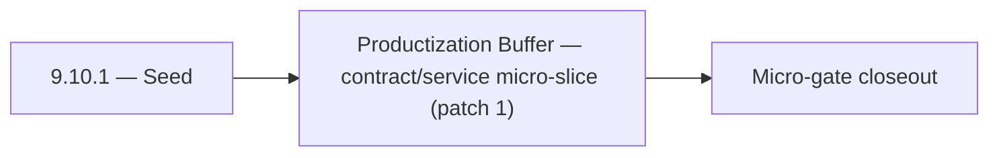

# 9.10.1 — Seed

- **Era:** `9.x` ecosystem integrations — hub [`versions.md`](../versions.md) · minors start at [`9.0 — Ecosystem Foundation`](9.0%20%E2%80%94%20Ecosystem%20Foundation.md)
- **Minor:** [9.10 — Productization Buffer](./9.10 — Productization Buffer.md)
- **Codename:** Seed
- **Status:** planned

## Focus
Productization Buffer — contract/service micro-slice (patch 1)

## Flowchart

## Micro-gate

| Track | Gate question | Answer / Evidence (fill at patch closeout) |
| --- | --- | --- |
| **Contract** | Connector lifecycle, entitlement model — `docs/backend/apis/` + integration matrices updated? | Document at patch closeout. |
| **Service** | Multi-tenant enforcement, connector adapters, webhook delivery — parity + smoke documented? | Document smoke paths. |
| **Surface** | Integrations UI, marketplace/admin, self-serve flows — delta? | Document UX delta or N/A. |
| **Frontend** | `docs/frontend/` hooks, partner surfaces, extension/email integrations touched? | Buffer minor — ecosystem overflow patches when chartered. Document at closeout. |
| **Data** | Tenant lineage, `connector_id`, entitlement tables — `docs/backend/database/`? | Document lineage or N/A. |
| **Ops** | SLA runbooks, partner onboarding, `connectors-commercial.md` / integration RC evidence — delta? | Document ops delta or N/A. |

## Tasks
### Contract
- 📌 Planned: **app**: define v9.10 contract outcomes for tenant config overlays; align UI payload contracts with backend enums in `contact360.io/app` while advancing entitlement enforcement.
- 📌 Planned: **mailvetter**: define v9.10 contract outcomes for tenant config overlays; pin verifier payload expectations and score fields in `backend(dev)/mailvetter` while advancing tenant config overlays.
- 📌 Planned: Freeze connector-facing request/response compatibility for:
- 📌 Planned: Document tenant isolation guarantees for read (`/contacts`, `/companies`) and write paths.

### Service
- 📌 Planned: **app**: deliver v9.10 service outcomes for tenant config overlays; wire client flows to canonical endpoints and failure states in `contact360.io/app` while advancing entitlement enforcement.
- 📌 Planned: **mailvetter**: deliver v9.10 service outcomes for tenant config overlays; calibrate verdict pipeline stages for stable scoring in `backend(dev)/mailvetter` while advancing tenant config overlays.
- 📌 Planned: Enforce tenant filter injection before VQL execution in route handlers under `app/api/routes/`.
- 📌 Planned: Implement connector adapter: standardized input/output format for external platform integrations.

## Service task slices
> Merged from era `9.x` ecosystem productization task packs (P0→`.0`–`.2`, P1→`.3`–`.6`, Ops→`.7`–`.9`).

### Appointment360 (gateway)
- Define NotificationQuery { notifications() }
- Define NotificationMutation { markNotificationRead(id), markAllRead }
- Define AnalyticsQuery { analytics(dateRange, granularity, metrics) }
- Define AnalyticsMutation { trackEvent(type, metadata) }
- Define AdminQuery { adminStats(), paymentSubmissions(), users() } (SuperAdmin-only)
- Define AdminMutation { creditUser, adjustCredits, approvePayment, declinePayment } (SuperAdmin-only)
- Implement notifications service: create, list, mark-read in app/services/notification.py
- Implement trackEvent mutation: write to events table with user_uuid, type, metadata
- Implement adminStats(): aggregated counts (users, contacts, jobs, revenue) for SuperAdmin
- Add require_super_admin() guard for all admin mutations
- Notification bell icon → query notifications() polling every 30s
- Notification drop-down → mutation markNotificationRead on click
- Admin panel → query adminStats() + mutation creditUser
- useNotifications hook: polling, badge count, mark-read
- useAdminPanel hook: manage user credit adjustments, approve payments
- Create notifications table: uuid, user_uuid, type, message, is_read, created_at
- Create events table: uuid, user_uuid, type, metadata JSON, created_at
- Run Alembic migration for all 9.x tables

### Connectra
- Define entitlement-aware VQL policy contract for tenant plans in `app/services/query/*`.
- Freeze connector-facing request/response compatibility for:
- `POST /contacts/batch-upsert`
- `POST /companies/batch-upsert`
- `POST /common/jobs/create`
- Document tenant isolation guarantees for read (`/contacts`, `/companies`) and write paths.
- Align endpoint era mapping in `docs/backend/endpoints/connectra_endpoint_era_matrix.json`.
- Add per-tenant quota/throttle middleware for heavy query/export workloads.
- Enforce tenant filter injection before VQL execution in route handlers under `app/api/routes/`.
- Validate UUID5 dedup behavior and ensure connector ingestion is replay-safe under retries.
- Add fairness controls for mixed-tenant high-volume batch upsert traffic.
- Store tenant usage aggregates for billing, quota, and SLA reporting.
- Persist connector lineage fields: `tenant_id`, `connector_id`, `source`, `session_id`, `trace_id`.

### contact.ai
- Define Contact AI connector spec for external integration platforms (Zapier, Make, HubSpot).
- Define webhook contract for async AI results: `{event: "ai_result", chat_id, result, timestamp}`.
- Document multi-tenant isolation: each tenant's `ai_chats` data is fully isolated by `user_id`/`organization_id`.
- Define connector auth model: connector keys separate from user keys; documented in API key management.
- Implement webhook delivery: on AI response completion, POST result to registered webhook URL.
- Implement connector adapter: standardized input/output format for external platform integrations.
- Implement organization-level AI usage aggregation (for tenant billing/quota).
- Add `organization_id` to `ai_chats` if multi-tenant isolation requires org-level partitioning.
- If `organization_id` added: migration file to add column to `ai_chats`; update `contact_ai_data_lineage.md`.
- Webhook delivery log schema: `{webhook_id, chat_id, payload_hash, status_code, retries, timestamp}`.

### emailapis / emailapigo
- Freeze 9.x finder/verifier/pattern endpoint contracts in:
- `lambda/emailapis/app/api/v1/router.py`
- `lambda/emailapigo/internal/api/router.go`
- Normalize error envelope for both runtimes (`status`, `message`, `provider`, `request_id`, `retryable`) and map to gateway GraphQL errors in `contact360.io/api`.
- Define partner connector compatibility contract for email workflows (input mapping and expected response cardinality).
- Update endpoint matrix in `docs/backend/endpoints/emailapis_endpoint_era_matrix.json`.
- Implement entitlement-aware execution guard for finder/verifier paths (per-tenant caps before provider fanout).
- Align provider orchestration behavior between runtimes (mailvetter/icypeas/truelist fallback order and timeout windows).
- Validate auth behavior (`X-API-Key` and gateway-issued context headers) across both runtimes.
- Add deterministic idempotency key support for bulk finder/verifier requests to avoid duplicate partner billing.
- Document 9.x lineage changes for `email_finder_cache` and `email_patterns` in `docs/backend/database`.
- Record per-request provider decision lineage (`provider`, `fallback_provider`, `status`, `latency_ms`, `tenant_id`, `trace_id`).

### Emailcampaign
- Org exceeding campaign send limit receives 429 with descriptive limit error.
- Suppression list import accepts CSV with 10k+ emails without timeout.
- HubSpot unsubscribe webhook adds contact to Contact360 suppression list.
- Sender domain DKIM verification status visible in settings UI.

### Jobs
- Define tenant-aware quota and entitlement scheduling contract for create/retry DAG operations.
- Freeze visibility contract for:
- `GET /api/v1/jobs/`
- `GET /api/v1/jobs/{uuid}`
- `GET /api/v1/jobs/{uuid}/timeline`
- `GET /api/v1/jobs/{uuid}/dag`
- Define connector callback payload contract for partner-facing async job completion events.
- Align endpoint references in `docs/backend/endpoints/jobs_endpoint_era_matrix.json`.
- Implement entitlement checks at create/retry boundaries in:
- `app/services/job_service.py`
- `app/workers/scheduler.py`
- Add fairness-aware tenant partitioning policy in scheduler queue dispatch.
- Add processor-level quota guard hooks in `app/processors/` registry.
- Ensure tenant context propagation across scheduler -> worker -> processor -> event timeline.
- Record `tenant_id` and entitlement snapshot in `job_node` lifecycle lineage.
- Define isolation boundary expectations for `job_events`, DAG edges, and metrics.

### logs.api
- Freeze 9.x logging schema additions and compatibility notes for partner and tenant observability.
- Define 9.x audit export contract for support and compliance bundles.
- Align endpoint references in `docs/backend/endpoints/logsapi_endpoint_era_matrix.json`.
- Define traceability field contract (`tenant_id`, `request_id`, `trace_id`, `connector_id`, `event_type`).
- Implement/validate event ingestion and query behavior in `app/services/log_service.py`.
- Add tenant-safe filtering defaults for query/search/stat endpoints.
- Verify auth and error envelope behavior for gateway and service consumers.
- Add audit-bundle export path with bounded query window and deterministic CSV formatting.
- Document tenant-prefixed S3 CSV object convention and lineage.
- Define retention policy and archive expectations per tenant tier.
- Record SLA evidence table expectations for incident and monthly reliability reports.

### Mailvetter
- Define partner webhook event catalog (`completed`, `failed`, `partial_failed`).
- Define partner-grade SLA and retry guarantees.
- Add webhook dead-letter and replay API.
- Add partner connector adapters for downstream systems.
- Add tenant-aware quotas and fairness controls.
- Add `webhook_delivery_log` and `connector_events` tables.
- Add tenant usage aggregates and SLA evidence tables.

### S3Storage
- Define entitlement matrix for storage capabilities by plan and tenant.
- Define quota policy contract (`rate`, `count`, `size`, `burst`) for upload/download/list operations.
- Freeze connector-safe storage API behavior for multipart and metadata paths.
- Align endpoint references in `docs/backend/endpoints/s3storage_endpoint_era_matrix.json`.
- Enforce plan-aware limits and throttling in `app/services/storage_service.py`.
- Add tenant context validation for object key namespace and bucket prefix routing.
- Validate multipart upload controls for quota-aware part counts and finalization.
- Add integration-safe diagnostics around metadata worker handoff and failures.
- Add tenant cost attribution fields to storage lineage and usage exports.
- Add residency metadata requirements for regulated tenant storage domains.
- Define metadata.json lineage fields for entitlement decision traceability.

### Salesnavigator
- Define connector adapter contract: normalized profile payload that non-SN sources (HubSpot, Salesforce, etc.) can use with this service
- Define webhook delivery contract: after `save-profiles` → POST result to configured `webhook_url`
- Define connector health endpoint: `GET /v1/connector/{id}/status`
- Define tenant-isolated ingestion lineage contract: `{tenant_id, session_id, source, profiles_count, timestamp}`
- Adapter layer: normalize partner profile payload → `SaveProfilesRequest` schema
- Webhook delivery: POST `SaveProfilesResponse` to `webhook_url` on save completion (configurable per API key)
- Webhook retry: 3 attempts, exponential backoff, dead-letter log on final failure
- Tenant-isolated ingestion: tag all Connectra writes with `tenant_id` from API key context
- Tenant-isolated lineage: `{tenant_id, source, session_id, lead_ids[], timestamp}` per session
- Connector audit trail: each connector event logged to `connector_events` table

## Evidence gate
Patch closeout includes contract diff, smoke output, data lineage delta, and ops note
