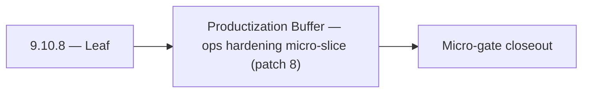

# 9.10.8 — Leaf

- **Era:** `9.x` ecosystem integrations — hub [`versions.md`](../versions.md) · minors start at [`9.0 — Ecosystem Foundation`](9.0%20%E2%80%94%20Ecosystem%20Foundation.md)
- **Minor:** [9.10 — Productization Buffer](./9.10 — Productization Buffer.md)
- **Codename:** Leaf
- **Status:** ✅ Completed
## Focus
Productization Buffer — ops hardening micro-slice (patch 8)

## Flowchart

## Micro-gate

| Track | Gate question | Answer / Evidence (fill at patch closeout) |
| --- | --- | --- |
| **Contract** | Connector lifecycle, entitlement model — `docs/backend/apis/` + integration matrices updated? | Document at patch closeout. |
| **Service** | Multi-tenant enforcement, connector adapters, webhook delivery — parity + smoke documented? | Document smoke paths. |
| **Surface** | Integrations UI, marketplace/admin, self-serve flows — delta? | Document UX delta or N/A. |
| **Frontend** | `docs/frontend/` hooks, partner surfaces, extension/email integrations touched? | Buffer minor — ecosystem overflow patches when chartered. Document at closeout. |
| **Data** | Tenant lineage, `connector_id`, entitlement tables — `docs/backend/database/`? | Document lineage or N/A. |
| **Ops** | SLA runbooks, partner onboarding, `connectors-commercial.md` / integration RC evidence — delta? | Document ops delta or N/A. |

## Tasks
### Ops
- 📌 Planned: **[appointment360]** — refine duplicate task (was: ✅ completed: 📌 planned: **app**: enforce v9.10 ops outcomes …) | patch `9.10.8` band `8` | reason: specialize this file vs sibling patches; see docs/codebases/appointment360-codebase-analysis.md
- 📌 Planned: **[appointment360]** — refine duplicate task (was: ✅ completed: 📌 planned: **sync**: enforce v9.10 ops outcomes…) | patch `9.10.8` band `8` | reason: specialize this file vs sibling patches; see docs/codebases/appointment360-codebase-analysis.md
- 📌 Planned: **[appointment360]** — refine duplicate task (was: ✅ completed: 📌 planned: **mailvetter**: enforce v9.10 ops ou…) | patch `9.10.8` band `8` | reason: specialize this file vs sibling patches; see docs/codebases/appointment360-codebase-analysis.md
- 📌 Planned: **[appointment360]** — refine duplicate task (was: ✅ completed: 📌 planned: **emailapigo**: enforce v9.10 ops ou…) | patch `9.10.8` band `8` | reason: specialize this file vs sibling patches; see docs/codebases/appointment360-codebase-analysis.md

### Contract

- ✅ Completed: 📌 Planned: **[appointment360]** — Diff and document schema for operations like ConnectraClient, LAMBDA_AI_API_URL, LAMBDA_CONNECTRA_API_URL; align with roadmap | area: `backend-api` | files: `docs/backend/apis/*.md`, `contact360.io/api/app/graphql/schema.py` | reason: Keep GraphQL/REST contracts aligned for era 9.8 patch 9.10.8

### Service

- 📌 Planned: **[appointment360]** — refine duplicate task (was: ✅ completed: 📌 planned: **[appointment360]** — service slice…) | patch `9.10.8` band `8` | reason: specialize this file vs sibling patches; see docs/codebases/appointment360-codebase-analysis.md

### Surface

- ✅ Completed: 📌 Planned: **[app]** — Verify UX for route `/email` and bindings (patch 9.10.8 band 8) | area: `frontend-page` | files: `contact360.io/app/...` | reason: Dashboard/extension surface for era 9 must match gateway contracts

### Data

- 📌 Planned: **[appointment360]** — refine duplicate task (was: ✅ completed: 📌 planned: **[appointment360]** — update postgr…) | patch `9.10.8` band `8` | reason: specialize this file vs sibling patches; see docs/codebases/appointment360-codebase-analysis.md

## Service task slices
> Merged from era `9.x` ecosystem productization task packs (P0→`.0`–`.2`, P1→`.3`–`.6`, Ops→`.7`–`.9`).

### Appointment360 (gateway)
- Write test: notifications() → markAllRead → notifications() = []
- Load test admin panel with 10,000 user dataset
- Document multi-tenant entitlement enforcement in ops runbook

### Connectra
- Add per-tenant SLO/error-budget dashboards for Connectra read/write paths.
- Add runbook for noisy-neighbor mitigation and quota override approvals.
- Define release gate evidence: tenant isolation report, quota enforcement tests, VQL policy conformance tests.

### contact.ai
- Webhook delivery retry: exponential backoff, max 3 retries, dead-letter queue on final failure.
- Connector health monitoring: track delivery success rate per connector.
- Tenant isolation audit: verify no cross-tenant data leakage in AI responses.
- Add connector endpoints to API rate limit policy.

### emailapis / emailapigo
- Add 9.x observability checks for provider health, fallback rate, and partner webhook error rate.
- Update rollback and incident runbook for email-impacting releases with connector-specific playbooks.
- Define release evidence bundle for each minor (`9.x.y`): contract diff, load test summary, and parity proof between Python and Go runtimes.

### Emailcampaign
- Org exceeding campaign send limit receives 429 with descriptive limit error.
- Suppression list import accepts CSV with 10k+ emails without timeout.
- HubSpot unsubscribe webhook adds contact to Contact360 suppression list.
- Sender domain DKIM verification status visible in settings UI.

### Jobs
- Add per-tenant SLA/error-budget dashboards and alert thresholds.
- Add runbook for quota exhaustion and noisy-neighbor mitigation incidents.
- Add release gate checks: timeline tenant isolation test, retry policy conformance test, processor quota test.

### logs.api
- Add observability checks for query latency, ingestion lag, and export failures.
- Add release validation evidence for 9.x logging schema and audit export compatibility.
- Capture rollback and incident runbook notes for logging-impacting releases.
- Define alerting thresholds for abnormal error rates by tenant/connector cohort.

### Mailvetter
- Alerting for webhook retry exhaustion.
- Monthly ecosystem reliability and partner SLA reporting.

### S3Storage
- Add entitlement correctness tests for upload/download/list under multiple plan tiers.
- Add quota and cost attribution accuracy checks to release evidence.
- Define alerts for quota rejection spikes and metadata worker lag.
- Add rollback procedures for storage policy misconfiguration incidents.

### Salesnavigator
- Connector SLA dashboard: per-tenant ingestion success rate
- Quota controls per connector type
- Alert: webhook delivery failure rate > 5% for a tenant
- Documentation: connector integration guide for partners
- `docs/codebases/salesnavigator-codebase-analysis.md`
- `docs/backend/apis/SALESNAVIGATOR_ERA_TASK_PACKS.md`

## Evidence gate
Patch closeout includes contract diff, smoke output, data lineage delta, and ops note
