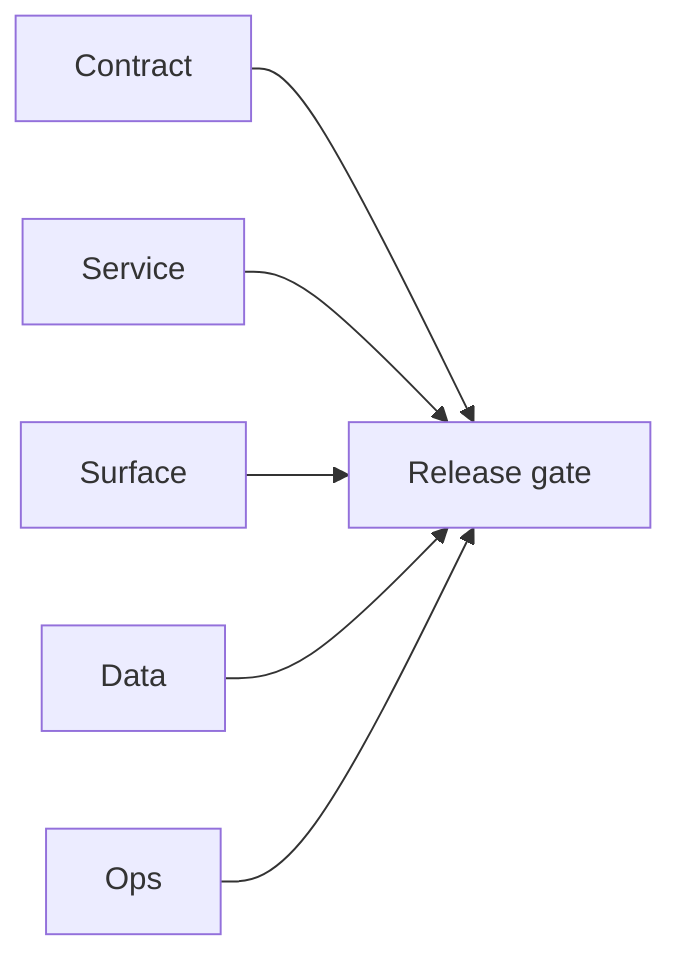

# 9.11.100 — EC2 email server ecosystem patch linkage

## Scope

Ecosystem/productization patch mapping for integrations depending on EC2 email runtime.

## Included patch intents

- `001-dockerization.patch`: standardized runtime packaging for integration environments.
- `006-error-handling.patch`: stronger job/runtime observability for partner troubleshooting.

## Ecosystem outcome

- Better portability and operational clarity for external integration scenarios.

## Flowchart

Five-track delivery (contract / service / surface / data / ops) for this doc:

**Master hub:** [`docs/docs/flowchart.md`](../docs/flowchart.md) — cross-system diagrams and era strip (`0.x` → `10.x`).
