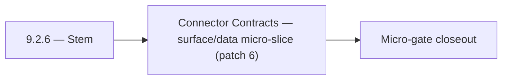

# 9.2.6 — Stem

- **Era:** `9.x` ecosystem integrations — hub [`versions.md`](../versions.md) · minors start at [`9.0 — Ecosystem Foundation`](9.0%20%E2%80%94%20Ecosystem%20Foundation.md)
- **Minor:** [9.2 — Connector Contracts](./9.2 — Connector Contracts.md)
- **Codename:** Stem
- **Status:** planned

## Focus
Connector Contracts — surface/data micro-slice (patch 6)

## Flowchart

## Micro-gate

| Track | Gate question | Answer / Evidence (fill at patch closeout) |
| --- | --- | --- |
| **Contract** | Connector lifecycle, entitlement model — `docs/backend/apis/` + integration matrices updated? | Document at patch closeout. |
| **Service** | Multi-tenant enforcement, connector adapters, webhook delivery — parity + smoke documented? | Document smoke paths. |
| **Surface** | Integrations UI, marketplace/admin, self-serve flows — delta? | Document UX delta or N/A. |
| **Frontend** | `docs/frontend/` hooks, partner surfaces, extension/email integrations touched? | Connector contracts — SDK surfaces, lifecycle hooks, compatibility tests. Document at closeout. |
| **Data** | Tenant lineage, `connector_id`, entitlement tables — `docs/backend/database/`? | Document lineage or N/A. |
| **Ops** | SLA runbooks, partner onboarding, `connectors-commercial.md` / integration RC evidence — delta? | Document ops delta or N/A. |

## Tasks
### Surface
- 📌 Planned: **jobs**: shape v9.2 surface outcomes for packaging/runtime plans; surface job lifecycle visibility for operators in `contact360.io/jobs` while advancing self-serve controls.
- 📌 Planned: **mailvetter**: shape v9.2 surface outcomes for packaging/runtime plans; present verifier rationale fields for audit readability in `backend(dev)/mailvetter` while advancing packaging/runtime plans.
- 📌 Planned: Expose tenant quota and connector health signals to integrations/admin surfaces in:
- `docs/frontend/hooks-services-contexts.md`

### Data
- 📌 Planned: **jobs**: anchor v9.2 data outcomes for packaging/runtime plans; record queue attempt history with reproducible markers in `contact360.io/jobs` while advancing self-serve controls.
- 📌 Planned: **mailvetter**: anchor v9.2 data outcomes for packaging/runtime plans; store verdict evidence artifacts with replay metadata in `backend(dev)/mailvetter` while advancing packaging/runtime plans.
- 📌 Planned: Store tenant usage aggregates for billing, quota, and SLA reporting.
- 📌 Planned: If `organization_id` added: migration file to add column to `ai_chats`; update `contact_ai_data_lineage.md`.

## Service task slices
> Merged from era `9.x` ecosystem productization task packs (P0→`.0`–`.2`, P1→`.3`–`.6`, Ops→`.7`–`.9`).

### Salesnavigator
- Integrations page: `/settings/integrations`
- SN integration card: status (connected/disconnected), last sync, profiles saved
- HubSpot/Salesforce connector card (future): "Import contacts" action
- Webhook delivery log: per integration, show last 10 webhook events (success/failure)
- Connector health card: live status indicator (green/yellow/red)
- Sync history: cross-source view — SN, HubSpot, manual import in one timeline
- Tenant-isolated lineage: `{tenant_id, source, session_id, lead_ids[], timestamp}` per session
- Connector audit trail: each connector event logged to `connector_events` table
- Webhook delivery log: `{webhook_id, session_id, status, attempts, last_error, delivered_at}`
- Adapter layer: normalize partner profile payload → `SaveProfilesRequest` schema
- Webhook delivery: POST `SaveProfilesResponse` to `webhook_url` on save completion (configurable per API key)
- Webhook retry: 3 attempts, exponential backoff, dead-letter log on final failure
- Tenant-isolated ingestion: tag all Connectra writes with `tenant_id` from API key context

### Connectra
- Expose tenant quota and connector health signals to integrations/admin surfaces in:
- `docs/frontend/README.md`
- `docs/frontend/components.md`
- `docs/frontend/hooks-services-contexts.md`
- Define user-facing messaging for quota blocked / degraded connector outcomes.
- Add support-facing reconciliation view requirements for created-vs-updated entity counts.
- Store tenant usage aggregates for billing, quota, and SLA reporting.
- Persist connector lineage fields: `tenant_id`, `connector_id`, `source`, `session_id`, `trace_id`.
- Define audit table expectations for UUID collisions, dedup merges, and replay attempts.
- Add per-tenant quota/throttle middleware for heavy query/export workloads.
- Enforce tenant filter injection before VQL execution in route handlers under `app/api/routes/`.
- Validate UUID5 dedup behavior and ensure connector ingestion is replay-safe under retries.
- Add fairness controls for mixed-tenant high-volume batch upsert traffic.

### Emailcampaign
- Org exceeding campaign send limit receives 429 with descriptive limit error.
- Suppression list import accepts CSV with 10k+ emails without timeout.
- HubSpot unsubscribe webhook adds contact to Contact360 suppression list.
- Sender domain DKIM verification status visible in settings UI.

### emailapis / emailapigo
- Bind integrations UX to runtime diagnostics:
- `docs/frontend/emailapis-ui-bindings.md`
- `docs/frontend/components.md`
- `docs/frontend/hooks-services-contexts.md`
- Define user-facing status vocabulary for email connector outcomes (`success`, `partial_success`, `quota_blocked`, `provider_degraded`).
- Add connector health and fallback explanation copy for settings and integrations pages.
- Document loading/error/progress patterns for bulk operations and webhook-triggered runs.
- Document 9.x lineage changes for `email_finder_cache` and `email_patterns` in `docs/backend/database`.
- Record per-request provider decision lineage (`provider`, `fallback_provider`, `status`, `latency_ms`, `tenant_id`, `trace_id`).
- Add tenant-safe usage attribution fields required for commercial metering reconciliation.
- Implement entitlement-aware execution guard for finder/verifier paths (per-tenant caps before provider fanout).
- Align provider orchestration behavior between runtimes (mailvetter/icypeas/truelist fallback order and timeout windows).
- Validate auth behavior (`X-API-Key` and gateway-issued context headers) across both runtimes.
- Add deterministic idempotency key support for bulk finder/verifier requests to avoid duplicate partner billing.

## Evidence gate
Patch closeout includes contract diff, smoke output, data lineage delta, and ops note
