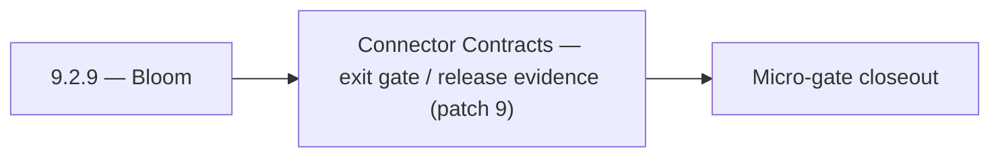

# 9.2.9 — Bloom

- **Era:** `9.x` ecosystem integrations — hub [`versions.md`](../versions.md) · minors start at [`9.0 — Ecosystem Foundation`](9.0%20%E2%80%94%20Ecosystem%20Foundation.md)
- **Minor:** [9.2 — Connector Contracts](./9.2 — Connector Contracts.md)
- **Codename:** Bloom
- **Status:** planned

## Focus
Connector Contracts — exit gate / release evidence (patch 9)

## Flowchart

## Micro-gate

| Track | Gate question | Answer / Evidence (fill at patch closeout) |
| --- | --- | --- |
| **Contract** | Connector lifecycle, entitlement model — `docs/backend/apis/` + integration matrices updated? | Document at patch closeout. |
| **Service** | Multi-tenant enforcement, connector adapters, webhook delivery — parity + smoke documented? | Document smoke paths. |
| **Surface** | Integrations UI, marketplace/admin, self-serve flows — delta? | Document UX delta or N/A. |
| **Frontend** | `docs/frontend/` hooks, partner surfaces, extension/email integrations touched? | Connector contracts — SDK surfaces, lifecycle hooks, compatibility tests. Document at closeout. |
| **Data** | Tenant lineage, `connector_id`, entitlement tables — `docs/backend/database/`? | Document lineage or N/A. |
| **Ops** | SLA runbooks, partner onboarding, `connectors-commercial.md` / integration RC evidence — delta? | Document ops delta or N/A. |

## Tasks
### Ops
- 📌 Planned: Connector SLA dashboard: per-tenant ingestion success rate
- 📌 Planned: Quota controls per connector type
- 📌 Planned: Alert: webhook delivery failure rate > 5% for a tenant
- 📌 Planned: Documentation: connector integration guide for partners
- `docs/codebases/salesnavigator-codebase-analysis.md`
- `docs/backend/apis/SALESNAVIGATOR_ERA_TASK_PACKS.md`

## Service task slices
> Merged from era `9.x` ecosystem productization task packs (P0→`.0`–`.2`, P1→`.3`–`.6`, Ops→`.7`–`.9`).

### Salesnavigator
- Connector SLA dashboard: per-tenant ingestion success rate
- Quota controls per connector type
- Alert: webhook delivery failure rate > 5% for a tenant
- Documentation: connector integration guide for partners
- `docs/codebases/salesnavigator-codebase-analysis.md`
- `docs/backend/apis/SALESNAVIGATOR_ERA_TASK_PACKS.md`

### Connectra
- Add per-tenant SLO/error-budget dashboards for Connectra read/write paths.
- Add runbook for noisy-neighbor mitigation and quota override approvals.
- Define release gate evidence: tenant isolation report, quota enforcement tests, VQL policy conformance tests.

### Emailcampaign
- Org exceeding campaign send limit receives 429 with descriptive limit error.
- Suppression list import accepts CSV with 10k+ emails without timeout.
- HubSpot unsubscribe webhook adds contact to Contact360 suppression list.
- Sender domain DKIM verification status visible in settings UI.

### emailapis / emailapigo
- Add 9.x observability checks for provider health, fallback rate, and partner webhook error rate.
- Update rollback and incident runbook for email-impacting releases with connector-specific playbooks.
- Define release evidence bundle for each minor (`9.x.y`): contract diff, load test summary, and parity proof between Python and Go runtimes.

## Evidence gate
Micro-gate table filled and handoff note to `9.3.0` recorded
