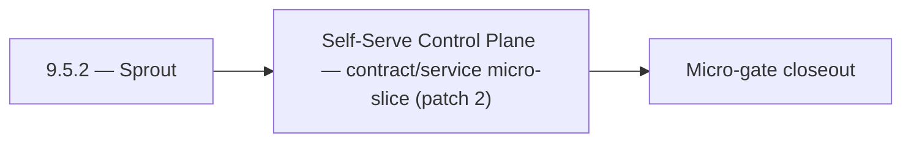

# 9.5.2 — Sprout

- **Era:** `9.x` ecosystem integrations — hub [`versions.md`](../versions.md) · minors start at [`9.0 — Ecosystem Foundation`](9.0%20%E2%80%94%20Ecosystem%20Foundation.md)
- **Minor:** [9.5 — Self-Serve Control Plane](./9.5 — Self-Serve Control Plane.md)
- **Codename:** Sprout
- **Status:** planned

## Focus
Self-Serve Control Plane — contract/service micro-slice (patch 2)

## Flowchart

## Micro-gate

| Track | Gate question | Answer / Evidence (fill at patch closeout) |
| --- | --- | --- |
| **Contract** | Connector lifecycle, entitlement model — `docs/backend/apis/` + integration matrices updated? | Document at patch closeout. |
| **Service** | Multi-tenant enforcement, connector adapters, webhook delivery — parity + smoke documented? | Document smoke paths. |
| **Surface** | Integrations UI, marketplace/admin, self-serve flows — delta? | Document UX delta or N/A. |
| **Frontend** | `docs/frontend/` hooks, partner surfaces, extension/email integrations touched? | Self-serve control plane — integrations UX, workspace, onboarding. Document at closeout. |
| **Data** | Tenant lineage, `connector_id`, entitlement tables — `docs/backend/database/`? | Document lineage or N/A. |
| **Ops** | SLA runbooks, partner onboarding, `connectors-commercial.md` / integration RC evidence — delta? | Document ops delta or N/A. |

## Tasks
### Contract
- 📌 Planned: **jobs**: define v9.5 contract outcomes for tenant config overlays; lock worker message schema and retry metadata in `contact360.io/jobs` while advancing packaging/runtime plans.
- 📌 Planned: **emailapis**: define v9.5 contract outcomes for tenant config overlays; normalize provider adapter contract and fallback keys in `lambda/emailapis` while advancing packaging/runtime plans.
- `POST /contacts/batch-upsert`
- 📌 Planned: Align endpoint era mapping in `docs/backend/endpoints/connectra_endpoint_era_matrix.json`.

### Service
- 📌 Planned: **jobs**: deliver v9.5 service outcomes for tenant config overlays; tune queue worker orchestration and idempotent retries in `contact360.io/jobs` while advancing packaging/runtime plans.
- 📌 Planned: **emailapis**: deliver v9.5 service outcomes for tenant config overlays; improve provider orchestration sequencing and fallback timing in `lambda/emailapis` while advancing packaging/runtime plans.
- 📌 Planned: Validate UUID5 dedup behavior and ensure connector ingestion is replay-safe under retries.
- 📌 Planned: Implement organization-level AI usage aggregation (for tenant billing/quota).

## Service task slices
> Merged from era `9.x` ecosystem productization task packs (P0→`.0`–`.2`, P1→`.3`–`.6`, Ops→`.7`–`.9`).

### Connectra
- Define entitlement-aware VQL policy contract for tenant plans in `app/services/query/*`.
- Freeze connector-facing request/response compatibility for:
- `POST /contacts/batch-upsert`
- `POST /companies/batch-upsert`
- `POST /common/jobs/create`
- Document tenant isolation guarantees for read (`/contacts`, `/companies`) and write paths.
- Align endpoint era mapping in `docs/backend/endpoints/connectra_endpoint_era_matrix.json`.
- Add per-tenant quota/throttle middleware for heavy query/export workloads.
- Enforce tenant filter injection before VQL execution in route handlers under `app/api/routes/`.
- Validate UUID5 dedup behavior and ensure connector ingestion is replay-safe under retries.
- Add fairness controls for mixed-tenant high-volume batch upsert traffic.
- Store tenant usage aggregates for billing, quota, and SLA reporting.
- Persist connector lineage fields: `tenant_id`, `connector_id`, `source`, `session_id`, `trace_id`.

### emailapis / emailapigo
- Freeze 9.x finder/verifier/pattern endpoint contracts in:
- `lambda/emailapis/app/api/v1/router.py`
- `lambda/emailapigo/internal/api/router.go`
- Normalize error envelope for both runtimes (`status`, `message`, `provider`, `request_id`, `retryable`) and map to gateway GraphQL errors in `contact360.io/api`.
- Define partner connector compatibility contract for email workflows (input mapping and expected response cardinality).
- Update endpoint matrix in `docs/backend/endpoints/emailapis_endpoint_era_matrix.json`.
- Implement entitlement-aware execution guard for finder/verifier paths (per-tenant caps before provider fanout).
- Align provider orchestration behavior between runtimes (mailvetter/icypeas/truelist fallback order and timeout windows).
- Validate auth behavior (`X-API-Key` and gateway-issued context headers) across both runtimes.
- Add deterministic idempotency key support for bulk finder/verifier requests to avoid duplicate partner billing.
- Document 9.x lineage changes for `email_finder_cache` and `email_patterns` in `docs/backend/database`.
- Record per-request provider decision lineage (`provider`, `fallback_provider`, `status`, `latency_ms`, `tenant_id`, `trace_id`).

### Appointment360 (gateway)
- Define NotificationQuery { notifications() }
- Define NotificationMutation { markNotificationRead(id), markAllRead }
- Define AnalyticsQuery { analytics(dateRange, granularity, metrics) }
- Define AnalyticsMutation { trackEvent(type, metadata) }
- Define AdminQuery { adminStats(), paymentSubmissions(), users() } (SuperAdmin-only)
- Define AdminMutation { creditUser, adjustCredits, approvePayment, declinePayment } (SuperAdmin-only)
- Implement notifications service: create, list, mark-read in app/services/notification.py
- Implement trackEvent mutation: write to events table with user_uuid, type, metadata
- Implement adminStats(): aggregated counts (users, contacts, jobs, revenue) for SuperAdmin
- Add require_super_admin() guard for all admin mutations
- Notification bell icon → query notifications() polling every 30s
- Notification drop-down → mutation markNotificationRead on click
- Admin panel → query adminStats() + mutation creditUser
- useNotifications hook: polling, badge count, mark-read
- useAdminPanel hook: manage user credit adjustments, approve payments
- Create notifications table: uuid, user_uuid, type, message, is_read, created_at
- Create events table: uuid, user_uuid, type, metadata JSON, created_at
- Run Alembic migration for all 9.x tables

### S3Storage
- Define entitlement matrix for storage capabilities by plan and tenant.
- Define quota policy contract (`rate`, `count`, `size`, `burst`) for upload/download/list operations.
- Freeze connector-safe storage API behavior for multipart and metadata paths.
- Align endpoint references in `docs/backend/endpoints/s3storage_endpoint_era_matrix.json`.
- Enforce plan-aware limits and throttling in `app/services/storage_service.py`.
- Add tenant context validation for object key namespace and bucket prefix routing.
- Validate multipart upload controls for quota-aware part counts and finalization.
- Add integration-safe diagnostics around metadata worker handoff and failures.
- Add tenant cost attribution fields to storage lineage and usage exports.
- Add residency metadata requirements for regulated tenant storage domains.
- Define metadata.json lineage fields for entitlement decision traceability.

## Evidence gate
Patch closeout includes contract diff, smoke output, data lineage delta, and ops note
